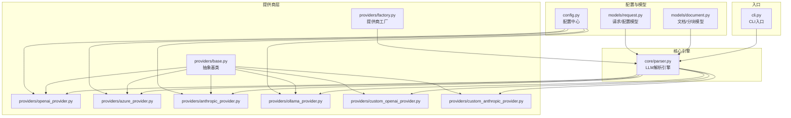
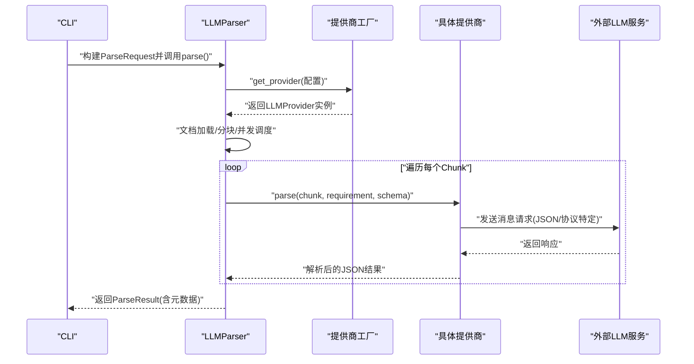
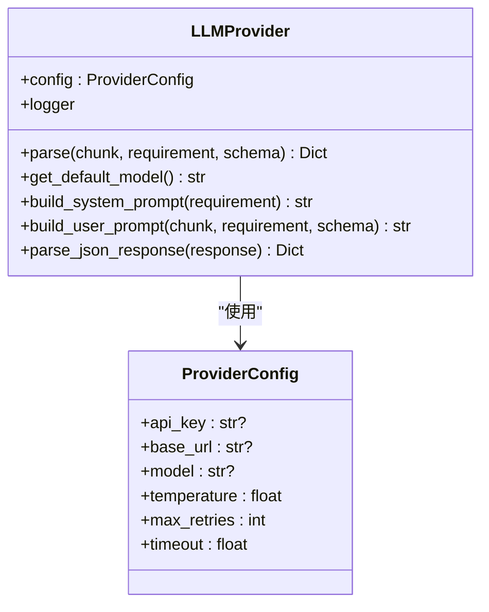
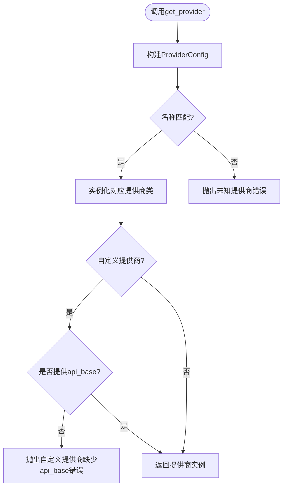
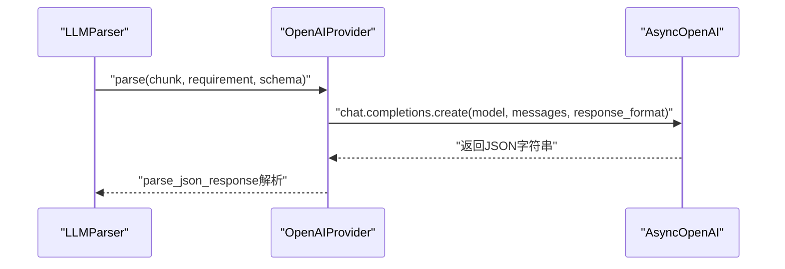
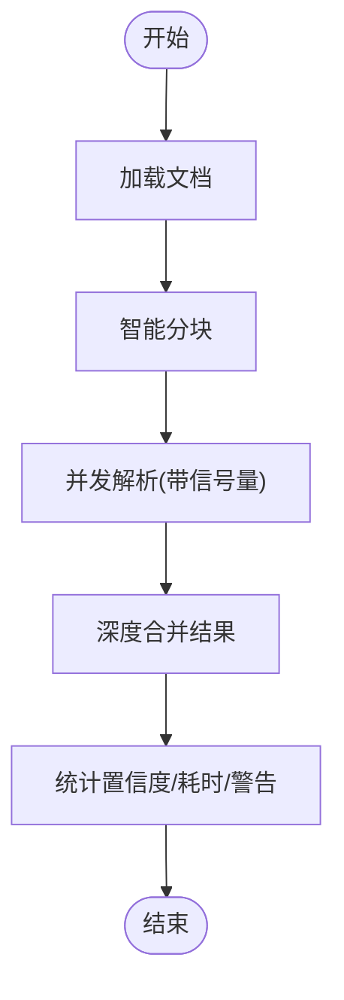
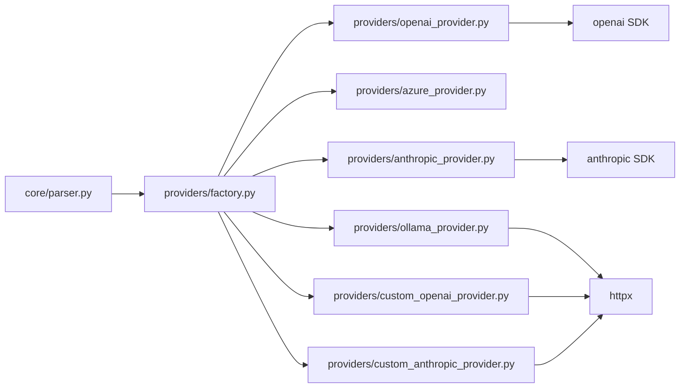

# LLM提供商适配

<cite>
**本文引用的文件**
- [README.md](file://README.md)
- [pyproject.toml](file://pyproject.toml)
- [config.py](file://src/api_doc_parser/config.py)
- [factory.py](file://src/api_doc_parser/providers/factory.py)
- [base.py](file://src/api_doc_parser/providers/base.py)
- [openai_provider.py](file://src/api_doc_parser/providers/openai_provider.py)
- [azure_provider.py](file://src/api_doc_parser/providers/azure_provider.py)
- [anthropic_provider.py](file://src/api_doc_parser/providers/anthropic_provider.py)
- [ollama_provider.py](file://src/api_doc_parser/providers/ollama_provider.py)
- [custom_openai_provider.py](file://src/api_doc_parser/providers/custom_openai_provider.py)
- [custom_anthropic_provider.py](file://src/api_doc_parser/providers/custom_anthropic_provider.py)
- [request.py](file://src/api_doc_parser/models/request.py)
- [document.py](file://src/api_doc_parser/models/document.py)
- [parser.py](file://src/api_doc_parser/core/parser.py)
- [cli.py](file://src/api_doc_parser/cli.py)
- [test_providers.py](file://tests/test_providers.py)
</cite>

## 目录
1. [简介](#简介)
2. [项目结构](#项目结构)
3. [核心组件](#核心组件)
4. [架构总览](#架构总览)
5. [详细组件分析](#详细组件分析)
6. [依赖分析](#依赖分析)
7. [性能考虑](#性能考虑)
8. [故障排查指南](#故障排查指南)
9. [结论](#结论)
10. [附录](#附录)

## 简介
本文件面向“LLM提供商适配”模块，系统性阐述提供商接口规范、集成实现与配置方法，覆盖 OpenAI、Azure OpenAI、Anthropic、Ollama 等官方提供商，以及自定义 OpenAI/Anthropic 协议提供商的扩展机制。文档同时提供认证配置、API 密钥管理、错误处理与性能优化策略，并给出具体调用流程图与最佳实践，兼顾初学者与高级用户的理解深度。

## 项目结构
该模块采用“工厂+抽象基类+具体提供商”的分层设计，结合配置中心与解析引擎，形成可插拔的 LLM 提供商适配体系。

图表来源
- [config.py](file://src/api_doc_parser/config.py#L1-L57)
- [factory.py](file://src/api_doc_parser/providers/factory.py#L1-L71)
- [base.py](file://src/api_doc_parser/providers/base.py#L1-L143)
- [openai_provider.py](file://src/api_doc_parser/providers/openai_provider.py#L1-L82)
- [azure_provider.py](file://src/api_doc_parser/providers/azure_provider.py#L1-L83)
- [anthropic_provider.py](file://src/api_doc_parser/providers/anthropic_provider.py#L1-L82)
- [ollama_provider.py](file://src/api_doc_parser/providers/ollama_provider.py#L1-L118)
- [custom_openai_provider.py](file://src/api_doc_parser/providers/custom_openai_provider.py#L1-L122)
- [custom_anthropic_provider.py](file://src/api_doc_parser/providers/custom_anthropic_provider.py#L1-L96)
- [request.py](file://src/api_doc_parser/models/request.py#L1-L57)
- [document.py](file://src/api_doc_parser/models/document.py#L1-L75)
- [parser.py](file://src/api_doc_parser/core/parser.py#L1-L304)
- [cli.py](file://src/api_doc_parser/cli.py#L1-L393)

章节来源
- [README.md](file://README.md#L1-L176)
- [pyproject.toml](file://pyproject.toml#L1-L100)

## 核心组件
- 抽象基类与通用能力
  - ProviderConfig：统一承载 api_key、base_url、model、temperature、max_retries、timeout 等配置项。
  - LLMProvider：定义 parse(chunk, requirement, output_schema) 与 get_default_model() 的抽象接口；内置系统提示词构建、用户提示词构建与 JSON 响应解析逻辑。
- 提供商工厂
  - get_provider(name, api_key, api_base, model, temperature, max_retries)：按名称创建具体提供商实例，校验自定义提供商必需参数。
- 具体提供商
  - OpenAIProvider/AzureOpenAIProvider/AnthropicProvider/OllamaProvider/CustomOpenAIProvider/CustomAnthropicProvider：分别对接官方或自定义协议，封装各自的客户端初始化、消息构造与响应解析。
- 解析引擎
  - LLMParser：负责文档加载、分块、并发调用提供商、结果合并与元数据统计。
- 配置与模型
  - config.Settings：集中管理各提供商的环境变量配置。
  - models.request/ models.document：定义输入输出的数据结构与约束。

章节来源
- [base.py](file://src/api_doc_parser/providers/base.py#L16-L143)
- [factory.py](file://src/api_doc_parser/providers/factory.py#L14-L71)
- [openai_provider.py](file://src/api_doc_parser/providers/openai_provider.py#L13-L82)
- [azure_provider.py](file://src/api_doc_parser/providers/azure_provider.py#L13-L83)
- [anthropic_provider.py](file://src/api_doc_parser/providers/anthropic_provider.py#L13-L82)
- [ollama_provider.py](file://src/api_doc_parser/providers/ollama_provider.py#L13-L118)
- [custom_openai_provider.py](file://src/api_doc_parser/providers/custom_openai_provider.py#L12-L122)
- [custom_anthropic_provider.py](file://src/api_doc_parser/providers/custom_anthropic_provider.py#L12-L96)
- [parser.py](file://src/api_doc_parser/core/parser.py#L20-L304)
- [config.py](file://src/api_doc_parser/config.py#L7-L57)
- [request.py](file://src/api_doc_parser/models/request.py#L8-L57)
- [document.py](file://src/api_doc_parser/models/document.py#L20-L75)

## 架构总览
以下序列图展示 CLI 到解析引擎再到具体提供商的调用链路，体现“工厂创建提供商 → 引擎并发解析 → 提供商调用外部API”的主流程。

图表来源
- [cli.py](file://src/api_doc_parser/cli.py#L127-L231)
- [parser.py](file://src/api_doc_parser/core/parser.py#L46-L128)
- [factory.py](file://src/api_doc_parser/providers/factory.py#L14-L71)
- [openai_provider.py](file://src/api_doc_parser/providers/openai_provider.py#L41-L82)
- [azure_provider.py](file://src/api_doc_parser/providers/azure_provider.py#L42-L83)
- [anthropic_provider.py](file://src/api_doc_parser/providers/anthropic_provider.py#L40-L82)
- [ollama_provider.py](file://src/api_doc_parser/providers/ollama_provider.py#L33-L118)
- [custom_openai_provider.py](file://src/api_doc_parser/providers/custom_openai_provider.py#L35-L122)
- [custom_anthropic_provider.py](file://src/api_doc_parser/providers/custom_anthropic_provider.py#L31-L96)

## 详细组件分析

### 抽象基类与通用能力（LLMProvider）
- 角色定位
  - 统一接口：parse、get_default_model。
  - 通用提示词：build_system_prompt、build_user_prompt。
  - 响应解析：parse_json_response（兼容裸JSON、代码块、对象片段）。
- 关键点
  - 通过 ProviderConfig 注入配置，日志绑定 provider 名称，便于追踪。
  - 默认 temperature、max_retries、timeout 在基类中统一管理，子类可覆盖。

图表来源
- [base.py](file://src/api_doc_parser/providers/base.py#L16-L143)

章节来源
- [base.py](file://src/api_doc_parser/providers/base.py#L27-L143)

### 提供商工厂（get_provider）
- 功能
  - 根据提供商名称映射到具体类，注入 ProviderConfig。
  - 对自定义提供商进行参数校验（需 base_url；可选 api_key）。
- 支持的提供商
  - openai、azure、anthropic、custom_openai、custom_anthropic、ollama。

图表来源
- [factory.py](file://src/api_doc_parser/providers/factory.py#L14-L71)

章节来源
- [factory.py](file://src/api_doc_parser/providers/factory.py#L14-L71)

### OpenAI 官方提供商
- 特性
  - 默认模型、客户端初始化、响应格式为 JSON Object。
  - 使用 response_format 指定 JSON 输出，增强稳定性。
- 配置来源
  - 优先使用 config.Settings 中的 openai_* 配置，否则由调用方传入。

图表来源
- [openai_provider.py](file://src/api_doc_parser/providers/openai_provider.py#L41-L82)

章节来源
- [openai_provider.py](file://src/api_doc_parser/providers/openai_provider.py#L13-L82)
- [config.py](file://src/api_doc_parser/config.py#L20-L24)

### Azure OpenAI 提供商
- 特性
  - 必须提供 endpoint（base_url），并携带 api_version。
  - 使用 AsyncAzureOpenAI 客户端。
- 错误处理
  - 缺少 endpoint 将直接报错。

章节来源
- [azure_provider.py](file://src/api_doc_parser/providers/azure_provider.py#L13-L83)
- [config.py](file://src/api_doc_parser/config.py#L25-L29)

### Anthropic Claude 提供商
- 特性
  - system prompt 通过独立参数传递；max_tokens 与 temperature 控制输出长度与多样性。
  - 使用 anthropic.AsyncAnthropic 客户端。
- 配置来源
  - anthropic_* 配置来自 config.Settings。

章节来源
- [anthropic_provider.py](file://src/api_doc_parser/providers/anthropic_provider.py#L13-L82)
- [config.py](file://src/api_doc_parser/config.py#L31-L35)

### Ollama 本地模型提供商
- 特性
  - 本地 HTTP API 调用，组合 system+user 为完整 prompt。
  - 支持 list_models 与 pull_model 辅助管理本地模型。
- 配置来源
  - ollama_* 配置来自 config.Settings。

章节来源
- [ollama_provider.py](file://src/api_doc_parser/providers/ollama_provider.py#L13-L118)
- [config.py](file://src/api_doc_parser/config.py#L36-L39)

### 自定义 OpenAI 协议提供商
- 适用场景
  - vLLM、TGI、LocalAI 等兼容 OpenAI 协议的服务。
- 特性
  - 通过 HTTPX 直接调用 /chat/completions；可选 api_key（若服务需要）。
  - 不强制 response_format，部分服务可能不支持。

章节来源
- [custom_openai_provider.py](file://src/api_doc_parser/providers/custom_openai_provider.py#L12-L122)

### 自定义 Anthropic 协议提供商
- 适用场景
  - 兼容 Anthropic Messages API 的自定义后端。
- 特性
  - 通过 HTTPX 调用 /messages；需要 x-api-key 与 anthropic-version 头。

章节来源
- [custom_anthropic_provider.py](file://src/api_doc_parser/providers/custom_anthropic_provider.py#L12-L96)

### 解析引擎（LLMParser）
- 能力
  - 文档加载、智能分块、并发解析、结果合并、缓存、元数据统计。
- 并发与限流
  - 使用 asyncio.Semaphore 限制并发数（示例为5），避免触发下游限流。
- 缓存
  - 基于内容指纹与模型名生成缓存键，命中则直接返回。
- 错误处理
  - 单 chunk 异常被捕获并记录，不影响整体流程；最终汇总 warnings 与失败列表。

图表来源
- [parser.py](file://src/api_doc_parser/core/parser.py#L46-L304)

章节来源
- [parser.py](file://src/api_doc_parser/core/parser.py#L20-L304)

### 配置与模型
- 配置中心
  - Settings 统一读取 .env，涵盖各提供商的 API Key、Endpoint、默认模型、温度、重试等。
- 请求/结果模型
  - ParseConfig/ParseRequest/RequirementDoc/DocumentSource 等，明确输入输出结构与约束。

章节来源
- [config.py](file://src/api_doc_parser/config.py#L7-L57)
- [request.py](file://src/api_doc_parser/models/request.py#L8-L57)
- [document.py](file://src/api_doc_parser/models/document.py#L20-L75)

## 依赖分析
- 外部依赖
  - openai、anthropic：官方 SDK。
  - httpx：自定义提供商与 Ollama 的 HTTP 客户端。
  - fastapi/uvicorn/typer/rich：CLI/Web 服务与交互。
- 内部耦合
  - 解析引擎仅依赖工厂接口，不直接耦合具体提供商，便于扩展。
  - 提供商均继承抽象基类，共享提示词与 JSON 解析逻辑，降低重复。

图表来源
- [parser.py](file://src/api_doc_parser/core/parser.py#L14-L44)
- [factory.py](file://src/api_doc_parser/providers/factory.py#L5-L11)
- [openai_provider.py](file://src/api_doc_parser/providers/openai_provider.py#L5-L10)
- [azure_provider.py](file://src/api_doc_parser/providers/azure_provider.py#L5-L10)
- [anthropic_provider.py](file://src/api_doc_parser/providers/anthropic_provider.py#L5-L10)
- [ollama_provider.py](file://src/api_doc_parser/providers/ollama_provider.py#L5-L10)
- [custom_openai_provider.py](file://src/api_doc_parser/providers/custom_openai_provider.py#L5-L10)
- [custom_anthropic_provider.py](file://src/api_doc_parser/providers/custom_anthropic_provider.py#L5-L10)

章节来源
- [pyproject.toml](file://pyproject.toml#L25-L59)

## 性能考虑
- 并发控制
  - 引擎使用信号量限制并发，请根据下游速率与资源情况调整。
- 分块策略
  - 通过 ParseConfig 的 chunk_size 与 chunk_overlap 控制吞吐与上下文完整性。
- 缓存
  - 启用 use_cache 可显著减少重复请求；注意缓存键包含模型名，不同模型不会互相命中。
- 超时与重试
  - ProviderConfig.timeout 与 max_retries 影响稳定性与耗时；建议对高延迟服务适当增大。
- 日志与可观测性
  - 各提供商在成功/失败时记录关键指标（tokens、耗时、状态码），便于性能分析。

[本节为通用指导，无需特定文件引用]

## 故障排查指南
- 常见错误与定位
  - 未知提供商：检查工厂名称拼写与支持列表。
  - 自定义提供商缺少 api_base：确保传入 api_base。
  - Azure OpenAI 缺少 endpoint：确保设置 base_url。
  - JSON 解析失败：查看 parse_json_response 的回退策略与日志。
- 调试建议
  - 使用 CLI 的 --verbose 输出配置与统计信息。
  - 在测试中使用 mock 替换客户端，验证流程与边界条件。
- 单元测试参考
  - 工厂与 OpenAI/Anthropic 提供商的解析流程均有测试覆盖。

章节来源
- [test_providers.py](file://tests/test_providers.py#L13-L106)
- [cli.py](file://src/api_doc_parser/cli.py#L246-L297)

## 结论
该适配模块以“抽象基类 + 工厂 + 具体提供商”的架构实现了对多家 LLM 提供商的统一接入，具备良好的扩展性与可维护性。通过配置中心与解析引擎的解耦，用户可在不修改核心逻辑的前提下快速切换或新增提供商。建议在生产环境中结合并发控制、缓存与可观测性策略，持续优化吞吐与稳定性。

[本节为总结，无需特定文件引用]

## 附录

### 接口规范与最佳实践
- 接口规范
  - parse 方法签名：parse(chunk, requirement, output_schema) -> Dict[str, Any]。
  - get_default_model 返回字符串模型名。
  - 建议在子类中复用基类的提示词构建与 JSON 解析方法。
- 最佳实践
  - 明确区分“官方 SDK 客户端”与“HTTP 客户端”，前者更稳定，后者更灵活。
  - 为自定义提供商实现 list_models/pull_model 等辅助能力，提升运维效率。
  - 在 CLI/Web 层暴露最小必要参数，通过配置中心集中管理敏感信息。

[本节为概念性内容，无需特定文件引用]

### 配置清单（.env）
- OpenAI/Azure/Anthropic/Ollama 的关键配置项参见配置中心定义与 README 示例。

章节来源
- [config.py](file://src/api_doc_parser/config.py#L20-L39)
- [README.md](file://README.md#L32-L49)