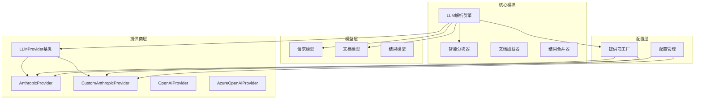
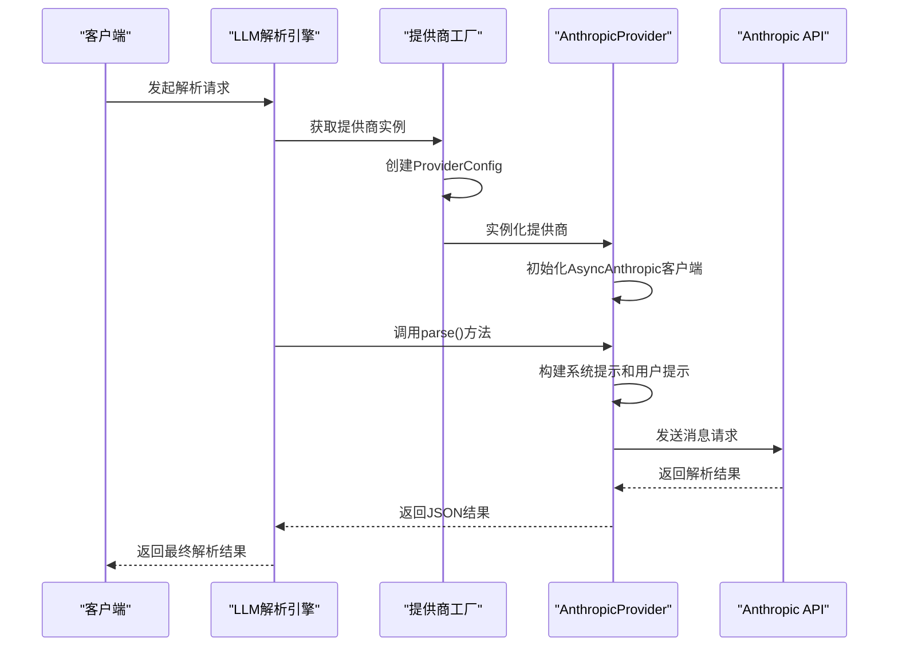
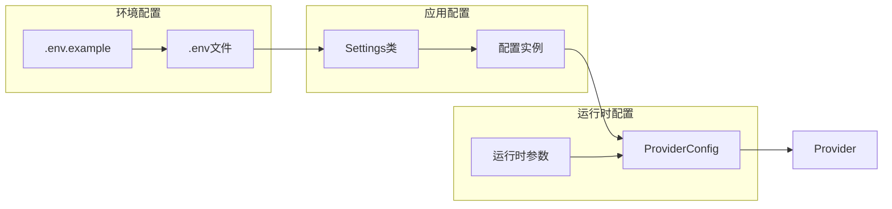
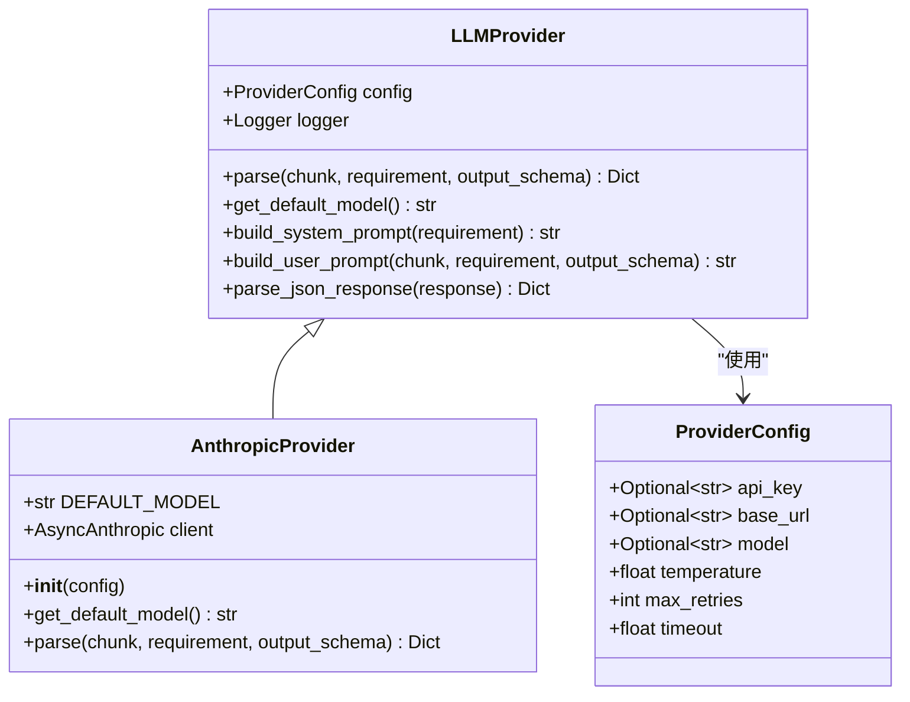
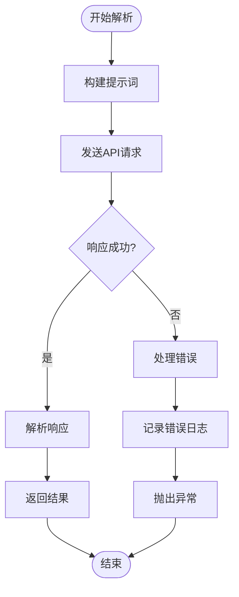
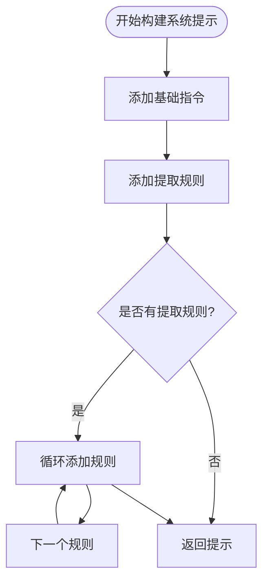
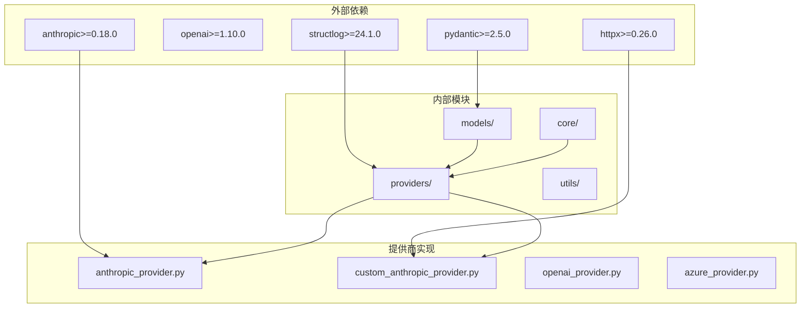
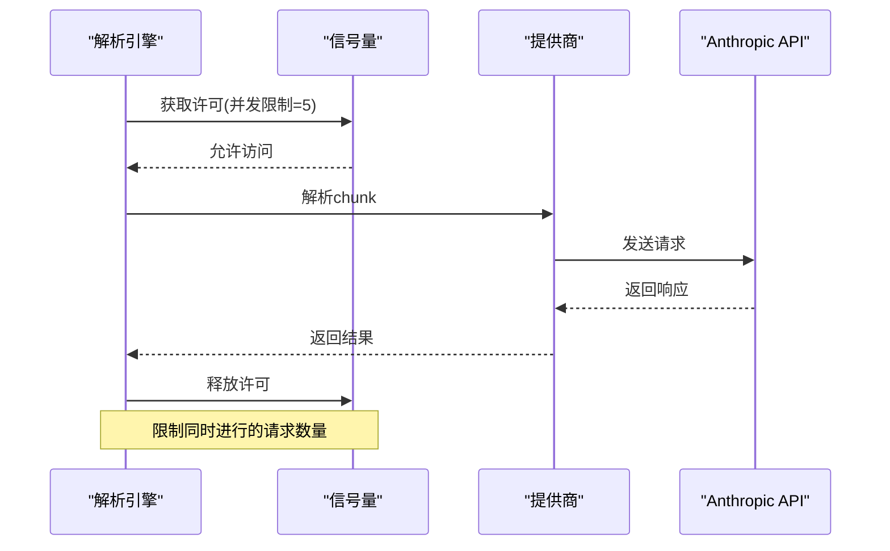

# Anthropic提供商集成

<cite>
**本文档引用的文件**
- [anthropic_provider.py](file://api-doc-parser/src/api_doc_parser/providers/anthropic_provider.py)
- [custom_anthropic_provider.py](file://api-doc-parser/src/api_doc_parser/providers/custom_anthropic_provider.py)
- [base.py](file://api-doc-parser/src/api_doc_parser/providers/base.py)
- [factory.py](file://api-doc-parser/src/api_doc_parser/providers/factory.py)
- [config.py](file://api-doc-parser/src/api_doc_parser/config.py)
- [.env.example](file://api-doc-parser/.env.example)
- [README.md](file://api-doc-parser/README.md)
- [models/request.py](file://api-doc-parser/src/api_doc_parser/models/request.py)
- [models/document.py](file://api-doc-parser/src/api_doc_parser/models/document.py)
- [core/parser.py](file://api-doc-parser/src/api_doc_parser/core/parser.py)
- [tests/test_providers.py](file://api-doc-parser/tests/test_providers.py)
- [pyproject.toml](file://api-doc-parser/pyproject.toml)
</cite>

## 目录
1. [简介](#简介)
2. [项目结构](#项目结构)
3. [核心组件](#核心组件)
4. [架构概览](#架构概览)
5. [详细组件分析](#详细组件分析)
6. [依赖关系分析](#依赖关系分析)
7. [性能考虑](#性能考虑)
8. [故障排除指南](#故障排除指南)
9. [结论](#结论)
10. [附录](#附录)

## 简介

本文档详细介绍了API文档解析器中Anthropic提供商的集成实现。该系统支持多种LLM提供商，包括Anthropic Claude官方API和自定义Anthropic协议API。文档深入分析了Anthropic特有的功能实现，包括API密钥配置、消息格式设置、系统提示构建、工具调用支持以及上下文窗口管理。

系统采用模块化设计，通过工厂模式统一管理不同提供商的实例化，支持标准的Anthropic API和兼容Anthropic协议的自定义端点。每个提供商都继承自统一的抽象基类，确保了一致的接口和行为。

## 项目结构

API文档解析器采用清晰的分层架构，主要包含以下核心模块：



**图表来源**
- [parser.py](file://api-doc-parser/src/api_doc_parser/core/parser.py#L20-L45)
- [factory.py](file://api-doc-parser/src/api_doc_parser/providers/factory.py#L14-L71)
- [base.py](file://api-doc-parser/src/api_doc_parser/providers/base.py#L27-L57)

**章节来源**
- [parser.py](file://api-doc-parser/src/api_doc_parser/core/parser.py#L1-L304)
- [factory.py](file://api-doc-parser/src/api_doc_parser/providers/factory.py#L1-L71)

## 核心组件

### LLMProvider抽象基类

所有LLM提供商都继承自统一的抽象基类，提供了标准化的接口和通用功能：

- **统一接口**: 所有提供商必须实现`parse()`方法和`get_default_model()`方法
- **配置管理**: 通过`ProviderConfig`数据类管理API密钥、基础URL、模型名称等配置
- **提示构建**: 提供系统提示和用户提示的构建方法
- **JSON解析**: 统一的JSON响应解析逻辑，支持多种格式

### AnthropicProvider实现

Anthropic官方API提供商实现了完整的Claude API集成：

- **默认模型**: 使用最新的Claude 3.5 Sonnet模型作为默认选择
- **异步客户端**: 基于anthropic库的异步客户端实现
- **系统提示**: 通过独立的system参数传递系统提示
- **消息格式**: 遵循Anthropic Messages API的消息格式规范

### CustomAnthropicProvider实现

自定义Anthropic协议提供商支持兼容Anthropic协议的第三方服务：

- **HTTP客户端**: 使用httpx库实现HTTP请求
- **协议兼容**: 完全遵循Anthropic Messages API协议
- **灵活配置**: 支持任意自定义端点和认证方式
- **错误处理**: 完善的HTTP状态码和异常处理机制

**章节来源**
- [base.py](file://api-doc-parser/src/api_doc_parser/providers/base.py#L16-L143)
- [anthropic_provider.py](file://api-doc-parser/src/api_doc_parser/providers/anthropic_provider.py#L13-L82)
- [custom_anthropic_provider.py](file://api-doc-parser/src/api_doc_parser/providers/custom_anthropic_provider.py#L12-L96)

## 架构概览

系统采用工厂模式和策略模式相结合的设计，实现了高度的可扩展性和一致性：



**图表来源**
- [parser.py](file://api-doc-parser/src/api_doc_parser/core/parser.py#L32-L44)
- [factory.py](file://api-doc-parser/src/api_doc_parser/providers/factory.py#L14-L71)
- [anthropic_provider.py](file://api-doc-parser/src/api_doc_parser/providers/anthropic_provider.py#L40-L82)

### 配置管理架构

系统通过分层配置管理确保了灵活性和安全性：



**图表来源**
- [config.py](file://api-doc-parser/src/api_doc_parser/config.py#L7-L57)
- [factory.py](file://api-doc-parser/src/api_doc_parser/providers/factory.py#L42-L48)

**章节来源**
- [config.py](file://api-doc-parser/src/api_doc_parser/config.py#L1-L57)
- [factory.py](file://api-doc-parser/src/api_doc_parser/providers/factory.py#L1-L71)

## 详细组件分析

### AnthropicProvider详细分析

AnthropicProvider是系统中最复杂的组件之一，实现了完整的Claude API集成：

#### 核心功能实现



**图表来源**
- [anthropic_provider.py](file://api-doc-parser/src/api_doc_parser/providers/anthropic_provider.py#L13-L82)
- [base.py](file://api-doc-parser/src/api_doc_parser/providers/base.py#L16-L57)

#### 消息格式和系统提示

AnthropicProvider实现了标准的Anthropic Messages API消息格式：

| 组件 | 字段名 | 类型 | 描述 | 示例 |
|------|--------|------|------|------|
| 请求头 | Content-Type | string | JSON内容类型 | application/json |
| 请求头 | x-api-key | string | API密钥 | sk-ant-... |
| 请求头 | anthropic-version | string | API版本 | 2023-06-01 |
| 请求体 | model | string | 模型名称 | claude-3-5-sonnet-20241022 |
| 请求体 | max_tokens | integer | 最大令牌数 | 4096 |
| 请求体 | system | string | 系统提示 | 系统指令... |
| 请求体 | messages | array | 消息数组 | [{"role": "user", "content": "..."}] |
| 请求体 | temperature | number | 温度参数 | 0.1 |

#### 错误处理机制

系统实现了多层次的错误处理机制：



**图表来源**
- [anthropic_provider.py](file://api-doc-parser/src/api_doc_parser/providers/anthropic_provider.py#L53-L81)

**章节来源**
- [anthropic_provider.py](file://api-doc-parser/src/api_doc_parser/providers/anthropic_provider.py#L1-L82)
- [base.py](file://api-doc-parser/src/api_doc_parser/providers/base.py#L59-L143)

### CustomAnthropicProvider详细分析

CustomAnthropicProvider提供了最大的灵活性，支持任何兼容Anthropic协议的服务：

#### 协议兼容性

该组件完全遵循Anthropic Messages API协议，确保了与各种第三方服务的兼容性：

- **HTTP客户端**: 使用httpx库实现异步HTTP通信
- **协议版本**: 固定使用2023-06-01版本
- **认证方式**: 支持API密钥认证
- **超时控制**: 可配置的请求超时时间

#### 配置选项

| 配置项 | 类型 | 默认值 | 描述 |
|--------|------|--------|------|
| base_url | string | 必需 | API基础URL |
| api_key | string | "not-needed" | API密钥 |
| timeout | float | 60.0 | 超时时间(秒) |
| model | string | "claude-3-sonnet" | 模型名称 |

**章节来源**
- [custom_anthropic_provider.py](file://api-doc-parser/src/api_doc_parser/providers/custom_anthropic_provider.py#L1-L96)

### 提示构建系统

系统实现了智能的提示构建机制，确保向LLM提供最有效的指令：

#### 系统提示构建

系统提示包含了完整的指令集，指导LLM如何正确解析API文档：



**图表来源**
- [base.py](file://api-doc-parser/src/api_doc_parser/providers/base.py#L59-L79)

#### 用户提示构建

用户提示包含了完整的上下文信息，确保LLM有足够的信息进行准确解析：

| 上下文部分 | 内容 | 作用 |
|------------|------|------|
| 需求说明 | 用户的具体要求 | 指导提取目标 |
| 输出格式要求 | JSON Schema | 规范输出格式 |
| 上下文信息 | 相关背景知识 | 提供额外上下文 |
| 待解析内容 | 实际文档内容 | 主要解析对象 |

**章节来源**
- [base.py](file://api-doc-parser/src/api_doc_parser/providers/base.py#L81-L111)

## 依赖关系分析

系统采用了清晰的依赖层次结构，确保了模块间的松耦合：



**图表来源**
- [pyproject.toml](file://api-doc-parser/pyproject.toml#L25-L59)
- [factory.py](file://api-doc-parser/src/api_doc_parser/providers/factory.py#L6-L11)

### 关键依赖关系

1. **Anthropic SDK依赖**: AnthropicProvider直接依赖anthropic库
2. **HTTP客户端依赖**: CustomAnthropicProvider依赖httpx库
3. **数据验证依赖**: 所有模型依赖pydantic进行数据验证
4. **日志记录依赖**: 使用structlog进行结构化日志记录

**章节来源**
- [pyproject.toml](file://api-doc-parser/pyproject.toml#L1-L100)
- [factory.py](file://api-doc-parser/src/api_doc_parser/providers/factory.py#L1-L12)

## 性能考虑

系统在设计时充分考虑了性能优化，特别是在高并发场景下的表现：

### 并发控制



**图表来源**
- [parser.py](file://api-doc-parser/src/api_doc_parser/core/parser.py#L138-L147)

### 缓存机制

系统实现了智能的缓存机制来减少重复请求：

- **内存缓存**: 使用字典存储最近的解析结果
- **缓存键**: 基于chunk内容、需求内容和模型的哈希值
- **指纹计算**: 使用SHA256算法计算内容指纹
- **命中率优化**: 避免重复解析相同内容

### 性能优化策略

1. **并发限制**: 通过信号量限制同时进行的请求数量
2. **智能分块**: 基于token数量的智能分块策略
3. **结果合并**: 高效的字典深度合并算法
4. **错误恢复**: 完善的异常处理和重试机制

**章节来源**
- [parser.py](file://api-doc-parser/src/api_doc_parser/core/parser.py#L130-L304)

## 故障排除指南

### 常见问题及解决方案

#### API密钥配置问题

**问题**: "API密钥未配置"
**原因**: 环境变量未正确设置
**解决方案**: 
1. 检查.env文件中的ANTHROPIC_API_KEY设置
2. 确认API密钥格式正确
3. 验证网络连接正常

#### 连接超时问题

**问题**: "请求超时"
**原因**: 网络延迟或服务器响应慢
**解决方案**:
1. 增加timeout配置
2. 检查网络连接
3. 考虑使用自定义端点

#### JSON解析失败

**问题**: "JSON解析错误"
**原因**: LLM返回非标准JSON格式
**解决方案**:
1. 检查系统提示是否明确要求JSON格式
2. 验证输出Schema的正确性
3. 调整temperature参数

### 日志分析

系统提供了详细的日志记录，帮助诊断问题：

| 日志级别 | 日志类型 | 描述 | 示例 |
|----------|----------|------|------|
| INFO | anthropic_parse_success | 成功解析 | "model": "claude-3-5-sonnet-20241022" |
| ERROR | anthropic_parse_error | 解析失败 | "error": "API错误" |
| WARNING | failed_to_parse_json | JSON解析失败 | "response_preview": "..." |

**章节来源**
- [anthropic_provider.py](file://api-doc-parser/src/api_doc_parser/providers/anthropic_provider.py#L66-L81)
- [custom_anthropic_provider.py](file://api-doc-parser/src/api_doc_parser/providers/custom_anthropic_provider.py#L80-L95)

## 结论

API文档解析器的Anthropic提供商集成实现了以下关键特性：

1. **完整API支持**: 支持Anthropic官方API和自定义协议
2. **灵活配置**: 通过工厂模式实现动态提供商选择
3. **高性能设计**: 并发控制和智能缓存机制
4. **健壮错误处理**: 多层次的异常处理和日志记录
5. **标准化接口**: 统一的抽象基类确保一致性

该集成充分利用了Anthropic Claude的优势，包括优秀的推理能力、稳定的输出质量和良好的JSON解析能力。通过合理的配置和使用，可以实现高质量的API文档解析效果。

## 附录

### 配置示例

#### 环境变量配置

```bash
# Anthropic配置
ANTHROPIC_API_KEY=your-anthropic-api-key-here
# ANTHROPIC_BASE_URL=https://api.anthropic.com  # 可选
```

#### 运行时配置

```python
from api_doc_parser.models.request import ParseConfig

config = ParseConfig(
    provider="anthropic",
    api_key="your-api-key",
    model="claude-3-5-sonnet-20241022",
    temperature=0.1,
    chunk_size=3000,
    chunk_overlap=200
)
```

### 使用示例

#### 基本使用

```python
from api_doc_parser.core.parser import LLMParser
from api_doc_parser.models.request import ParseRequest, RequirementDoc

# 创建解析请求
requirement = RequirementDoc(
    content="从API文档中提取所有API端点信息",
    output_schema={"your_schema": {}},
    extraction_rules=[]
)

request = ParseRequest(
    source_document=DocumentSource(file_type="pdf"),
    requirement_doc=requirement,
    config=ParseConfig(provider="anthropic")
)

# 执行解析
parser = LLMParser()
result = await parser.parse(request)
```

### 最佳实践

1. **合理设置温度参数**: 对于结构化数据提取，建议使用较低的temperature值
2. **优化分块大小**: 根据文档复杂度调整chunk_size和chunk_overlap
3. **监控API使用**: 定期检查API使用情况和成本
4. **错误处理**: 实现适当的错误处理和重试机制
5. **性能监控**: 监控解析时间和成功率指标