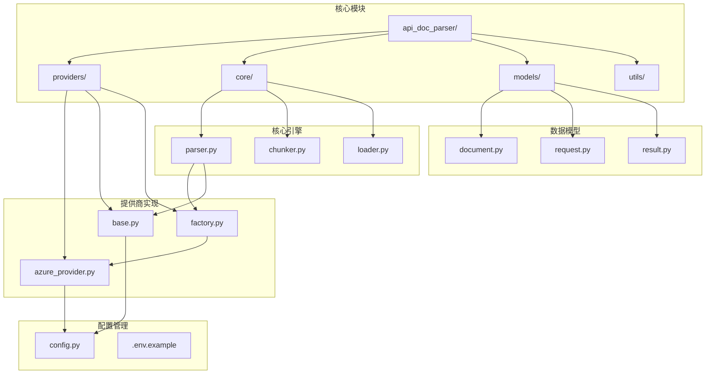
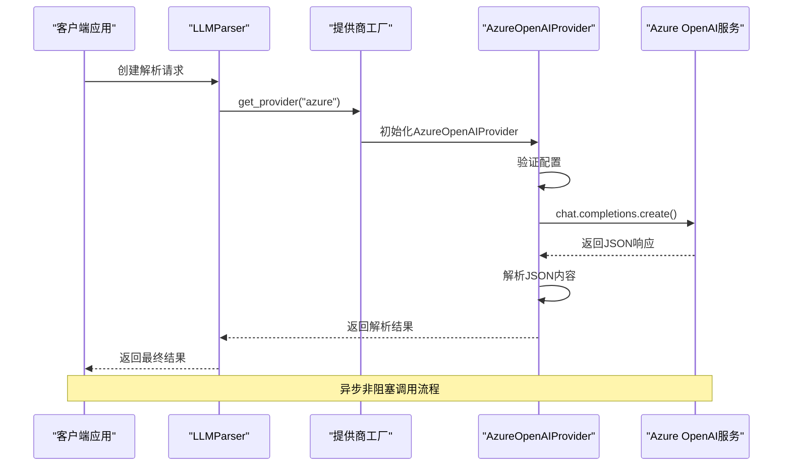
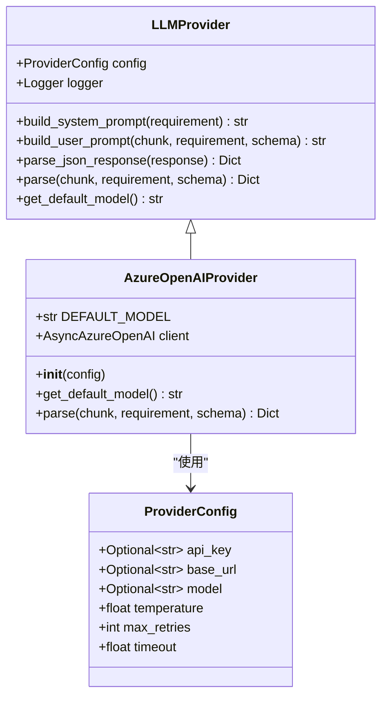
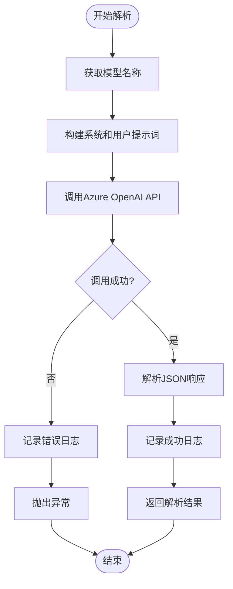
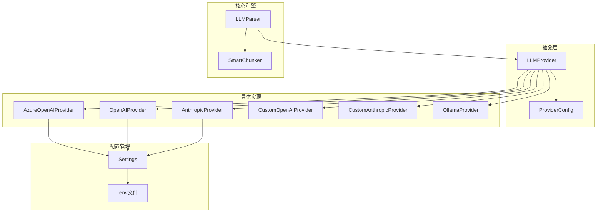
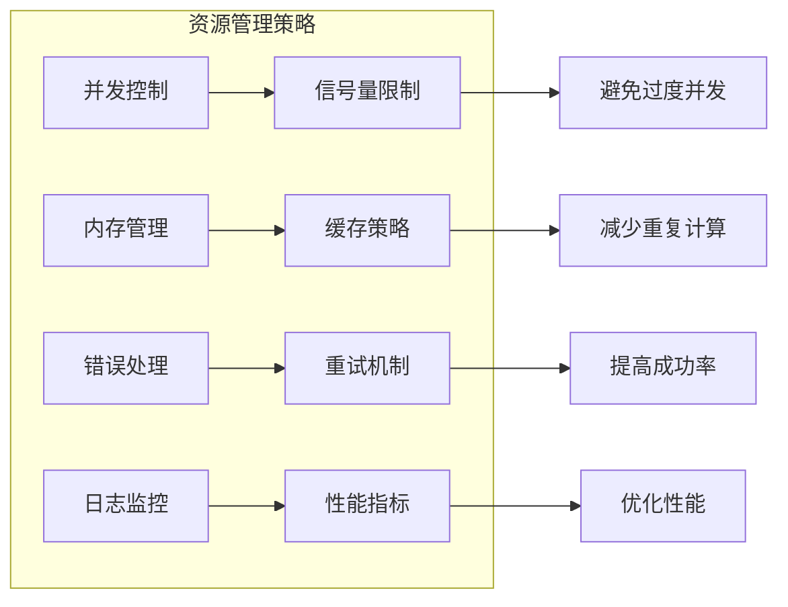

# Azure OpenAI提供商集成

<cite>
**本文档引用的文件**
- [azure_provider.py](file://api-doc-parser/src/api_doc_parser/providers/azure_provider.py)
- [base.py](file://api-doc-parser/src/api_doc_parser/providers/base.py)
- [factory.py](file://api-doc-parser/src/api_doc_parser/providers/factory.py)
- [config.py](file://api-doc-parser/src/api_doc_parser/config.py)
- [.env.example](file://api-doc-parser/.env.example)
- [parser.py](file://api-doc-parser/src/api_doc_parser/core/parser.py)
- [request.py](file://api-doc-parser/src/api_doc_parser/models/request.py)
- [document.py](file://api-doc-parser/src/api_doc_parser/models/document.py)
- [README.md](file://api-doc-parser/README.md)
</cite>

## 目录
1. [简介](#简介)
2. [项目结构](#项目结构)
3. [核心组件](#核心组件)
4. [架构概览](#架构概览)
5. [详细组件分析](#详细组件分析)
6. [依赖关系分析](#依赖关系分析)
7. [性能考虑](#性能考虑)
8. [故障排除指南](#故障排除指南)
9. [结论](#结论)
10. [附录](#附录)

## 简介

本文档为Azure OpenAI提供商集成提供了全面的技术文档。Azure OpenAI服务是微软Azure云平台上的大语言模型服务，为开发者提供了企业级的AI能力。本项目通过统一的提供商接口实现了对Azure OpenAI的无缝集成，支持多区域部署、企业级安全和合规性要求。

Azure OpenAI提供商的核心特性包括：
- **企业级安全**：基于Azure Active Directory的身份验证
- **多区域部署**：支持全球多个数据中心的部署选项
- **合规性保障**：满足GDPR、SOC 2等企业级合规要求
- **灵活的API版本管理**：支持不同版本的API端点
- **增强的安全控制**：网络隔离、数据加密、访问控制

## 项目结构

该项目采用模块化设计，主要包含以下核心目录和文件：



**图表来源**
- [azure_provider.py](file://api-doc-parser/src/api_doc_parser/providers/azure_provider.py#L1-L83)
- [base.py](file://api-doc-parser/src/api_doc_parser/providers/base.py#L1-L143)
- [factory.py](file://api-doc-parser/src/api_doc_parser/providers/factory.py#L1-L71)
- [config.py](file://api-doc-parser/src/api_doc_parser/config.py#L1-L57)

**章节来源**
- [README.md](file://api-doc-parser/README.md#L136-L157)

## 核心组件

### AzureOpenAIProvider类

AzureOpenAIProvider是Azure OpenAI服务的主要实现类，继承自LLMProvider基类。该类负责处理Azure OpenAI的特定配置和API调用。

**核心特性：**
- **默认模型配置**：使用GPT-4作为默认模型
- **AsyncAzureOpenAI客户端**：基于异步客户端的非阻塞调用
- **统一的日志记录**：标准化的成功和错误日志格式
- **JSON响应解析**：自动处理JSON格式的响应内容

**章节来源**
- [azure_provider.py](file://api-doc-parser/src/api_doc_parser/providers/azure_provider.py#L13-L83)

### ProviderConfig配置类

ProviderConfig提供了统一的提供商配置接口，支持所有LLM提供商的通用配置项。

**配置参数：**
- `api_key`: API密钥（Azure OpenAI必需）
- `base_url`: API基础URL（Azure OpenAI必需）
- `model`: 模型名称（可选，默认使用提供商默认值）
- `temperature`: 生成温度参数（0.0-2.0）
- `max_retries`: 最大重试次数
- `timeout`: 请求超时时间

**章节来源**
- [base.py](file://api-doc-parser/src/api_doc_parser/providers/base.py#L16-L25)

### Settings配置管理

Settings类使用Pydantic的BaseSettings实现环境变量配置管理，专门为Azure OpenAI提供了专门的配置项。

**Azure OpenAI专用配置：**
- `azure_openai_api_key`: Azure OpenAI API密钥
- `azure_openai_endpoint`: Azure OpenAI服务端点
- `azure_openai_api_version`: API版本号
- `azure_openai_default_model`: 默认使用的模型

**章节来源**
- [config.py](file://api-doc-parser/src/api_doc_parser/config.py#L25-L29)

## 架构概览

系统采用分层架构设计，通过工厂模式实现提供商的动态选择和配置。



**图表来源**
- [parser.py](file://api-doc-parser/src/api_doc_parser/core/parser.py#L32-L44)
- [factory.py](file://api-doc-parser/src/api_doc_parser/providers/factory.py#L14-L71)
- [azure_provider.py](file://api-doc-parser/src/api_doc_parser/providers/azure_provider.py#L42-L83)

## 详细组件分析

### AzureOpenAIProvider实现分析

AzureOpenAIProvider类实现了完整的Azure OpenAI集成，包括配置验证、客户端初始化和API调用。

#### 类关系图



**图表来源**
- [azure_provider.py](file://api-doc-parser/src/api_doc_parser/providers/azure_provider.py#L13-L41)
- [base.py](file://api-doc-parser/src/api_doc_parser/providers/base.py#L27-L57)

#### 初始化流程

AzureOpenAIProvider的初始化过程包含以下关键步骤：

1. **配置优先级处理**：如果未提供配置，自动从全局settings读取Azure配置
2. **必需参数验证**：确保base_url（Azure端点）存在
3. **客户端创建**：使用AsyncAzureOpenAI创建异步客户端
4. **API版本设置**：配置Azure API版本

**章节来源**
- [azure_provider.py](file://api-doc-parser/src/api_doc_parser/providers/azure_provider.py#L18-L37)

#### 解析流程

AzureOpenAIProvider的parse方法实现了完整的文档解析流程：



**图表来源**
- [azure_provider.py](file://api-doc-parser/src/api_doc_parser/providers/azure_provider.py#L42-L83)

**章节来源**
- [azure_provider.py](file://api-doc-parser/src/api_doc_parser/providers/azure_provider.py#L42-L83)

### 配置管理分析

系统提供了多层次的配置管理机制，确保Azure OpenAI集成的灵活性和安全性。

#### 环境变量配置

Azure OpenAI的环境变量配置遵循标准的命名约定：

| 配置项 | 描述 | 示例值 |
|--------|------|--------|
| AZURE_OPENAI_API_KEY | Azure OpenAI API密钥 | `your-azure-key` |
| AZURE_OPENAI_ENDPOINT | Azure OpenAI服务端点 | `https://your-resource.openai.azure.com` |
| AZURE_OPENAI_API_VERSION | API版本号 | `2024-02-01` |

#### 配置优先级

系统支持多种配置来源，按优先级排序：

1. **显式参数**：直接传入get_provider的参数
2. **ParseConfig**：解析配置中的设置
3. **环境变量**：.env文件中的配置
4. **默认值**：代码中的硬编码默认值

**章节来源**
- [.env.example](file://api-doc-parser/.env.example#L9-L12)
- [config.py](file://api-doc-parser/src/api_doc_parser/config.py#L25-L29)

### 工厂模式实现

工厂模式提供了统一的提供商创建接口，支持动态选择不同的LLM提供商。

#### 支持的提供商

| 提供商名称 | 用途 | API Key必需 | API Base必需 |
|------------|------|-------------|--------------|
| openai | OpenAI官方API | 是 | 否 |
| azure | Azure OpenAI | 是 | 是 |
| anthropic | Anthropic Claude | 是 | 否 |
| custom_openai | 自定义OpenAI协议 | 可选 | 是 |
| custom_anthropic | 自定义Anthropic协议 | 可选 | 是 |
| ollama | Ollama本地模型 | 否 | 可选 |

**章节来源**
- [factory.py](file://api-doc-parser/src/api_doc_parser/providers/factory.py#L14-L71)

## 依赖关系分析

系统采用松耦合的设计，通过抽象基类实现不同提供商的统一接口。



**图表来源**
- [base.py](file://api-doc-parser/src/api_doc_parser/providers/base.py#L27-L57)
- [factory.py](file://api-doc-parser/src/api_doc_parser/providers/factory.py#L14-L71)
- [config.py](file://api-doc-parser/src/api_doc_parser/config.py#L7-L56)

### 关键依赖关系

1. **AsyncAzureOpenAI客户端**：Azure OpenAI官方SDK
2. **structlog日志系统**：结构化日志记录
3. **Pydantic数据模型**：类型安全的数据验证
4. **asyncio异步框架**：非阻塞I/O操作

**章节来源**
- [azure_provider.py](file://api-doc-parser/src/api_doc_parser/providers/azure_provider.py#L3-L10)

## 性能考虑

Azure OpenAI提供商在设计时充分考虑了性能优化和资源管理。

### 并发处理

系统采用异步编程模型，支持高并发的文档解析：

- **并发限制**：使用信号量限制同时进行的解析任务数量
- **异步调用**：避免阻塞主线程，提高吞吐量
- **内存缓存**：缓存重复的解析结果，减少API调用

### 资源管理



**章节来源**
- [parser.py](file://api-doc-parser/src/api_doc_parser/core/parser.py#L130-L169)

### 性能优化建议

1. **合理设置并发数**：根据Azure OpenAI的速率限制调整并发度
2. **启用缓存**：对于重复的文档内容启用缓存机制
3. **监控API使用**：定期检查Azure OpenAI的使用情况和配额
4. **错误重试**：配置合理的重试策略和退避算法

## 故障排除指南

### 常见问题及解决方案

#### 1. Azure OpenAI配置错误

**问题症状：**
- 抛出"Azure OpenAI requires endpoint (base_url)"异常
- API调用返回401未授权错误

**解决步骤：**
1. 检查AZURE_OPENAI_ENDPOINT环境变量是否正确设置
2. 验证Azure OpenAI资源的可用性和状态
3. 确认API密钥具有正确的权限

**章节来源**
- [azure_provider.py](file://api-doc-parser/src/api_doc_parser/providers/azure_provider.py#L29-L30)

#### 2. API版本兼容性问题

**问题症状：**
- API调用返回版本不兼容错误
- 响应格式不符合预期

**解决步骤：**
1. 检查AZURE_OPENAI_API_VERSION配置
2. 确认Azure OpenAI资源支持的API版本
3. 更新API版本到最新稳定版本

**章节来源**
- [config.py](file://api-doc-parser/src/api_doc_parser/config.py#L28)

#### 3. JSON解析失败

**问题症状：**
- 解析结果包含"parse_error": true
- 日志显示failed_to_parse_json警告

**解决步骤：**
1. 检查模型的response_format设置
2. 验证输出Schema的正确性
3. 调整temperature参数以获得更稳定的输出

**章节来源**
- [base.py](file://api-doc-parser/src/api_doc_parser/providers/base.py#L112-L142)

### 监控和调试

#### 日志记录策略

系统提供了详细的日志记录机制：

| 日志级别 | 事件类型 | 描述 |
|----------|----------|------|
| INFO | azure_openai_parse_success | 成功的解析操作 |
| ERROR | azure_openai_parse_error | 解析过程中的错误 |
| WARNING | failed_to_parse_json | JSON解析失败警告 |

**章节来源**
- [azure_provider.py](file://api-doc-parser/src/api_doc_parser/providers/azure_provider.py#L67-L81)

#### 性能监控指标

建议监控以下关键指标：
- **API调用成功率**：跟踪Azure OpenAI的可用性
- **响应时间分布**：监控解析延迟
- **错误率统计**：识别常见问题模式
- **资源使用情况**：监控内存和CPU使用

## 结论

Azure OpenAI提供商集成为项目提供了企业级的大语言模型服务能力。通过统一的接口设计和灵活的配置管理，系统能够充分利用Azure OpenAI的优势，包括：

1. **企业级安全**：基于Azure Active Directory的认证机制
2. **全球部署**：支持多区域的数据中心部署
3. **合规性保障**：满足企业级的安全和合规要求
4. **灵活的API管理**：支持版本控制和向后兼容

该集成方案具有良好的扩展性，可以轻松适配不同的Azure OpenAI部署场景，并为企业用户提供可靠的文档解析服务。

## 附录

### 配置示例

#### 环境变量配置示例

```bash
# Azure OpenAI配置
AZURE_OPENAI_API_KEY=your-azure-key
AZURE_OPENAI_ENDPOINT=https://your-resource.openai.azure.com
AZURE_OPENAI_API_VERSION=2024-02-01
```

#### Python代码配置示例

```python
from api_doc_parser.providers.factory import get_provider
from api_doc_parser.models.request import ParseConfig

# 方式1：使用环境变量
provider = get_provider("azure")

# 方式2：显式配置
provider = get_provider(
    "azure",
    api_key="your-api-key",
    api_base="https://your-resource.openai.azure.com",
    model="gpt-4"
)

# 方式3：通过ParseConfig
config = ParseConfig(
    provider="azure",
    api_key="your-api-key",
    api_base="https://your-resource.openai.azure.com",
    model="gpt-4"
)
```

### API调用示例

#### 基本解析流程

```python
from api_doc_parser.core.parser import LLMParser
from api_doc_parser.models.request import ParseRequest, RequirementDoc, DocumentSource

# 创建解析请求
request = ParseRequest(
    source_document=DocumentSource(file_type="pdf"),
    requirement_doc=RequirementDoc(
        content="从API文档中提取所有API端点信息",
        output_schema={/* JSON Schema定义 */},
        extraction_rules=[/* 提取规则 */]
    ),
    config=ParseConfig(provider="azure")
)

# 执行解析
parser = LLMParser()
result = await parser.parse(request)
```

### 最佳实践

1. **配置管理**：使用环境变量管理敏感配置
2. **错误处理**：实现适当的重试和降级策略
3. **监控告警**：建立完善的监控和告警机制
4. **性能优化**：根据实际负载调整并发参数
5. **安全考虑**：定期轮换API密钥，最小权限原则