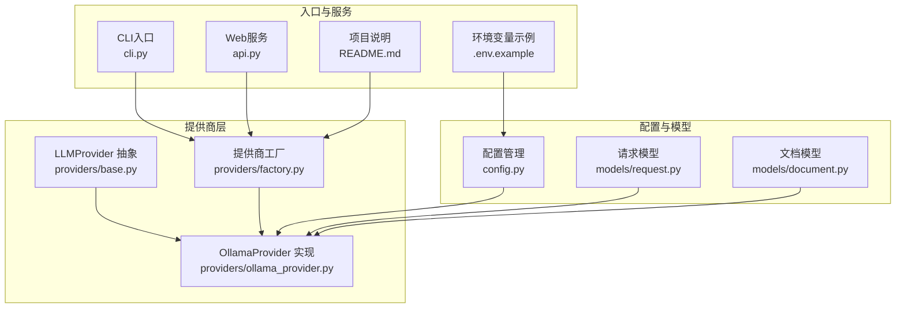
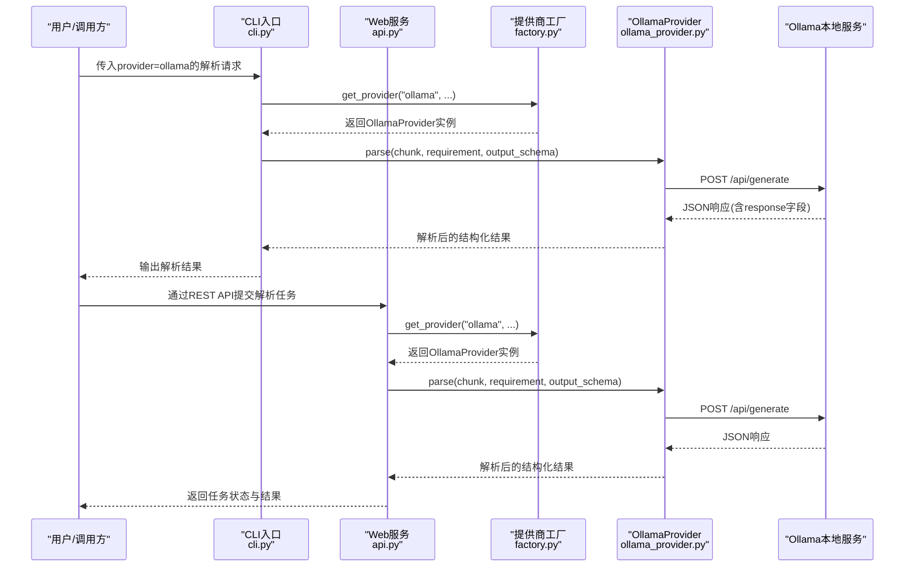
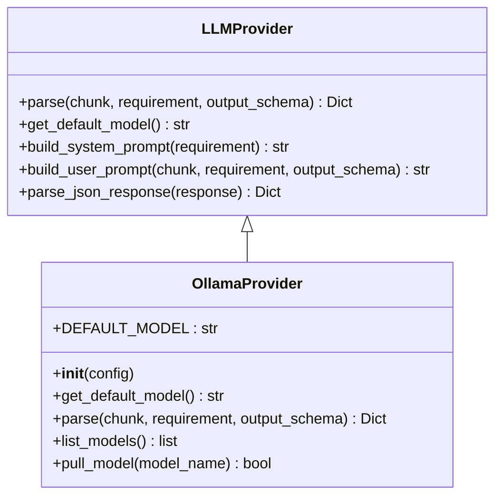
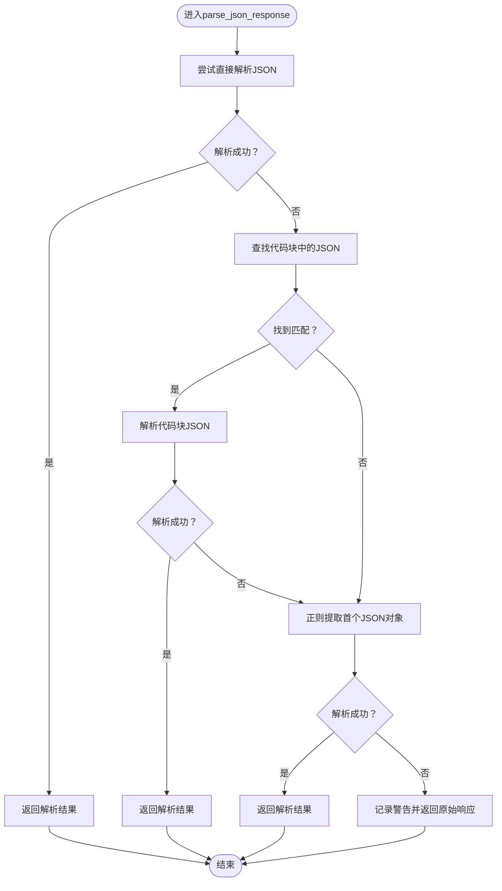
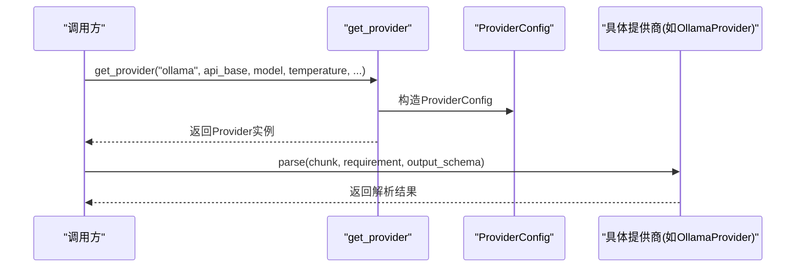
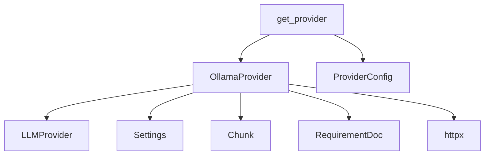

# Ollama本地模型集成

<cite>
**本文引用的文件**
- [ollama_provider.py](file://api-doc-parser/src/api_doc_parser/providers/ollama_provider.py)
- [base.py](file://api-doc-parser/src/api_doc_parser/providers/base.py)
- [factory.py](file://api-doc-parser/src/api_doc_parser/providers/factory.py)
- [config.py](file://api-doc-parser/src/api_doc_parser/config.py)
- [request.py](file://api-doc-parser/src/api_doc_parser/models/request.py)
- [document.py](file://api-doc-parser/src/api_doc_parser/models/document.py)
- [.env.example](file://api-doc-parser/.env.example)
- [README.md](file://api-doc-parser/README.md)
- [cli.py](file://api-doc-parser/src/api_doc_parser/cli.py)
- [api.py](file://api-doc-parser/src/api_doc_parser/api.py)
- [test_providers.py](file://api-doc-parser/tests/test_providers.py)
</cite>

## 目录
1. [简介](#简介)
2. [项目结构](#项目结构)
3. [核心组件](#核心组件)
4. [架构概览](#架构概览)
5. [详细组件分析](#详细组件分析)
6. [依赖关系分析](#依赖关系分析)
7. [性能考虑](#性能考虑)
8. [故障排除指南](#故障排除指南)
9. [结论](#结论)
10. [附录](#附录)

## 简介
本文件面向希望在本地环境中集成Ollama的开发者，提供从安装部署、模型管理到推理调用的完整技术文档。Ollama通过本地HTTP API提供与OpenAI兼容的接口，便于在本地或私网环境中进行大模型推理。本文档聚焦于以下方面：
- Ollama本地服务器配置与模型管理
- 与项目现有OpenAI兼容接口的对接方式
- 本地环境配置示例与Docker部署要点
- 本地模型的优势、资源需求与性能特征
- 故障排除与性能调优建议
- 安全与网络配置注意事项
- 与云端提供商的对比与迁移策略

## 项目结构
该项目采用模块化设计，围绕“提供商抽象层 + 具体提供商实现 + 配置管理 + CLI/Web服务”的架构组织。与Ollama集成相关的关键模块如下：
- 提供商抽象与通用逻辑：providers/base.py
- Ollama提供商实现：providers/ollama_provider.py
- 提供商工厂：providers/factory.py
- 配置管理：config.py
- 请求与数据模型：models/request.py、models/document.py
- CLI入口与Web服务：cli.py、api.py
- 示例环境变量：.env.example
- 项目说明文档：README.md

图表来源
- [ollama_provider.py](file://api-doc-parser/src/api_doc_parser/providers/ollama_provider.py#L1-L118)
- [base.py](file://api-doc-parser/src/api_doc_parser/providers/base.py#L1-L143)
- [factory.py](file://api-doc-parser/src/api_doc_parser/providers/factory.py#L1-L71)
- [config.py](file://api-doc-parser/src/api_doc_parser/config.py#L1-L57)
- [request.py](file://api-doc-parser/src/api_doc_parser/models/request.py#L1-L57)
- [document.py](file://api-doc-parser/src/api_doc_parser/models/document.py#L1-L75)
- [cli.py](file://api-doc-parser/src/api_doc_parser/cli.py#L1-L200)
- [api.py](file://api-doc-parser/src/api_doc_parser/api.py#L302-L352)
- [.env.example](file://api-doc-parser/.env.example#L1-L22)
- [README.md](file://api-doc-parser/README.md#L1-L176)

章节来源
- [README.md](file://api-doc-parser/README.md#L1-L176)
- [config.py](file://api-doc-parser/src/api_doc_parser/config.py#L1-L57)

## 核心组件
- OllamaProvider：实现与Ollama本地服务器的交互，负责构造OpenAI兼容的请求负载、发送HTTP请求、解析响应，并提供模型列表与拉取能力。
- LLMProvider抽象：定义统一的提供商接口、系统提示词与用户提示词构建逻辑、JSON响应解析策略。
- ProviderConfig：封装提供商通用配置项，如base_url、model、temperature、timeout等。
- 配置管理Settings：集中管理应用配置，包括Ollama默认base_url与默认模型等。
- 工厂get_provider：根据提供商名称返回对应实现，支持openai、azure、anthropic、custom_openai、custom_anthropic、ollama。

章节来源
- [ollama_provider.py](file://api-doc-parser/src/api_doc_parser/providers/ollama_provider.py#L1-L118)
- [base.py](file://api-doc-parser/src/api_doc_parser/providers/base.py#L1-L143)
- [factory.py](file://api-doc-parser/src/api_doc_parser/providers/factory.py#L1-L71)
- [config.py](file://api-doc-parser/src/api_doc_parser/config.py#L1-L57)

## 架构概览
Ollama集成遵循“抽象接口 + 具体实现 + 工厂选择 + 配置驱动”的模式。CLI与Web服务通过工厂获取OllamaProvider实例，随后由其向Ollama本地服务器发起HTTP请求，完成文档分块的结构化抽取。

图表来源
- [cli.py](file://api-doc-parser/src/api_doc_parser/cli.py#L127-L200)
- [api.py](file://api-doc-parser/src/api_doc_parser/api.py#L302-L352)
- [factory.py](file://api-doc-parser/src/api_doc_parser/providers/factory.py#L14-L71)
- [ollama_provider.py](file://api-doc-parser/src/api_doc_parser/providers/ollama_provider.py#L33-L91)

## 详细组件分析

### OllamaProvider 组件分析
- 默认模型与配置：默认模型为“llama2”，默认base_url指向本地11434端口；可通过ProviderConfig覆盖。
- 推理流程：构建系统提示词与用户提示词，拼接为单一样本，构造OpenAI兼容的payload（model、prompt、stream、options），通过httpx异步POST至“/api/generate”。
- 响应解析：从响应中提取“response”字段，交由基类的JSON解析策略处理，支持直接JSON与代码块内JSON两种常见格式。
- 模型管理：提供list_models（/api/tags）与pull_model（/api/pull）两个辅助方法，便于在运行时发现与拉取模型。
- 错误处理：捕获HTTP状态异常与通用异常，记录日志并向上抛出，便于上层重试或降级。

图表来源
- [base.py](file://api-doc-parser/src/api_doc_parser/providers/base.py#L27-L143)
- [ollama_provider.py](file://api-doc-parser/src/api_doc_parser/providers/ollama_provider.py#L13-L118)

章节来源
- [ollama_provider.py](file://api-doc-parser/src/api_doc_parser/providers/ollama_provider.py#L1-L118)
- [base.py](file://api-doc-parser/src/api_doc_parser/providers/base.py#L1-L143)

### 提示词构建与JSON解析策略
- 系统提示词：定义专业API文档解析专家角色、提取规则与输出约束，确保模型按要求输出合法JSON。
- 用户提示词：整合需求说明、输出Schema、上下文信息与待解析内容，形成完整的输入提示。
- JSON解析：优先尝试直接解析，其次匹配代码块内的JSON，最后尝试提取首个JSON对象；若均失败，保留原始响应并标记解析错误。

图表来源
- [base.py](file://api-doc-parser/src/api_doc_parser/providers/base.py#L112-L143)

章节来源
- [base.py](file://api-doc-parser/src/api_doc_parser/providers/base.py#L59-L143)

### 提供商工厂与配置注入
- 工厂get_provider：根据provider_name返回对应实现类，支持“ollama”选项；自定义OpenAI/Anthropic协议需提供api_base。
- 配置ProviderConfig：封装api_key、base_url、model、temperature、max_retries、timeout等，作为LLMProvider的统一输入。
- 配置Settings：集中管理Ollama默认base_url与默认模型，以及全局默认温度、分块大小等。

图表来源
- [factory.py](file://api-doc-parser/src/api_doc_parser/providers/factory.py#L14-L71)
- [config.py](file://api-doc-parser/src/api_doc_parser/config.py#L16-L56)

章节来源
- [factory.py](file://api-doc-parser/src/api_doc_parser/providers/factory.py#L1-L71)
- [config.py](file://api-doc-parser/src/api_doc_parser/config.py#L1-L57)

### CLI与Web服务中的Ollama集成
- CLI：支持--provider ollama、--api-base、--model、--temperature等参数，内部通过工厂创建OllamaProvider并执行解析。
- Web服务：接收REST请求，构建ParseRequest与ParseConfig，调用工厂获取OllamaProvider后执行解析，支持异步任务状态查询。

章节来源
- [cli.py](file://api-doc-parser/src/api_doc_parser/cli.py#L50-L125)
- [api.py](file://api-doc-parser/src/api_doc_parser/api.py#L302-L352)

## 依赖关系分析
- OllamaProvider依赖：
  - 基类LLMProvider（系统/用户提示词构建、JSON解析）
  - 配置Settings（默认base_url与默认模型）
  - 数据模型Chunk与RequirementDoc（输入数据结构）
  - httpx（异步HTTP客户端）
- 工厂依赖：
  - 各提供商实现类（含OllamaProvider）
  - ProviderConfig（统一配置注入）

图表来源
- [ollama_provider.py](file://api-doc-parser/src/api_doc_parser/providers/ollama_provider.py#L1-L118)
- [base.py](file://api-doc-parser/src/api_doc_parser/providers/base.py#L1-L143)
- [config.py](file://api-doc-parser/src/api_doc_parser/config.py#L1-L57)
- [factory.py](file://api-doc-parser/src/api_doc_parser/providers/factory.py#L1-L71)

章节来源
- [ollama_provider.py](file://api-doc-parser/src/api_doc_parser/providers/ollama_provider.py#L1-L118)
- [factory.py](file://api-doc-parser/src/api_doc_parser/providers/factory.py#L1-L71)

## 性能考虑
- 温度参数：较低的temperature（默认0.1）有助于提升输出稳定性，适合结构化抽取场景。
- 分块策略：结合文档结构与上下文，合理设置chunk_size与overlap，避免跨段信息断裂影响抽取质量。
- 超时与重试：ProviderConfig提供timeout与max_retries，建议根据本地硬件与模型规模调整。
- 模型选择：默认模型为“llama2”，可根据任务复杂度与资源情况选择更大模型；首次使用前可通过list_models确认可用模型，必要时使用pull_model拉取。
- 缓存与增量更新：项目支持缓存与增量更新，可减少重复计算与网络开销。

章节来源
- [config.py](file://api-doc-parser/src/api_doc_parser/config.py#L43-L56)
- [base.py](file://api-doc-parser/src/api_doc_parser/providers/base.py#L16-L25)
- [ollama_provider.py](file://api-doc-parser/src/api_doc_parser/providers/ollama_provider.py#L93-L118)

## 故障排除指南
- 无法连接Ollama服务
  - 现象：HTTP状态异常或连接超时
  - 排查：确认Ollama服务已启动且监听地址正确；检查防火墙与端口；验证OLLAMA_BASE_URL配置
  - 参考：OllamaProvider在HTTP异常与通用异常分支均有日志记录
- 模型未找到
  - 现象：解析报错或返回空结果
  - 排查：使用list_models确认可用模型；使用pull_model拉取所需模型
- JSON解析失败
  - 现象：返回包含原始响应与解析错误标记
  - 排查：检查模型输出是否包含JSON代码块；调整系统提示词以强制JSON输出
- CLI/Web服务参数问题
  - 现象：工厂抛出“未知提供商”或“缺少api_base”
  - 排查：确保provider参数为“ollama”；自定义协议需提供api_base

章节来源
- [ollama_provider.py](file://api-doc-parser/src/api_doc_parser/providers/ollama_provider.py#L77-L91)
- [factory.py](file://api-doc-parser/src/api_doc_parser/providers/factory.py#L59-L68)
- [base.py](file://api-doc-parser/src/api_doc_parser/providers/base.py#L112-L143)

## 结论
通过抽象的LLMProvider接口与工厂模式，项目实现了对Ollama本地模型的无缝集成。OllamaProvider遵循OpenAI兼容的请求格式，简化了本地部署与模型管理流程。配合CLI与Web服务，用户可在本地或私网环境中高效完成API文档的结构化抽取。建议在生产环境中结合缓存、合理的分块策略与模型选择，持续优化性能与稳定性。

## 附录

### 本地部署与配置示例
- 环境变量配置
  - 设置OLLAMA_BASE_URL为Ollama服务地址，默认http://localhost:11434
  - 可选：设置OLLAMA_DEFAULT_MODEL为默认模型名
- Docker部署要点
  - 拉取Ollama镜像并启动容器，确保容器网络与宿主机端口映射正确
  - 在容器内或宿主机上拉取所需模型（如llama2）
  - 验证服务连通性：curl http://localhost:11434/api/tags
- 项目内配置
  - 通过ProviderConfig覆盖默认base_url与模型
  - 通过CLI或Web服务传入--provider ollama与--api-base等参数

章节来源
- [.env.example](file://api-doc-parser/.env.example#L14-L16)
- [config.py](file://api-doc-parser/src/api_doc_parser/config.py#L36-L38)
- [README.md](file://api-doc-parser/README.md#L32-L86)

### OpenAI兼容API与参数映射
- 请求端点：/api/generate
- 关键参数映射：
  - model → 模型名
  - prompt → 组合后的系统提示词+用户提示词
  - stream → false（当前实现）
  - options.temperature → temperature
- 响应字段：
  - response → 模型输出文本
  - total_duration → 推理耗时（用于日志记录）

章节来源
- [ollama_provider.py](file://api-doc-parser/src/api_doc_parser/providers/ollama_provider.py#L48-L75)

### 与云端提供商的对比与迁移策略
- 对比维度
  - 成本：本地部署无按次计费，但需承担硬件与维护成本
  - 隐私：本地部署更易满足数据不出域的要求
  - 可靠性：本地部署受硬件与网络影响较大，需做好高可用与备份
  - 易用性：云端提供商通常提供更丰富的SDK与监控工具
- 迁移策略
  - 以ProviderConfig为边界，替换base_url与模型名即可完成迁移
  - 保持系统提示词与输出Schema不变，降低迁移成本
  - 逐步将流量切换至本地，同时保留云端作为备用

章节来源
- [factory.py](file://api-doc-parser/src/api_doc_parser/providers/factory.py#L22-L32)
- [config.py](file://api-doc-parser/src/api_doc_parser/config.py#L20-L38)