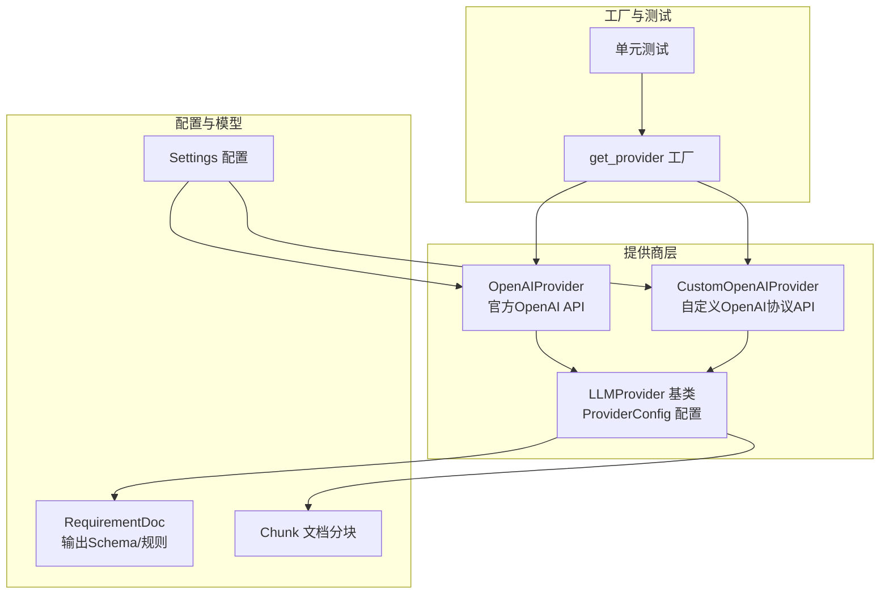
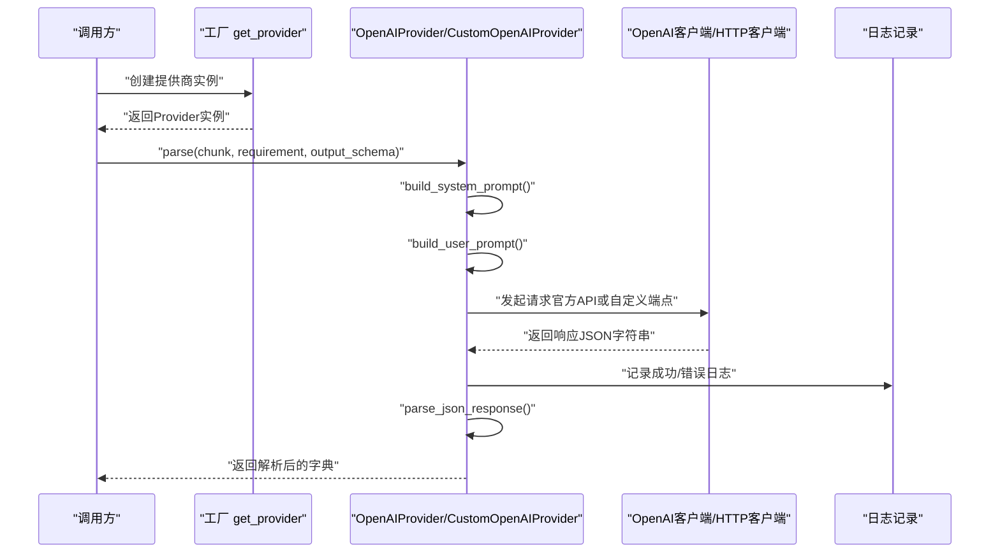
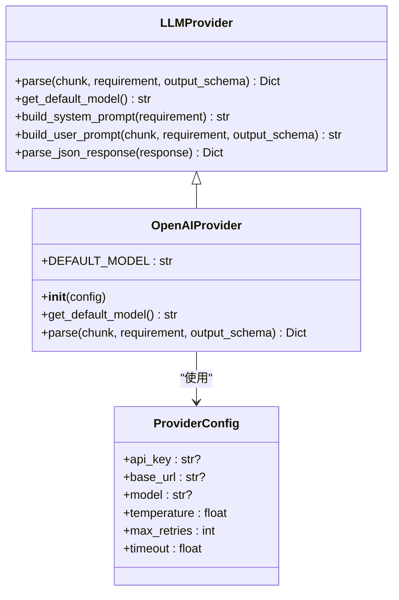
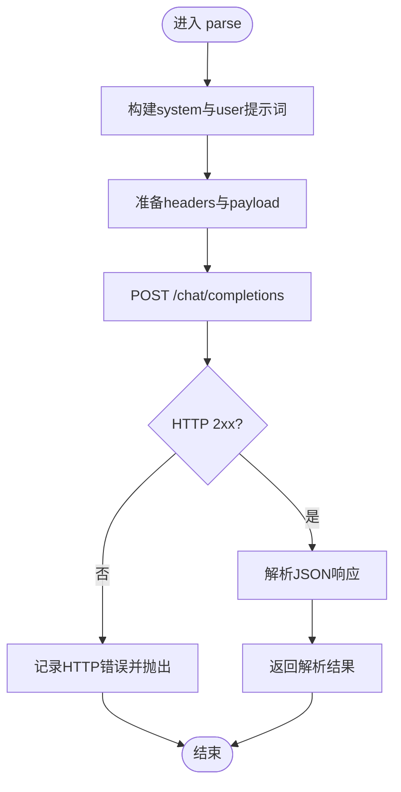
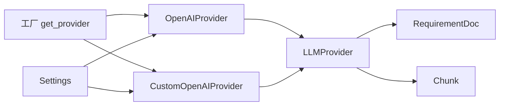

# OpenAI提供商集成

<cite>
**本文档引用的文件**
- [openai_provider.py](file://api-doc-parser/src/api_doc_parser/providers/openai_provider.py)
- [custom_openai_provider.py](file://api-doc-parser/src/api_doc_parser/providers/custom_openai_provider.py)
- [base.py](file://api-doc-parser/src/api_doc_parser/providers/base.py)
- [factory.py](file://api-doc-parser/src/api_doc_parser/providers/factory.py)
- [config.py](file://api-doc-parser/src/api_doc_parser/config.py)
- [request.py](file://api-doc-parser/src/api_doc_parser/models/request.py)
- [document.py](file://api-doc-parser/src/api_doc_parser/models/document.py)
- [.env.example](file://api-doc-parser/.env.example)
- [README.md](file://api-doc-parser/README.md)
- [test_providers.py](file://api-doc-parser/tests/test_providers.py)
</cite>

## 目录
1. [简介](#简介)
2. [项目结构](#项目结构)
3. [核心组件](#核心组件)
4. [架构总览](#架构总览)
5. [详细组件分析](#详细组件分析)
6. [依赖关系分析](#依赖关系分析)
7. [性能考虑](#性能考虑)
8. [故障排除指南](#故障排除指南)
9. [结论](#结论)
10. [附录](#附录)

## 简介
本文件面向需要在系统中集成OpenAI提供商的工程师与技术文档编写者，全面阐述OpenAI API的集成实现细节，包括API密钥配置、模型选择与参数设置、JSON模式输出、错误处理策略以及性能优化建议。文档同时覆盖自定义OpenAI协议API（如vLLM、TGI等）的适配方案，并提供完整的配置示例与最佳实践。

## 项目结构
该模块位于 `api-doc-parser/src/api_doc_parser/providers/` 目录下，采用“按职责分层”的组织方式：
- 提供商基类与通用配置：`base.py`
- OpenAI官方API提供商：`openai_provider.py`
- 自定义OpenAI协议提供商：`custom_openai_provider.py`
- 提供商工厂：`factory.py`
- 应用配置：`config.py`
- 数据模型：`request.py`、`document.py`
- 示例与环境配置：`.env.example`、`README.md`
- 单元测试：`tests/test_providers.py`

图表来源
- [factory.py](file://api-doc-parser/src/api_doc_parser/providers/factory.py#L14-L71)
- [openai_provider.py](file://api-doc-parser/src/api_doc_parser/providers/openai_provider.py#L13-L82)
- [custom_openai_provider.py](file://api-doc-parser/src/api_doc_parser/providers/custom_openai_provider.py#L12-L122)
- [base.py](file://api-doc-parser/src/api_doc_parser/providers/base.py#L16-L143)
- [config.py](file://api-doc-parser/src/api_doc_parser/config.py#L7-L57)
- [request.py](file://api-doc-parser/src/api_doc_parser/models/request.py#L24-L57)
- [document.py](file://api-doc-parser/src/api_doc_parser/models/document.py#L56-L75)

章节来源
- [factory.py](file://api-doc-parser/src/api_doc_parser/providers/factory.py#L14-L71)
- [openai_provider.py](file://api-doc-parser/src/api_doc_parser/providers/openai_provider.py#L13-L82)
- [custom_openai_provider.py](file://api-doc-parser/src/api_doc_parser/providers/custom_openai_provider.py#L12-L122)
- [base.py](file://api-doc-parser/src/api_doc_parser/providers/base.py#L16-L143)
- [config.py](file://api-doc-parser/src/api_doc_parser/config.py#L7-L57)
- [request.py](file://api-doc-parser/src/api_doc_parser/models/request.py#L24-L57)
- [document.py](file://api-doc-parser/src/api_doc_parser/models/document.py#L56-L75)

## 核心组件
- LLMProvider 抽象基类：定义统一接口、系统提示词构建、用户提示词构建、JSON响应解析与日志记录。
- ProviderConfig 配置类：封装API Key、Base URL、模型名、温度、最大重试次数、超时等配置项。
- OpenAIProvider：基于官方AsyncOpenAI客户端，支持response_format为json_object，自动记录tokens使用量。
- CustomOpenAIProvider：兼容OpenAI协议的自定义端点（如vLLM、TGI），通过HTTP客户端调用/chat/completions。
- 工厂函数 get_provider：根据提供商名称返回对应实例，支持openai、azure、anthropic、custom_openai、custom_anthropic、ollama。
- 配置管理 Settings：读取.env环境变量，提供OpenAI/Azure/Anthropic/Ollama等默认值与全局参数。

章节来源
- [base.py](file://api-doc-parser/src/api_doc_parser/providers/base.py#L27-L143)
- [openai_provider.py](file://api-doc-parser/src/api_doc_parser/providers/openai_provider.py#L13-L82)
- [custom_openai_provider.py](file://api-doc-parser/src/api_doc_parser/providers/custom_openai_provider.py#L12-L122)
- [factory.py](file://api-doc-parser/src/api_doc_parser/providers/factory.py#L14-L71)
- [config.py](file://api-doc-parser/src/api_doc_parser/config.py#L7-L57)

## 架构总览
OpenAI提供商的调用流程如下：
- 工厂根据提供商名称与配置创建具体提供商实例
- 提供商构建系统提示词与用户提示词（含输出Schema）
- 调用OpenAI官方客户端或自定义HTTP端点
- 解析JSON响应，记录日志与tokens使用情况

图表来源
- [factory.py](file://api-doc-parser/src/api_doc_parser/providers/factory.py#L14-L71)
- [openai_provider.py](file://api-doc-parser/src/api_doc_parser/providers/openai_provider.py#L41-L82)
- [custom_openai_provider.py](file://api-doc-parser/src/api_doc_parser/providers/custom_openai_provider.py#L35-L102)
- [base.py](file://api-doc-parser/src/api_doc_parser/providers/base.py#L59-L143)

## 详细组件分析

### OpenAIProvider 组件分析
- 默认模型：若未显式指定，使用gpt-4作为默认模型。
- 客户端初始化：从ProviderConfig读取api_key、max_retries；可选base_url。
- 请求参数：model、messages（system+user）、temperature、response_format=json_object。
- 日志记录：成功时记录模型名与tokens使用量；异常时记录错误详情。
- JSON解析：优先尝试直接解析；失败时尝试提取代码块与JSON对象；最终兜底返回原始内容并标记解析错误。

图表来源
- [openai_provider.py](file://api-doc-parser/src/api_doc_parser/providers/openai_provider.py#L13-L82)
- [base.py](file://api-doc-parser/src/api_doc_parser/providers/base.py#L16-L57)

章节来源
- [openai_provider.py](file://api-doc-parser/src/api_doc_parser/providers/openai_provider.py#L13-L82)
- [base.py](file://api-doc-parser/src/api_doc_parser/providers/base.py#L16-L143)

### CustomOpenAIProvider 组件分析
- 适用场景：兼容OpenAI协议的自定义端点（如vLLM、TGI、LocalAI等）。
- 关键约束：必须提供base_url；可选api_key（部分端点不需要）。
- 请求参数：model、messages、temperature、max_tokens；可选response_format（非所有端点支持）。
- 错误处理：区分HTTP状态错误与通用异常，记录状态码、响应体与chunk索引。
- 列举模型：支持GET /models端点，便于动态发现可用模型。

图表来源
- [custom_openai_provider.py](file://api-doc-parser/src/api_doc_parser/providers/custom_openai_provider.py#L35-L102)

章节来源
- [custom_openai_provider.py](file://api-doc-parser/src/api_doc_parser/providers/custom_openai_provider.py#L12-L122)

### 提供商工厂与配置
- 工厂函数：根据提供商名称映射到具体类，校验custom_*类必须提供base_url。
- 配置来源：Settings从.env读取OPENAI_*、AZURE_*、ANTHROPIC_*、OLLAMA_*等配置，提供默认值与全局参数。
- 模型选择：OpenAIProvider默认使用gpt-4；CustomOpenAIProvider默认使用"default"（由后端决定）。

章节来源
- [factory.py](file://api-doc-parser/src/api_doc_parser/providers/factory.py#L14-L71)
- [config.py](file://api-doc-parser/src/api_doc_parser/config.py#L7-L57)

### 数据模型与提示词构建
- RequirementDoc：包含content、output_schema、extraction_rules，用于指导系统提示词与用户提示词构建。
- Chunk：文档分块，包含content、index、context等，用于上下文注入与token估算。
- 提示词构建：系统提示词强调严格遵循规则、输出有效JSON；用户提示词包含需求说明、输出格式要求、上下文与待解析内容。

章节来源
- [request.py](file://api-doc-parser/src/api_doc_parser/models/request.py#L24-L57)
- [document.py](file://api-doc-parser/src/api_doc_parser/models/document.py#L56-L75)
- [base.py](file://api-doc-parser/src/api_doc_parser/providers/base.py#L59-L111)

## 依赖关系分析
- 组件耦合：OpenAIProvider与CustomOpenAIProvider均继承自LLMProvider，共享提示词构建与JSON解析逻辑，降低重复。
- 外部依赖：OpenAIProvider依赖官方AsyncOpenAI客户端；CustomOpenAIProvider依赖httpx异步HTTP客户端。
- 配置依赖：ProviderConfig贯穿所有提供商，Settings提供默认值与全局参数。
- 工厂解耦：通过工厂函数屏蔽具体提供商差异，便于扩展新提供商。

图表来源
- [factory.py](file://api-doc-parser/src/api_doc_parser/providers/factory.py#L14-L71)
- [openai_provider.py](file://api-doc-parser/src/api_doc_parser/providers/openai_provider.py#L13-L82)
- [custom_openai_provider.py](file://api-doc-parser/src/api_doc_parser/providers/custom_openai_provider.py#L12-L122)
- [base.py](file://api-doc-parser/src/api_doc_parser/providers/base.py#L27-L57)
- [config.py](file://api-doc-parser/src/api_doc_parser/config.py#L7-L57)

章节来源
- [factory.py](file://api-doc-parser/src/api_doc_parser/providers/factory.py#L14-L71)
- [openai_provider.py](file://api-doc-parser/src/api_doc_parser/providers/openai_provider.py#L13-L82)
- [custom_openai_provider.py](file://api-doc-parser/src/api_doc_parser/providers/custom_openai_provider.py#L12-L122)
- [base.py](file://api-doc-parser/src/api_doc_parser/providers/base.py#L27-L57)
- [config.py](file://api-doc-parser/src/api_doc_parser/config.py#L7-L57)

## 性能考虑
- 温度参数：默认0.1，适合结构化抽取；可根据需求适度提高以增强多样性，但会增加不确定性。
- 最大重试次数：默认3次，结合指数退避策略可减少瞬时错误影响。
- 超时设置：ProviderConfig.timeout默认60秒，可根据网络状况调整。
- 分块策略：文档分块大小与重叠大小在配置中可调，避免上下文丢失的同时控制token用量。
- JSON解析健壮性：内置多轮解析策略，减少因模型输出格式不一致导致的失败。

章节来源
- [base.py](file://api-doc-parser/src/api_doc_parser/providers/base.py#L16-L57)
- [config.py](file://api-doc-parser/src/api_doc_parser/config.py#L43-L49)
- [document.py](file://api-doc-parser/src/api_doc_parser/models/document.py#L72-L75)

## 故障排除指南
- OpenAI官方API错误
  - 现象：parse过程中抛出异常，日志记录openai_parse_error。
  - 排查：检查OPENAI_API_KEY、base_url、模型名与网络连通性；确认response_format支持情况。
  - 参考路径：[openai_provider.py](file://api-doc-parser/src/api_doc_parser/providers/openai_provider.py#L75-L81)

- 自定义OpenAI协议API错误
  - 现象：HTTP状态错误或通用异常，日志记录custom_openai_http_error或custom_openai_parse_error。
  - 排查：确认base_url正确、端点为/chat/completions、Authorization头为Bearer {api_key}；检查max_tokens与temperature设置。
  - 参考路径：[custom_openai_provider.py](file://api-doc-parser/src/api_doc_parser/providers/custom_openai_provider.py#L87-L102)

- JSON解析失败
  - 现象：parse_json_response返回包含raw_response与parse_error的字典。
  - 排查：检查模型输出是否包含JSON代码块或JSON对象；适当提高temperature以增强一致性。
  - 参考路径：[base.py](file://api-doc-parser/src/api_doc_parser/providers/base.py#L112-L143)

- 工厂参数错误
  - 现象：custom_openai/custom_anthropic需要api_base，否则抛出ValueError。
  - 排查：确保传入api_base；检查提供商名称拼写。
  - 参考路径：[factory.py](file://api-doc-parser/src/api_doc_parser/providers/factory.py#L66-L69)

- 环境变量与配置
  - 现象：OPENAI_API_KEY为空导致认证失败。
  - 排查：参考.env.example创建.env文件并设置OPENAI_API_KEY。
  - 参考路径：[.env.example](file://api-doc-parser/.env.example#L1-L22)

章节来源
- [openai_provider.py](file://api-doc-parser/src/api_doc_parser/providers/openai_provider.py#L75-L81)
- [custom_openai_provider.py](file://api-doc-parser/src/api_doc_parser/providers/custom_openai_provider.py#L87-L102)
- [base.py](file://api-doc-parser/src/api_doc_parser/providers/base.py#L112-L143)
- [factory.py](file://api-doc-parser/src/api_doc_parser/providers/factory.py#L66-L69)
- [.env.example](file://api-doc-parser/.env.example#L1-L22)

## 结论
OpenAI提供商集成通过统一的抽象基类与工厂模式实现了高内聚、低耦合的设计，既支持官方OpenAI API，也兼容自定义OpenAI协议端点。通过严格的提示词构建、稳健的JSON解析与完善的错误处理机制，系统能够在复杂文档解析场景中稳定产出结构化结果。建议在生产环境中合理设置温度、重试与超时参数，并结合分块策略与输出Schema提升准确性与性能。

## 附录

### 配置示例与最佳实践
- 环境变量配置
  - 在.env中设置OPENAI_API_KEY；可选OPENAI_BASE_URL用于自定义端点。
  - 参考路径：[.env.example](file://api-doc-parser/.env.example#L1-L22)

- 使用CLI进行解析
  - 使用openai提供商解析文档：参考README中的示例命令。
  - 参考路径：[README.md](file://api-doc-parser/README.md#L51-L76)

- 自定义端点接入
  - 使用custom_openai提供商，传入--api-base与--model参数。
  - 参考路径：[README.md](file://api-doc-parser/README.md#L65-L72)

- JSON Schema输出
  - 在RequirementDoc中提供output_schema，系统会在用户提示词中注入格式要求。
  - 参考路径：[request.py](file://api-doc-parser/src/api_doc_parser/models/request.py#L24-L28)

- 速率限制与成本控制
  - 通过max_retries与timeout控制重试与等待时间；在上游服务侧配置限流策略。
  - 参考路径：[base.py](file://api-doc-parser/src/api_doc_parser/providers/base.py#L16-L25)

- 测试验证
  - 使用单元测试验证工厂与提供商行为。
  - 参考路径：[test_providers.py](file://api-doc-parser/tests/test_providers.py#L13-L45)