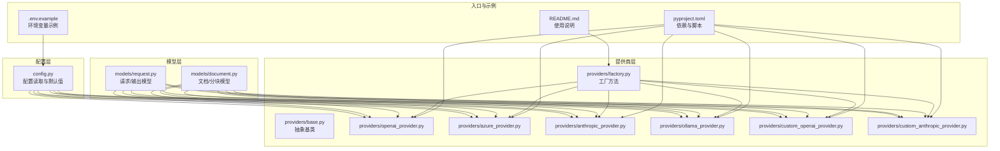
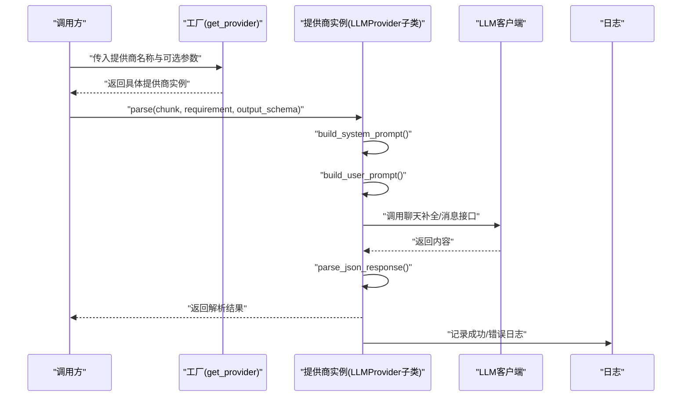
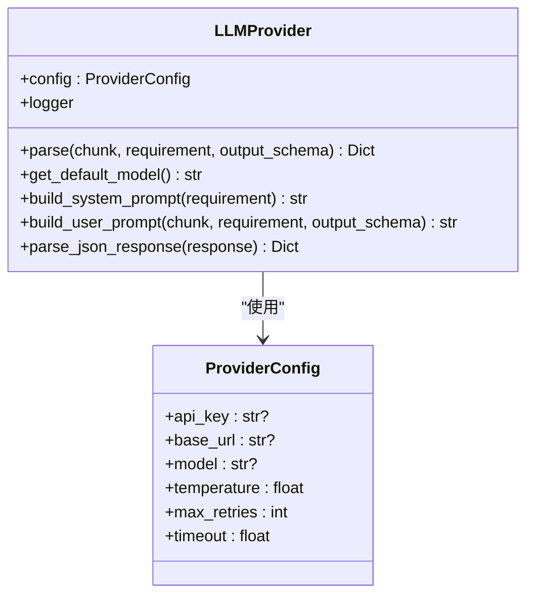
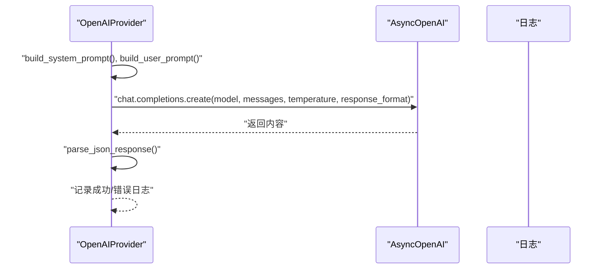
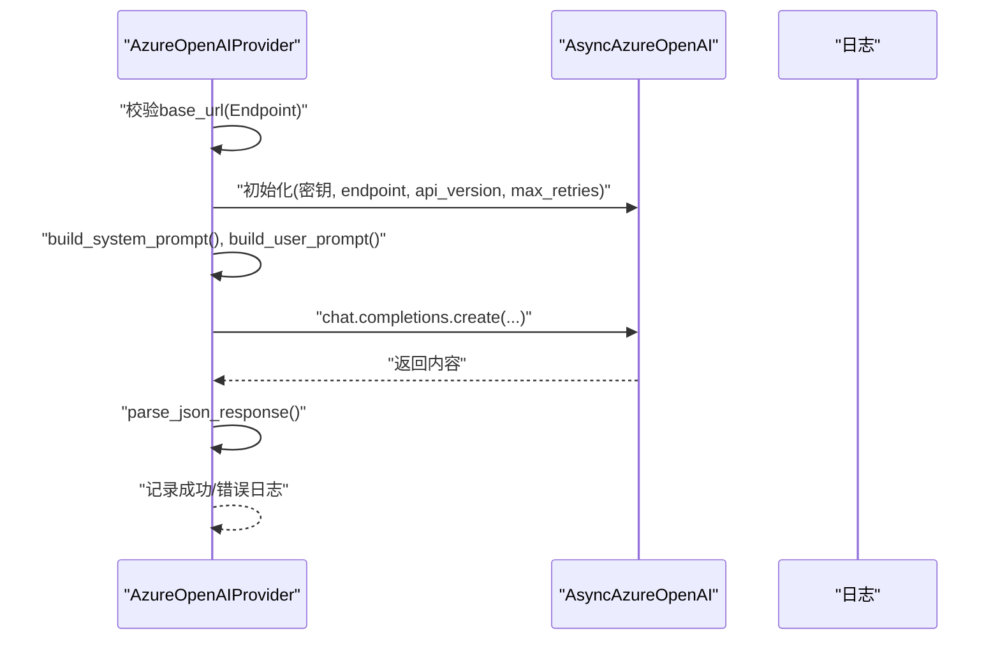
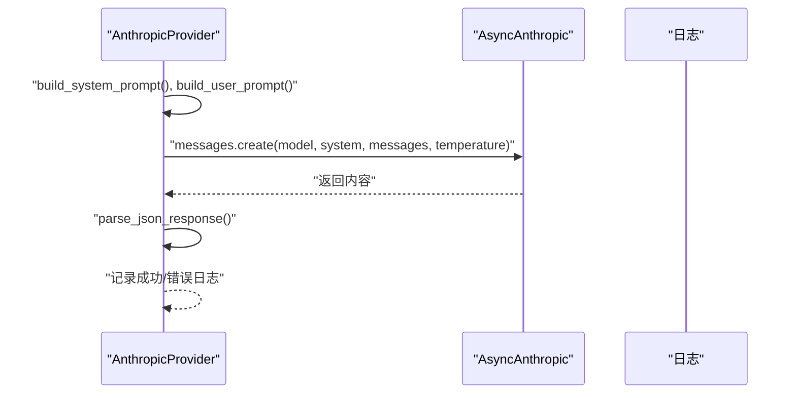
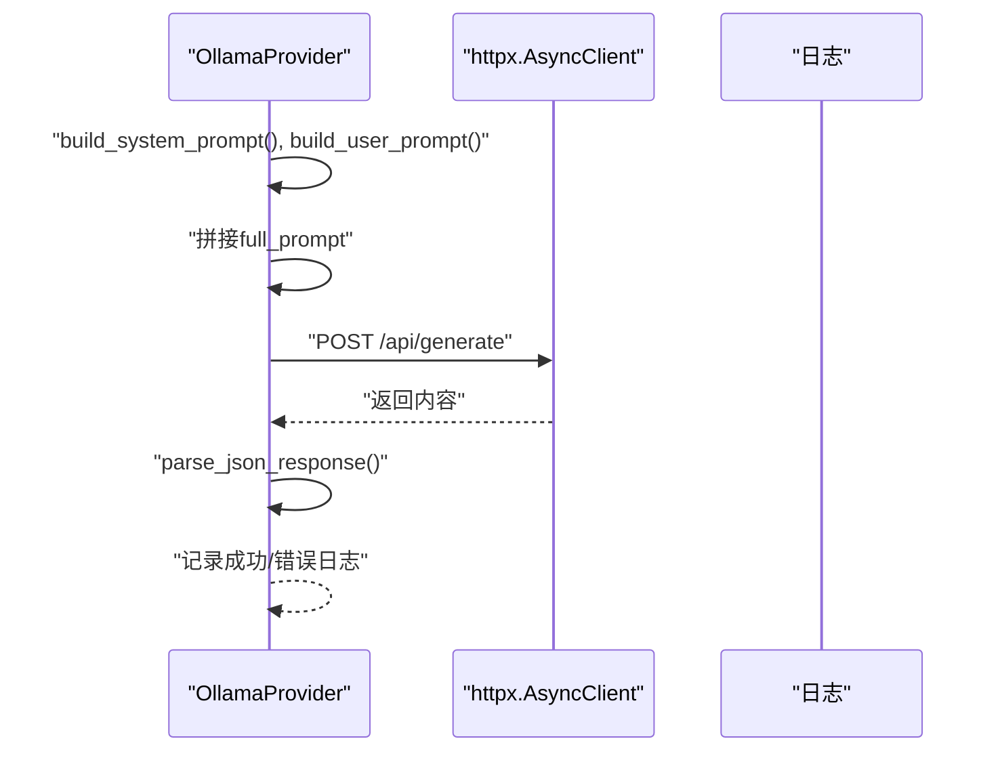
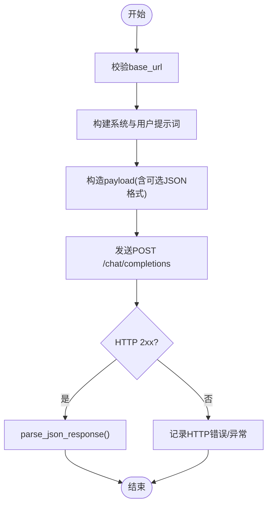
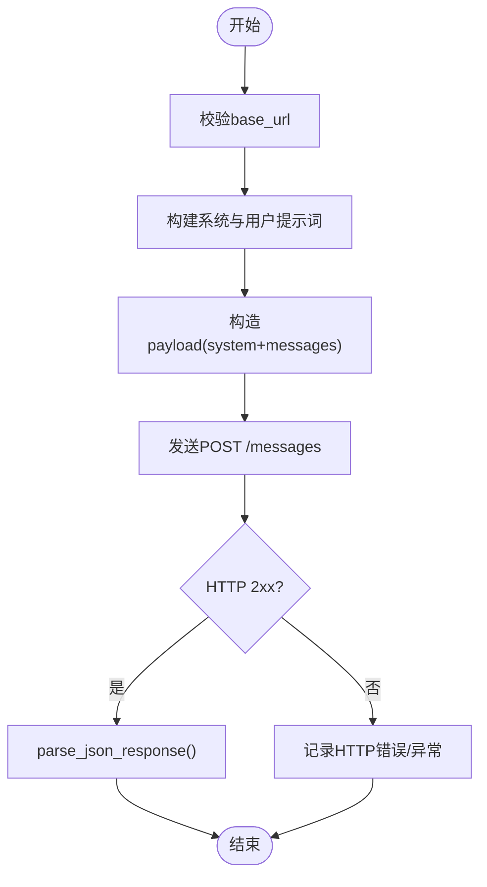
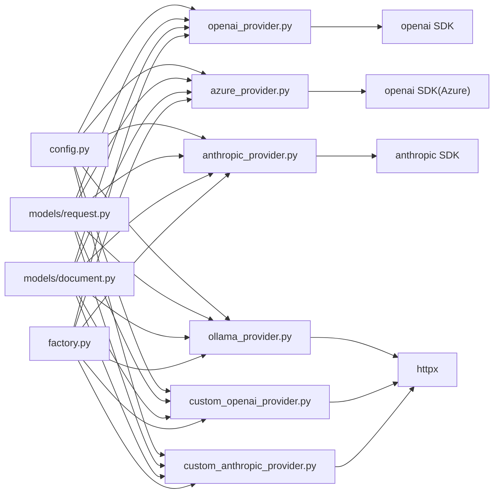

# 官方提供商集成

<cite>
**本文引用的文件**
- [README.md](file://README.md)
- [.env.example](file://.env.example)
- [pyproject.toml](file://pyproject.toml)
- [config.py](file://api-doc-parser/src/api_doc_parser/config.py)
- [base.py](file://api-doc-parser/src/api_doc_parser/providers/base.py)
- [factory.py](file://api-doc-parser/src/api_doc_parser/providers/factory.py)
- [openai_provider.py](file://api-doc-parser/src/api_doc_parser/providers/openai_provider.py)
- [azure_provider.py](file://api-doc-parser/src/api_doc_parser/providers/azure_provider.py)
- [anthropic_provider.py](file://api-doc-parser/src/api_doc_parser/providers/anthropic_provider.py)
- [ollama_provider.py](file://api-doc-parser/src/api_doc_parser/providers/ollama_provider.py)
- [custom_openai_provider.py](file://api-doc-parser/src/api_doc_parser/providers/custom_openai_provider.py)
- [custom_anthropic_provider.py](file://api-doc-parser/src/api_doc_parser/providers/custom_anthropic_provider.py)
- [request.py](file://api-doc-parser/src/api_doc_parser/models/request.py)
- [document.py](file://api-doc-parser/src/api_doc_parser/models/document.py)
</cite>

## 目录
1. [简介](#简介)
2. [项目结构](#项目结构)
3. [核心组件](#核心组件)
4. [架构总览](#架构总览)
5. [详细组件分析](#详细组件分析)
6. [依赖关系分析](#依赖关系分析)
7. [性能考量](#性能考量)
8. [故障排查指南](#故障排查指南)
9. [结论](#结论)
10. [附录](#附录)

## 简介
本文件面向官方LLM提供商集成，系统性介绍OpenAI、Azure OpenAI、Anthropic以及Ollama等官方提供商的集成实现。内容覆盖认证配置、API密钥管理、连接设置、特有参数、限制与性能特点、配置示例、错误处理与重试机制、使用示例与最佳实践，以及提供商间差异与迁移注意事项。目标是帮助读者从基础配置到高级优化建立完整的知识体系。

## 项目结构
该仓库采用按功能域划分的模块化组织方式，核心与提供商相关的关键目录与文件如下：
- 配置层：集中于配置管理模块，统一读取环境变量并提供默认值
- 提供商层：抽象基类与具体提供商实现，支持官方与自定义协议
- 模型层：输入输出数据结构定义
- 工厂层：根据提供商名称动态选择对应实现
- 文档与CLI/Web：提供使用示例与接口

图表来源
- [config.py](file://api-doc-parser/src/api_doc_parser/config.py#L1-L57)
- [base.py](file://api-doc-parser/src/api_doc_parser/providers/base.py#L1-L143)
- [factory.py](file://api-doc-parser/src/api_doc_parser/providers/factory.py#L1-L71)
- [openai_provider.py](file://api-doc-parser/src/api_doc_parser/providers/openai_provider.py#L1-L82)
- [azure_provider.py](file://api-doc-parser/src/api_doc_parser/providers/azure_provider.py#L1-L83)
- [anthropic_provider.py](file://api-doc-parser/src/api_doc_parser/providers/anthropic_provider.py#L1-L82)
- [ollama_provider.py](file://api-doc-parser/src/api_doc_parser/providers/ollama_provider.py#L1-L118)
- [custom_openai_provider.py](file://api-doc-parser/src/api_doc_parser/providers/custom_openai_provider.py#L1-L122)
- [custom_anthropic_provider.py](file://api-doc-parser/src/api_doc_parser/providers/custom_anthropic_provider.py#L1-L96)
- [request.py](file://api-doc-parser/src/api_doc_parser/models/request.py#L1-L57)
- [document.py](file://api-doc-parser/src/api_doc_parser/models/document.py#L1-L75)
- [README.md](file://README.md#L1-L176)
- [.env.example](file://.env.example#L1-L22)
- [pyproject.toml](file://pyproject.toml#L1-L100)

章节来源
- [README.md](file://README.md#L1-L176)
- [pyproject.toml](file://pyproject.toml#L1-L100)

## 核心组件
- 抽象基类与通用能力
  - 统一的配置载体与默认行为：温度、超时、重试次数、系统提示词构建、用户提示词构建、JSON响应解析
  - 适用于所有提供商的通用逻辑，包括提示词拼接、JSON提取容错与日志记录
- 工厂方法
  - 根据提供商名称动态创建对应实例，支持官方与自定义协议
  - 对自定义协议进行必要参数校验（如需要base_url）
- 配置管理
  - 通过环境变量集中管理各提供商的密钥、基础URL、默认模型、温度、重试等参数
  - 默认值与可选参数清晰分离，便于本地与云端部署

章节来源
- [base.py](file://api-doc-parser/src/api_doc_parser/providers/base.py#L16-L143)
- [factory.py](file://api-doc-parser/src/api_doc_parser/providers/factory.py#L14-L71)
- [config.py](file://api-doc-parser/src/api_doc_parser/config.py#L7-L57)

## 架构总览
整体架构围绕“配置驱动 + 工厂选择 + 抽象基类 + 具体提供商”的模式展开。调用流程通常为：解析请求进入工厂，依据提供商名称选择实现；实现类基于配置初始化客户端；随后构造系统与用户提示词，调用LLM完成解析，并对响应进行JSON提取与日志记录。

图表来源
- [factory.py](file://api-doc-parser/src/api_doc_parser/providers/factory.py#L14-L71)
- [base.py](file://api-doc-parser/src/api_doc_parser/providers/base.py#L34-L143)
- [openai_provider.py](file://api-doc-parser/src/api_doc_parser/providers/openai_provider.py#L41-L82)
- [azure_provider.py](file://api-doc-parser/src/api_doc_parser/providers/azure_provider.py#L42-L83)
- [anthropic_provider.py](file://api-doc-parser/src/api_doc_parser/providers/anthropic_provider.py#L40-L82)
- [ollama_provider.py](file://api-doc-parser/src/api_doc_parser/providers/ollama_provider.py#L33-L118)
- [custom_openai_provider.py](file://api-doc-parser/src/api_doc_parser/providers/custom_openai_provider.py#L35-L122)
- [custom_anthropic_provider.py](file://api-doc-parser/src/api_doc_parser/providers/custom_anthropic_provider.py#L31-L96)

## 详细组件分析

### 抽象基类与通用能力
- 角色与职责
  - 统一的配置注入与日志绑定
  - 系统提示词与用户提示词的构建模板
  - JSON响应解析的容错策略（直接解析、代码块提取、对象边界提取）
- 关键点
  - 温度、超时、重试次数作为可配置项，贯穿所有提供商
  - 日志记录包含提供商名、模型名、分块索引、token用量等关键指标
  - JSON解析失败时保留原始响应并标记错误，便于调试

图表来源
- [base.py](file://api-doc-parser/src/api_doc_parser/providers/base.py#L16-L143)

章节来源
- [base.py](file://api-doc-parser/src/api_doc_parser/providers/base.py#L16-L143)

### OpenAI提供商
- 特性与差异
  - 使用官方AsyncOpenAI客户端
  - 支持通过base_url自定义端点（如代理或兼容端点）
  - 默认模型、温度、重试次数来自配置
  - 返回JSON对象格式，便于直接解析
- 认证与连接
  - 通过配置读取API密钥与可选base_url
  - 初始化客户端时传入max_retries
- 错误处理
  - 捕获异常并记录错误日志，包含提供商名、错误信息、分块索引
  - 成功时记录模型名与token用量

图表来源
- [openai_provider.py](file://api-doc-parser/src/api_doc_parser/providers/openai_provider.py#L13-L82)
- [base.py](file://api-doc-parser/src/api_doc_parser/providers/base.py#L34-L143)

章节来源
- [openai_provider.py](file://api-doc-parser/src/api_doc_parser/providers/openai_provider.py#L13-L82)
- [config.py](file://api-doc-parser/src/api_doc_parser/config.py#L20-L24)

### Azure OpenAI提供商
- 特性与差异
  - 使用AsyncAzureOpenAI客户端
  - 必须提供endpoint（base_url），且需指定API版本
  - 默认模型、温度、重试次数来自配置
- 认证与连接
  - 通过配置读取API密钥、endpoint、API版本与默认模型
  - 初始化客户端时传入endpoint与api_version
- 错误处理
  - 缺少endpoint时抛出明确错误
  - 异常捕获与日志记录同OpenAI

图表来源
- [azure_provider.py](file://api-doc-parser/src/api_doc_parser/providers/azure_provider.py#L13-L83)
- [base.py](file://api-doc-parser/src/api_doc_parser/providers/base.py#L34-L143)

章节来源
- [azure_provider.py](file://api-doc-parser/src/api_doc_parser/providers/azure_provider.py#L13-L83)
- [config.py](file://api-doc-parser/src/api_doc_parser/config.py#L25-L29)

### Anthropic提供商
- 特性与差异
  - 使用AsyncAnthropic客户端
  - system prompt通过独立参数传递，非messages数组
  - 默认模型、温度、重试次数来自配置
- 认证与连接
  - 通过配置读取API密钥与可选base_url
  - 初始化客户端时传入api_key与可选base_url
- 错误处理
  - 异常捕获与日志记录，成功时记录token用量

图表来源
- [anthropic_provider.py](file://api-doc-parser/src/api_doc_parser/providers/anthropic_provider.py#L13-L82)
- [base.py](file://api-doc-parser/src/api_doc_parser/providers/base.py#L34-L143)

章节来源
- [anthropic_provider.py](file://api-doc-parser/src/api_doc_parser/providers/anthropic_provider.py#L13-L82)
- [config.py](file://api-doc-parser/src/api_doc_parser/config.py#L31-L35)

### Ollama提供商
- 特性与差异
  - 本地HTTP API调用，无需官方密钥
  - 通过base_url访问本地Ollama服务，默认端口11434
  - 使用组合prompt而非messages数组
  - 提供列出模型与拉取模型的辅助方法
- 认证与连接
  - 通过配置读取base_url与默认模型
  - 使用httpx异步客户端，支持自定义超时
- 错误处理
  - 捕获HTTP状态错误与通用异常，记录状态码与响应文本
  - 成功时记录模型名与耗时

图表来源
- [ollama_provider.py](file://api-doc-parser/src/api_doc_parser/providers/ollama_provider.py#L13-L118)
- [base.py](file://api-doc-parser/src/api_doc_parser/providers/base.py#L34-L143)

章节来源
- [ollama_provider.py](file://api-doc-parser/src/api_doc_parser/providers/ollama_provider.py#L13-L118)
- [config.py](file://api-doc-parser/src/api_doc_parser/config.py#L36-L39)

### 自定义OpenAI协议提供商
- 适用场景
  - 支持vLLM、Text Generation Inference (TGI)、LocalAI等兼容OpenAI协议的自定义端点
- 特性与差异
  - 必须提供base_url
  - 可选API密钥（若后端需要）
  - 通过HTTP调用/chat/completions端点
  - 不强制要求response_format（取决于后端支持）
- 错误处理
  - 捕获HTTP状态错误与通用异常，记录状态码与响应文本

图表来源
- [custom_openai_provider.py](file://api-doc-parser/src/api_doc_parser/providers/custom_openai_provider.py#L12-L122)
- [base.py](file://api-doc-parser/src/api_doc_parser/providers/base.py#L34-L143)

章节来源
- [custom_openai_provider.py](file://api-doc-parser/src/api_doc_parser/providers/custom_openai_provider.py#L12-L122)

### 自定义Anthropic协议提供商
- 适用场景
  - 支持兼容Anthropic Messages API协议的自定义端点
- 特性与差异
  - 必须提供base_url
  - 可选API密钥（若后端需要）
  - 通过HTTP调用/messages端点
  - system参数通过独立字段传递
- 错误处理
  - 捕获HTTP状态错误与通用异常，记录状态码与响应文本

图表来源
- [custom_anthropic_provider.py](file://api-doc-parser/src/api_doc_parser/providers/custom_anthropic_provider.py#L12-L96)
- [base.py](file://api-doc-parser/src/api_doc_parser/providers/base.py#L34-L143)

章节来源
- [custom_anthropic_provider.py](file://api-doc-parser/src/api_doc_parser/providers/custom_anthropic_provider.py#L12-L96)

## 依赖关系分析
- 外部SDK依赖
  - OpenAI官方SDK：OpenAI、AsyncOpenAI、AsyncAzureOpenAI
  - Anthropic官方SDK：AsyncAnthropic
  - HTTP客户端：httpx（用于自定义协议与Ollama）
- 内部依赖
  - 配置模块为所有提供商提供统一的密钥、URL、模型、温度、重试等参数
  - 工厂方法负责提供商实例化与参数校验
  - 抽象基类统一提示词构建与JSON解析逻辑

图表来源
- [config.py](file://api-doc-parser/src/api_doc_parser/config.py#L7-L57)
- [openai_provider.py](file://api-doc-parser/src/api_doc_parser/providers/openai_provider.py#L5-L10)
- [azure_provider.py](file://api-doc-parser/src/api_doc_parser/providers/azure_provider.py#L5-L10)
- [anthropic_provider.py](file://api-doc-parser/src/api_doc_parser/providers/anthropic_provider.py#L5-L10)
- [ollama_provider.py](file://api-doc-parser/src/api_doc_parser/providers/ollama_provider.py#L5-L10)
- [custom_openai_provider.py](file://api-doc-parser/src/api_doc_parser/providers/custom_openai_provider.py#L5-L10)
- [custom_anthropic_provider.py](file://api-doc-parser/src/api_doc_parser/providers/custom_anthropic_provider.py#L5-L10)
- [factory.py](file://api-doc-parser/src/api_doc_parser/providers/factory.py#L6-L11)
- [request.py](file://api-doc-parser/src/api_doc_parser/models/request.py#L3-L5)
- [document.py](file://api-doc-parser/src/api_doc_parser/models/document.py#L3-L5)

章节来源
- [pyproject.toml](file://pyproject.toml#L25-L59)

## 性能考量
- 温度与稳定性
  - 所有提供商均支持温度参数，较低温度提升确定性，适合结构化抽取
- 超时与重试
  - 统一的超时与重试配置，避免长时间阻塞
  - Azure OpenAI与Ollama提供更细粒度的超时控制（如Ollama的长拉取操作）
- Token用量
  - OpenAI与Anthropic提供token用量统计，便于成本控制与限流
- 分块策略
  - 文档分块与滑动窗口策略有助于控制输入长度，减少截断风险

章节来源
- [base.py](file://api-doc-parser/src/api_doc_parser/providers/base.py#L22-L24)
- [openai_provider.py](file://api-doc-parser/src/api_doc_parser/providers/openai_provider.py#L66-L71)
- [anthropic_provider.py](file://api-doc-parser/src/api_doc_parser/providers/anthropic_provider.py#L66-L71)
- [ollama_provider.py](file://api-doc-parser/src/api_doc_parser/providers/ollama_provider.py#L68-L73)

## 故障排查指南
- 常见错误与定位
  - 缺少必需参数：Azure OpenAI缺少endpoint会直接报错；自定义协议缺少base_url也会报错
  - HTTP错误：Ollama与自定义协议在HTTP状态码异常时会记录状态码与响应文本
  - JSON解析失败：当LLM未返回标准JSON时，系统尝试多种提取策略并记录警告
- 日志与可观测性
  - 成功路径记录模型名、分块索引、token用量或耗时
  - 失败路径记录错误详情、提供商名、分块索引
- 重试与退避
  - 统一max_retries配置，结合外部重试策略可进一步增强稳定性

章节来源
- [azure_provider.py](file://api-doc-parser/src/api_doc_parser/providers/azure_provider.py#L29-L31)
- [custom_openai_provider.py](file://api-doc-parser/src/api_doc_parser/providers/custom_openai_provider.py#L24-L25)
- [custom_anthropic_provider.py](file://api-doc-parser/src/api_doc_parser/providers/custom_anthropic_provider.py#L19-L21)
- [ollama_provider.py](file://api-doc-parser/src/api_doc_parser/providers/ollama_provider.py#L77-L91)
- [base.py](file://api-doc-parser/src/api_doc_parser/providers/base.py#L112-L143)

## 结论
本集成方案以抽象基类为核心，通过工厂方法与配置模块实现对多家LLM提供商的一致接入。官方提供商（OpenAI、Azure OpenAI、Anthropic）与本地提供商（Ollama）在认证、连接与提示词构建上各有差异，但共享统一的错误处理与JSON解析策略。自定义协议提供商进一步扩展了生态兼容性。建议在生产环境中结合重试、超时与日志监控，确保稳定与可观测性。

## 附录

### 配置与认证要点
- 环境变量与默认值
  - OpenAI：API密钥、可选base_url、默认模型
  - Azure OpenAI：API密钥、endpoint、API版本、默认模型
  - Anthropic：API密钥、可选base_url、默认模型
  - Ollama：base_url、默认模型
- 工厂参数优先级
  - 通过工厂方法传入的参数优先于配置模块中的默认值
- CLI与Web使用
  - README提供了CLI与Web服务的使用示例，包括提供商列表查询与同步/异步解析

章节来源
- [.env.example](file://.env.example#L1-L22)
- [config.py](file://api-doc-parser/src/api_doc_parser/config.py#L20-L39)
- [factory.py](file://api-doc-parser/src/api_doc_parser/providers/factory.py#L14-L71)
- [README.md](file://README.md#L32-L86)

### 使用示例与最佳实践
- 示例命令
  - 生成示例要求说明文件
  - 使用OpenAI解析API文档
  - 使用自定义OpenAI协议解析（如vLLM）
  - 列出支持的提供商
- 最佳实践
  - 明确区分官方与自定义协议的参数要求
  - 在Azure OpenAI中严格配置endpoint与API版本
  - 对Ollama与自定义协议设置合理的超时时间
  - 使用较低温度提升结构化输出一致性
  - 结合日志与监控评估token用量与延迟

章节来源
- [README.md](file://README.md#L51-L76)

### 提供商差异与迁移注意事项
- OpenAI vs Azure OpenAI
  - Azure OpenAI需要endpoint与API版本，OpenAI可直接使用官方端点
  - 迁移时需替换endpoint与版本号
- OpenAI vs Anthropic
  - 提示词构建方式不同：Anthropic通过独立system参数传递
  - 迁移时需调整提示词结构
- 本地vs云端
  - Ollama无需密钥，但需本地服务可用
  - 迁移时需关注网络可达性与超时设置

章节来源
- [openai_provider.py](file://api-doc-parser/src/api_doc_parser/providers/openai_provider.py#L13-L36)
- [azure_provider.py](file://api-doc-parser/src/api_doc_parser/providers/azure_provider.py#L13-L37)
- [anthropic_provider.py](file://api-doc-parser/src/api_doc_parser/providers/anthropic_provider.py#L13-L35)
- [ollama_provider.py](file://api-doc-parser/src/api_doc_parser/providers/ollama_provider.py#L13-L29)