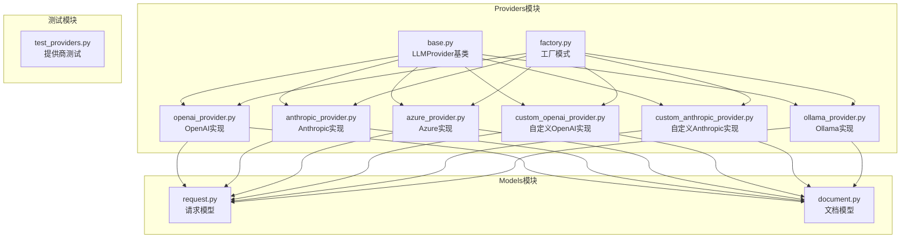
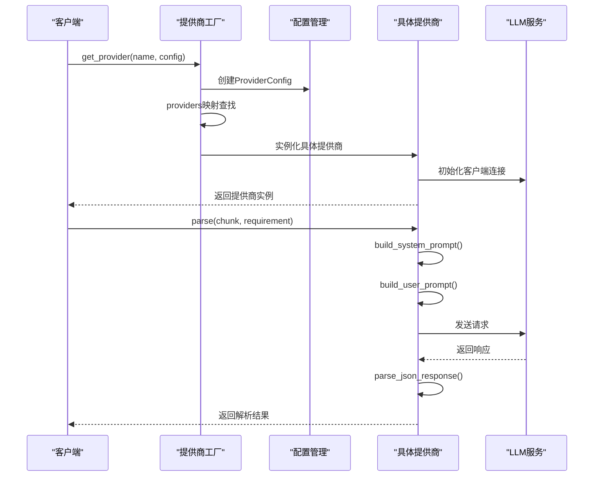
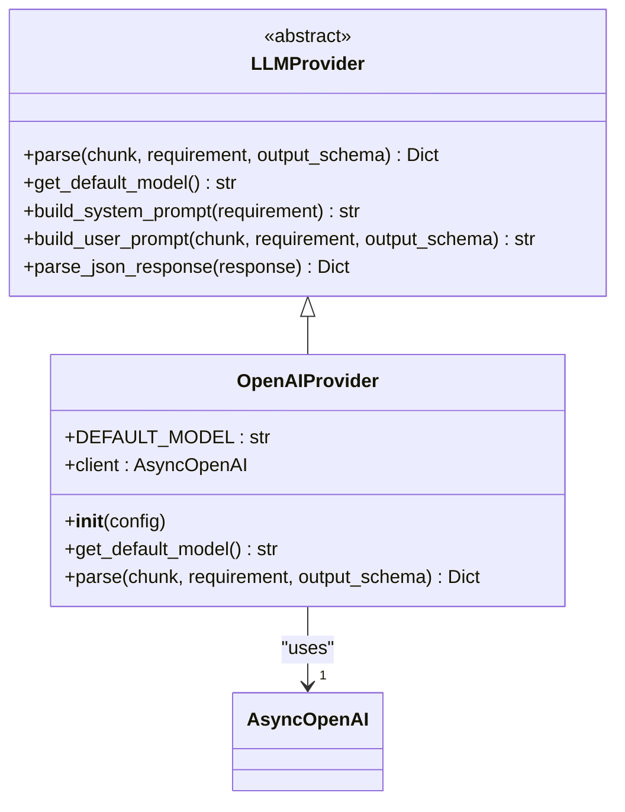
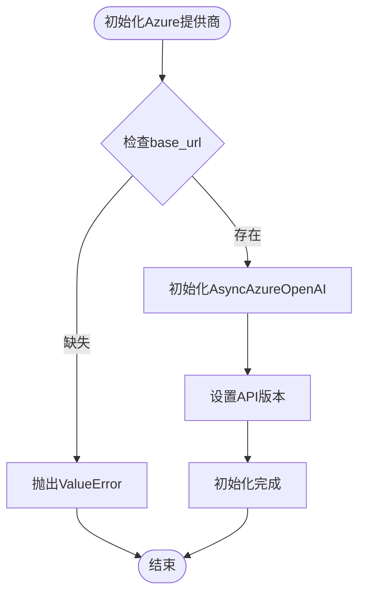
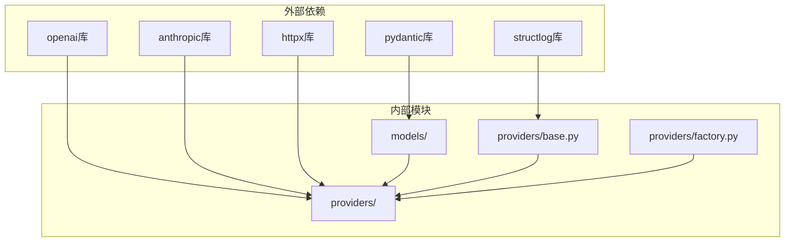
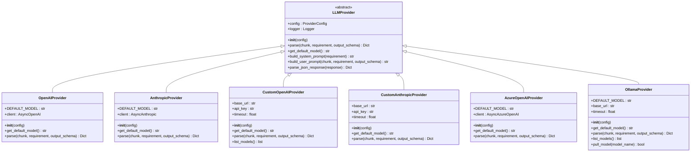
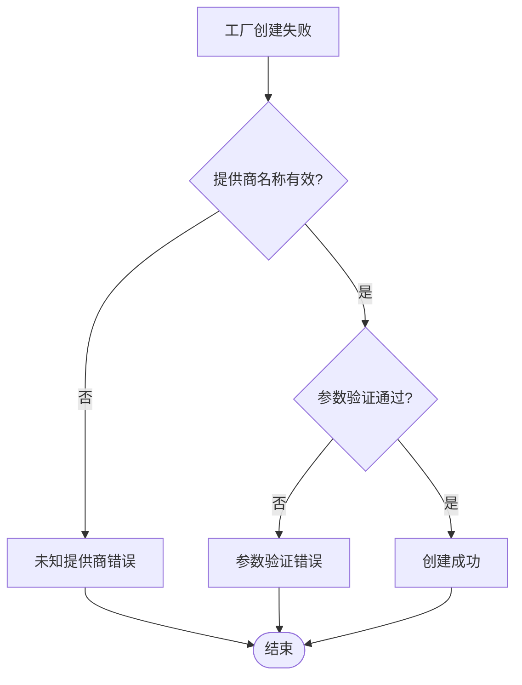

# 提供商接口规范

<cite>
**本文档引用的文件**
- [base.py](file://src/providers/base.py)
- [factory.py](file://src/providers/factory.py)
- [__init__.py](file://src/providers/__init__.py)
- [openai_provider.py](file://src/providers/openai_provider.py)
- [anthropic_provider.py](file://src/providers/anthropic_provider.py)
- [azure_provider.py](file://src/providers/azure_provider.py)
- [custom_openai_provider.py](file://src/providers/custom_openai_provider.py)
- [custom_anthropic_provider.py](file://src/providers/custom_anthropic_provider.py)
- [ollama_provider.py](file://src/providers/ollama_provider.py)
- [request.py](file://src/models/request.py)
- [document.py](file://src/models/document.py)
- [test_providers.py](file://tests/test_providers.py)
- [README.md](file://README.md)
</cite>

## 更新摘要
**变更内容**
- 更新了LLMProvider基类的完整接口规范
- 新增了ProviderConfig配置类的详细说明
- 完善了工厂模式实现机制的文档
- 增强了各提供商实现的接口一致性说明
- 补充了JSON响应解析的多层策略说明

## 目录
1. [简介](#简介)
2. [项目结构](#项目结构)
3. [核心组件](#核心组件)
4. [架构概览](#架构概览)
5. [详细组件分析](#详细组件分析)
6. [依赖关系分析](#依赖关系分析)
7. [性能考虑](#性能考虑)
8. [故障排除指南](#故障排除指南)
9. [结论](#结论)

## 简介

本文件为LLM提供商接口规范的详细技术文档，基于实际代码库实现。该系统提供了统一的抽象基类设计，支持多种LLM提供商的集成，包括OpenAI、Anthropic、Azure OpenAI、Ollama以及自定义协议提供商。文档详细说明了抽象基类的设计原理、接口定义、工厂模式实现机制，以及提供商的注册、实例化和生命周期管理流程。

## 项目结构

该项目采用模块化设计，主要分为以下几个核心部分：

**图表来源**
- [base.py](file://src/providers/base.py#L1-L143)
- [factory.py](file://src/providers/factory.py#L1-L71)
- [openai_provider.py](file://src/providers/openai_provider.py#L1-L82)
- [anthropic_provider.py](file://src/providers/anthropic_provider.py#L1-L82)
- [azure_provider.py](file://src/providers/azure_provider.py#L1-L83)
- [custom_openai_provider.py](file://src/providers/custom_openai_provider.py#L1-L122)
- [custom_anthropic_provider.py](file://src/providers/custom_anthropic_provider.py#L1-L96)
- [ollama_provider.py](file://src/providers/ollama_provider.py#L1-L118)

**章节来源**
- [base.py](file://src/providers/base.py#L1-L143)
- [factory.py](file://src/providers/factory.py#L1-L71)
- [__init__.py](file://src/providers/__init__.py#L1-L23)

## 核心组件

### 抽象基类设计

LLMProvider抽象基类是整个系统的核心，定义了所有提供商必须实现的标准接口。该设计遵循面向对象编程的最佳实践，确保不同提供商之间的一致性和可互换性。

#### ProviderConfig配置类

ProviderConfig类提供了统一的配置管理机制，支持以下关键配置项：

| 配置项 | 类型 | 默认值 | 描述 |
|--------|------|--------|------|
| api_key | Optional[str] | None | API访问密钥 |
| base_url | Optional[str] | None | API基础URL |
| model | Optional[str] | None | 默认模型名称 |
| temperature | float | 0.1 | 生成温度参数 |
| max_retries | int | 3 | 最大重试次数 |
| timeout | float | 60.0 | 请求超时时间 |

#### 核心接口方法

抽象基类定义了两个必须实现的抽象方法：

1. **parse方法**：执行文档解析的核心逻辑
2. **get_default_model方法**：返回提供商的默认模型名称

此外，还提供了三个可选的实用方法：

1. **build_system_prompt**：构建系统提示词
2. **build_user_prompt**：构建用户提示词  
3. **parse_json_response**：解析JSON响应

**章节来源**
- [base.py](file://src/providers/base.py#L16-L143)

## 架构概览

系统采用工厂模式实现提供商的动态创建和管理，确保了良好的扩展性和维护性。

**图表来源**
- [factory.py](file://src/providers/factory.py#L14-L71)
- [base.py](file://src/providers/base.py#L34-L143)

### 工厂模式实现机制

工厂模式通过`get_provider`函数实现，负责：

1. **配置创建**：根据输入参数创建ProviderConfig实例
2. **提供商映射**：维护提供商名称到类的映射关系
3. **实例化控制**：根据提供商类型创建相应的实例
4. **参数验证**：对特殊提供商进行参数验证

**章节来源**
- [factory.py](file://src/providers/factory.py#L14-L71)

## 详细组件分析

### OpenAI提供商实现

OpenAIProvider是最标准的实现，完全遵循OpenAI API规范。

#### 关键特性

- **默认模型**：使用GPT-4作为默认模型
- **客户端初始化**：支持自定义base_url
- **JSON响应格式**：强制使用JSON对象响应格式
- **令牌统计**：完整记录使用情况

#### 实现要点

**图表来源**
- [openai_provider.py](file://src/providers/openai_provider.py#L13-L82)
- [base.py](file://src/providers/base.py#L27-L143)

**章节来源**
- [openai_provider.py](file://src/providers/openai_provider.py#L1-L82)

### Anthropic提供商实现

AnthropicProvider实现了Anthropic Claude API的完整支持。

#### 协议差异

与OpenAI的主要区别在于系统提示词的传递方式：

- **OpenAI**：通过独立的system角色消息传递
- **Anthropic**：通过专门的system参数传递

#### 实现特点

- **默认模型**：使用Claude-3.5-Sonnet
- **令牌统计**：分别记录输入和输出令牌
- **错误处理**：详细的异常信息记录

**章节来源**
- [anthropic_provider.py](file://src/providers/anthropic_provider.py#L1-L82)

### Azure OpenAI提供商实现

AzureOpenAIProvider专门针对Microsoft Azure平台的OpenAI服务。

#### 特殊要求

- **必需参数**：必须提供Azure endpoint
- **API版本**：支持指定API版本
- **认证方式**：使用Azure特定的认证机制

#### 配置管理

**图表来源**
- [azure_provider.py](file://src/providers/azure_provider.py#L18-L37)

**章节来源**
- [azure_provider.py](file://src/providers/azure_provider.py#L1-L83)

### 自定义OpenAI协议提供商

CustomOpenAIProvider支持任何兼容OpenAI API协议的自定义服务。

#### 支持的服务

- **vLLM**：高性能推理引擎
- **Text Generation Inference (TGI)**：分布式推理框架
- **LocalAI**：本地AI服务
- **其他OpenAI兼容API**

#### 实现特点

- **灵活配置**：完全由base_url驱动
- **HTTP客户端**：使用httpx进行HTTP通信
- **模型发现**：支持列出可用模型
- **错误处理**：详细的HTTP状态码处理

**章节来源**
- [custom_openai_provider.py](file://src/providers/custom_openai_provider.py#L1-L122)

### 自定义Anthropic协议提供商

CustomAnthropicProvider支持任何兼容Anthropic Messages API协议的自定义服务。

#### 协议特性

- **头部认证**：使用x-api-key头部
- **版本控制**：固定anthropic-version
- **系统提示**：通过system参数传递

#### 扩展能力

- **HTTP通信**：基于httpx的异步HTTP客户端
- **模型管理**：支持模型列表查询
- **错误恢复**：完善的异常处理机制

**章节来源**
- [custom_anthropic_provider.py](file://src/providers/custom_anthropic_provider.py#L1-L96)

### Ollama本地模型提供商

OllamaProvider实现了完全本地化的模型运行。

#### 本地化优势

- **无网络依赖**：完全离线运行
- **成本效益**：无需支付API费用
- **隐私保护**：数据完全本地化

#### 实现特色

- **组合提示**：将系统提示和用户提示组合
- **选项配置**：支持温度等模型参数
- **模型管理**：支持模型列表和下载

**章节来源**
- [ollama_provider.py](file://src/providers/ollama_provider.py#L1-L118)

## 依赖关系分析

系统采用了清晰的依赖层次结构，确保模块间的松耦合。

**图表来源**
- [base.py](file://src/providers/base.py#L3-L13)
- [openai_provider.py](file://src/providers/openai_provider.py#L5-L10)
- [anthropic_provider.py](file://src/providers/anthropic_provider.py#L5-L10)

### 接口继承最佳实践

#### 继承层次设计

**图表来源**
- [base.py](file://src/providers/base.py#L27-L143)
- [openai_provider.py](file://src/providers/openai_provider.py#L13-L82)
- [anthropic_provider.py](file://src/providers/anthropic_provider.py#L13-L82)
- [custom_openai_provider.py](file://src/providers/custom_openai_provider.py#L12-L122)
- [custom_anthropic_provider.py](file://src/providers/custom_anthropic_provider.py#L12-L96)
- [azure_provider.py](file://src/providers/azure_provider.py#L13-L83)
- [ollama_provider.py](file://src/providers/ollama_provider.py#L13-L118)

### 扩展指南

#### 新增提供商步骤

1. **继承抽象基类**：创建新的提供商类继承LLMProvider
2. **实现必需方法**：实现parse和get_default_model方法
3. **配置初始化**：在__init__方法中设置客户端
4. **注册到工厂**：在factory.py中添加提供商映射
5. **添加到导出**：在__init__.py中添加导入

#### 接口版本兼容性

系统通过以下机制确保版本兼容性：

- **抽象基类约束**：确保所有提供商实现必需接口
- **配置参数兼容**：ProviderConfig提供向后兼容的配置
- **方法签名稳定**：核心方法签名保持不变
- **错误处理增强**：逐步改进异常处理机制

**章节来源**
- [__init__.py](file://src/providers/__init__.py#L12-L22)
- [factory.py](file://src/providers/factory.py#L50-L57)

## 性能考虑

### 异步处理优化

所有提供商都采用异步编程模式，通过async/await语法提高并发性能。这使得多个提供商可以同时处理请求，充分利用系统资源。

### 缓存策略

系统支持多种缓存策略以提高性能：

- **请求缓存**：避免重复的LLM调用
- **模型列表缓存**：减少模型发现的开销
- **配置缓存**：复用已创建的客户端实例

### 资源管理

- **连接池**：HTTP客户端使用连接池管理
- **超时控制**：每个请求都有明确的超时限制
- **重试机制**：自动重试失败的请求

## 故障排除指南

### 常见问题诊断

#### 提供商工厂问题

**图表来源**
- [factory.py](file://src/providers/factory.py#L59-L68)

#### JSON解析问题

系统提供了多层次的JSON解析策略：

1. **直接解析**：尝试直接解析JSON字符串
2. **代码块提取**：从Markdown代码块中提取JSON
3. **对象搜索**：从任意文本中搜索JSON对象
4. **降级处理**：返回原始响应和错误标记

#### 错误日志记录

每个提供商都实现了详细的错误日志记录，包括：

- **请求参数**：记录关键的请求信息
- **响应状态**：记录HTTP状态码和响应内容
- **错误详情**：记录具体的异常信息
- **性能指标**：记录令牌使用量和处理时间

**章节来源**
- [test_providers.py](file://tests/test_providers.py#L13-L44)

## 结论

本提供商接口规范文档详细阐述了基于抽象基类的设计原理、工厂模式的实现机制，以及各种提供商的具体实现细节。系统通过统一的接口设计和灵活的工厂模式，实现了良好的扩展性和维护性。

### 设计优势

1. **统一接口**：所有提供商遵循相同的接口规范
2. **灵活扩展**：易于添加新的提供商实现
3. **配置管理**：统一的配置管理和参数验证
4. **错误处理**：完善的异常处理和日志记录
5. **性能优化**：异步处理和资源管理

### 未来发展方向

- **更多提供商支持**：持续扩展支持的LLM服务
- **性能监控**：增加更详细的性能指标收集
- **配置热更新**：支持运行时配置修改
- **批量处理**：支持批量文档解析功能

该系统为开发者提供了清晰的实现指导，确保能够快速、可靠地集成各种LLM服务，满足不同场景下的需求。