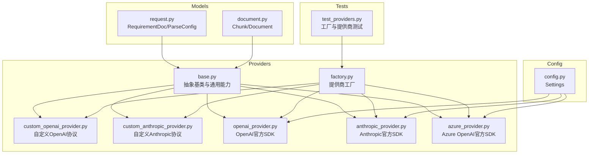
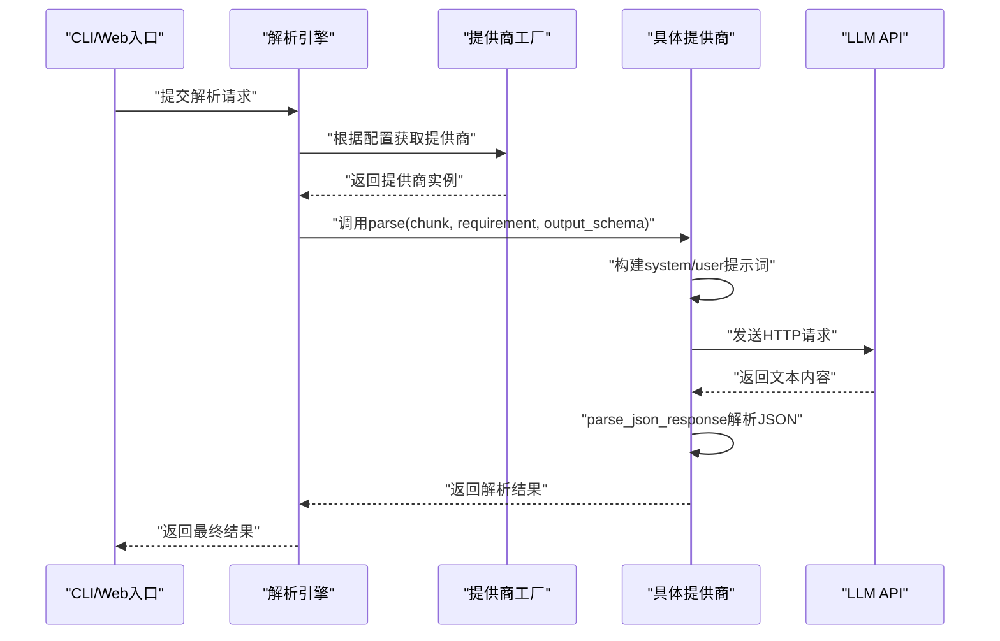
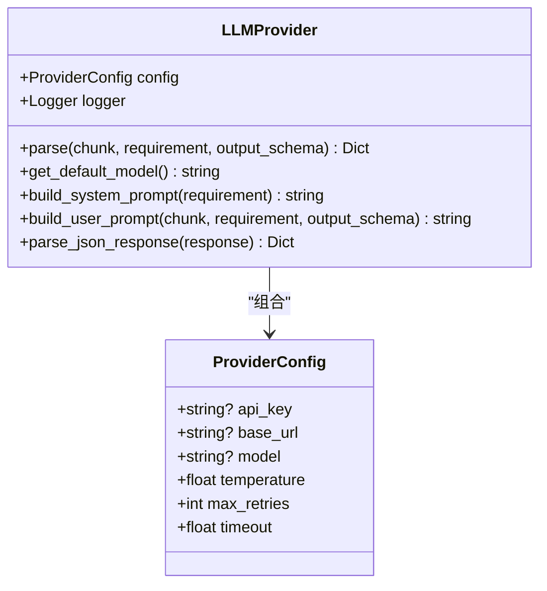
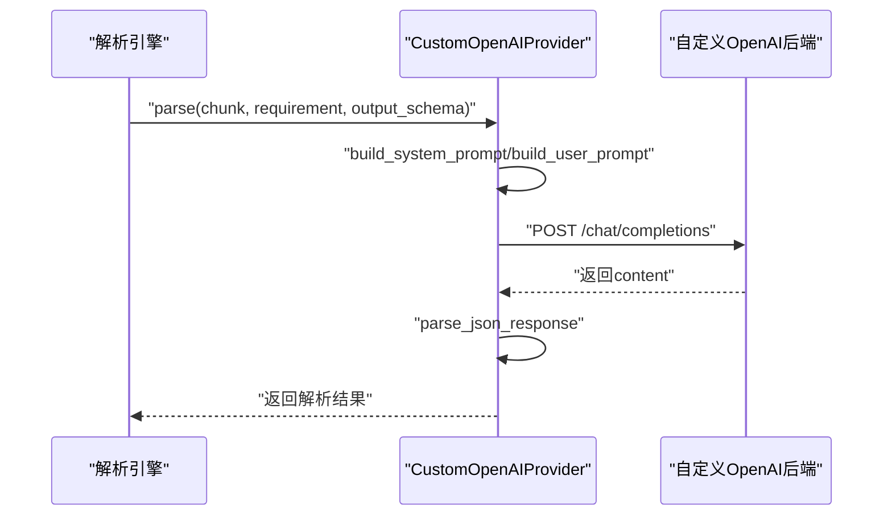
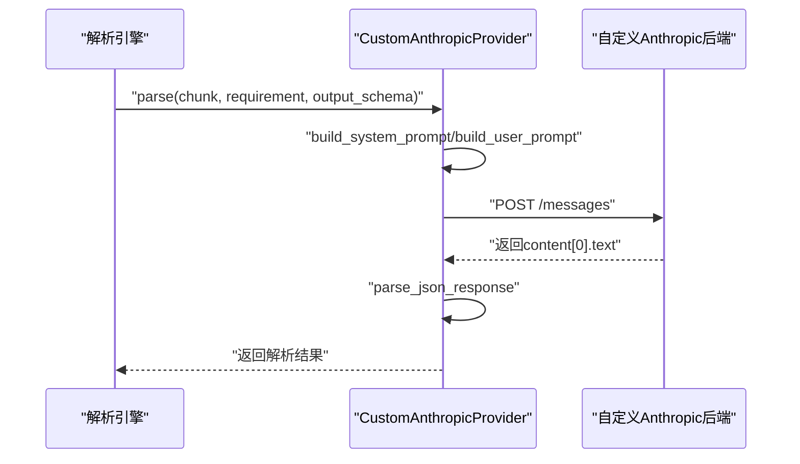
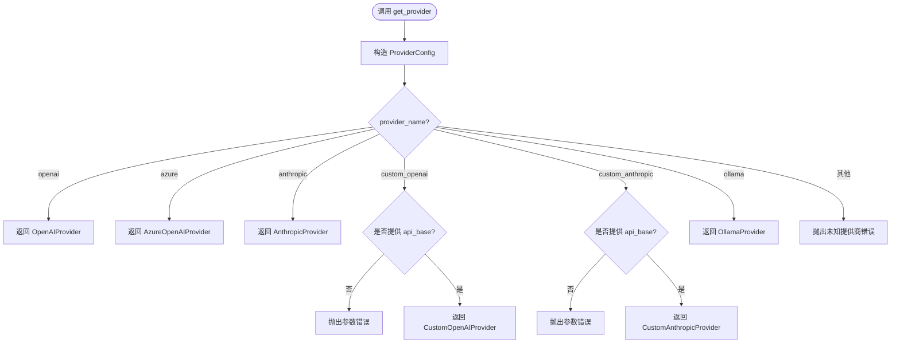
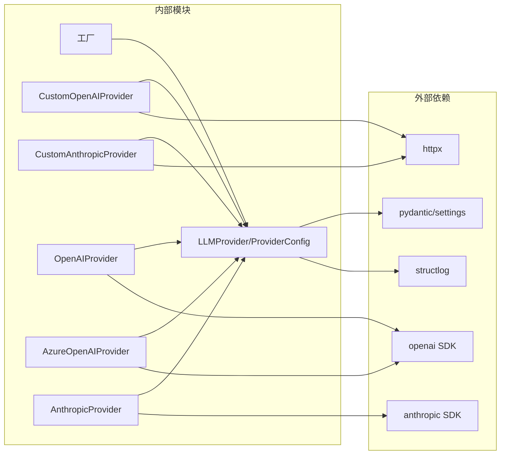
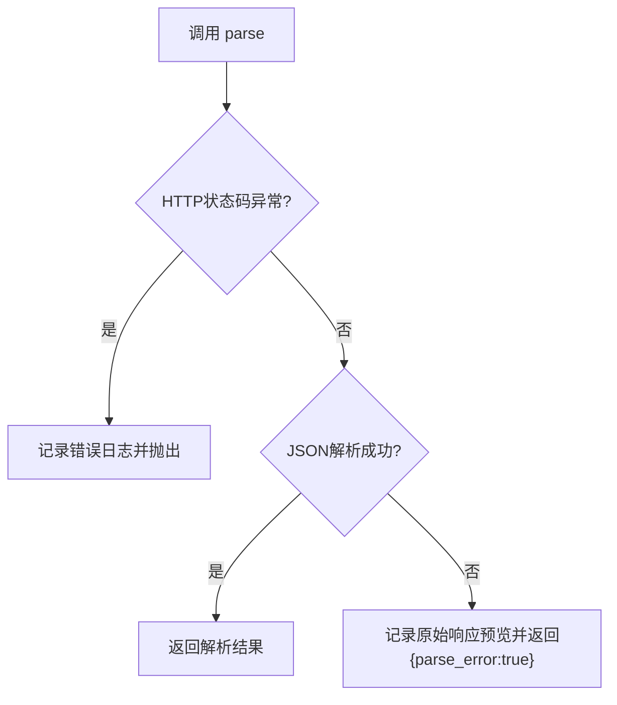

# 自定义提供商开发

<cite>
**本文引用的文件**
- [base.py](file://api-doc-parser/src/api_doc_parser/providers/base.py)
- [custom_openai_provider.py](file://api-doc-parser/src/api_doc_parser/providers/custom_openai_provider.py)
- [custom_anthropic_provider.py](file://api-doc-parser/src/api_doc_parser/providers/custom_anthropic_provider.py)
- [factory.py](file://api-doc-parser/src/api_doc_parser/providers/factory.py)
- [openai_provider.py](file://api-doc-parser/src/api_doc_parser/providers/openai_provider.py)
- [anthropic_provider.py](file://api-doc-parser/src/api_doc_parser/providers/anthropic_provider.py)
- [azure_provider.py](file://api-doc-parser/src/api_doc_parser/providers/azure_provider.py)
- [request.py](file://api-doc-parser/src/api_doc_parser/models/request.py)
- [document.py](file://api-doc-parser/src/api_doc_parser/models/document.py)
- [config.py](file://api-doc-parser/src/api_doc_parser/config.py)
- [test_providers.py](file://api-doc-parser/tests/test_providers.py)
- [README.md](file://api-doc-parser/README.md)
- [pyproject.toml](file://api-doc-parser/pyproject.toml)
</cite>

## 目录
1. [简介](#简介)
2. [项目结构](#项目结构)
3. [核心组件](#核心组件)
4. [架构总览](#架构总览)
5. [详细组件分析](#详细组件分析)
6. [依赖分析](#依赖分析)
7. [性能考虑](#性能考虑)
8. [故障排查指南](#故障排查指南)
9. [结论](#结论)
10. [附录](#附录)

## 简介
本指南面向希望基于抽象基类开发“自定义LLM提供商”的工程师，目标是帮助你从零开始实现一个兼容现有解析流程的自定义提供商，覆盖以下要点：
- 如何继承抽象基类并实现必要接口
- 配置管理与参数传递
- 错误处理与日志记录
- 自定义OpenAI协议与自定义Anthropic协议的实现方法
- 处理非标准API格式、特殊认证方式与定制化需求
- 完整开发流程、测试策略与部署指南
- 兼容性与版本升级策略
- 具体代码示例路径与调试技巧

## 项目结构
该项目采用“按职责分层 + 按功能模块划分”的组织方式：
- providers：LLM提供商实现与工厂
- models：输入输出数据模型
- config：全局配置与环境变量绑定
- core：文档加载、分块、解析、合并、增量更新
- tests：单元测试与集成测试
- CLI与Web服务入口位于根目录模块中

图表来源
- [base.py](file://api-doc-parser/src/api_doc_parser/providers/base.py#L27-L143)
- [factory.py](file://api-doc-parser/src/api_doc_parser/providers/factory.py#L14-L71)
- [custom_openai_provider.py](file://api-doc-parser/src/api_doc_parser/providers/custom_openai_provider.py#L12-L122)
- [custom_anthropic_provider.py](file://api-doc-parser/src/api_doc_parser/providers/custom_anthropic_provider.py#L12-L96)
- [openai_provider.py](file://api-doc-parser/src/api_doc_parser/providers/openai_provider.py#L13-L82)
- [anthropic_provider.py](file://api-doc-parser/src/api_doc_parser/providers/anthropic_provider.py#L13-L82)
- [azure_provider.py](file://api-doc-parser/src/api_doc_parser/providers/azure_provider.py#L13-L83)
- [request.py](file://api-doc-parser/src/api_doc_parser/models/request.py#L24-L57)
- [document.py](file://api-doc-parser/src/api_doc_parser/models/document.py#L57-L75)
- [config.py](file://api-doc-parser/src/api_doc_parser/config.py#L7-L57)
- [test_providers.py](file://api-doc-parser/tests/test_providers.py#L13-L106)

章节来源
- [README.md](file://api-doc-parser/README.md#L136-L157)

## 核心组件
- 抽象基类与通用能力
  - 抽象接口：parse、get_default_model
  - 通用提示词构建：build_system_prompt、build_user_prompt
  - JSON响应解析：parse_json_response（支持代码块、对象边界等）
  - 配置对象：ProviderConfig（api_key、base_url、model、temperature、max_retries、timeout）

- 数据模型
  - RequirementDoc：包含需求说明、输出Schema、提取规则
  - Chunk：文档分块，携带上下文与索引
  - ParseConfig：解析配置（provider、model、api_base、api_key、温度、重试等）

- 配置管理
  - Settings：统一读取.env环境变量，提供各提供商默认值与全局参数

- 工厂模式
  - get_provider：根据提供商名称返回对应实现；对自定义提供商进行参数校验

章节来源
- [base.py](file://api-doc-parser/src/api_doc_parser/providers/base.py#L16-L143)
- [request.py](file://api-doc-parser/src/api_doc_parser/models/request.py#L24-L57)
- [document.py](file://api-doc-parser/src/api_doc_parser/models/document.py#L57-L75)
- [config.py](file://api-doc-parser/src/api_doc_parser/config.py#L7-L57)
- [factory.py](file://api-doc-parser/src/api_doc_parser/providers/factory.py#L14-L71)

## 架构总览
整体调用链路如下：CLI/Web入口 -> 解析引擎 -> 提供商工厂 -> 具体提供商实现 -> LLM API -> 返回JSON结果。

图表来源
- [factory.py](file://api-doc-parser/src/api_doc_parser/providers/factory.py#L14-L71)
- [base.py](file://api-doc-parser/src/api_doc_parser/providers/base.py#L34-L143)
- [openai_provider.py](file://api-doc-parser/src/api_doc_parser/providers/openai_provider.py#L41-L82)
- [anthropic_provider.py](file://api-doc-parser/src/api_doc_parser/providers/anthropic_provider.py#L40-L82)
- [azure_provider.py](file://api-doc-parser/src/api_doc_parser/providers/azure_provider.py#L42-L83)
- [custom_openai_provider.py](file://api-doc-parser/src/api_doc_parser/providers/custom_openai_provider.py#L35-L103)
- [custom_anthropic_provider.py](file://api-doc-parser/src/api_doc_parser/providers/custom_anthropic_provider.py#L31-L96)

## 详细组件分析

### 抽象基类 LLMProvider 与 ProviderConfig
- 关键职责
  - 定义统一接口：parse、get_default_model
  - 提供系统提示词与用户提示词模板
  - 统一JSON解析逻辑，增强鲁棒性
- 设计要点
  - 通过ProviderConfig集中管理配置项，便于工厂注入
  - 日志绑定provider名称，便于追踪

图表来源
- [base.py](file://api-doc-parser/src/api_doc_parser/providers/base.py#L16-L143)

章节来源
- [base.py](file://api-doc-parser/src/api_doc_parser/providers/base.py#L16-L143)

### 自定义OpenAI协议提供商 CustomOpenAIProvider
- 适用场景
  - vLLM、TGI、LocalAI等兼容OpenAI协议的自定义后端
- 实现要点
  - 必须提供base_url；若未提供api_key则使用占位值
  - 使用/chat/completions端点，消息结构遵循OpenAI风格
  - 支持可选的JSON响应格式（部分后端不支持）
  - 错误处理：HTTP状态码异常与通用异常分别记录
  - 提供list_models辅助诊断

图表来源
- [custom_openai_provider.py](file://api-doc-parser/src/api_doc_parser/providers/custom_openai_provider.py#L35-L103)

章节来源
- [custom_openai_provider.py](file://api-doc-parser/src/api_doc_parser/providers/custom_openai_provider.py#L12-L122)

### 自定义Anthropic协议提供商 CustomAnthropicProvider
- 适用场景
  - 兼容Anthropic Messages API的自定义后端
- 实现要点
  - 必须提供base_url；若未提供api_key则使用占位值
  - 使用/x-api-key头与anthropic-version头部
  - 使用/messages端点，system通过独立字段传递
  - 错误处理：HTTP状态码异常与通用异常分别记录

图表来源
- [custom_anthropic_provider.py](file://api-doc-parser/src/api_doc_parser/providers/custom_anthropic_provider.py#L31-L96)

章节来源
- [custom_anthropic_provider.py](file://api-doc-parser/src/api_doc_parser/providers/custom_anthropic_provider.py#L12-L96)

### 工厂模式与提供商注册
- 工厂职责
  - 根据provider_name选择对应实现类
  - 对自定义提供商进行必需参数校验（如api_base）
  - 统一封装ProviderConfig并实例化

图表来源
- [factory.py](file://api-doc-parser/src/api_doc_parser/providers/factory.py#L14-L71)

章节来源
- [factory.py](file://api-doc-parser/src/api_doc_parser/providers/factory.py#L14-L71)

### 官方SDK对比参考
- OpenAIProvider/AzureOpenAIProvider
  - 使用官方AsyncOpenAI/AsyncAzureOpenAI客户端
  - 显式设置response_format为json_object以提升JSON产出稳定性
- AnthropicProvider
  - 使用官方AsyncAnthropic客户端
  - system提示词通过独立system参数传递

章节来源
- [openai_provider.py](file://api-doc-parser/src/api_doc_parser/providers/openai_provider.py#L13-L82)
- [azure_provider.py](file://api-doc-parser/src/api_doc_parser/providers/azure_provider.py#L13-L83)
- [anthropic_provider.py](file://api-doc-parser/src/api_doc_parser/providers/anthropic_provider.py#L13-L82)

## 依赖分析
- 第三方依赖
  - OpenAI/Anthropic官方SDK用于官方提供商
  - httpx用于自定义提供商的HTTP调用
  - structlog用于结构化日志
  - pydantic/pydantic-settings用于数据模型与配置
- 内部耦合
  - 所有提供商均继承自LLMProvider，共享提示词构建与JSON解析逻辑
  - 工厂负责提供商选择与参数校验，降低上层调用复杂度

图表来源
- [pyproject.toml](file://api-doc-parser/pyproject.toml#L25-L59)
- [openai_provider.py](file://api-doc-parser/src/api_doc_parser/providers/openai_provider.py#L5-L10)
- [anthropic_provider.py](file://api-doc-parser/src/api_doc_parser/providers/anthropic_provider.py#L5-L10)
- [custom_openai_provider.py](file://api-doc-parser/src/api_doc_parser/providers/custom_openai_provider.py#L5-L9)
- [custom_anthropic_provider.py](file://api-doc-parser/src/api_doc_parser/providers/custom_anthropic_provider.py#L5-L9)
- [base.py](file://api-doc-parser/src/api_doc_parser/providers/base.py#L3-L13)

章节来源
- [pyproject.toml](file://api-doc-parser/pyproject.toml#L25-L59)

## 性能考虑
- 分块策略
  - 使用Chunk与上下文拼接，避免跨段信息丢失
  - 通过ParseConfig控制chunk_size与chunk_overlap，平衡吞吐与准确性
- 超时与重试
  - ProviderConfig提供timeout与max_retries，建议结合网络状况调整
- 日志与可观测性
  - 统一的日志键（如provider名称、chunk索引、tokens使用）便于定位性能瓶颈
- JSON解析鲁棒性
  - parse_json_response支持代码块与对象边界匹配，减少解析失败率

章节来源
- [document.py](file://api-doc-parser/src/api_doc_parser/models/document.py#L57-L75)
- [base.py](file://api-doc-parser/src/api_doc_parser/providers/base.py#L112-L143)
- [config.py](file://api-doc-parser/src/api_doc_parser/config.py#L44-L48)

## 故障排查指南
- 常见错误与定位
  - 自定义提供商缺少api_base：工厂会显式报错，检查调用参数
  - HTTP状态码异常：查看日志中的status_code与response文本
  - JSON解析失败：parse_json_response会记录原始响应预览，检查LLM输出格式
- 单元测试参考
  - 工厂测试：验证未知提供商、自定义提供商参数校验、正常实例化
  - 官方提供商测试：通过Mock客户端验证parse流程与返回结构

图表来源
- [custom_openai_provider.py](file://api-doc-parser/src/api_doc_parser/providers/custom_openai_provider.py#L87-L102)
- [custom_anthropic_provider.py](file://api-doc-parser/src/api_doc_parser/providers/custom_anthropic_provider.py#L88-L95)
- [base.py](file://api-doc-parser/src/api_doc_parser/providers/base.py#L112-L143)

章节来源
- [test_providers.py](file://api-doc-parser/tests/test_providers.py#L13-L106)

## 结论
通过抽象基类与工厂模式，项目实现了对多提供商的统一接入。自定义OpenAI与Anthropic协议提供商遵循相同的提示词构建与JSON解析策略，同时保留了各自的认证与端点差异。按照本指南的步骤，你可以快速扩展新的自定义提供商，并在测试与日志体系下完成稳定交付。

## 附录

### 开发流程（从零到上线）
- 步骤
  - 新建文件：在providers目录新增自定义提供商实现
  - 继承LLMProvider并实现parse与get_default_model
  - 在factory.py中注册新提供商名称与类映射
  - 编写单元测试：覆盖parse、错误分支与参数校验
  - 配置与部署：在.env中设置必要参数，或通过ParseConfig传入
  - 验证：使用CLI或Web服务进行端到端测试
- 参考实现路径
  - 自定义OpenAI协议：[custom_openai_provider.py](file://api-doc-parser/src/api_doc_parser/providers/custom_openai_provider.py#L12-L122)
  - 自定义Anthropic协议：[custom_anthropic_provider.py](file://api-doc-parser/src/api_doc_parser/providers/custom_anthropic_provider.py#L12-L96)
  - 工厂注册：[factory.py](file://api-doc-parser/src/api_doc_parser/providers/factory.py#L14-L71)
  - 测试参考：[test_providers.py](file://api-doc-parser/tests/test_providers.py#L13-L106)

章节来源
- [custom_openai_provider.py](file://api-doc-parser/src/api_doc_parser/providers/custom_openai_provider.py#L12-L122)
- [custom_anthropic_provider.py](file://api-doc-parser/src/api_doc_parser/providers/custom_anthropic_provider.py#L12-L96)
- [factory.py](file://api-doc-parser/src/api_doc_parser/providers/factory.py#L14-L71)
- [test_providers.py](file://api-doc-parser/tests/test_providers.py#L13-L106)

### 配置管理与环境变量
- 重要配置项
  - OpenAI：OPENAI_API_KEY、OPENAI_BASE_URL、OPENAI_DEFAULT_MODEL
  - Azure OpenAI：AZURE_OPENAI_API_KEY、AZURE_OPENAI_ENDPOINT、AZURE_OPENAI_API_VERSION、AZURE_OPENAI_DEFAULT_MODEL
  - Anthropic：ANTHROPIC_API_KEY、ANTHROPIC_BASE_URL、ANTHROPIC_DEFAULT_MODEL
  - Ollama：OLLAMA_BASE_URL、OLLAMA_DEFAULT_MODEL
  - 全局：DEFAULT_CHUNK_SIZE、DEFAULT_CHUNK_OVERLAP、DEFAULT_TEMPERATURE、MAX_RETRIES、RETRY_DELAY
- 参考路径
  - [config.py](file://api-doc-parser/src/api_doc_parser/config.py#L7-L57)
  - [README.md](file://api-doc-parser/README.md#L32-L49)

章节来源
- [config.py](file://api-doc-parser/src/api_doc_parser/config.py#L7-L57)
- [README.md](file://api-doc-parser/README.md#L32-L49)

### 测试策略
- 单元测试
  - 工厂：验证提供商选择、参数校验、未知提供商报错
  - 官方提供商：Mock SDK客户端，验证parse返回结构
- 集成测试
  - 使用真实后端（如vLLM/TGI）进行端到端验证
- 调试技巧
  - 启用debug模式与结构化日志
  - 使用较小chunk_size与低temperature便于复现
  - 检查parse_json_response的原始响应预览

章节来源
- [test_providers.py](file://api-doc-parser/tests/test_providers.py#L13-L106)

### 部署指南
- 本地运行
  - 安装依赖与激活虚拟环境
  - 设置.env环境变量
  - CLI示例：[README.md](file://api-doc-parser/README.md#L51-L76)
- Web服务
  - 启动FastAPI服务：[README.md](file://api-doc-parser/README.md#L78-L86)
- Docker/容器化
  - 建议将.env与配置文件挂载到容器内
  - 为自定义后端暴露相应端口并配置安全策略

章节来源
- [README.md](file://api-doc-parser/README.md#L51-L86)

### 兼容性与版本升级策略
- SDK版本
  - 保持与pyproject.toml中openai/anthropic版本范围兼容
  - 升级前先运行测试与lint
- API协议
  - 自定义提供商需关注后端版本变化（如Anthropic的anthropic-version）
  - 通过工厂参数与配置项灵活切换不同后端版本
- 配置迁移
  - 旧版环境变量名变更时，提供兼容映射或迁移脚本

章节来源
- [pyproject.toml](file://api-doc-parser/pyproject.toml#L25-L59)
- [custom_anthropic_provider.py](file://api-doc-parser/src/api_doc_parser/providers/custom_anthropic_provider.py#L46-L47)