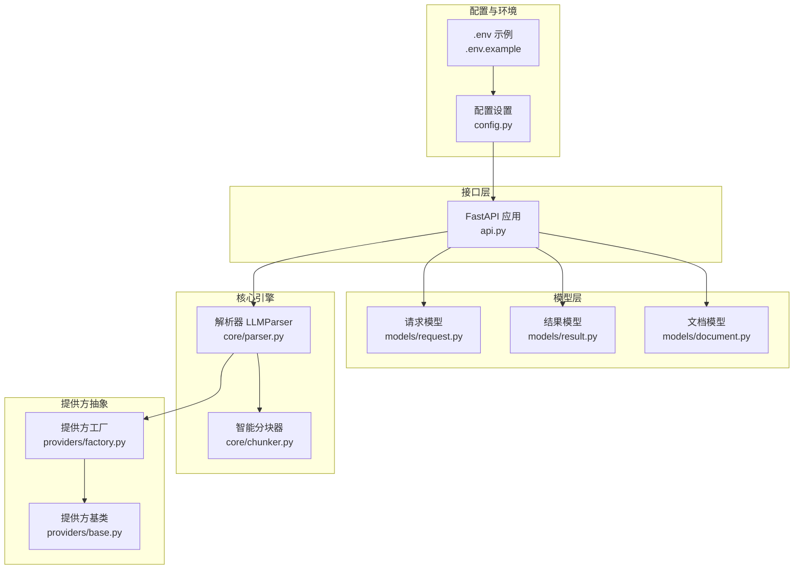
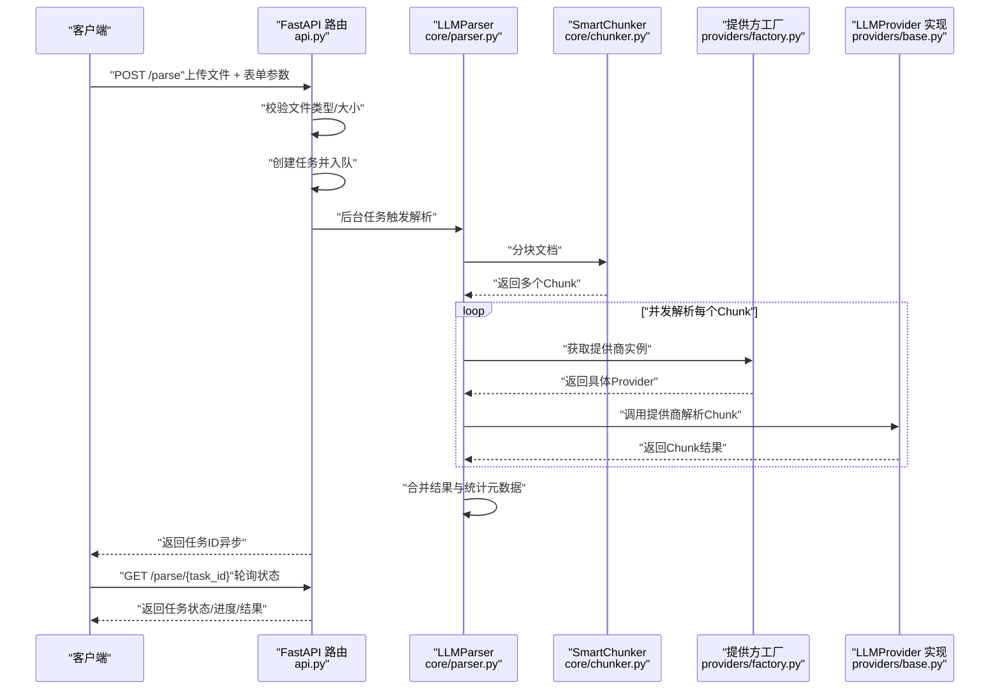
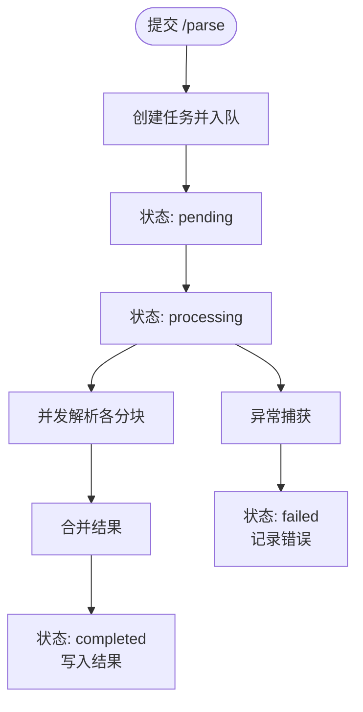
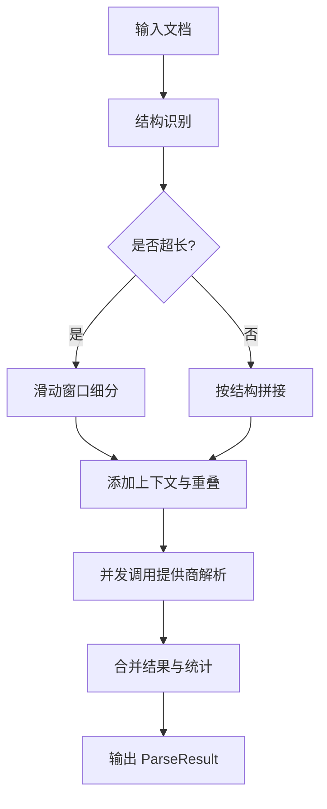
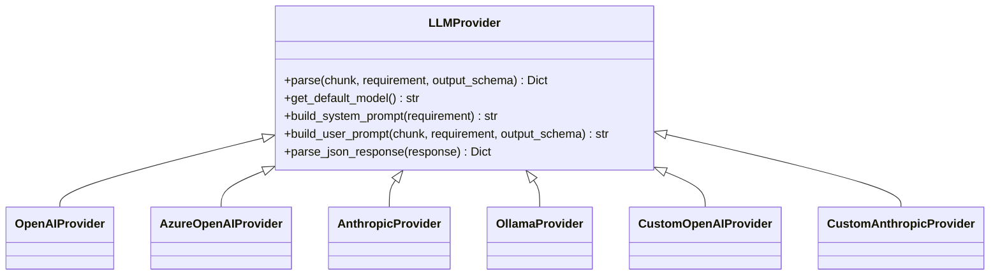

# Web服务API

<cite>
**本文引用的文件**
- [api.py](file://api-doc-parser/src/api_doc_parser/api.py)
- [config.py](file://api-doc-parser/src/api_doc_parser/config.py)
- [request.py](file://api-doc-parser/src/api_doc_parser/models/request.py)
- [result.py](file://api-doc-parser/src/api_doc_parser/models/result.py)
- [document.py](file://api-doc-parser/src/api_doc_parser/models/document.py)
- [parser.py](file://api-doc-parser/src/api_doc_parser/core/parser.py)
- [chunker.py](file://api-doc-parser/src/api_doc_parser/core/chunker.py)
- [factory.py](file://api-doc-parser/src/api_doc_parser/providers/factory.py)
- [base.py](file://api-doc-parser/src/api_doc_parser/providers/base.py)
- [.env.example](file://api-doc-parser/.env.example)
- [README.md](file://api-doc-parser/README.md)
- [pyproject.toml](file://api-doc-parser/pyproject.toml)
</cite>

## 目录
1. [简介](#简介)
2. [项目结构](#项目结构)
3. [核心组件](#核心组件)
4. [架构总览](#架构总览)
5. [详细组件分析](#详细组件分析)
6. [依赖分析](#依赖分析)
7. [性能考虑](#性能考虑)
8. [故障排查指南](#故障排查指南)
9. [结论](#结论)
10. [附录](#附录)

## 简介
本文件为 Web 服务 API 的全面文档，面向使用 FastAPI 提供的 REST 接口的开发者与集成方。API 支持将 PDF、Word、Excel、文本、Markdown 等格式的 API 文档上传至服务，通过异步任务或同步调用的方式，交由大语言模型进行结构化抽取，并返回标准化的 JSON 结果。文档覆盖以下方面：
- REST API 端点、请求/响应模型、鉴权与安全
- 异步任务、任务状态查询与进度反馈
- 错误处理策略、速率限制与版本信息
- 常见用例、客户端实现建议与性能优化技巧
- 调试工具与监控方法
- 已弃用功能与向后兼容性说明（本版本未发现弃用接口）

## 项目结构
该项目采用“模型-核心-提供方-接口”分层组织，核心流程为：前端上传文件 → FastAPI 接收 → 异步/同步解析 → LLM 提供商 → 结果聚合 → 返回。

图表来源
- [api.py](file://api-doc-parser/src/api_doc_parser/api.py#L1-L371)
- [request.py](file://api-doc-parser/src/api_doc_parser/models/request.py#L1-L57)
- [result.py](file://api-doc-parser/src/api_doc_parser/models/result.py#L1-L55)
- [document.py](file://api-doc-parser/src/api_doc_parser/models/document.py#L1-L75)
- [parser.py](file://api-doc-parser/src/api_doc_parser/core/parser.py#L1-L304)
- [chunker.py](file://api-doc-parser/src/api_doc_parser/core/chunker.py#L1-L377)
- [factory.py](file://api-doc-parser/src/api_doc_parser/providers/factory.py#L1-L71)
- [base.py](file://api-doc-parser/src/api_doc_parser/providers/base.py#L1-L143)
- [config.py](file://api-doc-parser/src/api_doc_parser/config.py#L1-L57)
- [.env.example](file://api-doc-parser/.env.example#L1-L22)

章节来源
- [api.py](file://api-doc-parser/src/api_doc_parser/api.py#L1-L371)
- [README.md](file://api-doc-parser/README.md#L1-L176)

## 核心组件
- FastAPI 应用与路由：提供根路径、健康检查、异步解析、同步解析、任务状态查询、提供商列表等端点。
- 解析器 LLMParser：负责文档加载、分块、并发调用 LLM 提供商、结果合并与元数据统计。
- 智能分块器 SmartChunker：按文档结构与长度限制进行分块，保留上下文与重叠，确保信息完整性。
- 提供方体系：统一抽象 LLMProvider 基类，工厂按提供商名称选择具体实现（OpenAI/Azure Anthropic/Ollama 及自定义协议）。
- 数据模型：ParseRequest/ParseConfig/RequirementDoc/DocumentSource、ParseResult/ParseMetadata、Document/Chunk 等。

章节来源
- [api.py](file://api-doc-parser/src/api_doc_parser/api.py#L1-L371)
- [parser.py](file://api-doc-parser/src/api_doc_parser/core/parser.py#L1-L304)
- [chunker.py](file://api-doc-parser/src/api_doc_parser/core/chunker.py#L1-L377)
- [factory.py](file://api-doc-parser/src/api_doc_parser/providers/factory.py#L1-L71)
- [base.py](file://api-doc-parser/src/api_doc_parser/providers/base.py#L1-L143)
- [request.py](file://api-doc-parser/src/api_doc_parser/models/request.py#L1-L57)
- [result.py](file://api-doc-parser/src/api_doc_parser/models/result.py#L1-L55)
- [document.py](file://api-doc-parser/src/api_doc_parser/models/document.py#L1-L75)

## 架构总览
下图展示从客户端到解析器的整体调用链路与数据流。

图表来源
- [api.py](file://api-doc-parser/src/api_doc_parser/api.py#L76-L174)
- [parser.py](file://api-doc-parser/src/api_doc_parser/core/parser.py#L46-L128)
- [chunker.py](file://api-doc-parser/src/api_doc_parser/core/chunker.py#L28-L62)
- [factory.py](file://api-doc-parser/src/api_doc_parser/providers/factory.py#L14-L71)
- [base.py](file://api-doc-parser/src/api_doc_parser/providers/base.py#L27-L57)

## 详细组件分析

### REST API 端点与交互
- 根路径
  - 方法：GET
  - URL：/
  - 用途：返回服务基本信息（名称、版本、文档地址）
- 健康检查
  - 方法：GET
  - URL：/health
  - 用途：返回服务健康状态
- 异步解析任务
  - 方法：POST
  - URL：/parse
  - 请求体：multipart/form-data
    - file：API 文档文件（支持 PDF/DOCX/XLSX/TXT/MD）
    - requirement_content：解析要求说明文本
    - output_schema：可选，JSON 字符串（需为合法 JSON）
    - provider：可选，LLM 提供商名称（默认 openai）
    - model：可选，模型名称
    - api_base：可选，自定义 API 基础 URL
    - api_key：可选，API 密钥
    - chunk_size：可选，分块大小（token 数）
    - temperature：可选，温度参数
  - 响应：ParseTaskResponse（包含 task_id、status、message）
  - 行为：创建任务并立即返回；后台任务实际执行解析
- 查询任务状态
  - 方法：GET
  - URL：/parse/{task_id}
  - 响应：TaskStatus（包含状态、创建/更新时间、进度、结果、错误）
- 同步解析
  - 方法：POST
  - URL：/parse/sync
  - 请求体：同上
  - 响应：ParseResult（直接返回解析结果）
  - 适用场景：小文档，无需任务队列
- 列出提供商
  - 方法：GET
  - URL：/providers
  - 响应：提供商清单（名称、说明、是否需要 API Key、是否需要 API Base）

章节来源
- [api.py](file://api-doc-parser/src/api_doc_parser/api.py#L60-L300)
- [README.md](file://api-doc-parser/README.md#L88-L94)

### 请求与响应模型
- ParseRequest：包含源文档、解析要求、配置、增量更新历史
- ParseConfig：提供商、模型、API 基础 URL、API Key、分块大小、温度、重试次数、缓存开关等
- RequirementDoc：要求说明文本、输出 JSON Schema、提取规则列表
- DocumentSource：文件路径或二进制内容、文件类型
- ParseResult：解析结果数据、元数据（分块统计、置信度、警告、处理时间、模型/提供商）、增量标记与变更字段
- TaskStatus：任务状态、时间戳、进度、结果、错误

章节来源
- [request.py](file://api-doc-parser/src/api_doc_parser/models/request.py#L1-L57)
- [result.py](file://api-doc-parser/src/api_doc_parser/models/result.py#L1-L55)
- [document.py](file://api-doc-parser/src/api_doc_parser/models/document.py#L1-L75)

### 异步任务与状态查询
- 任务存储：内存字典 tasks（生产环境建议替换为 Redis/Celery）
- 任务生命周期：pending → processing → completed 或 failed
- 进度回调：解析器在并发处理每个分块时回调，更新任务进度百分比
- 结果清理：完成后删除文件内容以节省内存

图表来源
- [api.py](file://api-doc-parser/src/api_doc_parser/api.py#L302-L353)
- [parser.py](file://api-doc-parser/src/api_doc_parser/core/parser.py#L130-L169)

章节来源
- [api.py](file://api-doc-parser/src/api_doc_parser/api.py#L30-L353)
- [parser.py](file://api-doc-parser/src/api_doc_parser/core/parser.py#L130-L169)

### 解析流程与并发控制
- 文档加载：根据文件类型选择加载器
- 分块策略：优先按文档结构（标题、API 端点、表格、代码）语义分块；超过阈值使用滑动窗口细分；保留重叠避免信息截断
- 并发解析：限制并发信号量（默认 5），对每个分块调用提供商解析
- 结果合并：深度合并字典，列表去重（基于关键字段）
- 元数据统计：计算置信度、失败分块、警告、处理时间、模型/提供商

图表来源
- [chunker.py](file://api-doc-parser/src/api_doc_parser/core/chunker.py#L28-L62)
- [chunker.py](file://api-doc-parser/src/api_doc_parser/core/chunker.py#L166-L201)
- [parser.py](file://api-doc-parser/src/api_doc_parser/core/parser.py#L130-L169)
- [parser.py](file://api-doc-parser/src/api_doc_parser/core/parser.py#L202-L269)

章节来源
- [chunker.py](file://api-doc-parser/src/api_doc_parser/core/chunker.py#L1-L377)
- [parser.py](file://api-doc-parser/src/api_doc_parser/core/parser.py#L1-L304)

### 提供商与工厂
- 抽象基类 LLMProvider：定义 parse、get_default_model、系统提示词构建、JSON 响应解析等通用逻辑
- 工厂 get_provider：根据 provider 名称返回对应实现（OpenAI/Azure Anthropic/Ollama 及自定义协议）
- 自定义协议要求：custom_openai/custom_anthropic 需提供 api_base

图表来源
- [base.py](file://api-doc-parser/src/api_doc_parser/providers/base.py#L27-L143)
- [factory.py](file://api-doc-parser/src/api_doc_parser/providers/factory.py#L14-L71)

章节来源
- [base.py](file://api-doc-parser/src/api_doc_parser/providers/base.py#L1-L143)
- [factory.py](file://api-doc-parser/src/api_doc_parser/providers/factory.py#L1-L71)

### 配置与环境
- 应用配置：应用名、调试模式、默认模型、分块参数、最大重试、文件大小限制、上传目录
- LLM 配置：OpenAI/Azure Anthropic/Ollama 的 API Key/Base URL，默认模型、API 版本等
- 环境变量：OPENAI_API_KEY、ANTHROPIC_API_KEY、AZURE_*、OLLAMA_BASE_URL、REDIS_URL 等

章节来源
- [config.py](file://api-doc-parser/src/api_doc_parser/config.py#L1-L57)
- [.env.example](file://api-doc-parser/.env.example#L1-L22)

## 依赖分析
- Web 框架与运行：FastAPI、Uvicorn
- CLI 框架：Typer、Rich
- 数据验证与配置：Pydantic、Pydantic-Settings
- LLM SDK：OpenAI、Anthropic
- 文档处理：PyMuPDF、pdfplumber、python-docx、openpyxl、pandas
- 任务队列：Celery、Redis（可选）
- 工具：tiktoken、structlog、python-multipart、aiofiles、httpx

章节来源
- [pyproject.toml](file://api-doc-parser/pyproject.toml#L1-L100)

## 性能考虑
- 并发限制：解析器对分块并发使用信号量，默认限制为 5，可根据资源调整
- 缓存策略：解析器内置简单内存缓存，命中可显著降低重复请求成本
- 分块策略：优先结构感知分块，再对超长块使用滑动窗口，减少信息截断
- 进度回调：客户端可通过轮询任务状态获取实时进度
- 文件大小限制：默认 100MB，避免大文件导致内存压力
- 建议
  - 生产环境使用 Redis/Celery 替代内存任务存储
  - 根据模型与并发能力调整 chunk_size 与并发数
  - 对重复文档启用缓存，合理设置缓存键

章节来源
- [parser.py](file://api-doc-parser/src/api_doc_parser/core/parser.py#L130-L169)
- [parser.py](file://api-doc-parser/src/api_doc_parser/core/parser.py#L178-L191)
- [config.py](file://api-doc-parser/src/api_doc_parser/config.py#L44-L52)

## 故障排查指南
- 常见错误
  - 不支持的文件类型：检查文件扩展名是否在支持列表内
  - 文件过大：超出 max_file_size 限制
  - output_schema 非法 JSON：确保传入合法 JSON 字符串
  - 任务不存在：确认 task_id 正确且未过期
  - 提供商参数缺失：custom_openai/custom_anthropic 需提供 api_base
- 错误响应
  - HTTP 400：参数校验失败（文件类型、大小、JSON 格式）
  - HTTP 404：任务不存在
  - HTTP 500：解析异常（LLM 调用失败、内部异常）
- 调试建议
  - 使用 /providers 端点确认可用提供商
  - 在 /parse/sync 直接返回结果便于快速定位问题
  - 查看任务状态中的 error 字段获取异常详情
  - 检查 .env 中的 API Key/Base URL 配置

章节来源
- [api.py](file://api-doc-parser/src/api_doc_parser/api.py#L94-L124)
- [api.py](file://api-doc-parser/src/api_doc_parser/api.py#L108-L113)
- [api.py](file://api-doc-parser/src/api_doc_parser/api.py#L161-L162)
- [api.py](file://api-doc-parser/src/api_doc_parser/api.py#L308-L353)
- [factory.py](file://api-doc-parser/src/api_doc_parser/providers/factory.py#L66-L69)

## 结论
本 Web 服务 API 提供了完整的异步与同步解析能力，支持多格式文档与多提供商 LLM，具备结构感知分块、并发解析、结果合并与元数据统计等核心能力。生产部署建议结合 Redis/Celery 实现稳定的任务队列，合理配置并发与分块参数以获得最佳性能与稳定性。

## 附录

### API 端点一览
- GET /
  - 用途：服务信息
- GET /health
  - 用途：健康检查
- POST /parse
  - 用途：创建异步解析任务
- GET /parse/{task_id}
  - 用途：查询任务状态
- POST /parse/sync
  - 用途：同步解析（小文档）
- GET /providers
  - 用途：列出支持的 LLM 提供商

章节来源
- [api.py](file://api-doc-parser/src/api_doc_parser/api.py#L60-L300)
- [README.md](file://api-doc-parser/README.md#L88-L94)

### 身份验证与安全
- 当前版本未实现全局鉴权中间件，建议在网关或反向代理层增加鉴权与速率限制
- API Key 通过表单参数传递，建议仅在受控网络或 HTTPS 下使用
- 自定义提供商需提供 api_base，注意 Base URL 的访问控制与证书校验

章节来源
- [api.py](file://api-doc-parser/src/api_doc_parser/api.py#L76-L146)
- [factory.py](file://api-doc-parser/src/api_doc_parser/providers/factory.py#L66-L69)

### 版本信息
- 服务版本：0.1.0
- 项目版本：0.1.0
- FastAPI 版本：>=0.109.0
- Uvicorn 版本：>=0.27.0

章节来源
- [api.py](file://api-doc-parser/src/api_doc_parser/api.py#L24-L28)
- [README.md](file://api-doc-parser/README.md#L1-L176)
- [pyproject.toml](file://api-doc-parser/pyproject.toml#L5-L29)

### 常见用例与客户端实现建议
- 异步解析（推荐）
  - 步骤：POST /parse 上传文件 → 记录 task_id → 轮询 /parse/{task_id} 直到 completed
  - 优点：适合大文档，不阻塞请求线程
- 同步解析（小文档）
  - 步骤：POST /parse/sync 直接返回结果
  - 优点：简化客户端逻辑
- 客户端建议
  - 使用 multipart/form-data 上传文件
  - 对 /parse/{task_id} 设置指数退避轮询
  - 对 /providers 获取可用提供商列表，动态选择 provider/model

章节来源
- [api.py](file://api-doc-parser/src/api_doc_parser/api.py#L76-L174)
- [README.md](file://api-doc-parser/README.md#L78-L86)

### 调试工具与监控
- 文档与交互：启动后访问 /docs 查看交互式 API 文档
- 日志：解析器使用 structlog 记录关键事件（分块、缓存命中、错误）
- 进度：通过任务状态中的 progress 字段观察解析进度
- 统计：ParseResult.metadata 包含分块统计、置信度、处理时间等

章节来源
- [api.py](file://api-doc-parser/src/api_doc_parser/api.py#L368-L371)
- [parser.py](file://api-doc-parser/src/api_doc_parser/core/parser.py#L72-L76)
- [parser.py](file://api-doc-parser/src/api_doc_parser/core/parser.py#L99-L113)

### 已弃用功能与向后兼容性
- 本版本未发现弃用接口或功能变更记录
- 若未来引入新版本，建议通过 URL 版本化（如 /v1/parse）或 Accept 头协商

[本节为概念性说明，不直接分析具体文件]