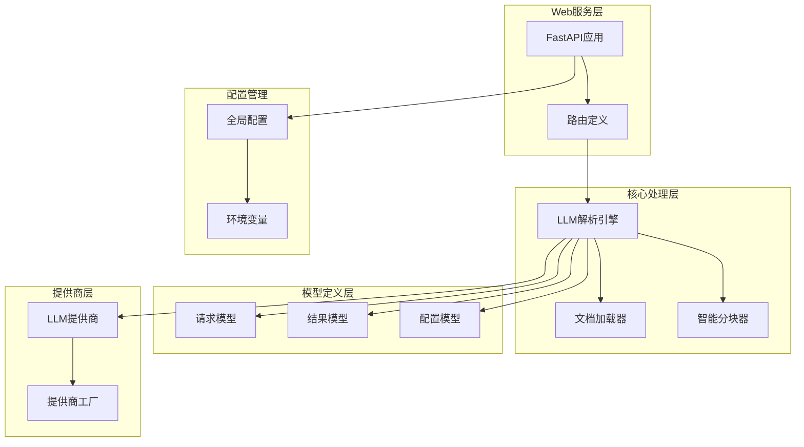
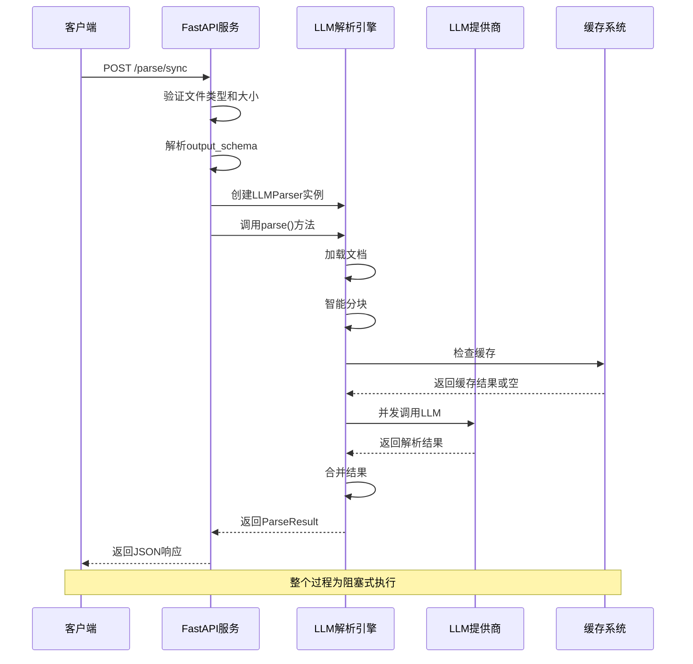
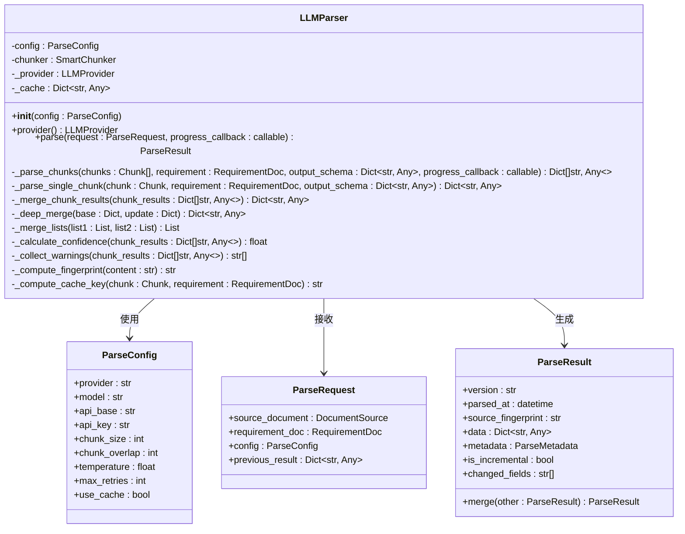
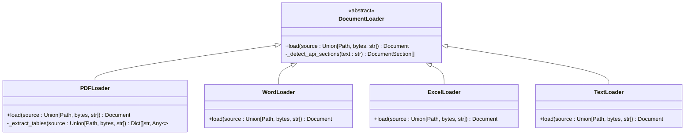
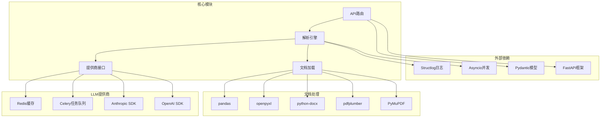
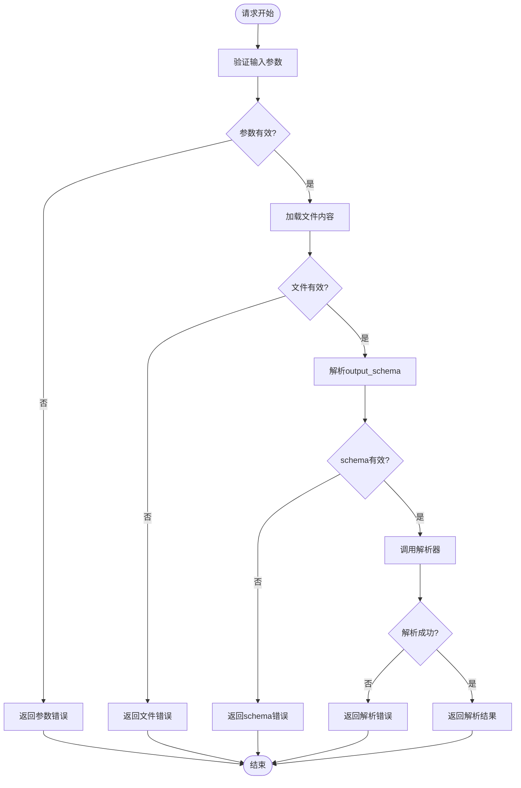

# 同步处理机制

<cite>
**本文引用的文件**
- [api.py](file://api-doc-parser/src/api_doc_parser/api.py)
- [parser.py](file://api-doc-parser/src/api_doc_parser/core/parser.py)
- [request.py](file://api-doc-parser/src/api_doc_parser/models/request.py)
- [result.py](file://api-doc-parser/src/api_doc_parser/models/result.py)
- [config.py](file://api-doc-parser/src/api_doc_parser/config.py)
- [loader.py](file://api-doc-parser/src/api_doc_parser/core/loader.py)
- [base.py](file://api-doc-parser/src/api_doc_parser/providers/base.py)
- [README.md](file://api-doc-parser/README.md)
- [pyproject.toml](file://api-doc-parser/pyproject.toml)
</cite>

## 目录
1. [简介](#简介)
2. [项目结构](#项目结构)
3. [核心组件](#核心组件)
4. [架构概览](#架构概览)
5. [详细组件分析](#详细组件分析)
6. [依赖关系分析](#依赖关系分析)
7. [性能考虑](#性能考虑)
8. [故障排除指南](#故障排除指南)
9. [结论](#结论)
10. [附录](#附录)

## 简介

本文档详细阐述了API文档解析系统的同步处理机制，重点分析 `/sync` 端点的工作原理。该系统提供了两种处理模式：异步任务处理和同步直接响应。同步处理模式专为小文档设计，通过 `/parse/sync` 端点实现阻塞式请求处理，直接返回解析结果，无需任务队列管理。

同步处理机制的核心优势在于实时性和简单性，特别适合需要即时响应的小型API文档解析场景。系统通过智能分块、并发处理和缓存机制确保在同步模式下的高效性能。

## 项目结构

API文档解析系统采用模块化架构设计，主要包含以下核心模块：



**图表来源**
- [api.py](file://api-doc-parser/src/api_doc_parser/api.py#L24-L28)
- [parser.py](file://api-doc-parser/src/api_doc_parser/core/parser.py#L20-L31)
- [config.py](file://api-doc-parser/src/api_doc_parser/config.py#L7-L56)

**章节来源**
- [api.py](file://api-doc-parser/src/api_doc_parser/api.py#L1-L371)
- [parser.py](file://api-doc-parser/src/api_doc_parser/core/parser.py#L1-L304)
- [config.py](file://api-doc-parser/src/api_doc_parser/config.py#L1-L57)

## 核心组件

### 同步处理端点

同步处理通过 `/parse/sync` 端点实现，该端点直接返回解析结果，不涉及任务队列管理。其核心特点包括：

- **阻塞式处理**：请求线程会等待整个解析过程完成
- **实时响应**：解析完成后立即返回结果
- **简化流程**：无需任务ID管理和状态查询
- **适用场景**：小文档、实时性要求高的场景

### 请求参数配置

同步处理支持丰富的参数配置，包括：

| 参数名 | 类型 | 默认值 | 描述 |
|--------|------|--------|------|
| file | UploadFile | 必填 | API文档文件（PDF/Word/Excel） |
| requirement_content | str | 必填 | 解析要求说明 |
| output_schema | str | None | 输出JSON Schema（JSON字符串） |
| provider | str | "openai" | LLM提供商 |
| model | str | None | 模型名称 |
| api_base | str | None | 自定义API基础URL |
| api_key | str | None | API密钥 |
| chunk_size | int | 3000 | 分块大小（token数） |
| temperature | float | 0.1 | 模型温度参数 |

### 错误处理机制

系统实现了多层次的错误处理策略：

- **文件类型验证**：支持PDF、DOCX、XLSX、TXT、MD格式
- **文件大小限制**：默认100MB上限
- **JSON Schema验证**：output_schema必须为有效JSON
- **异常捕获**：统一的HTTP异常处理
- **进度反馈**：异步模式下的进度监控

**章节来源**
- [api.py](file://api-doc-parser/src/api_doc_parser/api.py#L177-L255)
- [request.py](file://api-doc-parser/src/api_doc_parser/models/request.py#L31-L57)
- [config.py](file://api-doc-parser/src/api_doc_parser/config.py#L50-L52)

## 架构概览

同步处理机制的整体架构如下：



**图表来源**
- [api.py](file://api-doc-parser/src/api_doc_parser/api.py#L177-L255)
- [parser.py](file://api-doc-parser/src/api_doc_parser/core/parser.py#L46-L128)
- [base.py](file://api-doc-parser/src/api_doc_parser/providers/base.py#L34-L57)

## 详细组件分析

### LLM解析引擎

LLM解析引擎是同步处理的核心组件，负责整个解析流程的协调：



**图表来源**
- [parser.py](file://api-doc-parser/src/api_doc_parser/core/parser.py#L20-L31)
- [request.py](file://api-doc-parser/src/api_doc_parser/models/request.py#L31-L57)
- [result.py](file://api-doc-parser/src/api_doc_parser/models/result.py#L20-L34)

### 文档加载器系统

系统支持多种文档格式的智能加载：



**图表来源**
- [loader.py](file://api-doc-parser/src/api_doc_parser/core/loader.py#L17-L77)
- [loader.py](file://api-doc-parser/src/api_doc_parser/core/loader.py#L80-L153)
- [loader.py](file://api-doc-parser/src/api_doc_parser/core/loader.py#L155-L230)
- [loader.py](file://api-doc-parser/src/api_doc_parser/core/loader.py#L233-L282)
- [loader.py](file://api-doc-parser/src/api_doc_parser/core/loader.py#L285-L310)

### LLM提供商接口

提供统一的LLM提供商接口，支持多种AI服务：

| 提供商 | 特点 | 配置要求 |
|--------|------|----------|
| openai | OpenAI官方API | 需要API Key |
| azure | Azure OpenAI | 需要API Key和Base URL |
| anthropic | Anthropic Claude | 需要API Key |
| custom_openai | 自定义OpenAI协议 | 可选API Key，需要Base URL |
| custom_anthropic | 自定义Anthropic协议 | 可选API Key，需要Base URL |
| ollama | Ollama本地模型 | 无需API Key |

**章节来源**
- [parser.py](file://api-doc-parser/src/api_doc_parser/core/parser.py#L20-L31)
- [base.py](file://api-doc-parser/src/api_doc_parser/providers/base.py#L27-L57)
- [api.py](file://api-doc-parser/src/api_doc_parser/api.py#L257-L299)

## 依赖关系分析

同步处理机制的依赖关系图：



**图表来源**
- [pyproject.toml](file://api-doc-parser/pyproject.toml#L25-L59)
- [api.py](file://api-doc-parser/src/api_doc_parser/api.py#L9-L21)
- [parser.py](file://api-doc-parser/src/api_doc_parser/core/parser.py#L3-L15)

**章节来源**
- [pyproject.toml](file://api-doc-parser/pyproject.toml#L1-L100)
- [api.py](file://api-doc-parser/src/api_doc_parser/api.py#L1-L371)

## 性能考虑

### 同步处理性能特征

同步处理模式具有以下性能特点：

- **响应时间**：受文档大小和LLM提供商性能影响
- **内存使用**：一次性加载整个文档到内存
- **并发限制**：每个请求独立处理，无共享资源竞争
- **缓存优化**：内置内存缓存减少重复请求

### 异步vs同步对比

| 特性 | 同步处理 | 异步处理 |
|------|----------|----------|
| **响应时间** | 立即返回 | 需要轮询任务状态 |
| **资源占用** | 较高（一次性） | 较低（分批处理） |
| **复杂度** | 简单 | 复杂（任务管理） |
| **适用场景** | 小文档、实时性要求 | 大文档、批量处理 |
| **错误处理** | 直接反馈 | 需要任务状态查询 |

### 性能优化建议

1. **文档预处理**：对大文档进行预压缩
2. **缓存策略**：合理配置缓存大小和过期时间
3. **并发控制**：调整分块并发数量
4. **内存管理**：及时清理临时数据

**章节来源**
- [parser.py](file://api-doc-parser/src/api_doc_parser/core/parser.py#L130-L169)
- [config.py](file://api-doc-parser/src/api_doc_parser/config.py#L44-L48)

## 故障排除指南

### 常见错误及解决方案

| 错误类型 | 错误码 | 描述 | 解决方案 |
|----------|--------|------|----------|
| 文件类型错误 | 400 | 不支持的文件格式 | 确认文件扩展名为PDF/DOCX/XLSX/TXT/MD之一 |
| 文件过大 | 400 | 超过文件大小限制 | 减少文档大小或使用异步处理 |
| JSON格式错误 | 400 | output_schema不是有效JSON | 检查JSON格式正确性 |
| LLM提供商错误 | 500 | LLM调用失败 | 检查API Key和网络连接 |
| 超时错误 | 504 | 处理超时 | 增加超时时间或优化文档 |

### 调试技巧

1. **启用调试模式**：设置DEBUG环境变量
2. **查看日志**：使用structlog查看详细处理日志
3. **监控性能**：关注处理时间和内存使用
4. **测试小样**：先用小文档测试配置正确性

### 错误处理流程



**图表来源**
- [api.py](file://api-doc-parser/src/api_doc_parser/api.py#L194-L254)

**章节来源**
- [api.py](file://api-doc-parser/src/api_doc_parser/api.py#L94-L113)
- [api.py](file://api-doc-parser/src/api_doc_parser/api.py#L205-L220)
- [api.py](file://api-doc-parser/src/api_doc_parser/api.py#L253-L254)

## 结论

同步处理机制为API文档解析提供了简单高效的解决方案。通过 `/parse/sync` 端点，系统实现了阻塞式请求处理、实时响应和完善的错误处理机制。

**核心优势**：
- 实时响应，无需任务管理
- 简化部署，降低复杂度
- 适合小文档和实时场景
- 完善的错误处理机制

**适用场景**：
- 小型API文档（< 100MB）
- 需要即时响应的应用
- 开发测试环境
- 原型验证和演示

对于大文档或批量处理场景，建议使用异步处理模式，以获得更好的资源利用效率和系统稳定性。

## 附录

### 使用示例

#### 基本同步请求
```bash
curl -X POST "http://localhost:8000/parse/sync" \
  -F "file=@api_document.pdf" \
  -F "requirement_content=从API文档中提取所有端点信息" \
  -F "provider=openai" \
  -F "model=gpt-4"
```

#### 带输出格式约束
```bash
curl -X POST "http://localhost:8000/parse/sync" \
  -F "file=@api_document.pdf" \
  -F "requirement_content=提取API端点的路径和方法" \
  -F "output_schema={\"type\":\"object\",\"properties\":{\"endpoints\":{\"type\":\"array\",\"items\":{\"type\":\"object\",\"properties\":{\"path\":{\"type\":\"string\"},\"method\":{\"type\":\"string\"}}}}}}" \
  -F "chunk_size=2000"
```

### 配置参考

| 配置项 | 默认值 | 说明 |
|--------|--------|------|
| max_file_size | 100MB | 最大文件大小限制 |
| default_chunk_size | 3000 | 分块大小（token数） |
| default_temperature | 0.1 | 模型温度参数 |
| max_retries | 3 | 最大重试次数 |
| use_cache | true | 是否启用缓存 |

### 监控指标

- **处理时间**：从请求到响应的总耗时
- **内存使用**：解析过程中的内存峰值
- **缓存命中率**：重复请求的缓存利用率
- **错误率**：各类错误的发生频率