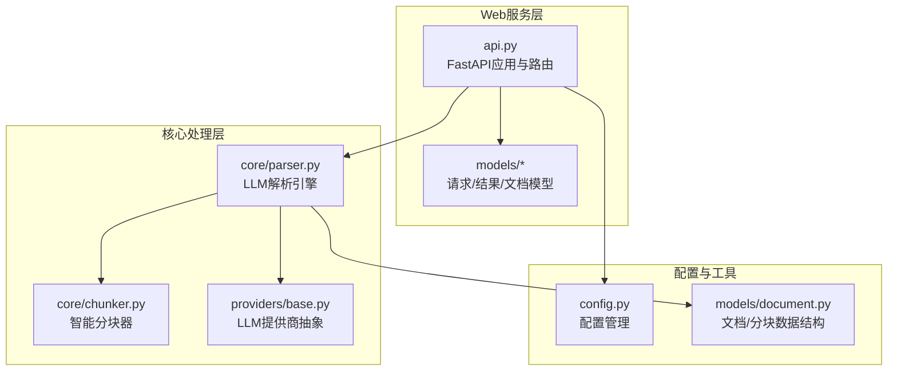
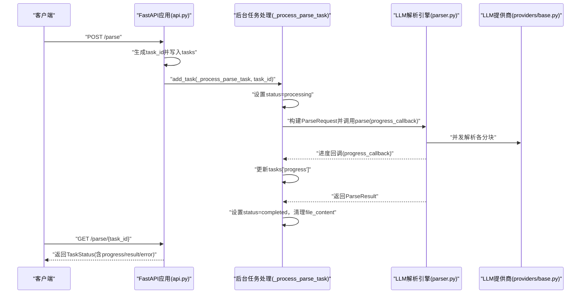
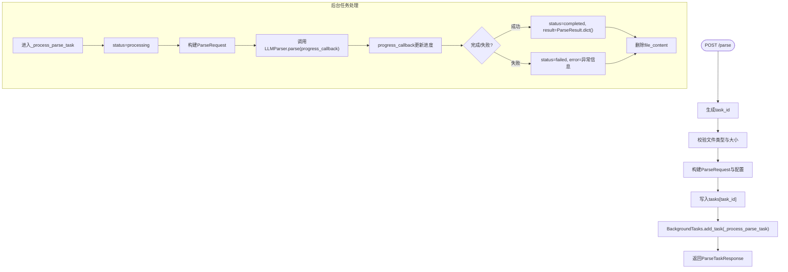
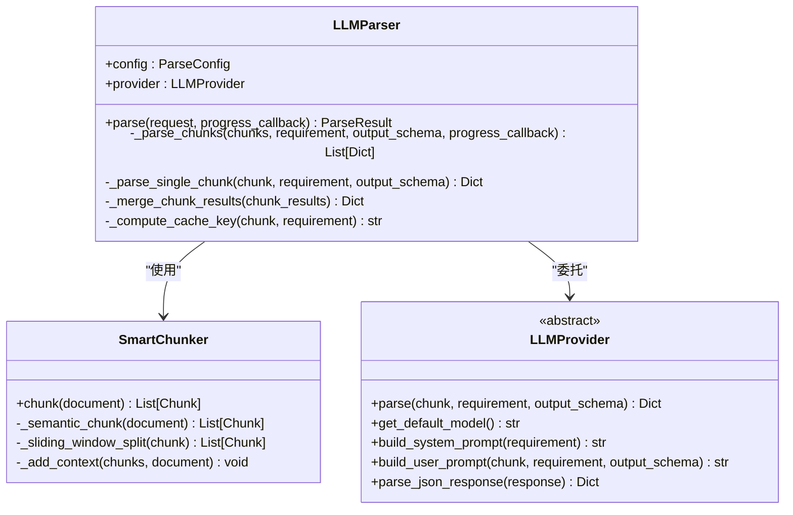
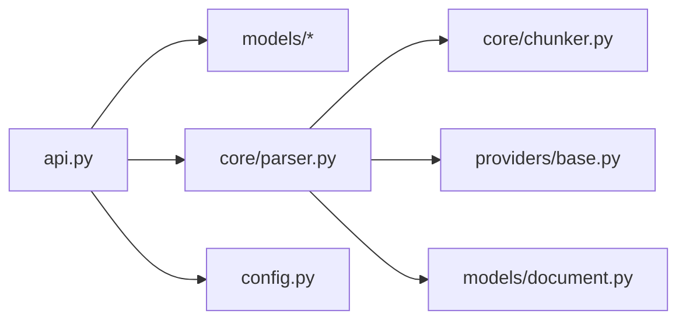

# 异步处理机制

<cite>
**本文引用的文件**
- [api.py](file://api-doc-parser/src/api_doc_parser/api.py)
- [parser.py](file://api-doc-parser/src/api_doc_parser/core/parser.py)
- [request.py](file://api-doc-parser/src/api_doc_parser/models/request.py)
- [result.py](file://api-doc-parser/src/api_doc_parser/models/result.py)
- [document.py](file://api-doc-parser/src/api_doc_parser/models/document.py)
- [chunker.py](file://api-doc-parser/src/api_doc_parser/core/chunker.py)
- [base.py](file://api-doc-parser/src/api_doc_parser/providers/base.py)
- [config.py](file://api-doc-parser/src/api_doc_parser/config.py)
- [README.md](file://api-doc-parser/README.md)
</cite>

## 目录
1. [简介](#简介)
2. [项目结构](#项目结构)
3. [核心组件](#核心组件)
4. [架构概览](#架构概览)
5. [详细组件分析](#详细组件分析)
6. [依赖关系分析](#依赖关系分析)
7. [性能考量](#性能考量)
8. [故障排查指南](#故障排查指南)
9. [结论](#结论)
10. [附录](#附录)

## 简介
本文件围绕异步处理机制展开，重点说明以下方面：
- 异步解析的工作流程：任务创建、状态轮询、进度跟踪、结果获取
- /task/{task_id} 端点的使用方法：如何查询任务状态、获取中间结果和最终输出
- 异步处理的优势、适用场景和最佳实践
- 完整的代码示例路径，展示如何实现异步任务管理

## 项目结构
该项目采用模块化设计，核心围绕 FastAPI Web 服务、LLM 解析引擎、文档模型与分块器构成。异步处理的关键实现位于 Web 服务层的任务管理与后台任务调度，以及解析引擎的并发执行与进度回调。

图表来源
- [api.py](file://api-doc-parser/src/api_doc_parser/api.py#L1-L371)
- [parser.py](file://api-doc-parser/src/api_doc_parser/core/parser.py#L1-L304)
- [chunker.py](file://api-doc-parser/src/api_doc_parser/core/chunker.py#L1-L377)
- [base.py](file://api-doc-parser/src/api_doc_parser/providers/base.py#L1-L143)
- [config.py](file://api-doc-parser/src/api_doc_parser/config.py#L1-L57)
- [document.py](file://api-doc-parser/src/api_doc_parser/models/document.py#L1-L75)

章节来源
- [api.py](file://api-doc-parser/src/api_doc_parser/api.py#L1-L371)
- [README.md](file://api-doc-parser/README.md#L1-L176)

## 核心组件
- 任务存储与状态管理：内存字典 tasks 保存任务状态、进度、结果与错误信息
- 异步任务创建：POST /parse 接口创建任务并启动后台任务
- 任务状态查询：GET /parse/{task_id} 返回任务状态、进度、结果与错误
- 解析引擎：LLMParser 并发处理分块，支持进度回调与缓存
- 模型定义：ParseRequest/ParseResult/Document/Chunk 等数据结构

章节来源
- [api.py](file://api-doc-parser/src/api_doc_parser/api.py#L30-L174)
- [parser.py](file://api-doc-parser/src/api_doc_parser/core/parser.py#L20-L128)
- [request.py](file://api-doc-parser/src/api_doc_parser/models/request.py#L1-L57)
- [result.py](file://api-doc-parser/src/api_doc_parser/models/result.py#L1-L55)
- [document.py](file://api-doc-parser/src/api_doc_parser/models/document.py#L1-L75)

## 架构概览
异步解析的整体流程如下：
- 客户端上传文档与解析要求，调用 POST /parse 创建任务
- 服务器生成任务ID，写入内存任务存储，并通过后台任务启动解析
- 客户端轮询 GET /parse/{task_id} 获取任务状态与进度
- 解析完成后，客户端可获取最终结果；若失败，可查看错误信息

图表来源
- [api.py](file://api-doc-parser/src/api_doc_parser/api.py#L76-L174)
- [parser.py](file://api-doc-parser/src/api_doc_parser/core/parser.py#L46-L128)
- [base.py](file://api-doc-parser/src/api_doc_parser/providers/base.py#L27-L57)

## 详细组件分析

### 任务创建与状态管理
- POST /parse
  - 接收文件、解析要求、可选输出Schema与解析配置
  - 生成任务ID，写入内存任务存储 tasks，初始状态为 pending
  - 通过 BackgroundTasks.add_task 启动后台任务 _process_parse_task
  - 返回 ParseTaskResponse，包含 task_id 与消息
- GET /parse/{task_id}
  - 根据 task_id 查询任务状态
  - 返回 TaskStatus，包含 status、created_at、updated_at、progress、result、error

图表来源
- [api.py](file://api-doc-parser/src/api_doc_parser/api.py#L76-L174)
- [api.py](file://api-doc-parser/src/api_doc_parser/api.py#L302-L352)

章节来源
- [api.py](file://api-doc-parser/src/api_doc_parser/api.py#L76-L174)
- [api.py](file://api-doc-parser/src/api_doc_parser/api.py#L302-L352)

### 解析引擎与并发处理
- LLMParser.parse
  - 加载文档、计算指纹、分块、并发解析各分块、合并结果、构建 ParseResult
  - 支持进度回调 progress_callback(current, total)，用于更新任务进度
- 并发控制
  - 使用 asyncio.Semaphore(5) 控制并发数，避免过度占用资源
  - 使用 asyncio.gather 并发等待所有分块解析完成
- 缓存与容错
  - 基于内容与模型的缓存键，减少重复请求
  - 异常捕获并记录，失败分块标记为错误，不影响其他分块解析

图表来源
- [parser.py](file://api-doc-parser/src/api_doc_parser/core/parser.py#L20-L304)
- [chunker.py](file://api-doc-parser/src/api_doc_parser/core/chunker.py#L10-L377)
- [base.py](file://api-doc-parser/src/api_doc_parser/providers/base.py#L27-L143)

章节来源
- [parser.py](file://api-doc-parser/src/api_doc_parser/core/parser.py#L46-L172)
- [chunker.py](file://api-doc-parser/src/api_doc_parser/core/chunker.py#L28-L62)
- [base.py](file://api-doc-parser/src/api_doc_parser/providers/base.py#L27-L143)

### 数据模型与结果结构
- ParseRequest/ParseConfig/RequirementDoc/DocumentSource
  - 描述解析输入、配置与文档来源
- ParseResult/ParseMetadata
  - 描述解析输出与元数据，包含置信度、处理时间、警告等
- Document/Chunk
  - 描述文档结构与分块，支持上下文与令牌估算

章节来源
- [request.py](file://api-doc-parser/src/api_doc_parser/models/request.py#L1-L57)
- [result.py](file://api-doc-parser/src/api_doc_parser/models/result.py#L1-L55)
- [document.py](file://api-doc-parser/src/api_doc_parser/models/document.py#L1-L75)

## 依赖关系分析
- Web 层依赖核心解析模块与模型定义
- 解析引擎依赖分块器与提供商抽象
- 配置模块提供默认参数与环境变量读取

图表来源
- [api.py](file://api-doc-parser/src/api_doc_parser/api.py#L1-L30)
- [parser.py](file://api-doc-parser/src/api_doc_parser/core/parser.py#L1-L16)
- [chunker.py](file://api-doc-parser/src/api_doc_parser/core/chunker.py#L1-L7)
- [base.py](file://api-doc-parser/src/api_doc_parser/providers/base.py#L1-L11)
- [config.py](file://api-doc-parser/src/api_doc_parser/config.py#L1-L57)

章节来源
- [api.py](file://api-doc-parser/src/api_doc_parser/api.py#L1-L30)
- [parser.py](file://api-doc-parser/src/api_doc_parser/core/parser.py#L1-L16)

## 性能考量
- 并发解析：通过信号量限制并发数，避免资源争用；使用 gather 并发等待，提升吞吐
- 缓存策略：基于内容与模型的缓存键，减少重复请求，提高二次解析速度
- 分块策略：结构感知分块 + 滑动窗口 + 上下文拼接，平衡准确性与性能
- 内存优化：任务完成后清理文件内容，降低内存占用

章节来源
- [parser.py](file://api-doc-parser/src/api_doc_parser/core/parser.py#L130-L172)
- [parser.py](file://api-doc-parser/src/api_doc_parser/core/parser.py#L176-L201)
- [chunker.py](file://api-doc-parser/src/api_doc_parser/core/chunker.py#L28-L62)

## 故障排查指南
- 任务不存在
  - 现象：GET /parse/{task_id} 返回 404
  - 原因：task_id 错误或任务已过期
  - 处理：重新创建任务或检查任务ID
- 任务失败
  - 现象：GET /parse/{task_id} 返回 status=failed 与 error
  - 原因：解析异常、提供商配置错误、网络问题
  - 处理：查看 error 详情，检查配置与网络，重试或更换提供商
- 进度未更新
  - 现象：progress 为空或不变
  - 原因：解析时间短、回调未触发或任务未进入 processing
  - 处理：确认任务状态为 processing，检查回调逻辑
- 文件过大
  - 现象：POST /parse 返回 400
  - 原因：超过最大文件大小限制
  - 处理：压缩文件或拆分文档

章节来源
- [api.py](file://api-doc-parser/src/api_doc_parser/api.py#L158-L174)
- [api.py](file://api-doc-parser/src/api_doc_parser/api.py#L108-L112)
- [config.py](file://api-doc-parser/src/api_doc_parser/config.py#L50-L52)

## 结论
该异步处理机制通过 FastAPI 的后台任务与 LLM 解析引擎的并发分块处理，实现了高吞吐、可观测的异步解析能力。其优势在于：
- 高吞吐：并发解析多个分块，缩短整体处理时间
- 可观测：提供进度回调与任务状态查询，便于监控
- 易扩展：抽象的提供商接口与配置管理，支持多厂商与本地部署

适用场景：
- 大文档解析（PDF/Word/Excel）
- 需要长时间运行的批处理任务
- 需要进度反馈与错误恢复的生产环境

最佳实践：
- 使用异步接口处理大文档，同步接口仅用于小文档
- 合理设置并发数与分块大小，平衡性能与稳定性
- 在生产环境替换内存任务存储为持久化存储（如 Redis/Celery）
- 为任务设置超时与重试策略，增强鲁棒性

## 附录

### /parse/{task_id} 端点使用指南
- 查询任务状态
  - 方法：GET /parse/{task_id}
  - 返回：TaskStatus，包含 status、created_at、updated_at、progress、result、error
  - 用途：轮询任务状态，判断是否完成或失败
- 获取中间结果
  - 说明：当任务处于 processing 且存在 progress 时，可获取当前进度
  - 字段：progress.current、progress.total、progress.percentage
- 获取最终输出
  - 说明：任务完成后，result 中包含 ParseResult 的结构化数据
  - 字段：data、metadata（包含置信度、处理时间、警告等）

章节来源
- [api.py](file://api-doc-parser/src/api_doc_parser/api.py#L158-L174)
- [result.py](file://api-doc-parser/src/api_doc_parser/models/result.py#L20-L55)

### 异步任务管理代码示例路径
- 创建任务
  - POST /parse
  - 示例路径：[api.py](file://api-doc-parser/src/api_doc_parser/api.py#L76-L155)
- 查询任务状态
  - GET /parse/{task_id}
  - 示例路径：[api.py](file://api-doc-parser/src/api_doc_parser/api.py#L158-L174)
- 后台任务处理
  - _process_parse_task
  - 示例路径：[api.py](file://api-doc-parser/src/api_doc_parser/api.py#L302-L352)
- 解析引擎并发处理
  - LLMParser.parse/_parse_chunks
  - 示例路径：[parser.py](file://api-doc-parser/src/api_doc_parser/core/parser.py#L46-L172)
- 进度回调与结果构建
  - progress_callback 与 ParseResult
  - 示例路径：[api.py](file://api-doc-parser/src/api_doc_parser/api.py#L329-L344), [parser.py](file://api-doc-parser/src/api_doc_parser/core/parser.py#L96-L128)