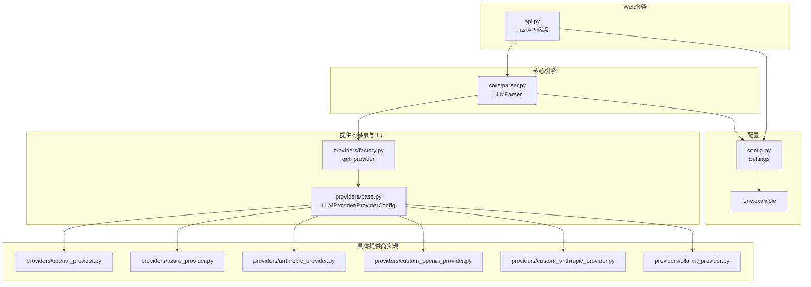
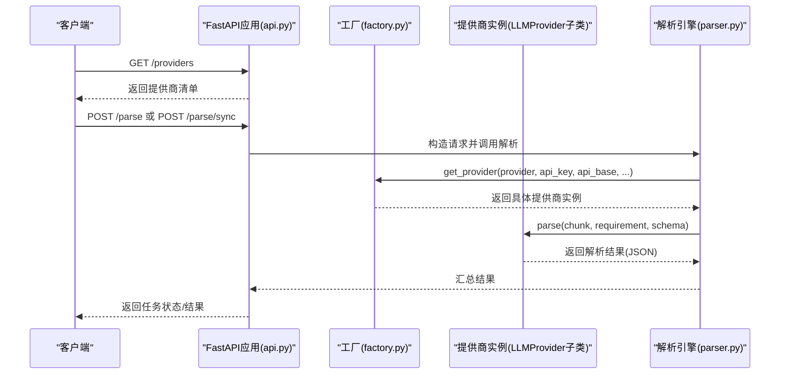
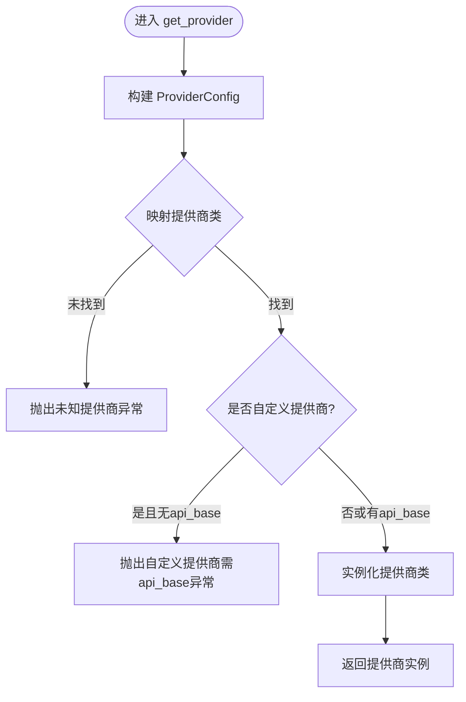
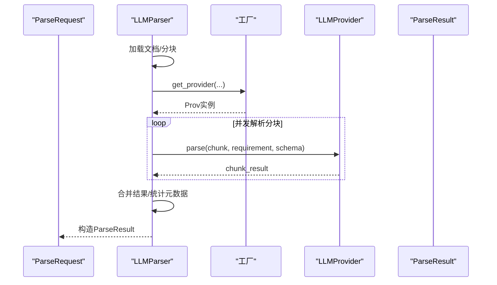
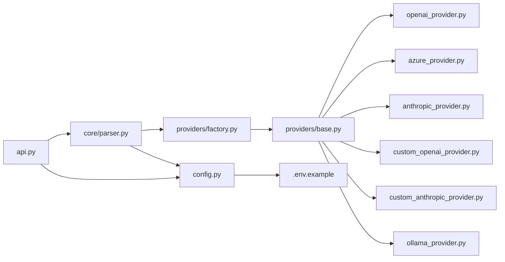

# 提供商管理

<cite>
**本文引用的文件**
- [api.py](file://api-doc-parser/src/api_doc_parser/api.py)
- [factory.py](file://api-doc-parser/src/api_doc_parser/providers/factory.py)
- [base.py](file://api-doc-parser/src/api_doc_parser/providers/base.py)
- [openai_provider.py](file://api-doc-parser/src/api_doc_parser/providers/openai_provider.py)
- [azure_provider.py](file://api-doc-parser/src/api_doc_parser/providers/azure_provider.py)
- [anthropic_provider.py](file://api-doc-parser/src/api_doc_parser/providers/anthropic_provider.py)
- [custom_openai_provider.py](file://api-doc-parser/src/api_doc_parser/providers/custom_openai_provider.py)
- [custom_anthropic_provider.py](file://api-doc-parser/src/api_doc_parser/providers/custom_anthropic_provider.py)
- [ollama_provider.py](file://api-doc-parser/src/api_doc_parser/providers/ollama_provider.py)
- [parser.py](file://api-doc-parser/src/api_doc_parser/core/parser.py)
- [config.py](file://api-doc-parser/src/api_doc_parser/config.py)
- [.env.example](file://api-doc-parser/.env.example)
- [pyproject.toml](file://api-doc-parser/pyproject.toml)
- [README.md](file://api-doc-parser/README.md)
- [test_providers.py](file://api-doc-parser/tests/test_providers.py)
</cite>

## 目录
1. [简介](#简介)
2. [项目结构](#项目结构)
3. [核心组件](#核心组件)
4. [架构总览](#架构总览)
5. [详细组件分析](#详细组件分析)
6. [依赖分析](#依赖分析)
7. [性能考虑](#性能考虑)
8. [故障排除指南](#故障排除指南)
9. [结论](#结论)
10. [附录](#附录)

## 简介
本文件围绕“提供商管理”主题，系统说明 /providers 端点返回的提供商列表与配置信息，以及如何动态获取可用的LLM提供商、进行提供商状态检查与配置验证。同时给出提供商切换、故障转移与负载均衡的实现建议，并提供完整配置示例与故障排除指南。

## 项目结构
本项目采用按功能域划分的组织方式，核心与提供商相关的模块集中在 providers 与 core 目录中，Web 服务入口位于 api.py，配置集中于 config.py，环境变量示例位于 .env.example。

图表来源
- [api.py](file://api-doc-parser/src/api_doc_parser/api.py#L257-L299)
- [factory.py](file://api-doc-parser/src/api_doc_parser/providers/factory.py#L14-L71)
- [base.py](file://api-doc-parser/src/api_doc_parser/providers/base.py#L16-L57)
- [openai_provider.py](file://api-doc-parser/src/api_doc_parser/providers/openai_provider.py#L13-L82)
- [azure_provider.py](file://api-doc-parser/src/api_doc_parser/providers/azure_provider.py#L13-L83)
- [anthropic_provider.py](file://api-doc-parser/src/api_doc_parser/providers/anthropic_provider.py#L13-L82)
- [custom_openai_provider.py](file://api-doc-parser/src/api_doc_parser/providers/custom_openai_provider.py#L12-L122)
- [custom_anthropic_provider.py](file://api-doc-parser/src/api_doc_parser/providers/custom_anthropic_provider.py#L12-L96)
- [ollama_provider.py](file://api-doc-parser/src/api_doc_parser/providers/ollama_provider.py#L13-L118)
- [parser.py](file://api-doc-parser/src/api_doc_parser/core/parser.py#L20-L44)
- [config.py](file://api-doc-parser/src/api_doc_parser/config.py#L7-L57)
- [.env.example](file://api-doc-parser/.env.example#L1-L22)

章节来源
- [api.py](file://api-doc-parser/src/api_doc_parser/api.py#L257-L299)
- [factory.py](file://api-doc-parser/src/api_doc_parser/providers/factory.py#L14-L71)
- [base.py](file://api-doc-parser/src/api_doc_parser/providers/base.py#L16-L57)
- [config.py](file://api-doc-parser/src/api_doc_parser/config.py#L7-L57)

## 核心组件
- /providers 端点：返回支持的LLM提供商清单及每个提供商的配置要求（是否需要API Key、是否需要API Base）。
- 工厂方法 get_provider：根据提供商名称与传入参数动态构造对应的提供商实例，负责参数校验与实例化。
- 抽象基类 LLMProvider 与配置 ProviderConfig：统一构建系统提示词、用户提示词、JSON解析策略，以及默认模型与超时等通用能力。
- 具体提供商实现：OpenAI、Azure OpenAI、Anthropic、自定义OpenAI协议、自定义Anthropic协议、Ollama本地模型。
- 解析引擎 LLMParser：负责文档加载、分块、并发调用提供商、结果合并与元数据统计。

章节来源
- [api.py](file://api-doc-parser/src/api_doc_parser/api.py#L257-L299)
- [factory.py](file://api-doc-parser/src/api_doc_parser/providers/factory.py#L14-L71)
- [base.py](file://api-doc-parser/src/api_doc_parser/providers/base.py#L16-L57)
- [parser.py](file://api-doc-parser/src/api_doc_parser/core/parser.py#L20-L44)

## 架构总览
/providers 端点由 FastAPI 提供，返回静态的提供商清单；运行时实际使用的提供商由 /parse 相关接口触发，通过 LLMParser 间接调用工厂方法 get_provider 获取实例，再由具体提供商实现执行解析。

图表来源
- [api.py](file://api-doc-parser/src/api_doc_parser/api.py#L257-L299)
- [api.py](file://api-doc-parser/src/api_doc_parser/api.py#L76-L155)
- [api.py](file://api-doc-parser/src/api_doc_parser/api.py#L177-L254)
- [factory.py](file://api-doc-parser/src/api_doc_parser/providers/factory.py#L14-L71)
- [parser.py](file://api-doc-parser/src/api_doc_parser/core/parser.py#L46-L128)

## 详细组件分析

### /providers 端点与返回结构
- 端点：GET /providers
- 返回结构：包含一个 providers 数组，数组中每个元素描述一个提供商的名称、说明、是否需要API Key、是否需要API Base。
- 用途：前端或SDK在发起解析前，先调用该端点动态获取可用提供商列表与配置要求，避免硬编码。

章节来源
- [api.py](file://api-doc-parser/src/api_doc_parser/api.py#L257-L299)

### 工厂方法 get_provider 的动态获取逻辑
- 输入参数：provider_name、api_key、api_base、model、temperature、max_retries。
- 校验逻辑：
  - 不支持的 provider_name 将抛出异常；
  - custom_openai/custom_anthropic 必须提供 api_base；
  - 其他提供商可从配置中心读取默认值（如 OpenAI/Azure/Anthropic/Ollama）。
- 实例化：根据 provider_name 映射到具体提供商类并传入 ProviderConfig 构造实例。

图表来源
- [factory.py](file://api-doc-parser/src/api_doc_parser/providers/factory.py#L14-L71)

章节来源
- [factory.py](file://api-doc-parser/src/api_doc_parser/providers/factory.py#L14-L71)

### 抽象基类 LLMProvider 与 ProviderConfig
- ProviderConfig：封装 api_key、base_url、model、temperature、max_retries、timeout 等配置项。
- LLMProvider：
  - 统一构建系统提示词与用户提示词；
  - 统一JSON解析策略（支持代码块与裸JSON）；
  - 抽象 parse 与 get_default_model 方法，由各提供商实现。

章节来源
- [base.py](file://api-doc-parser/src/api_doc_parser/providers/base.py#L16-L57)
- [base.py](file://api-doc-parser/src/api_doc_parser/providers/base.py#L59-L143)

### 具体提供商实现概览
- OpenAIProvider：使用官方AsyncOpenAI客户端，支持自定义base_url；默认模型来自配置。
- AzureOpenAIProvider：使用AsyncAzureOpenAI客户端，必须提供endpoint（base_url），并设置api_version。
- AnthropicProvider：使用AsyncAnthropic客户端，系统提示词通过独立参数传递。
- CustomOpenAIProvider：兼容OpenAI协议的自定义端点（如vLLM/TGI），支持列出可用模型。
- CustomAnthropicProvider：兼容Anthropic Messages协议的自定义端点。
- OllamaProvider：本地HTTP API，支持列出/拉取模型。

章节来源
- [openai_provider.py](file://api-doc-parser/src/api_doc_parser/providers/openai_provider.py#L13-L82)
- [azure_provider.py](file://api-doc-parser/src/api_doc_parser/providers/azure_provider.py#L13-L83)
- [anthropic_provider.py](file://api-doc-parser/src/api_doc_parser/providers/anthropic_provider.py#L13-L82)
- [custom_openai_provider.py](file://api-doc-parser/src/api_doc_parser/providers/custom_openai_provider.py#L12-L122)
- [custom_anthropic_provider.py](file://api-doc-parser/src/api_doc_parser/providers/custom_anthropic_provider.py#L12-L96)
- [ollama_provider.py](file://api-doc-parser/src/api_doc_parser/providers/ollama_provider.py#L13-L118)

### 解析引擎 LLMParser 的提供商使用流程
- 通过工厂方法按需创建提供商实例；
- 对文档进行加载与智能分块；
- 并发调用提供商解析各分块，限制并发度；
- 合并结果并生成元数据（包含置信度、失败分块、处理时间等）。

图表来源
- [parser.py](file://api-doc-parser/src/api_doc_parser/core/parser.py#L46-L128)
- [parser.py](file://api-doc-parser/src/api_doc_parser/core/parser.py#L130-L169)

章节来源
- [parser.py](file://api-doc-parser/src/api_doc_parser/core/parser.py#L20-L44)
- [parser.py](file://api-doc-parser/src/api_doc_parser/core/parser.py#L46-L128)
- [parser.py](file://api-doc-parser/src/api_doc_parser/core/parser.py#L130-L169)

### 配置与环境变量
- 配置中心 Settings：集中管理各提供商默认配置（如OpenAI/Azure/Anthropic/Ollama的默认模型、基础URL、重试参数等）。
- 环境变量示例：.env.example 展示了各提供商所需的最小配置项。
- 依赖声明：pyproject.toml 中声明了FastAPI、OpenAI、Anthropic、httpx等依赖。

章节来源
- [config.py](file://api-doc-parser/src/api_doc_parser/config.py#L7-L57)
- [.env.example](file://api-doc-parser/.env.example#L1-L22)
- [pyproject.toml](file://api-doc-parser/pyproject.toml#L25-L59)

## 依赖分析
- 模块耦合：
  - api.py 依赖 LLMParser 与配置中心；
  - LLMParser 依赖工厂方法与具体提供商实现；
  - 具体提供商实现依赖抽象基类与配置中心。
- 外部依赖：
  - OpenAI/Anthropic SDK用于官方API；
  - httpx用于自定义协议与本地Ollama的HTTP调用；
  - structlog用于日志记录。

图表来源
- [api.py](file://api-doc-parser/src/api_doc_parser/api.py#L13-L21)
- [parser.py](file://api-doc-parser/src/api_doc_parser/core/parser.py#L10-L15)
- [factory.py](file://api-doc-parser/src/api_doc_parser/providers/factory.py#L5-L11)
- [base.py](file://api-doc-parser/src/api_doc_parser/providers/base.py#L3-L11)
- [config.py](file://api-doc-parser/src/api_doc_parser/config.py#L4-L14)

章节来源
- [api.py](file://api-doc-parser/src/api_doc_parser/api.py#L13-L21)
- [parser.py](file://api-doc-parser/src/api_doc_parser/core/parser.py#L10-L15)
- [factory.py](file://api-doc-parser/src/api_doc_parser/providers/factory.py#L5-L11)
- [base.py](file://api-doc-parser/src/api_doc_parser/providers/base.py#L3-L11)
- [config.py](file://api-doc-parser/src/api_doc_parser/config.py#L4-L14)

## 性能考虑
- 并发限制：解析引擎对分块解析使用信号量限制并发度，避免过度占用下游API速率限制或本地资源。
- 缓存：解析引擎内置简单内存缓存，基于内容指纹与模型组合生成缓存键，减少重复请求。
- 超时与重试：ProviderConfig 提供 timeout 与 max_retries，具体提供商实现可结合各自SDK的重试策略。
- 日志与可观测性：统一使用 structlog 记录关键事件，便于定位性能瓶颈与错误。

章节来源
- [parser.py](file://api-doc-parser/src/api_doc_parser/core/parser.py#L130-L169)
- [parser.py](file://api-doc-parser/src/api_doc_parser/core/parser.py#L171-L201)
- [base.py](file://api-doc-parser/src/api_doc_parser/providers/base.py#L16-L25)

## 故障排除指南
- /providers 返回的提供商不可用
  - 检查 provider_name 是否拼写正确，仅支持预定义名称。
  - 若使用自定义提供商，确保传入 api_base。
- 400 错误：output_schema 非法JSON
  - 确保 output_schema 为合法JSON字符串。
- 400 错误：文件类型不受支持或过大
  - 支持的后缀：.pdf、.docx、.xlsx、.txt、.md；文件大小受 max_file_size 限制。
- OpenAI/Azure/Anthropic 解析异常
  - 检查对应API Key与Endpoint配置；
  - Azure OpenAI 必须提供 endpoint（base_url）。
- 自定义OpenAI/Anthropic协议解析异常
  - 确认自定义端点的 /chat/completions 或 /messages 接口可用；
  - 检查鉴权头与协议版本（如anthropic-version）。
- Ollama 解析异常
  - 确认本地Ollama服务运行且可访问；
  - 可使用 list_models 检查可用模型。

章节来源
- [api.py](file://api-doc-parser/src/api_doc_parser/api.py#L94-L124)
- [api.py](file://api-doc-parser/src/api_doc_parser/api.py#L194-L221)
- [factory.py](file://api-doc-parser/src/api_doc_parser/providers/factory.py#L60-L69)
- [azure_provider.py](file://api-doc-parser/src/api_doc_parser/providers/azure_provider.py#L29-L31)
- [custom_openai_provider.py](file://api-doc-parser/src/api_doc_parser/providers/custom_openai_provider.py#L24-L26)
- [custom_anthropic_provider.py](file://api-doc-parser/src/api_doc_parser/providers/custom_anthropic_provider.py#L20-L22)
- [ollama_provider.py](file://api-doc-parser/src/api_doc_parser/providers/ollama_provider.py#L27-L29)

## 结论
/providers 端点提供了标准化的提供商清单与配置要求，结合工厂方法与抽象基类，系统实现了对多家LLM提供商的统一接入。通过解析引擎的并发控制、缓存与日志机制，可在不同提供商之间灵活切换，并具备一定的容错能力。对于更复杂的场景（如故障转移与负载均衡），可在现有工厂与抽象层之上扩展，例如引入健康检查、权重轮询或熔断策略。

## 附录

### /providers 返回的提供商清单与配置要求
- openai：需要API Key，不需要API Base
- azure：需要API Key，需要API Base（endpoint）
- anthropic：需要API Key，不需要API Base
- custom_openai：不需要API Key（可选），需要API Base
- custom_anthropic：不需要API Key（可选），需要API Base
- ollama：不需要API Key，不需要API Base

章节来源
- [api.py](file://api-doc-parser/src/api_doc_parser/api.py#L257-L299)

### 动态获取可用LLM提供商与配置验证
- 在发起 /parse 请求前，先调用 /providers 获取支持的提供商列表与配置要求；
- 根据返回信息决定是否传入 api_key 与 api_base；
- 对自定义提供商，确保 api_base 正确指向兼容的API端点。

章节来源
- [api.py](file://api-doc-parser/src/api_doc_parser/api.py#L257-L299)
- [factory.py](file://api-doc-parser/src/api_doc_parser/providers/factory.py#L60-L69)

### 提供商切换、故障转移与负载均衡实现方案
- 切换：通过 /parse 接口的 provider 字段动态选择；也可在业务层根据 /providers 返回信息选择默认提供商。
- 故障转移：在工厂层增加健康检查与降级策略，当某提供商连续失败达到阈值时自动切换到下一个备选提供商。
- 负载均衡：对同一提供商进行多实例部署，解析引擎按权重轮询或最少连接策略选择实例。

说明：上述为概念性实现建议，可在现有工厂与抽象层基础上扩展。

### 完整配置示例
- 环境变量示例（.env.example）展示了各提供商所需的最小配置项，包括 OpenAI、Anthropic、Azure OpenAI、Ollama 等。
- 配置中心（config.py）提供了默认模型与重试参数等全局配置。

章节来源
- [.env.example](file://api-doc-parser/.env.example#L1-L22)
- [config.py](file://api-doc-parser/src/api_doc_parser/config.py#L20-L48)

### 测试参考
- 单元测试覆盖了工厂方法、OpenAI与Anthropic提供商的基本行为，可作为集成测试的参考。

章节来源
- [test_providers.py](file://api-doc-parser/tests/test_providers.py#L13-L45)
- [test_providers.py](file://api-doc-parser/tests/test_providers.py#L47-L102)