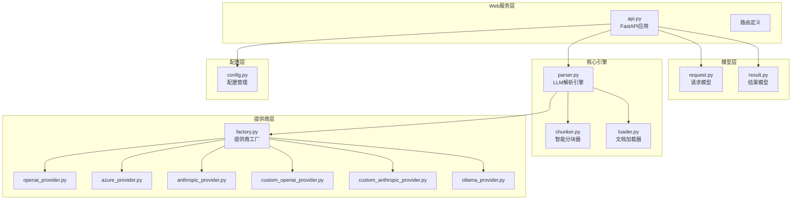
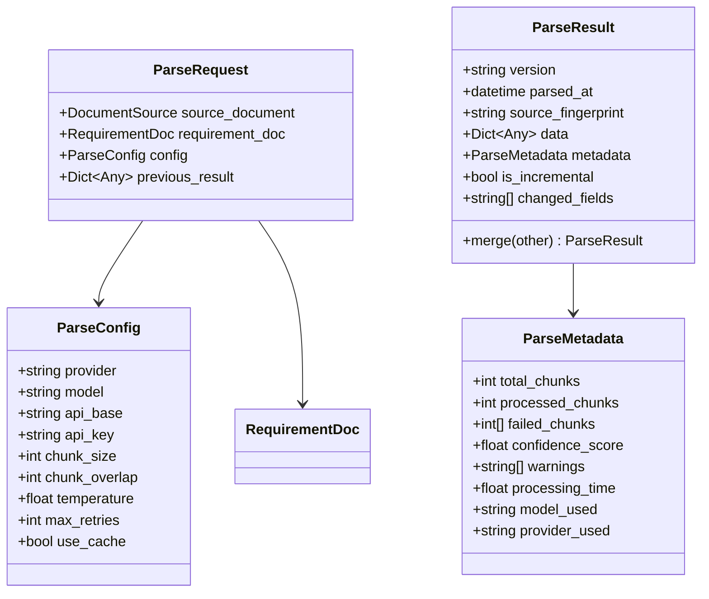
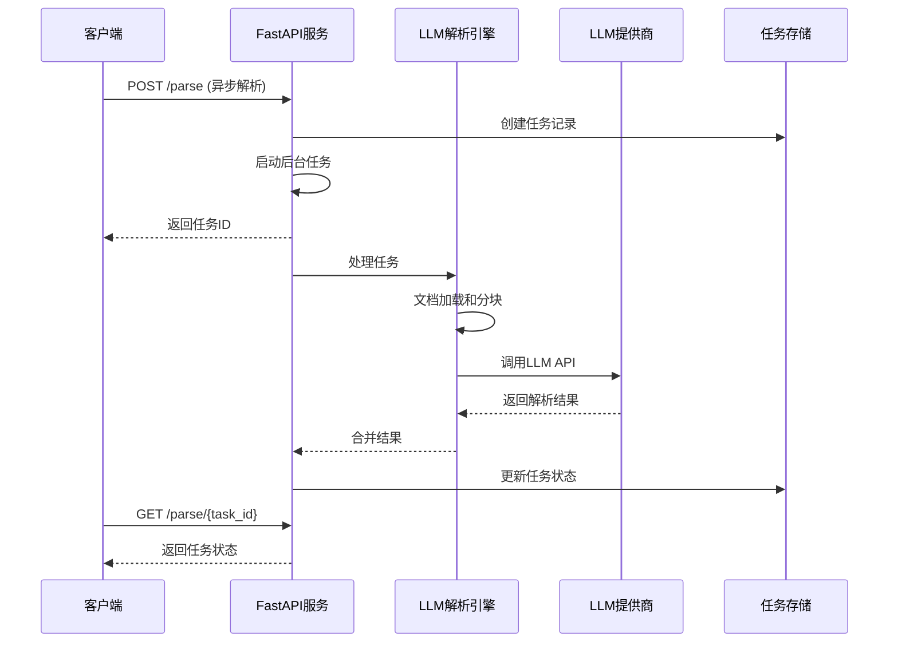
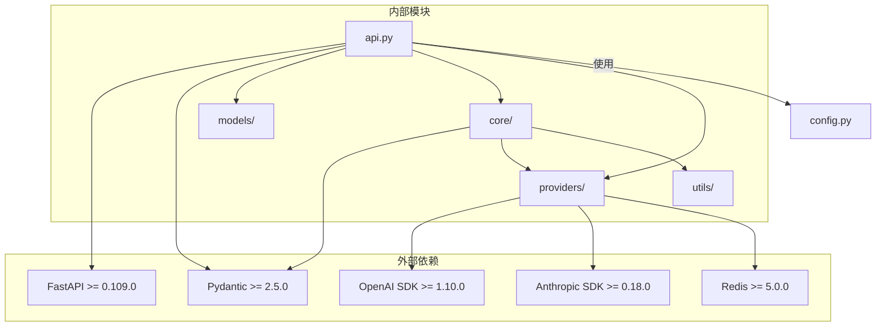

# 核心API端点

<cite>
**本文档引用的文件**
- [api.py](file://api-doc-parser/src/api_doc_parser/api.py)
- [request.py](file://api-doc-parser/src/api_doc_parser/models/request.py)
- [result.py](file://api-doc-parser/src/api_doc_parser/models/result.py)
- [parser.py](file://api-doc-parser/src/api_doc_parser/core/parser.py)
- [factory.py](file://api-doc-parser/src/api_doc_parser/providers/factory.py)
- [config.py](file://api-doc-parser/src/api_doc_parser/config.py)
- [README.md](file://api-doc-parser/README.md)
- [pyproject.toml](file://api-doc-parser/pyproject.toml)
</cite>

## 目录
1. [简介](#简介)
2. [项目结构](#项目结构)
3. [核心组件](#核心组件)
4. [架构概览](#架构概览)
5. [详细组件分析](#详细组件分析)
6. [依赖关系分析](#依赖关系分析)
7. [性能考虑](#性能考虑)
8. [故障排除指南](#故障排除指南)
9. [结论](#结论)

## 简介

API Doc Parser 是一个使用大语言模型智能解析API文档的工具，支持PDF、Word、Excel等多种格式，可输出结构化的JSON数据。该服务提供了完整的REST API接口，包括异步解析、同步解析和提供商管理功能。

## 项目结构

该项目采用模块化设计，主要包含以下核心模块：



**图表来源**
- [api.py](file://api-doc-parser/src/api_doc_parser/api.py#L1-L371)
- [request.py](file://api-doc-parser/src/api_doc_parser/models/request.py#L1-L57)
- [result.py](file://api-doc-parser/src/api_doc_parser/models/result.py#L1-L55)
- [parser.py](file://api-doc-parser/src/api_doc_parser/core/parser.py#L1-L304)
- [factory.py](file://api-doc-parser/src/api_doc_parser/providers/factory.py#L1-L71)

**章节来源**
- [api.py](file://api-doc-parser/src/api_doc_parser/api.py#L1-L371)
- [README.md](file://api-doc-parser/README.md#L136-L157)

## 核心组件

### API应用配置

应用使用FastAPI框架构建，具有以下特点：
- **标题**: API Doc Parser
- **描述**: 使用大语言模型解析API文档的智能工具
- **版本**: 0.1.0
- **健康检查**: `/health` 端点返回服务状态

### 数据模型

系统使用Pydantic模型确保数据验证和类型安全：



**图表来源**
- [request.py](file://api-doc-parser/src/api_doc_parser/models/request.py#L51-L57)
- [result.py](file://api-doc-parser/src/api_doc_parser/models/result.py#L20-L34)

**章节来源**
- [request.py](file://api-doc-parser/src/api_doc_parser/models/request.py#L1-L57)
- [result.py](file://api-doc-parser/src/api_doc_parser/models/result.py#L1-L55)

## 架构概览

系统采用分层架构设计，实现了清晰的关注点分离：



**图表来源**
- [api.py](file://api-doc-parser/src/api_doc_parser/api.py#L76-L155)
- [parser.py](file://api-doc-parser/src/api_doc_parser/core/parser.py#L46-L128)

## 详细组件分析

### 异步解析端点 (/parse)

#### 端点定义
- **HTTP方法**: POST
- **URL路径**: `/parse`
- **功能**: 创建异步解析任务，立即返回任务ID

#### 请求参数

| 参数名 | 类型 | 必需 | 默认值 | 描述 |
|--------|------|------|--------|------|
| file | UploadFile | 是 | - | API文档文件 (PDF/Word/Excel) |
| requirement_content | string | 是 | - | 解析要求说明 |
| output_schema | string | 否 | null | 输出JSON Schema (JSON字符串) |
| provider | string | 否 | "openai" | LLM提供商 |
| model | string | 否 | null | 模型名称 |
| api_base | string | 否 | null | 自定义API基础URL |
| api_key | string | 否 | null | API密钥 |
| chunk_size | integer | 否 | 3000 | 分块大小 |
| temperature | float | 否 | 0.1 | 温度参数 |

#### 响应格式

```json
{
  "task_id": "string",
  "status": "string",
  "message": "string"
}
```

#### 错误码

- **400**: 文件类型不支持或文件过大
- **400**: output_schema不是有效的JSON字符串
- **500**: 解析过程中发生内部错误

#### 使用示例

**请求示例**:
```bash
curl -X POST "http://localhost:8000/parse" \
  -H "Content-Type: multipart/form-data" \
  -F "file=@api_document.pdf" \
  -F "requirement_content=从文档中提取所有API端点信息" \
  -F "provider=openai" \
  -F "model=gpt-4"
```

**响应示例**:
```json
{
  "task_id": "550e8400-e29b-41d4-a716-446655440000",
  "status": "pending",
  "message": "解析任务已创建，请使用任务ID查询状态"
}
```

### 任务状态查询端点 (/parse/{task_id})

#### 端点定义
- **HTTP方法**: GET
- **URL路径**: `/parse/{task_id}`
- **功能**: 查询异步解析任务的状态

#### 路径参数

| 参数名 | 类型 | 必需 | 描述 |
|--------|------|------|------|
| task_id | string | 是 | 任务ID |

#### 响应格式

```json
{
  "task_id": "string",
  "status": "pending|processing|completed|failed",
  "created_at": "string",
  "updated_at": "string",
  "progress": {
    "current": 0,
    "total": 0,
    "percentage": 0.0
  },
  "result": {},
  "error": "string"
}
```

#### 错误码

- **404**: 任务不存在

#### 使用示例

**请求示例**:
```bash
curl "http://localhost:8000/parse/550e8400-e29b-41d4-a716-446655440000"
```

**响应示例**:
```json
{
  "task_id": "550e8400-e29b-41d4-a716-446655440000",
  "status": "processing",
  "created_at": "2024-01-01T12:00:00Z",
  "updated_at": "2024-01-01T12:00:05Z",
  "progress": {
    "current": 3,
    "total": 10,
    "percentage": 30.0
  },
  "result": null,
  "error": null
}
```

### 同步解析端点 (/parse/sync)

#### 端点定义
- **HTTP方法**: POST
- **URL路径**: `/parse/sync`
- **功能**: 直接返回解析结果，适用于小文档

#### 请求参数

| 参数名 | 类型 | 必需 | 默认值 | 描述 |
|--------|------|------|--------|------|
| file | UploadFile | 是 | - | API文档文件 |
| requirement_content | string | 是 | - | 解析要求说明 |
| output_schema | string | 否 | null | 输出JSON Schema |
| provider | string | 否 | "openai" | LLM提供商 |
| model | string | 否 | null | 模型名称 |
| api_base | string | 否 | null | 自定义API基础URL |
| api_key | string | 否 | null | API密钥 |
| chunk_size | integer | 否 | 3000 | 分块大小 |
| temperature | float | 否 | 0.1 | 温度参数 |

#### 响应格式

同步解析返回完整的解析结果，格式与异步解析完成后的结果相同。

#### 错误码

- **400**: 文件类型不支持或文件过大
- **400**: output_schema不是有效的JSON字符串
- **500**: 解析过程中发生内部错误

#### 使用示例

**请求示例**:
```bash
curl -X POST "http://localhost:8000/parse/sync" \
  -H "Content-Type: multipart/form-data" \
  -F "file=@api_document.pdf" \
  -F "requirement_content=从文档中提取所有API端点信息" \
  -F "provider=openai" \
  -F "model=gpt-4"
```

**响应示例**:
```json
{
  "version": "1.0",
  "parsed_at": "2024-01-01T12:00:05Z",
  "source_fingerprint": "abc123...",
  "data": {
    "endpoints": [
      {
        "path": "/users",
        "method": "GET",
        "description": "获取用户列表"
      }
    ]
  },
  "metadata": {
    "total_chunks": 5,
    "processed_chunks": 5,
    "failed_chunks": [],
    "confidence_score": 0.95,
    "warnings": [],
    "processing_time": 5.2,
    "model_used": "gpt-4",
    "provider_used": "openai"
  },
  "is_incremental": false,
  "changed_fields": []
}
```

### 提供商列表端点 (/providers)

#### 端点定义
- **HTTP方法**: GET
- **URL路径**: `/providers`
- **功能**: 列出支持的LLM提供商

#### 响应格式

```json
{
  "providers": [
    {
      "name": "openai",
      "description": "OpenAI官方API",
      "requires_api_key": true,
      "requires_api_base": false
    },
    {
      "name": "azure",
      "description": "Azure OpenAI",
      "requires_api_key": true,
      "requires_api_base": true
    },
    {
      "name": "anthropic",
      "description": "Anthropic Claude",
      "requires_api_key": true,
      "requires_api_base": false
    },
    {
      "name": "custom_openai",
      "description": "自定义OpenAI协议API (vLLM, TGI等)",
      "requires_api_key": false,
      "requires_api_base": true
    },
    {
      "name": "custom_anthropic",
      "description": "自定义Anthropic协议API",
      "requires_api_key": false,
      "requires_api_base": true
    },
    {
      "name": "ollama",
      "description": "Ollama本地模型",
      "requires_api_key": false,
      "requires_api_base": false
    }
  ]
}
```

#### 错误码

- **无特定错误码**: 该端点总是返回成功响应

#### 使用示例

**请求示例**:
```bash
curl "http://localhost:8000/providers"
```

**响应示例**:
```json
{
  "providers": [
    {
      "name": "openai",
      "description": "OpenAI官方API",
      "requires_api_key": true,
      "requires_api_base": false
    },
    {
      "name": "azure",
      "description": "Azure OpenAI",
      "requires_api_key": true,
      "requires_api_base": true
    },
    {
      "name": "anthropic",
      "description": "Anthropic Claude",
      "requires_api_key": true,
      "requires_api_base": false
    },
    {
      "name": "custom_openai",
      "description": "自定义OpenAI协议API (vLLM, TGI等)",
      "requires_api_key": false,
      "requires_api_base": true
    },
    {
      "name": "custom_anthropic",
      "description": "自定义Anthropic协议API",
      "requires_api_key": false,
      "requires_api_base": true
    },
    {
      "name": "ollama",
      "description": "Ollama本地模型",
      "requires_api_key": false,
      "requires_api_base": false
    }
  ]
}
```

## 依赖关系分析

### 核心依赖关系



**图表来源**
- [pyproject.toml](file://api-doc-parser/pyproject.toml#L25-L59)
- [api.py](file://api-doc-parser/src/api_doc_parser/api.py#L9-L21)

### 端点间关系

```mermaid
flowchart TD
START[客户端请求] --> CHECK{请求类型}
CHECK --> |POST /parse| ASYNC[异步解析流程]
CHECK --> |GET /parse/{task_id}| STATUS[状态查询流程]
CHECK --> |POST /parse/sync| SYNC[同步解析流程]
CHECK --> |GET /providers| PROVIDERS[提供商列表流程]
ASYNC --> CREATE_TASK[创建任务记录]
ASYNC --> BACKGROUND[启动后台任务]
ASYNC --> RETURN_TASK[返回任务ID]
STATUS --> GET_STATUS[获取任务状态]
STATUS --> RETURN_STATUS[返回状态信息]
SYNC --> DIRECT_PARSE[直接解析文档]
SYNC --> RETURN_RESULT[返回解析结果]
PROVIDERS --> LIST_PROVIDERS[列出支持的提供商]
PROVIDERS --> RETURN_PROVIDERS[返回提供商列表]
CREATE_TASK --> BACKGROUND
BACKGROUND --> PROCESS_TASK[处理解析任务]
PROCESS_TASK --> UPDATE_STATUS[更新任务状态]
RETURN_TASK --> WAIT[等待客户端轮询]
RETURN_STATUS --> WAIT
RETURN_RESULT --> END[结束]
UPDATE_STATUS --> WAIT
WAIT --> CHECK
```

**图表来源**
- [api.py](file://api-doc-parser/src/api_doc_parser/api.py#L76-L299)

**章节来源**
- [pyproject.toml](file://api-doc-parser/pyproject.toml#L1-L100)
- [api.py](file://api-doc-parser/src/api_doc_parser/api.py#L1-L371)

## 性能考虑

### 异步处理机制

系统采用异步架构处理大型文档解析：

1. **并发控制**: 使用信号量限制同时处理的分块数量
2. **内存优化**: 解析完成后清理文件内容以节省内存
3. **进度跟踪**: 实时更新任务进度信息
4. **缓存机制**: 内置简单内存缓存减少重复请求

### 性能优化建议

- **合理设置分块大小**: 根据文档复杂度调整 `chunk_size` 参数
- **选择合适的提供商**: 不同提供商的响应时间和成本不同
- **使用缓存**: 对于重复解析的文档，启用缓存机制
- **监控资源使用**: 关注内存和CPU使用情况

## 故障排除指南

### 常见错误及解决方案

| 错误码 | 错误类型 | 可能原因 | 解决方案 |
|--------|----------|----------|----------|
| 400 | 文件类型不支持 | 上传文件扩展名不在支持列表中 | 确保文件扩展名为 .pdf, .docx, .xlsx, .txt, .md |
| 400 | 文件过大 | 超过最大文件限制 (100MB) | 分割文档或使用压缩工具 |
| 400 | JSON格式错误 | output_schema不是有效JSON | 检查JSON格式并确保语法正确 |
| 404 | 任务不存在 | 任务ID无效或已过期 | 确认任务ID正确性并检查任务状态 |
| 500 | 内部服务器错误 | LLM提供商API调用失败 | 检查网络连接和API密钥配置 |

### 调试技巧

1. **启用调试模式**: 设置 `debug=True` 获取更详细的日志信息
2. **检查提供商配置**: 确认API密钥和基础URL配置正确
3. **监控任务状态**: 定期查询任务状态了解处理进度
4. **查看日志输出**: 关注服务端日志获取错误详情

**章节来源**
- [api.py](file://api-doc-parser/src/api_doc_parser/api.py#L108-L123)
- [config.py](file://api-doc-parser/src/api_doc_parser/config.py#L50-L52)

## 结论

API Doc Parser 提供了一个完整、可靠的API文档解析解决方案。其异步处理机制适合处理大型文档，而同步解析端点则满足快速需求。通过灵活的提供商配置和强大的数据模型，该系统能够适应各种使用场景。

关键优势包括：
- **多格式支持**: 全面支持主流文档格式
- **异步处理**: 高效处理大型文档
- **灵活配置**: 支持多种LLM提供商
- **类型安全**: 使用Pydantic确保数据完整性
- **易于集成**: 清晰的REST API接口

建议在生产环境中结合监控和缓存策略，以获得最佳性能表现。