# 错误处理和状态码

<cite>
**本文引用的文件**
- [api.py](file://api-doc-parser/src/api_doc_parser/api.py)
- [base.py](file://api-doc-parser/src/api_doc_parser/providers/base.py)
- [parser.py](file://api-doc-parser/src/api_doc_parser/core/parser.py)
- [factory.py](file://api-doc-parser/src/api_doc_parser/providers/factory.py)
- [openai_provider.py](file://api-doc-parser/src/api_doc_parser/providers/openai_provider.py)
- [anthropic_provider.py](file://api-doc-parser/src/api_doc_parser/providers/anthropic_provider.py)
- [azure_provider.py](file://api-doc-parser/src/api_doc_parser/providers/azure_provider.py)
- [custom_openai_provider.py](file://api-doc-parser/src/api_doc_parser/providers/custom_openai_provider.py)
- [config.py](file://api-doc-parser/src/api_doc_parser/config.py)
- [request.py](file://api-doc-parser/src/api_doc_parser/models/request.py)
- [result.py](file://api-doc-parser/src/api_doc_parser/models/result.py)
- [test_providers.py](file://api-doc-parser/tests/test_providers.py)
</cite>

## 目录
1. [简介](#简介)
2. [项目结构](#项目结构)
3. [核心组件](#核心组件)
4. [架构概览](#架构概览)
5. [详细组件分析](#详细组件分析)
6. [依赖关系分析](#依赖关系分析)
7. [性能考虑](#性能考虑)
8. [故障排除指南](#故障排除指南)
9. [结论](#结论)

## 简介
本文件详细记录了API文档解析服务的错误处理机制和状态码规范。该系统提供了完整的错误处理策略，包括HTTP状态码、错误消息格式、异常情况处理以及客户端错误处理最佳实践。系统支持多种LLM提供商，每种提供商都有特定的错误处理逻辑和重试策略。

## 项目结构
系统采用模块化设计，错误处理分布在多个层次：

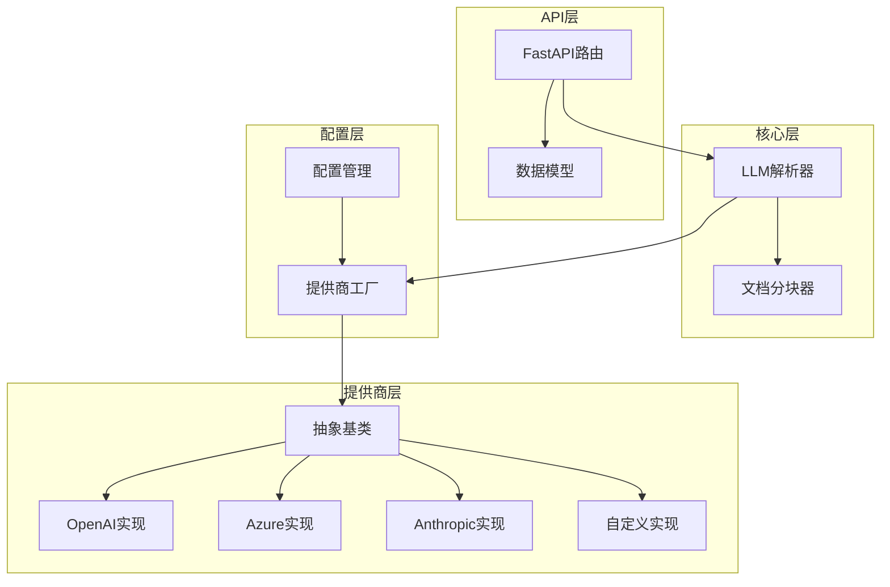
```mermaid
graph TB
subgraph "API层"
API[FastAPI路由]
MODELS[数据模型]
end
subgraph "核心层"
PARSER[LLM解析器]
CHUNKER[文档分块器]
end
subgraph "提供商层"
BASE[抽象基类]
OPENAI[OpenAI实现]
AZURE[Azure实现]
ANTHROPIC[Anthropic实现]
CUSTOM[自定义实现]
end
subgraph "配置层"
CONFIG[配置管理]
FACTORY[提供商工厂]
end
API --> PARSER
PARSER --> CHUNKER
PARSER --> FACTORY
FACTORY --> BASE
BASE --> OPENAI
BASE --> AZURE
BASE --> ANTHROPIC
BASE --> CUSTOM
API --> MODELS
CONFIG --> FACTORY
```

**图表来源**
- [api.py](file://api-doc-parser/src/api_doc_parser/api.py#L1-L371)
- [parser.py](file://api-doc-parser/src/api_doc_parser/core/parser.py#L1-L304)
- [factory.py](file://api-doc-parser/src/api_doc_parser/providers/factory.py#L1-L71)

**章节来源**
- [api.py](file://api-doc-parser/src/api_doc_parser/api.py#L1-L371)
- [parser.py](file://api-doc-parser/src/api_doc_parser/core/parser.py#L1-L304)
- [factory.py](file://api-doc-parser/src/api_doc_parser/providers/factory.py#L1-L71)

## 核心组件

### HTTP状态码规范
系统遵循RESTful API标准，使用标准HTTP状态码进行错误处理：

| 状态码 | 用途 | 错误场景 |
|--------|------|----------|
| 200 | 成功 | 同步解析成功、健康检查 |
| 201 | 任务创建成功 | 异步解析任务创建 |
| 400 | 请求错误 | 无效参数、文件类型不支持、文件过大、JSON格式错误 |
| 404 | 资源不存在 | 任务ID不存在 |
| 500 | 服务器内部错误 | 解析过程中的未预期异常 |

### 错误消息格式
系统提供统一的错误消息格式：

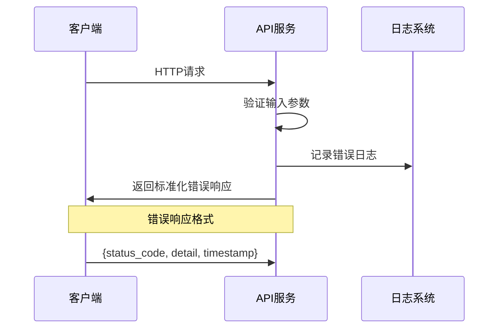
```mermaid
sequenceDiagram
participant Client as 客户端
participant API as API服务
participant Logger as 日志系统
Client->>API : HTTP请求
API->>API : 验证输入参数
API->>Logger : 记录错误日志
API->>Client : 返回标准化错误响应
Note over Client,API : 错误响应格式
Client->>API : {status_code, detail, timestamp}
```

**图表来源**
- [api.py](file://api-doc-parser/src/api_doc_parser/api.py#L94-L123)
- [api.py](file://api-doc-parser/src/api_doc_parser/api.py#L194-L209)

**章节来源**
- [api.py](file://api-doc-parser/src/api_doc_parser/api.py#L94-L123)
- [api.py](file://api-doc-parser/src/api_doc_parser/api.py#L194-L209)

## 架构概览

### 错误处理架构
系统采用分层错误处理架构，确保错误能够被正确捕获、转换和传播：

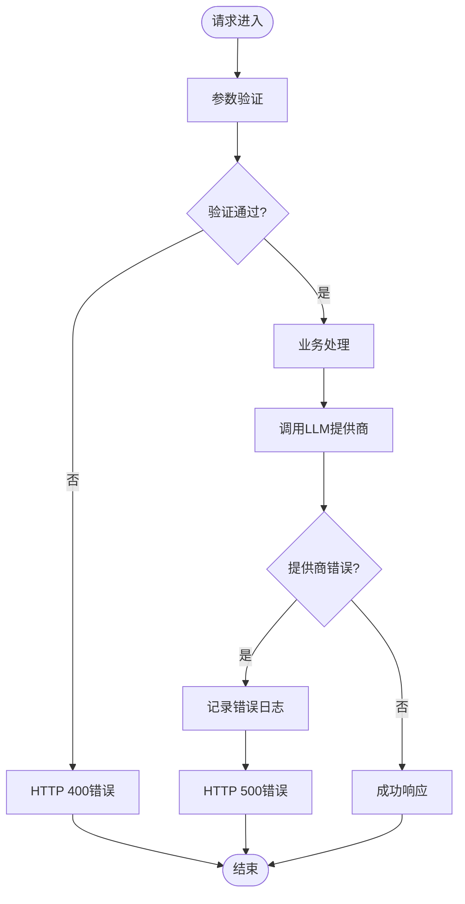
```mermaid
flowchart TD
Start([请求进入]) --> Validate[参数验证]
Validate --> Valid{验证通过?}
Valid --> |否| HTTP400[HTTP 400错误]
Valid --> |是| Process[业务处理]
Process --> Provider[调用LLM提供商]
Provider --> ProviderError{提供商错误?}
ProviderError --> |是| LogError[记录错误日志]
LogError --> HTTP500[HTTP 500错误]
ProviderError --> |否| Success[成功响应]
HTTP400 --> End([结束])
HTTP500 --> End
Success --> End
```

**图表来源**
- [api.py](file://api-doc-parser/src/api_doc_parser/api.py#L76-L155)
- [parser.py](file://api-doc-parser/src/api_doc_parser/core/parser.py#L130-L169)

### 任务状态管理
异步任务的状态流转：

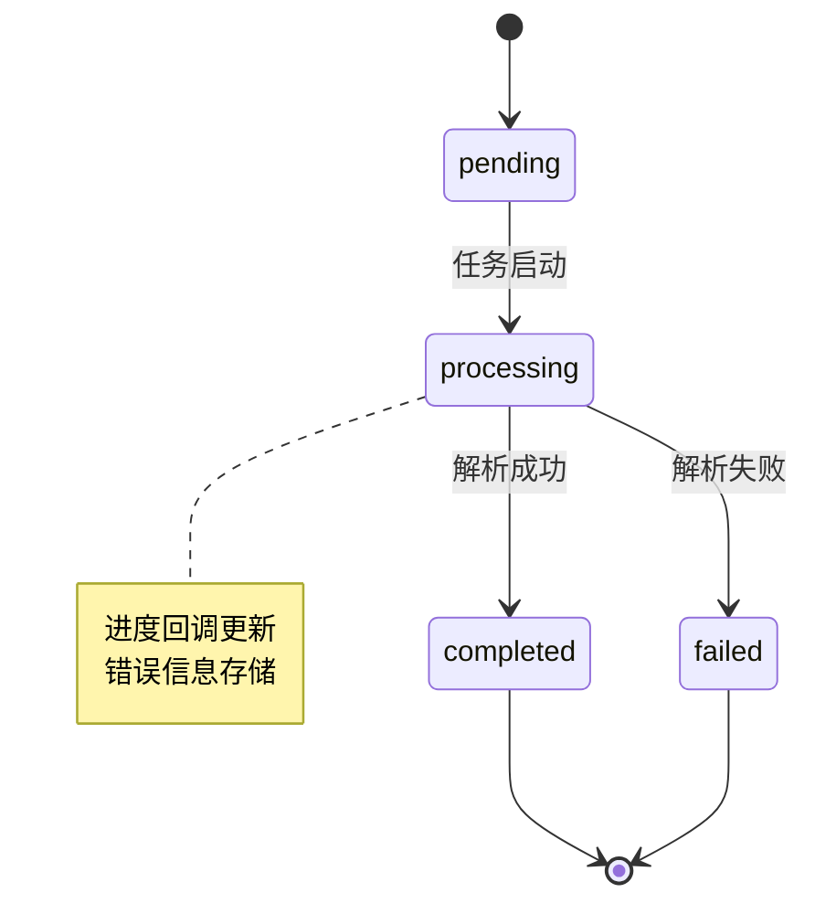
```mermaid
stateDiagram-v2
[*] --> pending
pending --> processing : 任务启动
processing --> completed : 解析成功
processing --> failed : 解析失败
completed --> [*]
failed --> [*]
note right of processing
进度回调更新
错误信息存储
end note
```

**图表来源**
- [api.py](file://api-doc-parser/src/api_doc_parser/api.py#L302-L353)

**章节来源**
- [api.py](file://api-doc-parser/src/api_doc_parser/api.py#L302-L353)

## 详细组件分析

### API层错误处理
API层负责HTTP层面的错误处理和响应格式化。

#### 文件类型验证错误
系统支持的文件类型及对应的错误处理：

| 文件类型 | 支持状态 | 错误响应 |
|----------|----------|----------|
| PDF | ✅ 支持 | 正常处理 |
| DOCX | ✅ 支持 | 正常处理 |
| XLSX | ✅ 支持 | 正常处理 |
| TXT | ✅ 支持 | 正常处理 |
| MD | ✅ 支持 | 正常处理 |
| 其他 | ❌ 不支持 | HTTP 400错误 |

#### 文件大小限制
系统对上传文件大小进行严格限制：

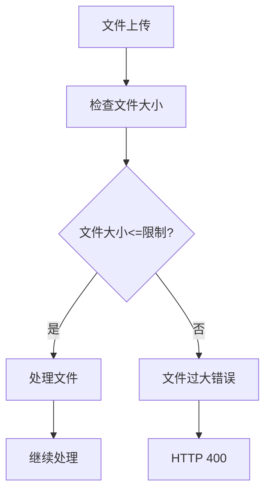
```mermaid
flowchart TD
FileUpload[文件上传] --> CheckSize[检查文件大小]
CheckSize --> SizeOK{文件大小<=限制?}
SizeOK --> |是| ProcessFile[处理文件]
SizeOK --> |否| TooLarge[文件过大错误]
TooLarge --> HTTP400[HTTP 400]
ProcessFile --> Continue[继续处理]
```

**图表来源**
- [api.py](file://api-doc-parser/src/api_doc_parser/api.py#L108-L112)

#### JSON格式验证
输出模式的JSON格式验证：

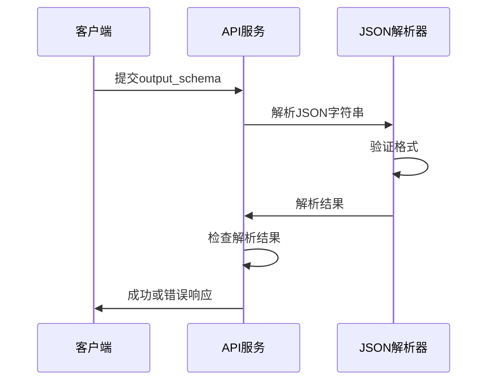
```mermaid
sequenceDiagram
participant Client as 客户端
participant API as API服务
participant JSON as JSON解析器
Client->>API : 提交output_schema
API->>JSON : 解析JSON字符串
JSON->>JSON : 验证格式
JSON->>API : 解析结果
API->>API : 检查解析结果
API->>Client : 成功或错误响应
```

**图表来源**
- [api.py](file://api-doc-parser/src/api_doc_parser/api.py#L115-L123)

**章节来源**
- [api.py](file://api-doc-parser/src/api_doc_parser/api.py#L76-L155)
- [api.py](file://api-doc-parser/src/api_doc_parser/api.py#L108-L123)

### LLM提供商错误处理

#### 抽象基类错误处理
LLM提供商基类提供了统一的错误处理框架：

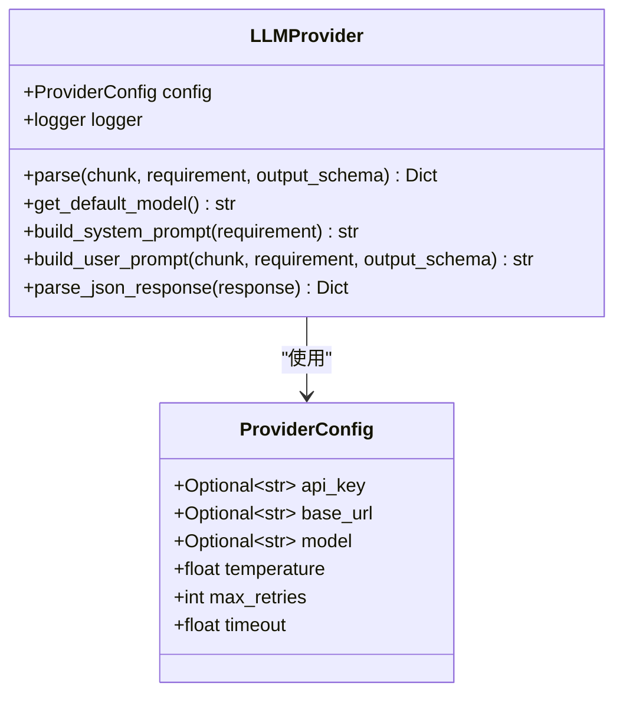
```mermaid
classDiagram
class LLMProvider {
+ProviderConfig config
+logger logger
+parse(chunk, requirement, output_schema) Dict
+get_default_model() str
+build_system_prompt(requirement) str
+build_user_prompt(chunk, requirement, output_schema) str
+parse_json_response(response) Dict
}
class ProviderConfig {
+Optional~str~ api_key
+Optional~str~ base_url
+Optional~str~ model
+float temperature
+int max_retries
+float timeout
}
LLMProvider --> ProviderConfig : "使用"
```

**图表来源**
- [base.py](file://api-doc-parser/src/api_doc_parser/providers/base.py#L16-L57)

#### JSON响应解析策略
提供商基类实现了robust的JSON响应解析：

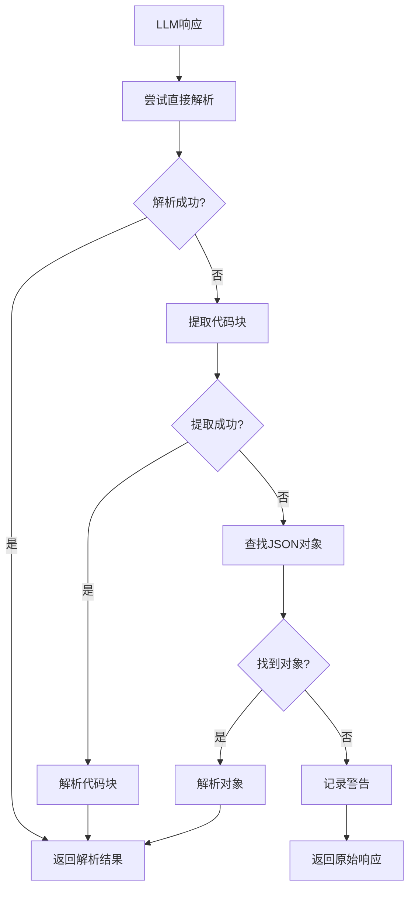
```mermaid
flowchart TD
Response[LLM响应] --> TryDirect[尝试直接解析]
TryDirect --> DirectOK{解析成功?}
DirectOK --> |是| Success[返回解析结果]
DirectOK --> |否| TryCodeBlock[提取代码块]
TryCodeBlock --> CodeBlockOK{提取成功?}
CodeBlockOK --> |是| ParseCodeBlock[解析代码块]
CodeBlockOK --> |否| TryObject[查找JSON对象]
TryObject --> ObjectOK{找到对象?}
ObjectOK --> |是| ParseObject[解析对象]
ObjectOK --> |否| Warning[记录警告]
ParseCodeBlock --> Success
ParseObject --> Success
Warning --> RawResponse[返回原始响应]
```

**图表来源**
- [base.py](file://api-doc-parser/src/api_doc_parser/providers/base.py#L112-L142)

**章节来源**
- [base.py](file://api-doc-parser/src/api_doc_parser/providers/base.py#L16-L142)

### 解析器错误处理
解析器负责协调整个解析流程的错误处理：

#### 并发解析错误处理
解析器使用信号量控制并发，并处理每个chunk的错误：

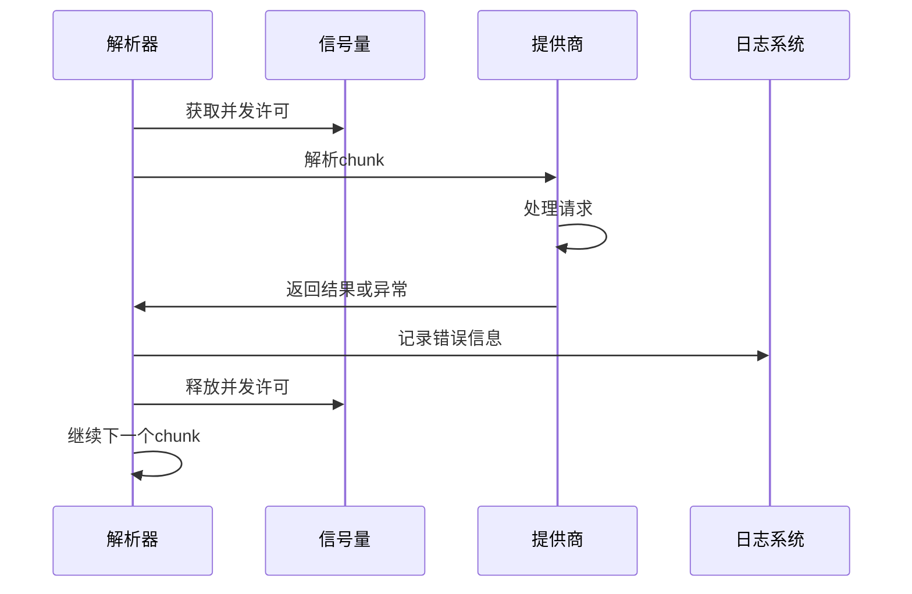
```mermaid
sequenceDiagram
participant Parser as 解析器
participant Semaphore as 信号量
participant Provider as 提供商
participant Logger as 日志系统
Parser->>Semaphore : 获取并发许可
Parser->>Provider : 解析chunk
Provider->>Provider : 处理请求
Provider->>Parser : 返回结果或异常
Parser->>Logger : 记录错误信息
Parser->>Semaphore : 释放并发许可
Parser->>Parser : 继续下一个chunk
```

**图表来源**
- [parser.py](file://api-doc-parser/src/api_doc_parser/core/parser.py#L130-L169)

#### 缓存错误处理
解析器实现了简单的内存缓存机制：

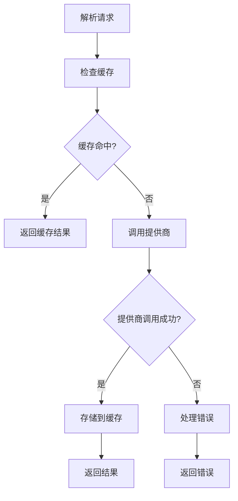
```mermaid
flowchart TD
Request[解析请求] --> CheckCache[检查缓存]
CheckCache --> CacheHit{缓存命中?}
CacheHit --> |是| ReturnCache[返回缓存结果]
CacheHit --> |否| CallProvider[调用提供商]
CallProvider --> ProviderOK{提供商调用成功?}
ProviderOK --> |是| StoreCache[存储到缓存]
ProviderOK --> |否| HandleError[处理错误]
StoreCache --> ReturnResult[返回结果]
HandleError --> ReturnError[返回错误]
```

**图表来源**
- [parser.py](file://api-doc-parser/src/api_doc_parser/core/parser.py#L178-L200)

**章节来源**
- [parser.py](file://api-doc-parser/src/api_doc_parser/core/parser.py#L130-L200)

### 提供商特定错误处理

#### OpenAI提供商错误处理
OpenAI提供商实现了完整的错误处理机制：

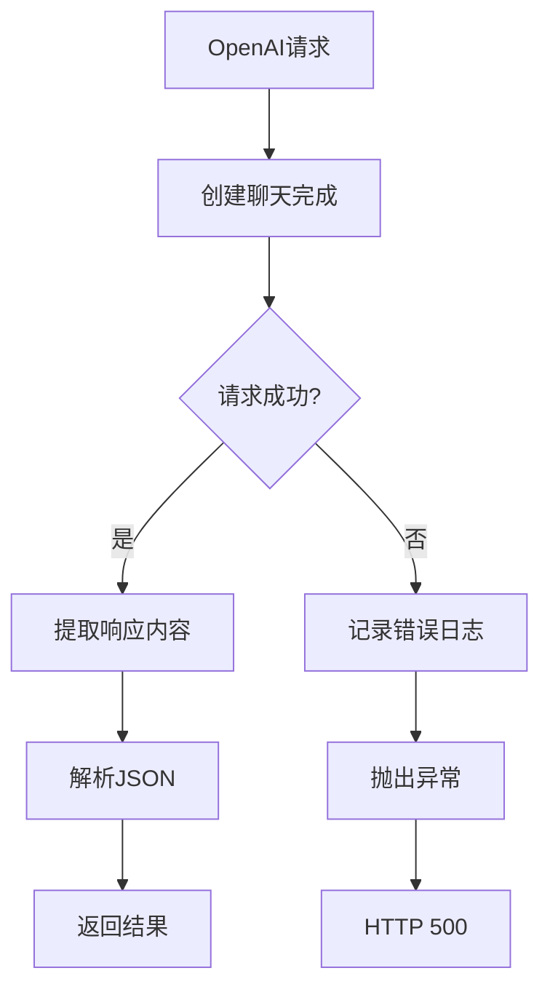
```mermaid
flowchart TD
OpenAIRequest[OpenAI请求] --> CreateChat[创建聊天完成]
CreateChat --> ChatOK{请求成功?}
ChatOK --> |是| ExtractContent[提取响应内容]
ChatOK --> |否| LogError[记录错误日志]
ExtractContent --> ParseJSON[解析JSON]
ParseJSON --> Success[返回结果]
LogError --> RaiseError[抛出异常]
RaiseError --> HTTP500[HTTP 500]
```

**图表来源**
- [openai_provider.py](file://api-doc-parser/src/api_doc_parser/providers/openai_provider.py#L53-L81)

#### Azure OpenAI错误处理
Azure OpenAI提供商具有特定的配置要求：

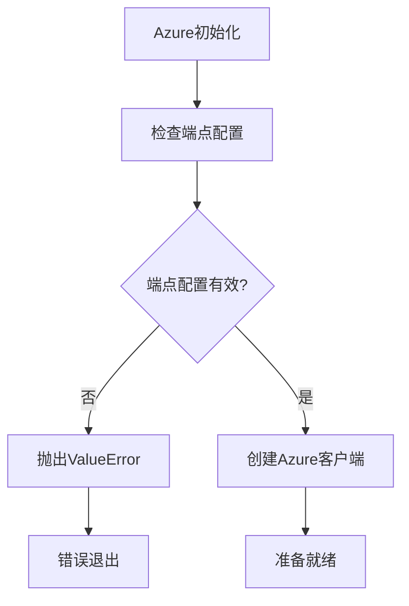
```mermaid
flowchart TD
AzureInit[Azure初始化] --> CheckEndpoint[检查端点配置]
CheckEndpoint --> EndpointOK{端点配置有效?}
EndpointOK --> |否| ValueError[抛出ValueError]
EndpointOK --> |是| CreateClient[创建Azure客户端]
CreateClient --> Ready[准备就绪]
ValueError --> ErrorExit[错误退出]
```

**图表来源**
- [azure_provider.py](file://api-doc-parser/src/api_doc_parser/providers/azure_provider.py#L29-L37)

#### 自定义OpenAI协议错误处理
自定义OpenAI协议提供商处理HTTP错误：

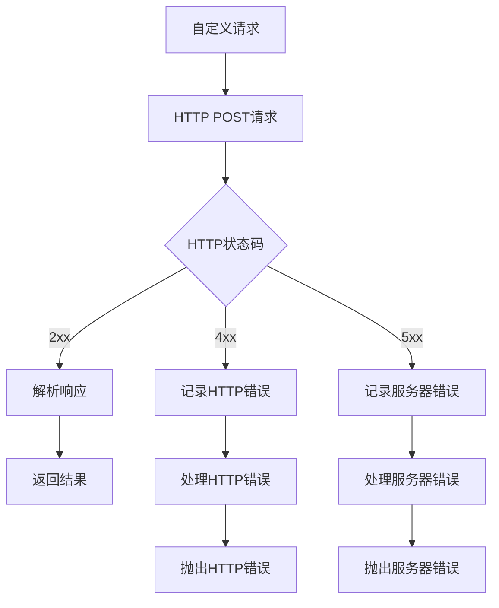
```mermaid
flowchart TD
CustomRequest[自定义请求] --> HTTPPost[HTTP POST请求]
HTTPPost --> HTTPStatus{HTTP状态码}
HTTPStatus --> |2xx| ParseResponse[解析响应]
HTTPStatus --> |4xx| LogHTTPError[记录HTTP错误]
HTTPStatus --> |5xx| LogServerError[记录服务器错误]
ParseResponse --> Success[返回结果]
LogHTTPError --> HandleHTTPError[处理HTTP错误]
LogServerError --> HandleServerError[处理服务器错误]
HandleHTTPError --> RaiseHTTPError[抛出HTTP错误]
HandleServerError --> RaiseServerError[抛出服务器错误]
```

**图表来源**
- [custom_openai_provider.py](file://api-doc-parser/src/api_doc_parser/providers/custom_openai_provider.py#L87-L102)

**章节来源**
- [openai_provider.py](file://api-doc-parser/src/api_doc_parser/providers/openai_provider.py#L53-L81)
- [azure_provider.py](file://api-doc-parser/src/api_doc_parser/providers/azure_provider.py#L29-L37)
- [custom_openai_provider.py](file://api-doc-parser/src/api_doc_parser/providers/custom_openai_provider.py#L87-L102)

## 依赖关系分析

### 错误处理依赖图
系统各组件之间的错误处理依赖关系：

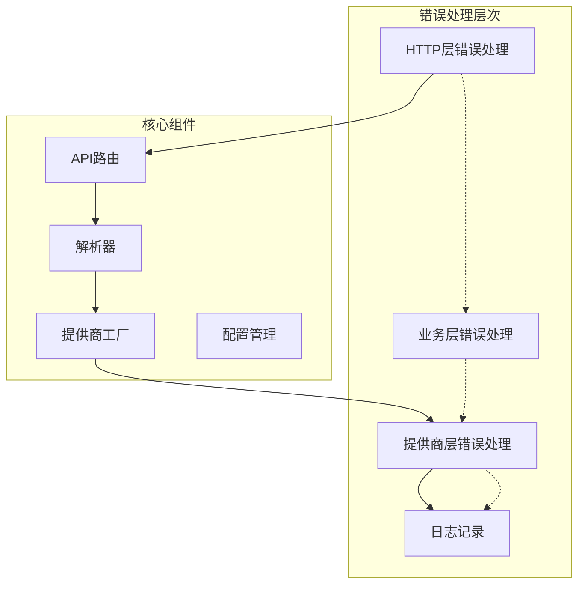
```mermaid
graph TB
subgraph "错误处理层次"
HTTP[HTTP层错误处理]
Business[业务层错误处理]
Provider[提供商层错误处理]
Logging[日志记录]
end
subgraph "核心组件"
API[API路由]
Parser[解析器]
Factory[提供商工厂]
Config[配置管理]
end
HTTP --> API
API --> Parser
Parser --> Factory
Factory --> Provider
Provider --> Logging
HTTP -.-> Business
Business -.-> Provider
Provider -.-> Logging
```

**图表来源**
- [api.py](file://api-doc-parser/src/api_doc_parser/api.py#L76-L155)
- [parser.py](file://api-doc-parser/src/api_doc_parser/core/parser.py#L130-L169)
- [factory.py](file://api-doc-parser/src/api_doc_parser/providers/factory.py#L14-L70)

### 错误传播路径
错误在系统中的传播路径：

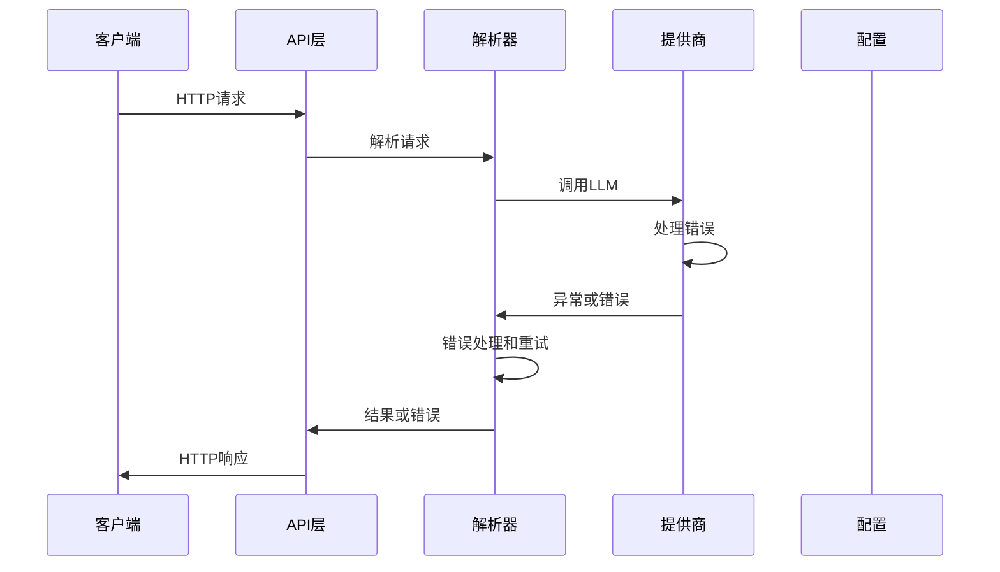
```mermaid
sequenceDiagram
participant Client as 客户端
participant API as API层
participant Parser as 解析器
participant Provider as 提供商
participant Config as 配置
Client->>API : HTTP请求
API->>Parser : 解析请求
Parser->>Provider : 调用LLM
Provider->>Provider : 处理错误
Provider->>Parser : 异常或错误
Parser->>Parser : 错误处理和重试
Parser->>API : 结果或错误
API->>Client : HTTP响应
```

**图表来源**
- [api.py](file://api-doc-parser/src/api_doc_parser/api.py#L302-L353)
- [parser.py](file://api-doc-parser/src/api_doc_parser/core/parser.py#L185-L200)

**章节来源**
- [api.py](file://api-doc-parser/src/api_doc_parser/api.py#L302-L353)
- [parser.py](file://api-doc-parser/src/api_doc_parser/core/parser.py#L185-L200)

## 性能考虑
系统在错误处理方面采用了多项性能优化措施：

### 并发控制
- 使用信号量限制并发请求数量（默认5个）
- 异常处理不影响其他并发任务
- 缓存机制减少重复计算

### 错误恢复策略
- 提供商级别重试机制
- 任务级别的错误隔离
- 进度跟踪避免完全重新开始

## 故障排除指南

### 常见错误场景诊断

#### 文件格式不支持
**症状**: HTTP 400错误，提示不支持的文件类型
**诊断步骤**:
1. 检查文件扩展名
2. 验证文件格式有效性
3. 确认文件未损坏

**解决方案**:
- 使用支持的文件格式（PDF、DOCX、XLSX、TXT、MD）
- 重新生成或转换文件格式

#### 文件过大
**症状**: HTTP 400错误，提示文件超过大小限制
**诊断步骤**:
1. 检查当前文件大小
2. 对比配置中的最大文件大小限制

**解决方案**:
- 减少文件大小或拆分文件
- 调整配置中的文件大小限制

#### JSON格式错误
**症状**: HTTP 400错误，提示output_schema不是有效JSON
**诊断步骤**:
1. 验证JSON语法
2. 检查JSON结构完整性

**解决方案**:
- 使用JSON验证工具检查格式
- 确保JSON字符串转义正确

#### LLM提供商错误
**症状**: HTTP 500错误，提供商调用失败
**诊断步骤**:
1. 检查API密钥配置
2. 验证网络连接
3. 确认提供商服务可用性

**解决方案**:
- 验证API密钥有效性
- 检查网络连接和防火墙设置
- 联系提供商技术支持

### 重试策略

#### 客户端重试最佳实践
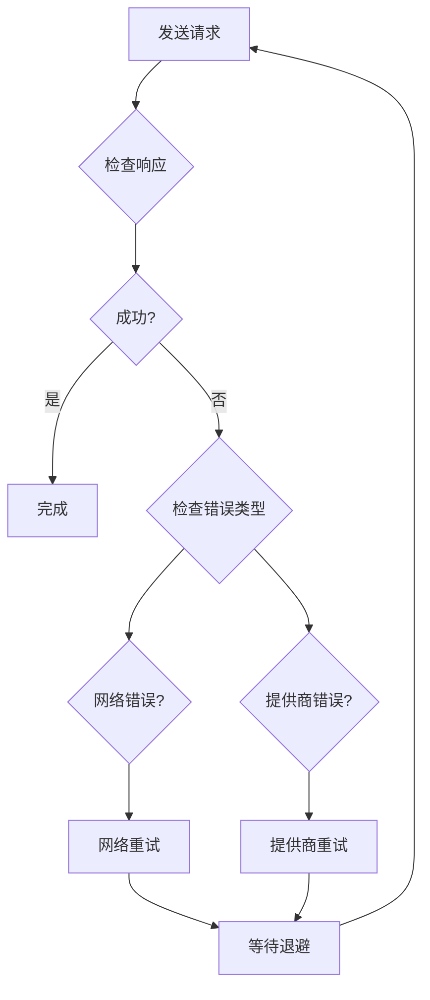
```mermaid
flowchart TD
Request[发送请求] --> CheckResponse{检查响应}
CheckResponse --> Success{成功?}
Success --> |是| Complete[完成]
Success --> |否| CheckError{检查错误类型}
CheckError --> NetworkError{网络错误?}
CheckError --> ProviderError{提供商错误?}
NetworkError --> RetryNetwork[网络重试]
ProviderError --> RetryProvider[提供商重试]
RetryNetwork --> Wait[等待退避]
RetryProvider --> Wait
Wait --> Request
```

#### 重试配置建议
- **指数退避**: 1秒、2秒、4秒、8秒...
- **最大重试次数**: 3次
- **超时设置**: 60秒
- **并发限制**: 5个并发请求

### 监控和日志
系统提供了全面的日志记录机制：

#### 关键日志事件
- `document_loaded`: 文档加载成功
- `document_chunked`: 文档分块完成
- `parse_completed`: 解析完成
- `chunk_parse_failed`: 单个chunk解析失败
- `openai_parse_error`: OpenAI调用错误
- `anthropic_parse_error`: Anthropic调用错误

**章节来源**
- [parser.py](file://api-doc-parser/src/api_doc_parser/core/parser.py#L72-L76)
- [parser.py](file://api-doc-parser/src/api_doc_parser/core/parser.py#L159-L160)
- [openai_provider.py](file://api-doc-parser/src/api_doc_parser/providers/openai_provider.py#L75-L81)
- [anthropic_provider.py](file://api-doc-parser/src/api_doc_parser/providers/anthropic_provider.py#L75-L81)

## 结论
本系统的错误处理机制设计完善，涵盖了从HTTP层到业务层再到提供商层的全栈错误处理。系统通过标准化的HTTP状态码、统一的错误消息格式、分层的错误处理架构以及详细的日志记录，为用户提供了可靠的错误诊断和问题解决能力。

主要特点包括：
- **标准化错误处理**: 遵循RESTful API标准
- **多层次错误处理**: 从API到提供商的完整覆盖
- **详细的日志记录**: 便于问题诊断和追踪
- **健壮的重试机制**: 提高系统可靠性
- **灵活的配置选项**: 支持不同环境的需求

建议在生产环境中结合实际使用情况进行适当的配置调整和监控设置。