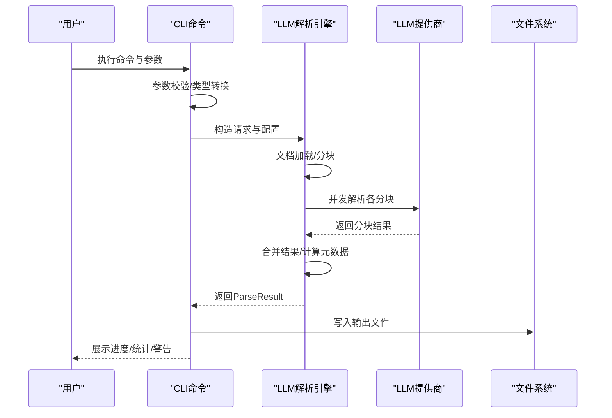
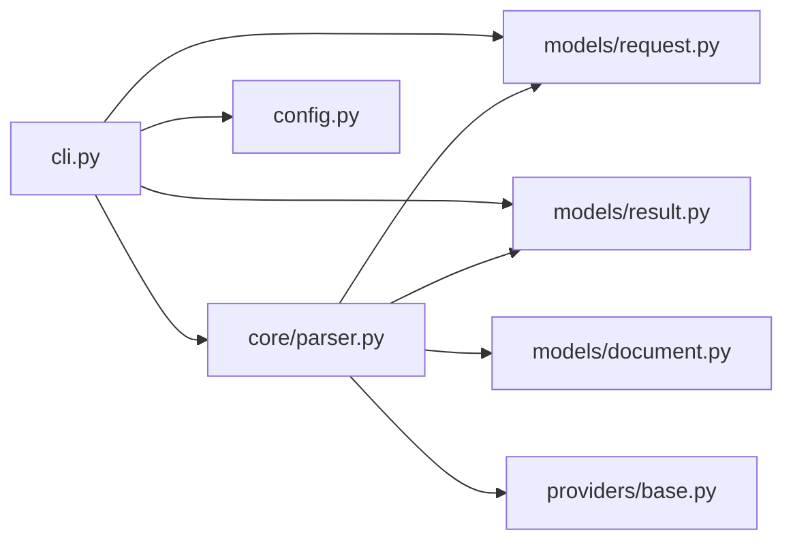

# 命令行界面

<cite>
**本文引用的文件**
- [cli.py](file://src/cli.py)
- [pyproject.toml](file://pyproject.toml)
- [README.md](file://README.md)
- [.env.example](file://.env.example)
- [config.py](file://src/config.py)
- [request.py](file://src/models/request.py)
- [result.py](file://src/models/result.py)
- [document.py](file://src/models/document.py)
- [parser.py](file://src/core/parser.py)
- [base.py](file://src/providers/base.py)
</cite>

## 更新摘要
**变更内容**
- 完整实现了CLI命令行工具的所有功能
- 新增了详细的命令参考手册和使用示例
- 更新了架构图和依赖关系分析
- 增强了错误处理策略和调试技巧
- 添加了性能考量和故障排查指南

## 目录
1. [简介](#简介)
2. [项目结构](#项目结构)
3. [核心组件](#核心组件)
4. [架构总览](#架构总览)
5. [详细组件分析](#详细组件分析)
6. [依赖关系分析](#依赖关系分析)
7. [性能考量](#性能考量)
8. [故障排查指南](#故障排查指南)
9. [结论](#结论)
10. [附录](#附录)

## 简介
本文档为命令行界面（CLI）的完整API文档，涵盖所有可用命令、参数与选项，提供参数详解、使用示例与最佳实践。同时对比CLI与Web服务的差异与适用场景，给出错误处理策略、调试技巧、常见使用模式与高级配置选项，兼顾初学者与有经验用户的阅读体验。

## 项目结构
CLI入口位于模块的命令行文件中，通过Typer定义命令与参数；核心解析逻辑由LLM解析引擎与提供商抽象层协作完成；数据模型定义了输入、输出与中间结构；配置模块负责环境变量与默认值。

```mermaid
graph TB
subgraph "CLI"
CLI["cli.py<br/>命令定义与参数解析"]
end
subgraph "核心"
PARSER["core/parser.py<br/>LLM解析引擎"]
REQ["models/request.py<br/>请求/配置/来源模型"]
RES["models/result.py<br/>结果/元数据模型"]
DOC["models/document.py<br/>文档/分块模型"]
end
subgraph "提供商"
BASE["providers/base.py<br/>提供商抽象"]
end
subgraph "配置"
CFG["config.py<br/>设置/默认值"]
end
CLI --> PARSER
PARSER --> REQ
PARSER --> RES
PARSER --> DOC
PARSER --> BASE
CLI --> REQ
CLI --> RES
CLI --> CFG
```

**图表来源**
- [cli.py](file://src/cli.py#L1-L393)
- [parser.py](file://src/core/parser.py#L1-L304)
- [request.py](file://src/models/request.py#L1-L57)
- [result.py](file://src/models/result.py#L1-L55)
- [document.py](file://src/models/document.py#L1-L75)
- [base.py](file://src/providers/base.py#L1-L143)
- [config.py](file://src/config.py#L1-L57)

**章节来源**
- [cli.py](file://src/cli.py#L1-L393)
- [pyproject.toml](file://pyproject.toml#L72-L73)

## 核心组件
- 命令行入口与命令
  - 主命令：api-doc-parser（无参时显示帮助）
  - 子命令：
    - parse：解析API文档
    - providers：列出支持的LLM提供商
    - example-requirement：生成示例要求说明文件
- 参数与选项
  - parse命令的关键参数与选项详见"详细组件分析"的"parse命令"部分
- 输出与展示
  - 进度条、表格、面板等富文本输出，便于用户理解解析过程与结果统计

**章节来源**
- [cli.py](file://src/cli.py#L25-L124)
- [README.md](file://README.md#L66-L91)

## 架构总览
CLI命令调用解析流程如下：命令行参数解析后，构造请求与配置对象，交由LLM解析引擎进行文档加载、分块、并发解析、结果合并与持久化，并以富文本形式输出进度与统计信息。



**图表来源**
- [cli.py](file://src/cli.py#L112-L231)
- [parser.py](file://src/core/parser.py#L46-L128)
- [base.py](file://src/providers/base.py#L34-L57)

## 详细组件分析

### 命令参考手册

- 命令：api-doc-parser
  - 用途：主入口，显示帮助信息
  - 选项：
    - --version, -v：打印版本并退出
  - 示例：
    - api-doc-parser --version

- 命令：parse
  - 用途：解析API文档，输出结构化JSON结果
  - 位置参数：
    - source：API文档路径（支持PDF/Word/Excel/文本/Markdown），必须存在且为文件
  - 选项：
    - --requirement, -r：解析要求说明文件（JSON），必须存在
    - --output, -o：输出文件路径
    - --provider, -p：LLM提供商（默认openai），可选值见"providers命令"
    - --model, -m：模型名称（可选）
    - --api-base：自定义API基础URL（可选）
    - --api-key：API密钥（可选）
    - --chunk-size：分块大小（token数，默认3000）
    - --temperature, -t：模型温度参数（默认0.1）
    - --previous-result：之前的解析结果（用于增量更新，可选）
    - --verbose, -v：显示详细配置与调试信息
  - 行为：
    - 校验文件类型（仅支持指定扩展名）
    - 加载要求说明JSON
    - 构造ParseRequest与ParseConfig
    - 可选加载previous_result用于增量更新
    - 调用LLM解析引擎执行解析
    - 保存结果为JSON
    - 输出统计信息与警告
  - 示例：
    - 生成示例要求说明：api-doc-parser example-requirement -o requirement.json
    - 解析文档：api-doc-parser parse api_document.pdf --requirement requirement.json --output result.json --provider openai --model gpt-4
    - 自定义API（如vLLM）：api-doc-parser parse api_document.pdf --requirement requirement.json --output result.json --provider custom_openai --api-base http://localhost:8000/v1 --model my-model
  - 最佳实践：
    - 使用--verbose观察配置与进度
    - 对大文档调整--chunk-size与--temperature以平衡质量与速度
    - 使用--previous-result进行增量更新，减少重复工作

- 命令：providers
  - 用途：列出支持的LLM提供商及其特性
  - 输出：表格，包含提供商、说明、是否需要API Key、是否需要API Base

- 命令：example-requirement
  - 用途：生成示例要求说明文件（JSON）
  - 选项：
    - --output, -o：输出文件路径（默认requirement_example.json）

**章节来源**
- [cli.py](file://src/cli.py#L50-L124)
- [cli.py](file://src/cli.py#L299-L323)
- [cli.py](file://src/cli.py#L325-L389)
- [README.md](file://README.md#L66-L91)

### 参数详解与使用示例

- 参数与选项详解
  - source：文档路径，必须存在且为文件；支持类型映射见内部文件类型检测逻辑
  - requirement：要求说明JSON文件，包含content、output_schema、extraction_rules
  - output：输出JSON文件路径
  - provider：提供商枚举，支持openai、azure、anthropic、custom_openai、custom_anthropic、ollama
  - model：模型名称，不同提供商默认模型不同
  - api_base：自定义API基础URL，适用于自定义协议或代理
  - api_key：API密钥，按提供商要求配置
  - chunk_size：分块大小（token数），影响吞吐与成本
  - temperature：模型温度参数，越低越确定，越高越创造性
  - previous_result：增量更新时传入历史结果
  - verbose：开启详细日志与配置展示

- 使用示例
  - 生成示例要求说明文件
    - api-doc-parser example-requirement -o requirement.json
  - 解析文档（OpenAI）
    - api-doc-parser parse api_document.pdf --requirement requirement.json --output result.json --provider openai --model gpt-4
  - 自定义API（如vLLM）
    - api-doc-parser parse api_document.pdf --requirement requirement.json --output result.json --provider custom_openai --api-base http://localhost:8000/v1 --model my-model
  - 查看提供商
    - api-doc-parser providers

- 最佳实践
  - 优先使用--verbose定位问题
  - 对长文档适当增大--chunk-size，但需考虑模型上下文长度
  - 使用--temperature控制稳定性与创造性
  - 使用--previous-result进行增量更新，避免重复解析

**章节来源**
- [cli.py](file://src/cli.py#L50-L124)
- [README.md](file://README.md#L66-L91)

### CLI与Web服务的区别与适用场景

- 区别
  - CLI：面向命令行用户，适合批处理、脚本集成、离线解析
  - Web服务：提供REST API端点，适合在线服务、前端集成、异步任务管理
- 适用场景
  - CLI：批量解析大量文档、CI/CD流水线、本地开发调试
  - Web服务：提供解析能力给其他系统或前端应用，支持任务查询与同步/异步解析

**章节来源**
- [README.md](file://README.md#L93-L112)

### 数据模型与处理逻辑

- 请求与配置模型
  - ParseRequest：包含文档来源、要求说明、配置与增量结果
  - ParseConfig：包含提供商、模型、API配置、分块与温度等
  - DocumentSource：文档来源（路径或二进制内容）
  - RequirementDoc：要求说明（内容、输出Schema、提取规则）
- 结果与元数据
  - ParseResult：包含版本、解析时间、指纹、结构化数据与元数据
  - ParseMetadata：包含分块统计、置信度、警告、处理时间、模型与提供商信息
- 文档与分块
  - Document/DocumentSection/DocumentStructure：文档结构化表示
  - Chunk：分块，包含内容、索引、上下文与章节集合

- 处理流程（简化）
  - 文档加载 → 分块 → 并发解析 → 合并 → 生成结果与元数据 → 保存输出

**章节来源**
- [request.py](file://src/models/request.py#L1-L57)
- [result.py](file://src/models/result.py#L1-L55)
- [document.py](file://src/models/document.py#L1-L75)
- [parser.py](file://src/core/parser.py#L46-L128)

### 错误处理策略与调试技巧

- 常见错误与处理
  - 不支持的文件类型：检查扩展名是否在支持列表内
  - 要求说明文件加载失败：确认JSON格式正确、路径存在
  - 解析失败：查看详细输出与堆栈（--verbose），检查网络与API配置
  - 保存结果失败：确认输出路径可写
- 调试技巧
  - 使用--verbose查看配置表与进度
  - 使用--api-base与--api-key验证自定义API连通性
  - 逐步缩小问题范围：先用小文档验证，再扩大规模
  - 检查提供商与模型配置是否匹配

**章节来源**
- [cli.py](file://src/cli.py#L140-L231)

## 依赖关系分析



**图表来源**
- [cli.py](file://src/cli.py#L16-L23)
- [parser.py](file://src/core/parser.py#L10-L15)
- [request.py](file://src/models/request.py#L1-L57)
- [result.py](file://src/models/result.py#L1-L55)
- [document.py](file://src/models/document.py#L1-L75)
- [base.py](file://src/providers/base.py#L1-L143)
- [config.py](file://src/config.py#L1-L57)

**章节来源**
- [pyproject.toml](file://pyproject.toml#L25-L59)

## 性能考量
- 并发解析：解析引擎限制并发数，避免过度占用资源
- 分块策略：合理设置--chunk-size与重叠，平衡吞吐与上下文完整性
- 缓存：启用缓存可减少重复解析开销（默认启用）
- 温度参数：较低温度提升稳定性，较高温度可能增加不确定性
- 增量更新：使用--previous-result减少重复工作

**章节来源**
- [parser.py](file://src/core/parser.py#L130-L169)
- [request.py](file://src/models/request.py#L31-L49)

## 故障排查指南
- 版本与安装
  - 使用--version确认版本
  - 确认Python版本与依赖满足要求
- 环境变量与配置
  - 按提供商填写API Key与Base URL
  - 使用.env文件或环境变量
- 常见问题
  - "不支持的文件类型"：确认扩展名为pdf/docx/xlsx/txt/md之一
  - "无法加载要求说明文件"：检查JSON语法与路径
  - "解析失败"：开启--verbose查看详细错误与堆栈
  - "保存结果失败"：检查输出目录权限

**章节来源**
- [cli.py](file://src/cli.py#L140-L231)
- [.env.example](file://.env.example#L1-L22)

## 结论
CLI提供了简洁高效的命令行接口，覆盖从文档解析到结果输出的完整流程。通过明确的参数与选项、丰富的示例与最佳实践，既能满足初学者快速上手，也能为高级用户提供足够的灵活性与可控性。结合Web服务，可形成从本地批处理到在线服务的完整能力矩阵。

## 附录

### 常见使用模式
- 批量解析：循环遍历多个文档，统一输出到不同文件
- 增量更新：首次解析后，后续仅对变更部分重新解析
- 自定义API：对接vLLM、TGI等自定义推理服务

### 高级配置选项
- 提供商选择：根据部署环境选择openai、azure、anthropic、custom_*或ollama
- 模型与温度：依据任务稳定性与创造性需求调整
- 分块策略：针对长文档优化--chunk-size与重叠
- 缓存与并发：在资源允许范围内提升吞吐

**章节来源**
- [cli.py](file://src/cli.py#L300-L323)
- [config.py](file://src/config.py#L43-L48)