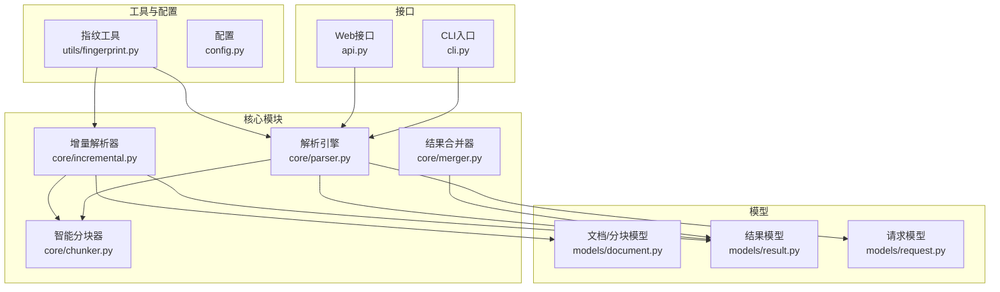
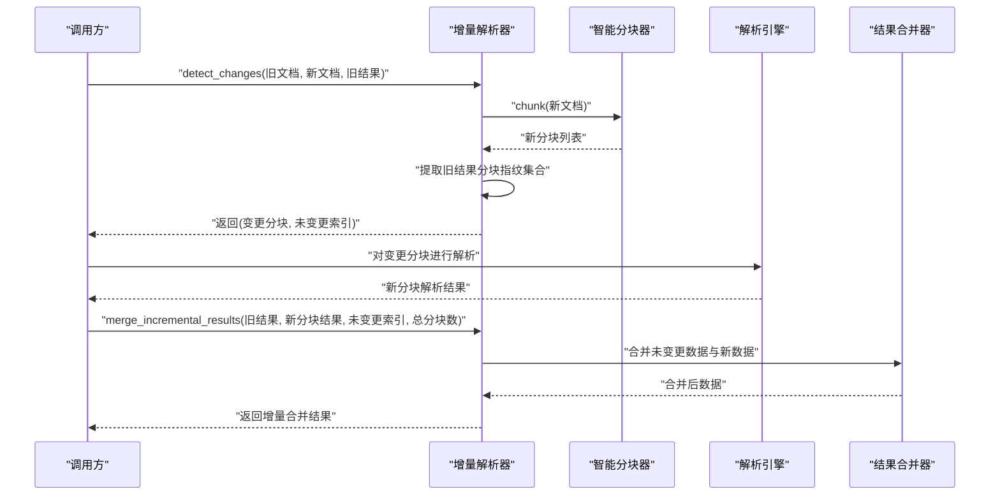
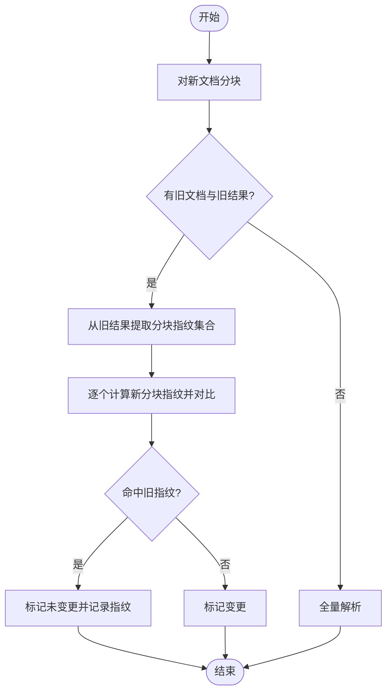
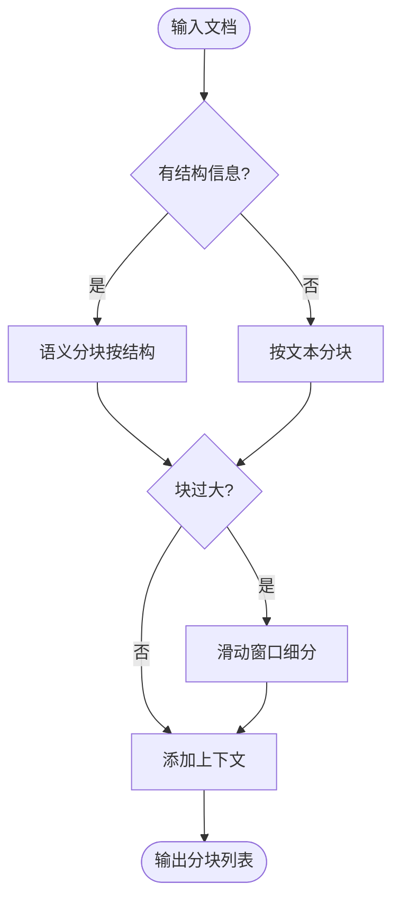
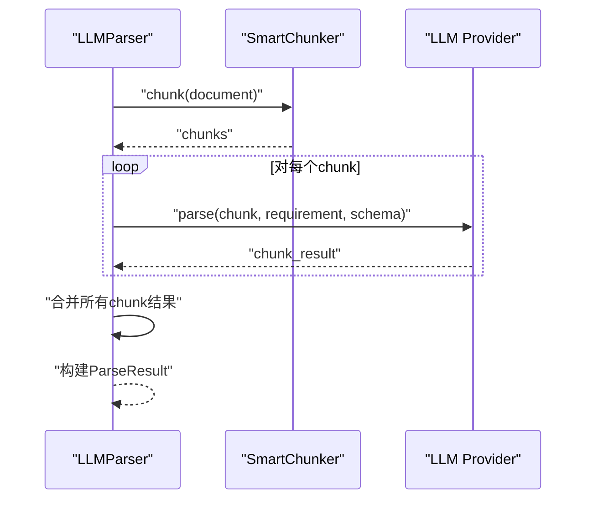
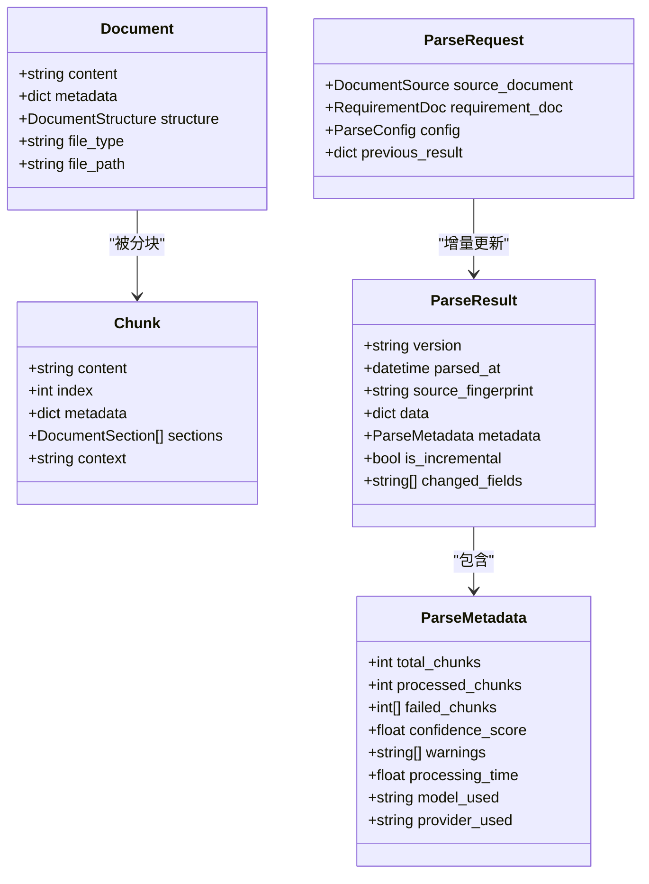
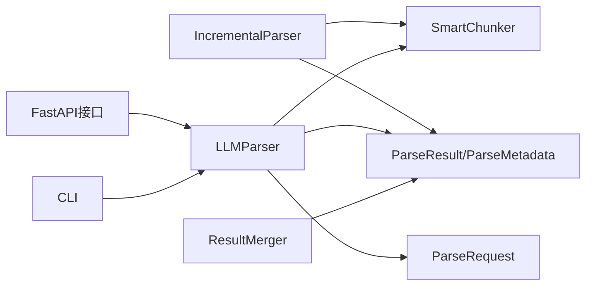

# 增量更新功能

<cite>
**本文引用的文件**
- [incremental.py](file://api-doc-parser/src/api_doc_parser/core/incremental.py)
- [chunker.py](file://api-doc-parser/src/api_doc_parser/core/chunker.py)
- [parser.py](file://api-doc-parser/src/api_doc_parser/core/parser.py)
- [merger.py](file://api-doc-parser/src/api_doc_parser/core/merger.py)
- [document.py](file://api-doc-parser/src/api_doc_parser/models/document.py)
- [result.py](file://api-doc-parser/src/api_doc_parser/models/result.py)
- [request.py](file://api-doc-parser/src/api_doc_parser/models/request.py)
- [fingerprint.py](file://api-doc-parser/src/api_doc_parser/utils/fingerprint.py)
- [config.py](file://api-doc-parser/src/api_doc_parser/config.py)
- [api.py](file://api-doc-parser/src/api_doc_parser/api.py)
- [cli.py](file://api-doc-parser/src/api_doc_parser/cli.py)
- [test_chunker.py](file://api-doc-parser/tests/test_chunker.py)
- [README.md](file://api-doc-parser/README.md)
</cite>

## 目录
1. [简介](#简介)
2. [项目结构](#项目结构)
3. [核心组件](#核心组件)
4. [架构概览](#架构概览)
5. [详细组件分析](#详细组件分析)
6. [依赖关系分析](#依赖关系分析)
7. [性能考量](#性能考量)
8. [故障排查指南](#故障排查指南)
9. [结论](#结论)
10. [附录](#附录)

## 简介
本文件围绕“增量更新”能力进行系统化技术文档编写，聚焦于以下目标：
- 深入解释增量更新的实现细节与调用关系
- 明确接口、领域模型与使用模式
- 给出来自实际代码库的具体示例路径
- 记录配置选项、参数与返回值
- 说明与其他组件的关系
- 处理常见问题及其解决方案
- 重点阐述变更检测算法、性能优化策略与实际应用场景

## 项目结构
本项目采用“核心模块 + 模型 + 工具 + 接口”的分层组织方式。与增量更新直接相关的核心文件包括：
- 增量解析器：core/incremental.py
- 智能分块器：core/chunker.py
- 解析引擎：core/parser.py
- 结果合并器：core/merger.py
- 领域模型：models/document.py、models/result.py、models/request.py
- 指纹工具：utils/fingerprint.py
- 配置：config.py
- Web接口：api.py
- CLI入口：cli.py

**图表来源**
- [incremental.py](file://api-doc-parser/src/api_doc_parser/core/incremental.py#L1-L209)
- [chunker.py](file://api-doc-parser/src/api_doc_parser/core/chunker.py#L1-L377)
- [parser.py](file://api-doc-parser/src/api_doc_parser/core/parser.py#L1-L304)
- [merger.py](file://api-doc-parser/src/api_doc_parser/core/merger.py#L1-L220)
- [document.py](file://api-doc-parser/src/api_doc_parser/models/document.py#L1-L75)
- [result.py](file://api-doc-parser/src/api_doc_parser/models/result.py#L1-L55)
- [request.py](file://api-doc-parser/src/api_doc_parser/models/request.py#L1-L57)
- [fingerprint.py](file://api-doc-parser/src/api_doc_parser/utils/fingerprint.py#L1-L80)
- [config.py](file://api-doc-parser/src/api_doc_parser/config.py#L1-L57)
- [api.py](file://api-doc-parser/src/api_doc_parser/api.py#L1-L371)
- [cli.py](file://api-doc-parser/src/api_doc_parser/cli.py#L170-L210)

**章节来源**
- [README.md](file://api-doc-parser/README.md#L1-L176)

## 核心组件
- 增量解析器（IncrementalParser）
  - 职责：检测文档变更、合并增量结果、判断是否全量重解析
  - 关键方法：detect_changes、merge_incremental_results、should_full_reparse、compute_document_fingerprint、compute_chunk_fingerprint
- 智能分块器（SmartChunker）
  - 职责：基于结构与长度的智能分块，支持滑动窗口与上下文增强
  - 关键方法：chunk、_semantic_chunk、_sliding_window_split、_add_context
- 解析引擎（LLMParser）
  - 职责：加载文档、分块、并发调用LLM、合并结果
  - 关键方法：parse、_parse_chunks、_merge_chunk_results
- 结果合并器（ResultMerger）
  - 职责：合并多个ParseResult，去重与智能合并
  - 关键方法：merge、_merge_data、_smart_merge_lists
- 领域模型
  - Document/Chunk：文档与分块结构
  - ParseResult/ParseMetadata：解析结果与元数据
  - ParseRequest：解析请求（含previous_result）
- 指纹工具（fingerprint.py）
  - 职责：内容指纹计算与比较
- 配置（config.py）
  - 职责：全局配置（默认分块大小、重叠、温度等）

**章节来源**
- [incremental.py](file://api-doc-parser/src/api_doc_parser/core/incremental.py#L14-L209)
- [chunker.py](file://api-doc-parser/src/api_doc_parser/core/chunker.py#L10-L377)
- [parser.py](file://api-doc-parser/src/api_doc_parser/core/parser.py#L20-L304)
- [merger.py](file://api-doc-parser/src/api_doc_parser/core/merger.py#L11-L220)
- [document.py](file://api-doc-parser/src/api_doc_parser/models/document.py#L42-L75)
- [result.py](file://api-doc-parser/src/api_doc_parser/models/result.py#L8-L55)
- [request.py](file://api-doc-parser/src/api_doc_parser/models/request.py#L51-L57)
- [fingerprint.py](file://api-doc-parser/src/api_doc_parser/utils/fingerprint.py#L9-L80)
- [config.py](file://api-doc-parser/src/api_doc_parser/config.py#L7-L57)

## 架构概览
增量更新的整体流程如下：
- 输入：旧文档、新文档、旧解析结果（可选）
- 步骤：
  1) 新文档分块（SmartChunker）
  2) 从旧结果提取历史分块指纹集合
  3) 对比新分块指纹，区分变更与未变更分块
  4) 对变更分块进行LLM解析
  5) 合并旧结果中未变更部分与新解析部分
  6) 更新元数据（处理计数、置信度、警告、失败块等）

**图表来源**
- [incremental.py](file://api-doc-parser/src/api_doc_parser/core/incremental.py#L29-L151)
- [chunker.py](file://api-doc-parser/src/api_doc_parser/core/chunker.py#L28-L62)
- [parser.py](file://api-doc-parser/src/api_doc_parser/core/parser.py#L130-L169)
- [merger.py](file://api-doc-parser/src/api_doc_parser/core/merger.py#L17-L79)

## 详细组件分析

### 增量解析器（IncrementalParser）
- 变更检测算法
  - 对新文档进行分块
  - 若无旧文档或旧结果，则全量解析
  - 从旧结果中提取历史分块指纹集合（优先从元数据，其次从data）
  - 对新分块逐个计算指纹，若命中旧指纹则标记为未变更，否则标记为变更
- 合并策略
  - 保留旧结果中未变更部分的数据
  - 用新解析结果覆盖变更部分
  - 合并元数据：警告、失败块去重，处理计数累加，置信度按总处理数/总分块数计算
- 全量重解析判定
  - 基于文档指纹对比与内容长度差异比例（默认阈值0.5），超过阈值触发全量重解析

**图表来源**
- [incremental.py](file://api-doc-parser/src/api_doc_parser/core/incremental.py#L29-L88)

**章节来源**
- [incremental.py](file://api-doc-parser/src/api_doc_parser/core/incremental.py#L14-L209)

### 智能分块器（SmartChunker）
- 设计要点
  - 优先按文档结构（标题、章节、API端点）进行语义分块
  - 对超长块使用滑动窗口细分，并保留重叠以避免信息截断
  - 为每个块添加上下文摘要（全局信息 + 相邻块摘要）
- 与增量更新的关系
  - 增量解析依赖其稳定的分块行为，确保指纹一致性
  - 重叠策略有助于在局部修改时减少误判

**图表来源**
- [chunker.py](file://api-doc-parser/src/api_doc_parser/core/chunker.py#L28-L62)
- [chunker.py](file://api-doc-parser/src/api_doc_parser/core/chunker.py#L166-L201)
- [chunker.py](file://api-doc-parser/src/api_doc_parser/core/chunker.py#L292-L311)

**章节来源**
- [chunker.py](file://api-doc-parser/src/api_doc_parser/core/chunker.py#L10-L377)

### 解析引擎（LLMParser）
- 并发解析与缓存
  - 限制并发数，避免LLM限流
  - 基于内容+要求+模型的缓存键进行结果缓存
- 与增量更新的衔接
  - 仅对“变更分块”发起LLM调用
  - 合并阶段由增量解析器负责

**图表来源**
- [parser.py](file://api-doc-parser/src/api_doc_parser/core/parser.py#L46-L128)
- [parser.py](file://api-doc-parser/src/api_doc_parser/core/parser.py#L130-L169)

**章节来源**
- [parser.py](file://api-doc-parser/src/api_doc_parser/core/parser.py#L20-L304)

### 结果合并器（ResultMerger）
- 作用
  - 在多分块或多阶段解析后进行统一合并
  - 深度合并字典、智能合并列表、去重处理
- 与增量更新的关系
  - 增量合并时，增量解析器负责保留未变更数据，ResultMerger负责通用合并逻辑

**章节来源**
- [merger.py](file://api-doc-parser/src/api_doc_parser/core/merger.py#L11-L220)

### 领域模型与接口
- 文档/分块模型
  - Document/Chunk：承载内容、元数据、上下文
- 结果模型
  - ParseResult：包含数据、元数据、增量标志与变更字段
  - ParseMetadata：统计信息（总分块、已处理、失败、置信度、警告、耗时、模型/提供商）
- 请求模型
  - ParseRequest：包含previous_result（用于增量更新）

**图表来源**
- [document.py](file://api-doc-parser/src/api_doc_parser/models/document.py#L42-L75)
- [result.py](file://api-doc-parser/src/api_doc_parser/models/result.py#L8-L55)
- [request.py](file://api-doc-parser/src/api_doc_parser/models/request.py#L51-L57)

**章节来源**
- [document.py](file://api-doc-parser/src/api_doc_parser/models/document.py#L1-L75)
- [result.py](file://api-doc-parser/src/api_doc_parser/models/result.py#L1-L55)
- [request.py](file://api-doc-parser/src/api_doc_parser/models/request.py#L1-L57)

### 指纹工具与配置
- 指纹工具
  - 支持多种算法（sha256/md5/sha1），默认使用sha256并截取前16位
  - 提供分块指纹与文件指纹计算
- 配置
  - 默认分块大小、重叠、温度、最大重试等
  - 影响分块稳定性与增量指纹一致性

**章节来源**
- [fingerprint.py](file://api-doc-parser/src/api_doc_parser/utils/fingerprint.py#L9-L80)
- [config.py](file://api-doc-parser/src/api_doc_parser/config.py#L43-L48)

### 使用模式与示例路径
- CLI增量更新
  - 从上一次解析结果文件加载previous_result，构造ParseRequest并执行解析
  - 示例路径：[cli.py](file://api-doc-parser/src/api_doc_parser/cli.py#L170-L210)
- Web服务同步解析
  - 通过POST /parse/sync传入requirement_doc与可选previous_result
  - 示例路径：[api.py](file://api-doc-parser/src/api_doc_parser/api.py#L177-L255)
- 异步任务解析
  - 通过POST /parse创建任务，后台任务中构建ParseRequest并执行解析
  - 示例路径：[api.py](file://api-doc-parser/src/api_doc_parser/api.py#L302-L352)

**章节来源**
- [cli.py](file://api-doc-parser/src/api_doc_parser/cli.py#L170-L210)
- [api.py](file://api-doc-parser/src/api_doc_parser/api.py#L177-L255)
- [api.py](file://api-doc-parser/src/api_doc_parser/api.py#L302-L352)

## 依赖关系分析
- 组件耦合
  - IncrementalParser依赖SmartChunker与ParseResult/ParseMetadata
  - LLMParser依赖SmartChunker与LLM Provider，输出ParseResult
  - ResultMerger独立于增量流程，用于通用合并
- 外部依赖
  - LLM提供商工厂（factory）与具体实现（openai/azure/anthropic/ollama/custom_*）
  - FastAPI与Pydantic用于接口与模型校验

**图表来源**
- [incremental.py](file://api-doc-parser/src/api_doc_parser/core/incremental.py#L7-L9)
- [parser.py](file://api-doc-parser/src/api_doc_parser/core/parser.py#L10-L16)
- [api.py](file://api-doc-parser/src/api_doc_parser/api.py#L13-L21)
- [cli.py](file://api-doc-parser/src/api_doc_parser/cli.py#L1-L210)

**章节来源**
- [incremental.py](file://api-doc-parser/src/api_doc_parser/core/incremental.py#L1-L209)
- [parser.py](file://api-doc-parser/src/api_doc_parser/core/parser.py#L1-L304)
- [api.py](file://api-doc-parser/src/api_doc_parser/api.py#L1-L371)
- [cli.py](file://api-doc-parser/src/api_doc_parser/cli.py#L1-L210)

## 性能考量
- 变更检测复杂度
  - 新分块指纹计算：O(n)，n为新分块数
  - 旧指纹集合查找：平均O(1)，整体O(n)
- 并发与缓存
  - LLMParser限制并发，避免超卖
  - 缓存键包含内容+要求+模型，命中率高时显著降低重复调用
- 分块策略
  - 滑动窗口与重叠减少误判，但增加分块数量；需权衡指纹稳定性与解析成本
- 全量重解析阈值
  - 当变更比例超过阈值（默认0.5）时选择全量重解析，避免碎片化增量导致的错误累积

**章节来源**
- [parser.py](file://api-doc-parser/src/api_doc_parser/core/parser.py#L130-L169)
- [parser.py](file://api-doc-parser/src/api_doc_parser/core/parser.py#L296-L304)
- [incremental.py](file://api-doc-parser/src/api_doc_parser/core/incremental.py#L177-L209)
- [chunker.py](file://api-doc-parser/src/api_doc_parser/core/chunker.py#L166-L201)

## 故障排查指南
- 增量结果为空或不完整
  - 检查旧结果是否包含分块指纹（metadata.chunk_fingerprints或data["_chunk_fingerprints"]）
  - 确认新旧文档分块策略一致（相同配置）
  - 参考路径：[incremental.py](file://api-doc-parser/src/api_doc_parser/core/incremental.py#L76-L88)
- 变更检测误判
  - 调整分块大小与重叠，确保关键信息不被截断
  - 参考路径：[chunker.py](file://api-doc-parser/src/api_doc_parser/core/chunker.py#L13-L27)
- LLM调用失败
  - 查看ParseMetadata中的failed_chunks与warnings
  - 检查网络、API Key、模型可用性
  - 参考路径：[parser.py](file://api-doc-parser/src/api_doc_parser/core/parser.py#L99-L113)
- Web/CLI接口异常
  - 检查文件类型检测与大小限制
  - 参考路径：[api.py](file://api-doc-parser/src/api_doc_parser/api.py#L94-L113)、[api.py](file://api-doc-parser/src/api_doc_parser/api.py#L202-L210)

**章节来源**
- [incremental.py](file://api-doc-parser/src/api_doc_parser/core/incremental.py#L76-L88)
- [chunker.py](file://api-doc-parser/src/api_doc_parser/core/chunker.py#L13-L27)
- [parser.py](file://api-doc-parser/src/api_doc_parser/core/parser.py#L99-L113)
- [api.py](file://api-doc-parser/src/api_doc_parser/api.py#L94-L113)
- [api.py](file://api-doc-parser/src/api_doc_parser/api.py#L202-L210)

## 结论
增量更新通过“指纹对比 + 局部重解析 + 合并策略”实现了在文档局部变更场景下的高效处理。其核心在于：
- 稳定的分块策略（SmartChunker）保障指纹一致性
- 精准的变更检测算法（IncrementalParser）最小化LLM调用
- 完善的合并与元数据更新机制（IncrementalParser + ResultMerger）
- 可配置的全量重解析阈值，平衡准确性与性能

## 附录

### 关键接口与参数说明
- detect_changes
  - 输入：旧文档、新文档、旧解析结果
  - 返回：(变更分块列表, 未变更分块索引列表)
  - 参考路径：[incremental.py](file://api-doc-parser/src/api_doc_parser/core/incremental.py#L29-L74)
- merge_incremental_results
  - 输入：旧结果、新分块结果、未变更索引、总分块数
  - 返回：合并后的ParseResult（is_incremental=True）
  - 参考路径：[incremental.py](file://api-doc-parser/src/api_doc_parser/core/incremental.py#L90-L150)
- should_full_reparse
  - 输入：旧文档、新文档、变更阈值（默认0.5）
  - 返回：是否全量重解析
  - 参考路径：[incremental.py](file://api-doc-parser/src/api_doc_parser/core/incremental.py#L177-L209)
- compute_document_fingerprint/compute_chunk_fingerprint
  - 输入：Document/Chunk
  - 返回：指纹字符串
  - 参考路径：[incremental.py](file://api-doc-parser/src/api_doc_parser/core/incremental.py#L21-L27)
- ParseRequest.previous_result
  - 用于增量更新的前置解析结果
  - 参考路径：[request.py](file://api-doc-parser/src/api_doc_parser/models/request.py#L56-L56)

**章节来源**
- [incremental.py](file://api-doc-parser/src/api_doc_parser/core/incremental.py#L21-L209)
- [request.py](file://api-doc-parser/src/api_doc_parser/models/request.py#L51-L57)