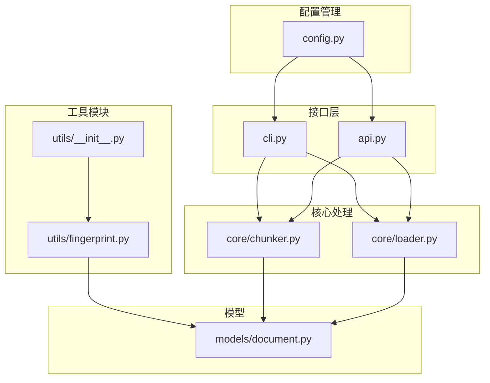
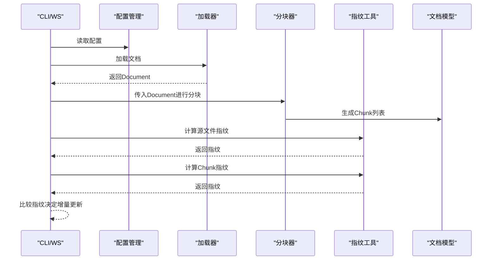
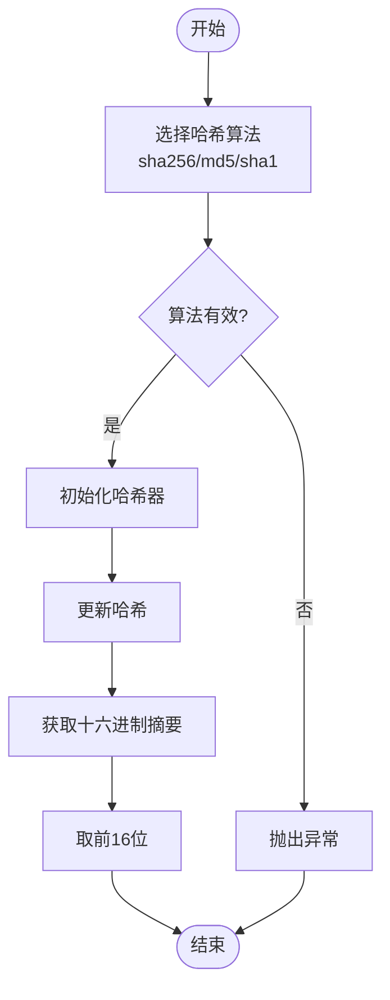
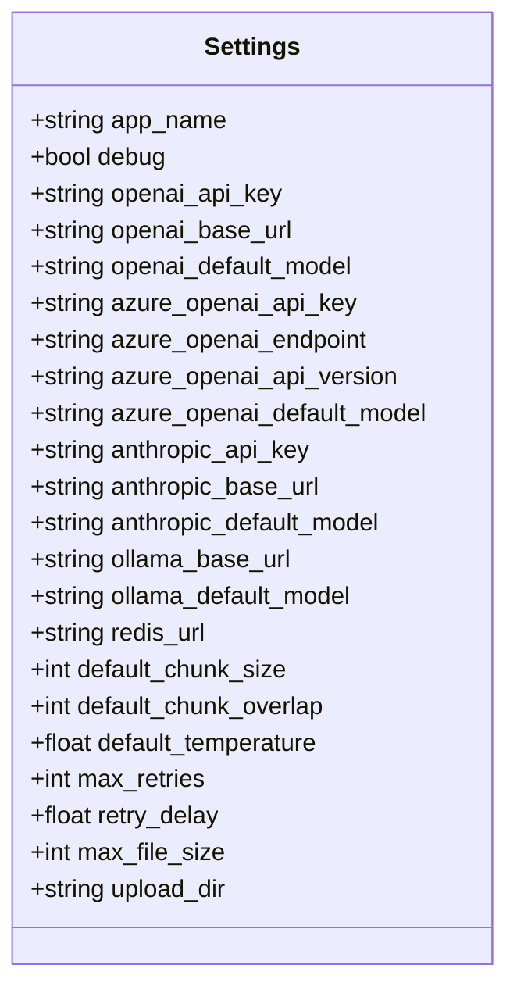
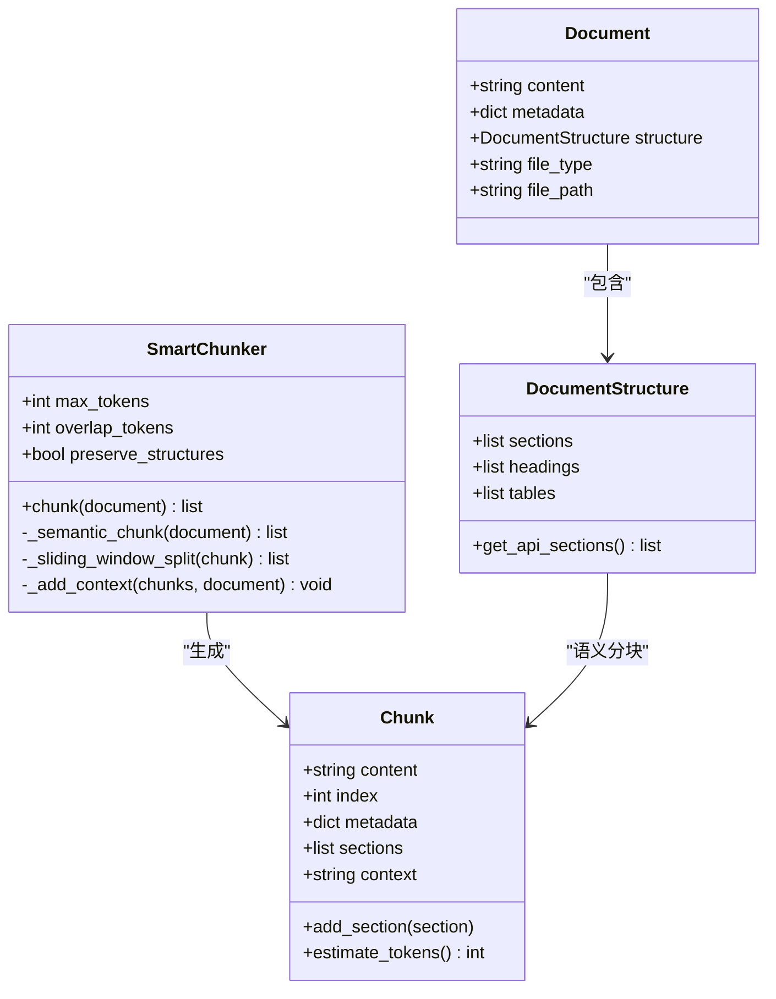
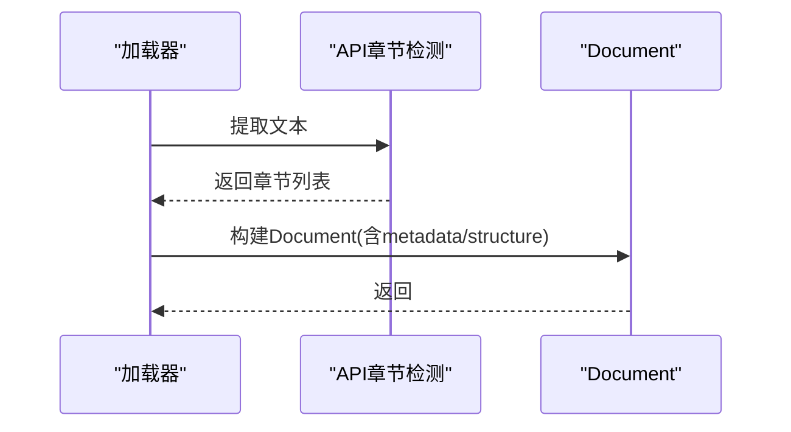
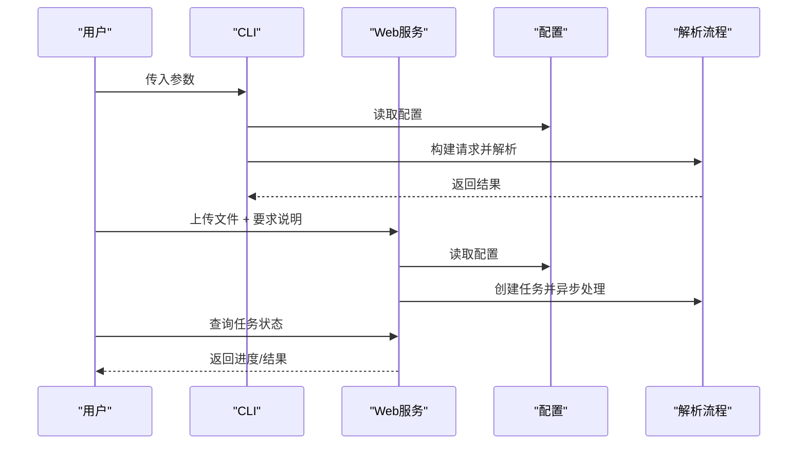
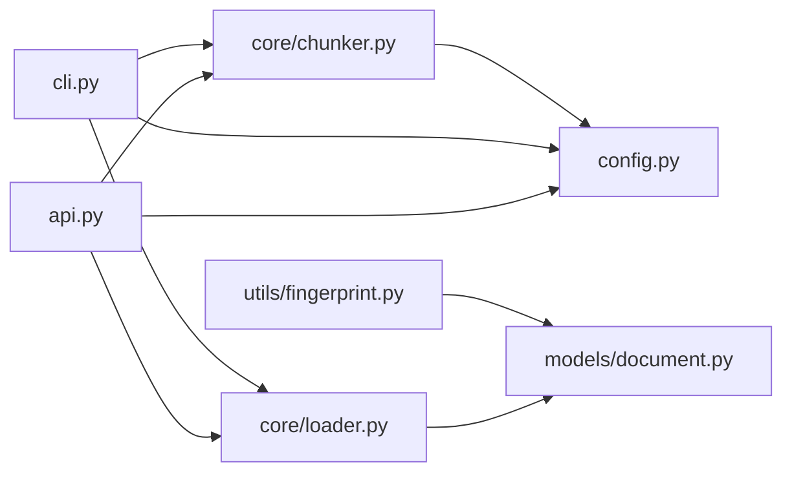

# 工具函数和实用程序

<cite>
**本文引用的文件**
- [fingerprint.py](file://api-doc-parser/src/api_doc_parser/utils/fingerprint.py)
- [__init__.py（工具模块）](file://api-doc-parser/src/api_doc_parser/utils/__init__.py)
- [config.py](file://api-doc-parser/src/api_doc_parser/config.py)
- [document.py](file://api-doc-parser/src/api_doc_parser/models/document.py)
- [chunker.py](file://api-doc-parser/src/api_doc_parser/core/chunker.py)
- [loader.py](file://api-doc-parser/src/api_doc_parser/core/loader.py)
- [cli.py](file://api-doc-parser/src/api_doc_parser/cli.py)
- [api.py](file://api-doc-parser/src/api_doc_parser/api.py)
- [test_chunker.py](file://api-doc-parser/tests/test_chunker.py)
- [test_providers.py](file://api-doc-parser/tests/test_providers.py)
- [README.md](file://api-doc-parser/README.md)
- [pyproject.toml](file://api-doc-parser/pyproject.toml)
</cite>

## 目录
1. [简介](#简介)
2. [项目结构](#项目结构)
3. [核心组件](#核心组件)
4. [架构概览](#架构概览)
5. [详细组件分析](#详细组件分析)
6. [依赖分析](#依赖分析)
7. [性能考虑](#性能考虑)
8. [故障排除指南](#故障排除指南)
9. [结论](#结论)
10. [附录](#附录)

## 简介
本文件聚焦于工具函数与实用程序，涵盖指纹计算工具、配置管理以及与之相关的辅助函数与使用模式。文档面向初学者与有经验的开发者，既提供清晰的使用说明，又给出代码级的结构与流程图解，帮助读者快速理解并正确使用这些工具。

## 项目结构
工具函数与实用程序主要位于 utils 子包，并与配置管理、文档模型、分块器、加载器、CLI 和 Web 服务紧密协作。

图表来源
- [fingerprint.py](file://api-doc-parser/src/api_doc_parser/utils/fingerprint.py#L1-L80)
- [__init__.py（工具模块）](file://api-doc-parser/src/api_doc_parser/utils/__init__.py#L1-L6)
- [config.py](file://api-doc-parser/src/api_doc_parser/config.py#L1-L57)
- [document.py](file://api-doc-parser/src/api_doc_parser/models/document.py#L1-L75)
- [chunker.py](file://api-doc-parser/src/api_doc_parser/core/chunker.py#L1-L377)
- [loader.py](file://api-doc-parser/src/api_doc_parser/core/loader.py#L1-L328)
- [cli.py](file://api-doc-parser/src/api_doc_parser/cli.py#L1-L393)
- [api.py](file://api-doc-parser/src/api_doc_parser/api.py#L1-L371)

章节来源
- [README.md](file://api-doc-parser/README.md#L136-L157)
- [pyproject.toml](file://api-doc-parser/pyproject.toml#L1-L100)

## 核心组件
- 指纹计算工具：提供内容、分块与文件的指纹计算，以及指纹比较功能。
- 配置管理：集中管理应用、LLM 提供商、解析与文件上传等配置。
- 文档模型：定义文档、分块、章节等核心数据结构。
- 分块器：基于结构感知与滑动窗口的智能分块策略。
- 加载器：多格式文档加载与结构检测。
- CLI/Web 接口：对外提供命令行与 Web 服务入口，集成配置与工具。

章节来源
- [fingerprint.py](file://api-doc-parser/src/api_doc_parser/utils/fingerprint.py#L9-L80)
- [config.py](file://api-doc-parser/src/api_doc_parser/config.py#L7-L57)
- [document.py](file://api-doc-parser/src/api_doc_parser/models/document.py#L20-L75)
- [chunker.py](file://api-doc-parser/src/api_doc_parser/core/chunker.py#L10-L62)
- [loader.py](file://api-doc-parser/src/api_doc_parser/core/loader.py#L17-L78)
- [cli.py](file://api-doc-parser/src/api_doc_parser/cli.py#L25-L47)
- [api.py](file://api-doc-parser/src/api_doc_parser/api.py#L24-L31)

## 架构概览
工具函数与实用程序在系统中的作用：
- 指纹工具贯穿“输入校验、增量更新、缓存命中”等场景，提升系统鲁棒性与性能。
- 配置管理为 CLI 与 Web 服务提供统一的运行参数来源。
- 文档模型与分块器为指纹工具提供数据载体（Chunk），确保指纹计算的准确性与一致性。
- 加载器负责将多格式文档转换为结构化 Document，为后续分块与指纹计算奠定基础。

图表来源
- [cli.py](file://api-doc-parser/src/api_doc_parser/cli.py#L127-L231)
- [api.py](file://api-doc-parser/src/api_doc_parser/api.py#L177-L254)
- [loader.py](file://api-doc-parser/src/api_doc_parser/core/loader.py#L80-L127)
- [chunker.py](file://api-doc-parser/src/api_doc_parser/core/chunker.py#L28-L62)
- [fingerprint.py](file://api-doc-parser/src/api_doc_parser/utils/fingerprint.py#L9-L80)
- [document.py](file://api-doc-parser/src/api_doc_parser/models/document.py#L56-L75)

## 详细组件分析

### 组件A：指纹计算工具
- 功能概述
  - 计算内容指纹：支持 sha256、md5、sha1，默认返回 16 位十六进制前缀。
  - 计算分块指纹：可选择是否包含上下文，结合 Chunk 的 content 与 context。
  - 计算文件指纹：以流式方式读取文件，逐块更新哈希，适合大文件。
  - 比较指纹：直接比较两个指纹字符串是否相等。
- 关键接口与参数
  - compute_fingerprint(content: str, algorithm: str = "sha256") -> str
  - compute_chunk_fingerprint(chunk: Chunk, include_context: bool = False) -> str
  - compute_file_fingerprint(file_path: str) -> str
  - compare_fingerprints(fp1: str, fp2: str) -> bool
- 使用模式
  - 输入校验：对上传文件或解析前的文档计算指纹，用于去重与缓存。
  - 增量更新：对比源指纹与历史指纹，仅对变化部分重新解析。
  - 分块去重：对 Chunk 指纹进行集合去重，避免重复处理。
- 与模型的关系
  - 依赖 Chunk 结构，确保 content 与 context 的一致性。
- 性能与复杂度
  - 内容指纹与文件指纹均为 O(n)，n 为内容长度；比较指纹 O(1)。
  - 文件指纹采用 8KB 块流式读取，内存友好。
- 常见问题与建议
  - 算法选择：优先使用 sha256；md5/sha1 仅用于兼容或测试。
  - 上下文影响：开启 include_context 会将上下文拼接到 content，指纹会包含上下文信息。
  - 指纹长度：返回 16 位前缀，冲突概率较低，但非唯一标识。

图表来源
- [fingerprint.py](file://api-doc-parser/src/api_doc_parser/utils/fingerprint.py#L9-L30)

章节来源
- [fingerprint.py](file://api-doc-parser/src/api_doc_parser/utils/fingerprint.py#L9-L80)
- [document.py](file://api-doc-parser/src/api_doc_parser/models/document.py#L56-L75)

### 组件B：配置管理
- 功能概述
  - 使用 Pydantic Settings 管理环境变量与默认值，支持 .env 文件加载。
  - 覆盖应用、LLM 提供商、解析参数、文件上传等配置。
- 关键字段与默认值
  - 应用配置：app_name、debug
  - OpenAI/Azure/Anthropic/Ollama：API Key、Base URL、默认模型
  - Redis：Celery 任务队列连接
  - 解析配置：默认分块大小、重叠、温度、重试次数与延迟
  - 文件上传：最大文件大小、上传目录
- 使用模式
  - CLI 与 Web 服务均通过 settings 获取配置，无需硬编码。
  - 在生产环境通过 .env 注入敏感配置。
- 与工具的关系
  - 分块器默认使用 default_chunk_size 与 default_chunk_overlap。
  - Web 服务限制上传文件大小，防止资源滥用。

图表来源
- [config.py](file://api-doc-parser/src/api_doc_parser/config.py#L7-L57)

章节来源
- [config.py](file://api-doc-parser/src/api_doc_parser/config.py#L7-L57)
- [chunker.py](file://api-doc-parser/src/api_doc_parser/core/chunker.py#L13-L26)
- [api.py](file://api-doc-parser/src/api_doc_parser/api.py#L108-L112)

### 组件C：文档模型与分块器（与指纹工具的协作）
- 文档模型
  - Document、DocumentSection、DocumentStructure、Chunk 等数据结构。
  - Chunk 包含 content、context、sections 等，便于指纹工具计算。
- 分块器策略
  - 语义分块：依据章节类型（标题、API 端点、表格、代码等）进行分块。
  - 滑动窗口：对超长块进行细粒度分割，保留重叠避免信息截断。
  - 上下文注入：为每个 Chunk 附加全局信息与邻近 Chunk 摘要。
- 与指纹工具的交互
  - 分块后对每个 Chunk 计算指纹，用于去重与增量更新。
  - 可选择包含 context 的指纹，确保上下文变化也能被检测到。

图表来源
- [document.py](file://api-doc-parser/src/api_doc_parser/models/document.py#L42-L75)
- [chunker.py](file://api-doc-parser/src/api_doc_parser/core/chunker.py#L10-L62)

章节来源
- [document.py](file://api-doc-parser/src/api_doc_parser/models/document.py#L42-L75)
- [chunker.py](file://api-doc-parser/src/api_doc_parser/core/chunker.py#L64-L125)
- [chunker.py](file://api-doc-parser/src/api_doc_parser/core/chunker.py#L166-L201)
- [chunker.py](file://api-doc-parser/src/api_doc_parser/core/chunker.py#L292-L311)

### 组件D：加载器（为指纹工具提供数据）
- 多格式支持：PDF、Word、Excel、文本/Markdown。
- 结构检测：自动识别标题、API 端点、代码块、表格等。
- 输出：统一的 Document 对象，包含 content 与 structure，供分块器与指纹工具使用。

图表来源
- [loader.py](file://api-doc-parser/src/api_doc_parser/core/loader.py#L25-L77)
- [loader.py](file://api-doc-parser/src/api_doc_parser/core/loader.py#L80-L127)
- [loader.py](file://api-doc-parser/src/api_doc_parser/core/loader.py#L155-L230)
- [loader.py](file://api-doc-parser/src/api_doc_parser/core/loader.py#L233-L282)
- [loader.py](file://api-doc-parser/src/api_doc_parser/core/loader.py#L285-L310)

章节来源
- [loader.py](file://api-doc-parser/src/api_doc_parser/core/loader.py#L17-L78)
- [loader.py](file://api-doc-parser/src/api_doc_parser/core/loader.py#L313-L328)

### 组件E：CLI 与 Web 服务（配置与工具的集成）
- CLI
  - 解析参数、构建 ParseRequest/ParseConfig，调用 LLMParser。
  - 通过 settings 控制文件大小、分块大小、温度等。
- Web 服务
  - 异步任务队列：/parse 返回任务 ID，/parse/{task_id} 查询状态。
  - 同步解析：/parse/sync 直接返回结果。
  - 通过 settings 限制上传大小与并发。

图表来源
- [cli.py](file://api-doc-parser/src/api_doc_parser/cli.py#L50-L125)
- [cli.py](file://api-doc-parser/src/api_doc_parser/cli.py#L127-L231)
- [api.py](file://api-doc-parser/src/api_doc_parser/api.py#L76-L155)
- [api.py](file://api-doc-parser/src/api_doc_parser/api.py#L158-L174)
- [api.py](file://api-doc-parser/src/api_doc_parser/api.py#L177-L254)
- [config.py](file://api-doc-parser/src/api_doc_parser/config.py#L44-L52)

章节来源
- [cli.py](file://api-doc-parser/src/api_doc_parser/cli.py#L233-L244)
- [cli.py](file://api-doc-parser/src/api_doc_parser/cli.py#L246-L263)
- [api.py](file://api-doc-parser/src/api_doc_parser/api.py#L355-L365)

## 依赖分析
- 指纹工具依赖文档模型（Chunk）进行分块指纹计算。
- 分块器依赖配置管理（settings）设置默认分块大小与重叠。
- 加载器产出 Document，为指纹工具提供统一的数据结构。
- CLI 与 Web 服务依赖配置管理与工具模块，形成完整的处理链路。

图表来源
- [fingerprint.py](file://api-doc-parser/src/api_doc_parser/utils/fingerprint.py#L6-L6)
- [chunker.py](file://api-doc-parser/src/api_doc_parser/core/chunker.py#L7-L7)
- [loader.py](file://api-doc-parser/src/api_doc_parser/core/loader.py#L14-L14)
- [cli.py](file://api-doc-parser/src/api_doc_parser/cli.py#L16-L23)
- [api.py](file://api-doc-parser/src/api_doc_parser/api.py#L13-L21)

章节来源
- [fingerprint.py](file://api-doc-parser/src/api_doc_parser/utils/fingerprint.py#L1-L80)
- [chunker.py](file://api-doc-parser/src/api_doc_parser/core/chunker.py#L1-L377)
- [loader.py](file://api-doc-parser/src/api_doc_parser/core/loader.py#L1-L328)
- [cli.py](file://api-doc-parser/src/api_doc_parser/cli.py#L1-L393)
- [api.py](file://api-doc-parser/src/api_doc_parser/api.py#L1-L371)

## 性能考虑
- 指纹计算
  - 内容指纹与文件指纹为线性复杂度；文件指纹采用 8KB 块流式读取，内存占用低。
  - 比较指纹为常数时间。
- 分块与上下文
  - 分块器在超长块上使用滑动窗口，重叠保留避免信息丢失，但会增加处理时间。
  - 上下文注入对每个 Chunk 生成摘要，适度增加 CPU 开销。
- 配置优化
  - 合理设置 default_chunk_size 与 default_chunk_overlap，平衡吞吐与完整性。
  - 通过 settings.max_file_size 限制上传，避免内存压力。

## 故障排除指南
- 指纹工具
  - 不支持的哈希算法：检查 algorithm 参数，仅支持 sha256、md5、sha1。
  - 分块指纹为空：确认 Chunk.content 与 context 是否为空。
  - 文件指纹异常：检查文件路径与权限，确保文件可读。
- 配置管理
  - .env 未生效：确认 env_file 路径与编码（UTF-8），extra="ignore" 会忽略未知字段。
  - Web 上传失败：检查 max_file_size 限制与上传目录权限。
- 分块器
  - 语义分块无效：确认 Document.structure 是否存在且包含 sections。
  - 大表格/代码块处理异常：检查 _split_large_section 的逻辑是否覆盖目标类型。
- 加载器
  - 不支持的文件类型：确认 get_loader 的映射表与文件后缀一致。
- CLI
  - 要求说明文件加载失败：检查 JSON 格式与字符编码。
  - 解析失败：查看详细日志与回溯信息。

章节来源
- [fingerprint.py](file://api-doc-parser/src/api_doc_parser/utils/fingerprint.py#L26-L27)
- [config.py](file://api-doc-parser/src/api_doc_parser/config.py#L10-L14)
- [api.py](file://api-doc-parser/src/api_doc_parser/api.py#L108-L112)
- [chunker.py](file://api-doc-parser/src/api_doc_parser/core/chunker.py#L203-L233)
- [loader.py](file://api-doc-parser/src/api_doc_parser/core/loader.py#L313-L327)
- [cli.py](file://api-doc-parser/src/api_doc_parser/cli.py#L148-L153)
- [cli.py](file://api-doc-parser/src/api_doc_parser/cli.py#L213-L218)

## 结论
工具函数与实用程序在本项目中承担了“数据标准化、输入校验、性能优化与可维护性”的关键角色。指纹计算工具提供了高效、稳定的去重与增量更新能力；配置管理实现了环境隔离与参数集中化；文档模型与分块器保障了结构感知与完整性；CLI 与 Web 服务将这些工具无缝集成到端到端工作流中。遵循本文的使用模式与最佳实践，可在保证质量的同时显著提升系统的稳定性与扩展性。

## 附录
- 使用示例（路径参考）
  - 计算内容指纹：参见 [fingerprint.py](file://api-doc-parser/src/api_doc_parser/utils/fingerprint.py#L9-L30)
  - 计算分块指纹：参见 [fingerprint.py](file://api-doc-parser/src/api_doc_parser/utils/fingerprint.py#L33-L48)
  - 计算文件指纹：参见 [fingerprint.py](file://api-doc-parser/src/api_doc_parser/utils/fingerprint.py#L51-L65)
  - 比较指纹：参见 [fingerprint.py](file://api-doc-parser/src/api_doc_parser/utils/fingerprint.py#L68-L79)
  - 读取配置：参见 [config.py](file://api-doc-parser/src/api_doc_parser/config.py#L55-L57)
  - 构建分块：参见 [chunker.py](file://api-doc-parser/src/api_doc_parser/core/chunker.py#L28-L62)
  - 加载文档：参见 [loader.py](file://api-doc-parser/src/api_doc_parser/core/loader.py#L80-L127)
  - CLI 解析：参见 [cli.py](file://api-doc-parser/src/api_doc_parser/cli.py#L127-L231)
  - Web 异步任务：参见 [api.py](file://api-doc-parser/src/api_doc_parser/api.py#L302-L353)