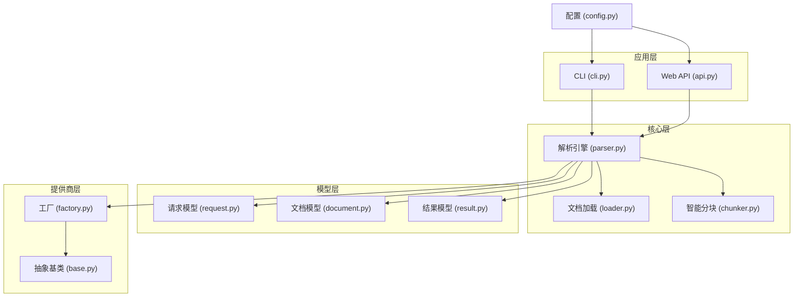
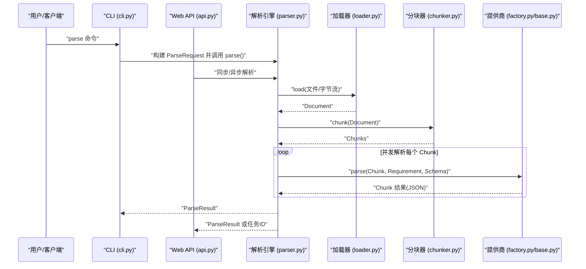
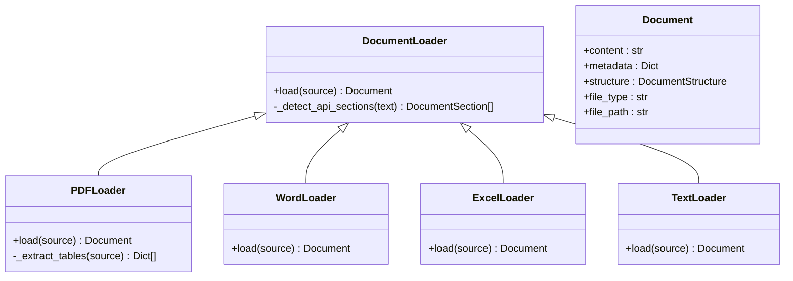
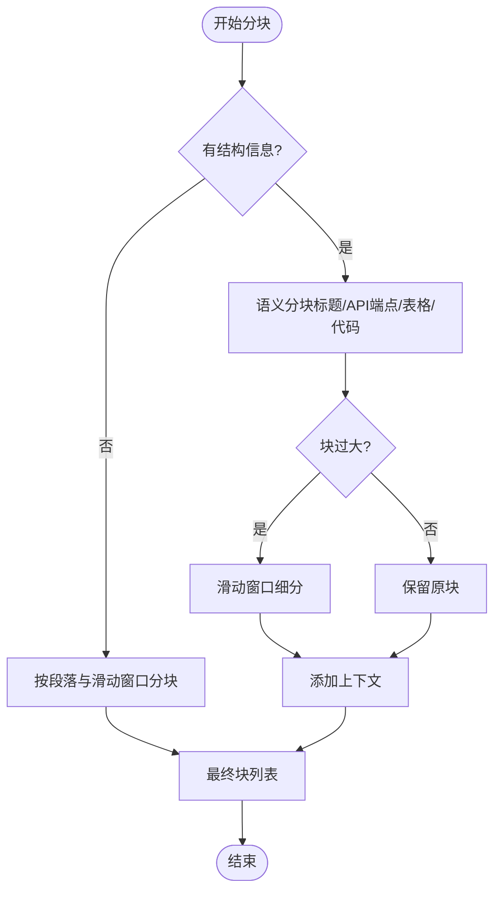
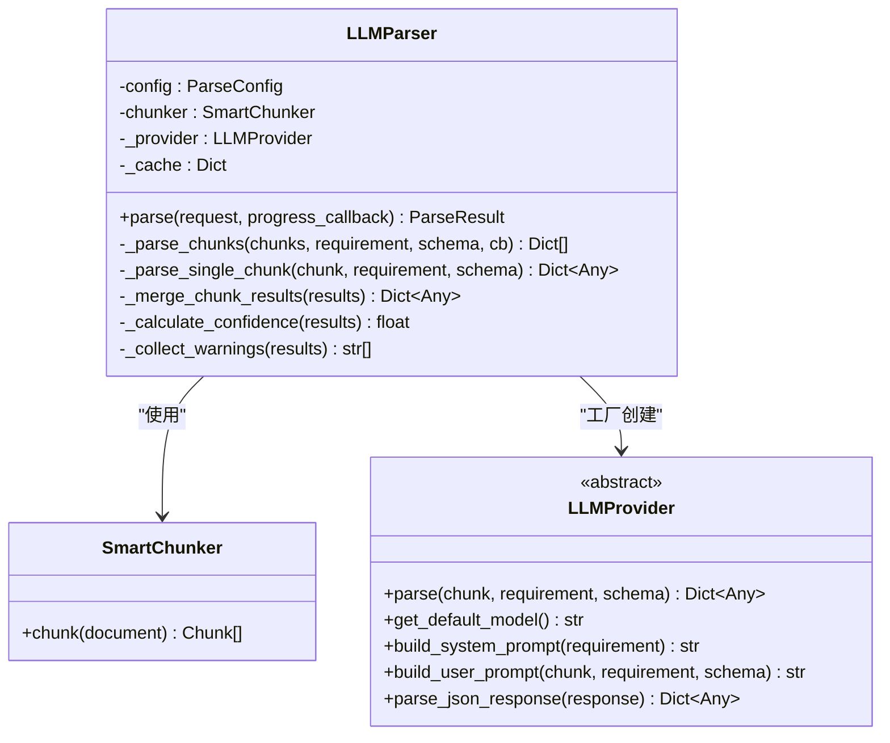
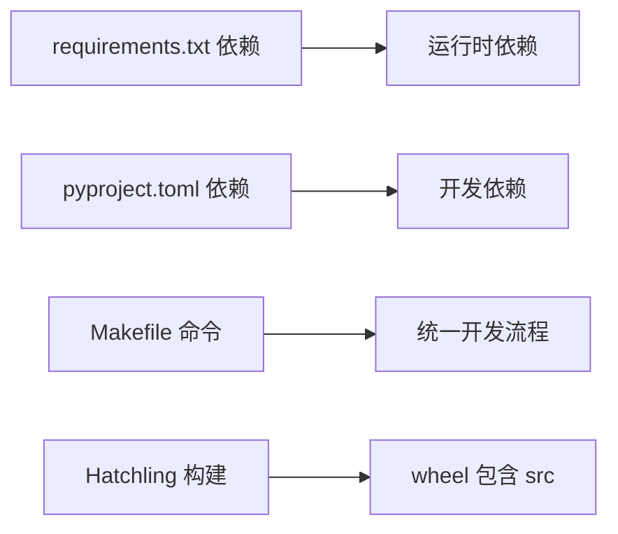

# 开发者指南

<cite>
**本文引用的文件**
- [README.md](file://doc_ai_parser/README.md)
- [Makefile](file://doc_ai_parser/Makefile)
- [requirements.txt](file://doc_ai_parser/requirements.txt)
- [pyproject.toml](file://doc_ai_parser/pyproject.toml)
- [src/__init__.py](file://doc_ai_parser/src/__init__.py)
- [src/config.py](file://doc_ai_parser/src/config.py)
- [src/cli.py](file://doc_ai_parser/src/cli.py)
- [src/api.py](file://doc_ai_parser/src/api.py)
- [src/core/loader.py](file://doc_ai_parser/src/core/loader.py)
- [src/core/chunker.py](file://doc_ai_parser/src/core/chunker.py)
- [src/core/parser.py](file://doc_ai_parser/src/core/parser.py)
- [src/models/document.py](file://doc_ai_parser/src/models/document.py)
- [src/models/request.py](file://doc_ai_parser/src/models/request.py)
- [src/models/result.py](file://doc_ai_parser/src/models/result.py)
- [src/providers/factory.py](file://doc_ai_parser/src/providers/factory.py)
- [src/providers/base.py](file://doc_ai_parser/src/providers/base.py)
- [.env.example](file://doc_ai_parser/.env.example)
</cite>

## 更新摘要
**变更内容**
- 新增Makefile开发工具链配置，提供标准化的开发命令
- 更新requirements.txt作为主要依赖管理文件，替代部分pyproject.toml依赖声明
- 重构pyproject.toml配置，分离运行时依赖和开发依赖
- 增强本地开发环境搭建流程，提供多种安装方式

## 目录
1. [简介](#简介)
2. [项目结构](#项目结构)
3. [核心组件](#核心组件)
4. [架构总览](#架构总览)
5. [详细组件分析](#详细组件分析)
6. [依赖分析](#依赖分析)
7. [性能考虑](#性能考虑)
8. [故障排查指南](#故障排查指南)
9. [结论](#结论)
10. [附录](#附录)

## 简介
本指南面向希望参与 API 文档解析工具开发的工程师，涵盖本地开发环境搭建、代码规范与最佳实践、调试技巧与贡献流程、开发工具配置、依赖管理与构建流程、代码评审标准与质量保障流程、常见问题与性能优化建议，以及版本控制、分支管理与发布流程。目标是帮助新贡献者快速上手，同时为有经验的开发者提供深入的技术指导。

## 项目结构
该项目采用"包内模块化 + 层次清晰"的组织方式，主要目录与职责如下：
- src/doc_ai_parser：核心源码
  - api.py：FastAPI Web 服务入口
  - cli.py：Typer CLI 入口
  - config.py：配置管理（Pydantic Settings）
  - core/：核心处理逻辑
    - loader.py：多格式文档加载器
    - chunker.py：智能分块器
    - parser.py：LLM 解析引擎
  - models/：数据模型（请求、结果、文档结构）
  - providers/：LLM 提供商抽象与工厂
  - utils/：工具函数
- tests/：单元测试与集成测试
- requirements.txt：主要依赖文件
- Makefile：开发工具链配置
- pyproject.toml：项目元数据、构建配置与开发工具配置
- .env.example：环境变量示例
- README.md：功能说明、安装与使用示例

**图表来源**
- [src/cli.py](file://doc_ai_parser/src/cli.py#L1-L393)
- [src/api.py](file://doc_ai_parser/src/api.py#L1-L371)
- [src/core/parser.py](file://doc_ai_parser/src/core/parser.py#L1-L304)
- [src/core/loader.py](file://doc_ai_parser/src/core/loader.py#L1-L328)
- [src/core/chunker.py](file://doc_ai_parser/src/core/chunker.py#L1-L377)
- [src/providers/factory.py](file://doc_ai_parser/src/providers/factory.py#L1-L71)
- [src/providers/base.py](file://doc_ai_parser/src/providers/base.py#L1-L143)
- [src/models/request.py](file://doc_ai_parser/src/models/request.py#L1-L57)
- [src/models/document.py](file://doc_ai_parser/src/models/document.py#L1-L75)
- [src/models/result.py](file://doc_ai_parser/src/models/result.py#L1-L55)
- [src/config.py](file://doc_ai_parser/src/config.py#L1-L57)

**章节来源**
- [README.md](file://doc_ai_parser/README.md#L154-L177)
- [pyproject.toml](file://doc_ai_parser/pyproject.toml#L1-L100)

## 核心组件
- 配置管理：集中管理应用、LLM 提供商、文件上传、解析参数等配置，支持 .env 注入与类型校验。
- 文档加载：统一抽象 DocumentLoader，支持 PDF、Word、Excel、纯文本、Markdown 等格式，内置 API 端点与结构识别。
- 智能分块：结合文档结构与滑动窗口策略，保证 API 信息完整性与上下文连续性。
- 解析引擎：并发调用提供商，缓存与合并结果，产出结构化 JSON。
- 提供商抽象：统一接口与提示词构建，支持 OpenAI、Azure OpenAI、Anthropic、自定义 OpenAI/Anthropic 协议、Ollama。
- Web 服务：FastAPI 提供异步任务与同步解析接口；CLI 提供命令行体验。
- 数据模型：对请求、结果、文档结构进行强类型建模，便于校验与文档生成。

**章节来源**
- [src/config.py](file://doc_ai_parser/src/config.py#L1-L57)
- [src/core/loader.py](file://doc_ai_parser/src/core/loader.py#L1-L328)
- [src/core/chunker.py](file://doc_ai_parser/src/core/chunker.py#L1-L377)
- [src/core/parser.py](file://doc_ai_parser/src/core/parser.py#L1-L304)
- [src/providers/factory.py](file://doc_ai_parser/src/providers/factory.py#L1-L71)
- [src/providers/base.py](file://doc_ai_parser/src/providers/base.py#L1-L143)
- [src/api.py](file://doc_ai_parser/src/api.py#L1-L371)
- [src/cli.py](file://doc_ai_parser/src/cli.py#L1-L393)
- [src/models/request.py](file://doc_ai_parser/src/models/request.py#L1-L57)
- [src/models/document.py](file://doc_ai_parser/src/models/document.py#L1-L75)
- [src/models/result.py](file://doc_ai_parser/src/models/result.py#L1-L55)

## 架构总览
系统采用"请求驱动 + 并行解析 + 统一合并"的架构。CLI 与 Web API 均通过 LLMParser 驱动，核心流程包括：文档加载 → 结构识别 → 智能分块 → 并发解析 → 结果合并 → 元数据统计。

**图表来源**
- [src/cli.py](file://doc_ai_parser/src/cli.py#L110-L231)
- [src/api.py](file://doc_ai_parser/src/api.py#L177-L254)
- [src/core/parser.py](file://doc_ai_parser/src/core/parser.py#L46-L128)
- [src/core/loader.py](file://doc_ai_parser/src/core/loader.py#L80-L127)
- [src/core/chunker.py](file://doc_ai_parser/src/core/chunker.py#L28-L62)
- [src/providers/factory.py](file://doc_ai_parser/src/providers/factory.py#L14-L71)
- [src/providers/base.py](file://doc_ai_parser/src/providers/base.py#L34-L57)

## 详细组件分析

### 配置管理（config.py）
- 使用 Pydantic Settings 从 .env 注入配置，支持类型校验与默认值。
- 关键配置项：各提供商的 API Key/Base URL、默认模型、分块大小/重叠、温度、重试策略、文件大小限制、上传目录、Redis URL 等。
- 全局 settings 实例供应用各模块共享。

**章节来源**
- [src/config.py](file://doc_ai_parser/src/config.py#L7-L57)

### 文档加载器（loader.py）
- 抽象类 DocumentLoader 定义统一接口，具体实现包括 PDF、Word、Excel、Text/Markdown。
- 内置 API 端点与结构识别，支持标题、代码块、表格等结构化信息抽取。
- PDF 加载使用 pymupdf 提取文本与页数元数据，并用 pdfplumber 提取表格；Word/Excel 加载后补充段落数、表格数、工作表信息。

**图表来源**
- [src/core/loader.py](file://doc_ai_parser/src/core/loader.py#L17-L328)
- [src/models/document.py](file://doc_ai_parser/src/models/document.py#L42-L75)

**章节来源**
- [src/core/loader.py](file://doc_ai_parser/src/core/loader.py#L17-L328)
- [src/models/document.py](file://doc_ai_parser/src/models/document.py#L1-L75)

### 智能分块器（chunker.py）
- 基于文档结构的语义分块优先，再对超长块使用滑动窗口细分，保持块间重叠避免信息截断。
- 特殊处理表格与代码块，尽量保持其完整性；提供上下文注入与摘要生成辅助合并。
- 估算 token 数量（字符/4），支持自定义最大长度与重叠长度。

**图表来源**
- [src/core/chunker.py](file://doc_ai_parser/src/core/chunker.py#L28-L62)
- [src/core/chunker.py](file://doc_ai_parser/src/core/chunker.py#L166-L201)
- [src/core/chunker.py](file://doc_ai_parser/src/core/chunker.py#L292-L311)

**章节来源**
- [src/core/chunker.py](file://doc_ai_parser/src/core/chunker.py#L10-L377)

### 解析引擎（parser.py）
- 负责加载文档、计算指纹、分块、并发调用提供商解析、合并结果、统计元数据。
- 使用信号量限制并发度，内置简单内存缓存；异常处理与警告收集完善。
- 支持增量更新合并策略，计算置信度与失败块索引。

**图表来源**
- [src/core/parser.py](file://doc_ai_parser/src/core/parser.py#L20-L304)
- [src/core/chunker.py](file://doc_ai_parser/src/core/chunker.py#L10-L377)
- [src/providers/base.py](file://doc_ai_parser/src/providers/base.py#L27-L143)

**章节来源**
- [src/core/parser.py](file://doc_ai_parser/src/core/parser.py#L20-L304)

### 提供商工厂与抽象（factory.py, base.py）
- 工厂根据提供商名称返回对应实现，支持 openai、azure、anthropic、custom_openai、custom_anthropic、ollama。
- 抽象基类定义统一接口与提示词构建逻辑，增强 JSON 解析鲁棒性。

**章节来源**
- [src/providers/factory.py](file://doc_ai_parser/src/providers/factory.py#L14-L71)
- [src/providers/base.py](file://doc_ai_parser/src/providers/base.py#L27-L143)

### Web API（api.py）
- 提供 /parse 异步任务、/parse/sync 同步解析、/providers 列表、/health 健康检查等接口。
- 任务状态内存存储，支持进度回调与错误回传；文件类型检测与大小限制。

**章节来源**
- [src/api.py](file://doc_ai_parser/src/api.py#L70-L300)

### CLI（cli.py）
- 提供 parse、providers、example-requirement 三个命令，支持进度条、统计信息展示、详细输出与错误追踪。
- 支持增量更新（previous-result）、自定义提供商与模型、自定义 API Base URL 与 API Key。

**章节来源**
- [src/cli.py](file://doc_ai_parser/src/cli.py#L50-L393)

### 数据模型（models）
- request.py：ParseRequest、ParseConfig、RequirementDoc、DocumentSource、ExtractionRule。
- document.py：Document、DocumentStructure、DocumentSection、Chunk、SectionType。
- result.py：ParseResult、ParseMetadata。

**章节来源**
- [src/models/request.py](file://doc_ai_parser/src/models/request.py#L1-L57)
- [src/models/document.py](file://doc_ai_parser/src/models/document.py#L1-L75)
- [src/models/result.py](file://doc_ai_parser/src/models/result.py#L1-L55)

## 依赖分析
- 运行时依赖：FastAPI、Uvicorn、Typer、Rich、Pydantic、Pydantic-Settings、OpenAI、Anthropic、PDF/Word/Excel 处理库、Celery/Redis（任务队列）、tiktoken、structlog、aiofiles、httpx。
- 开发依赖：pytest、pytest-asyncio、pytest-cov、black、ruff、mypy、pre-commit。
- 构建系统：Hatchling；脚本入口：api-doc-parser → cli.app。

**更新** 重构了依赖管理策略，requirements.txt作为主要依赖文件，pyproject.toml专注于构建配置和开发工具配置

**图表来源**
- [requirements.txt](file://doc_ai_parser/requirements.txt#L1-L45)
- [pyproject.toml](file://doc_ai_parser/pyproject.toml#L25-L70)
- [pyproject.toml](file://doc_ai_parser/pyproject.toml#L79-L81)
- [Makefile](file://doc_ai_parser/Makefile#L13-L16)

**章节来源**
- [requirements.txt](file://doc_ai_parser/requirements.txt#L1-L45)
- [pyproject.toml](file://doc_ai_parser/pyproject.toml#L1-L100)

## 性能考虑
- 并发控制：解析引擎使用信号量限制并发，避免过度占用资源。
- 缓存策略：内存缓存键由 chunk 内容、需求说明与模型组合生成，命中后直接返回。
- 分块策略：优先语义分块，再对超长块滑动细分，减少重复上下文传输。
- 日志与指标：记录处理耗时、块数、失败块索引、置信度，便于性能评估与优化。
- I/O 优化：Web 服务对大文件进行大小限制与内存清理（删除文件内容）。

**章节来源**
- [src/core/parser.py](file://doc_ai_parser/src/core/parser.py#L130-L169)
- [src/core/parser.py](file://doc_ai_parser/src/core/parser.py#L179-L201)
- [src/api.py](file://doc_ai_parser/src/api.py#L346-L348)

## 故障排查指南
- 环境变量未生效
  - 确认 .env 文件存在且编码为 UTF-8；检查 Settings 的 env_file 路径与 extra 设置。
- 提供商配置错误
  - 自定义协议需提供 api_base；工厂会校验提供商名称与必需参数。
- 文件类型不支持
  - CLI/Web 侧均进行文件类型检测，仅支持 pdf/docx/xlsx/txt/md。
- JSON 解析失败
  - 提供商基类具备多种 JSON 提取策略；若仍失败，查看日志 warning 与原始响应预览。
- 任务失败或进度停滞
  - Web 服务内存任务存储包含 error 字段；检查并发与重试设置。

**章节来源**
- [src/config.py](file://doc_ai_parser/src/config.py#L10-L14)
- [src/providers/factory.py](file://doc_ai_parser/src/providers/factory.py#L66-L70)
- [src/api.py](file://doc_ai_parser/src/api.py#L97-L103)
- [src/cli.py](file://doc_ai_parser/src/cli.py#L141-L146)
- [src/providers/base.py](file://doc_ai_parser/src/providers/base.py#L112-L143)

## 结论
本项目通过模块化设计与清晰的层次划分，实现了多格式文档的智能解析与结构化输出。建议在开发过程中遵循统一的代码风格与测试规范，充分利用并发与缓存机制提升性能，并通过完善的日志与监控持续优化解析质量与用户体验。

## 附录

### 本地开发环境搭建
- Python 版本：>=3.11
- 步骤
  - 克隆仓库并进入目录
  - 创建虚拟环境并激活
  - 方法一：使用 pip 安装依赖
  - 方法二：使用 Makefile 统一安装
  - 复制 .env.example 为 .env 并填写必要配置
  - 运行 CLI 或启动 Web 服务进行验证

**更新** 新增了使用 Makefile 的安装方式，提供更便捷的开发环境搭建流程

**章节来源**
- [README.md](file://doc_ai_parser/README.md#L22-L46)
- [.env.example](file://doc_ai_parser/.env.example#L1-L22)
- [Makefile](file://doc_ai_parser/Makefile#L13-L16)

### 代码规范与最佳实践
- 格式化：使用 black（行宽 100，Python 3.11 目标版本）
- 规范检查：使用 ruff（选择 E、F、I、N、W、UP、B、C4、SIM 规则集）
- 类型检查：使用 mypy（严格模式）
- 提交前钩子：使用 pre-commit（建议配置 black、ruff、mypy）

**更新** 重构了开发工具配置，pyproject.toml专门用于开发工具配置，requirements.txt用于运行时依赖

**章节来源**
- [pyproject.toml](file://doc_ai_parser/pyproject.toml#L82-L96)

### 调试技巧
- CLI 详细输出：使用 --verbose 查看配置与统计信息
- Web 服务：访问 /docs 查看接口文档；/health 健康检查
- 日志：structlog 记录关键事件（加载、分块、解析完成、失败等）
- 增量更新：CLI 支持 previous-result 参数进行增量对比

**章节来源**
- [src/cli.py](file://doc_ai_parser/src/cli.py#L193-L231)
- [src/api.py](file://doc_ai_parser/src/api.py#L60-L74)

### 贡献指南
- 分支策略：建议采用 Git Flow，主分支保护，功能分支从 develop 派生
- 提交流程：提交前运行 pytest、black、ruff、mypy；编写最小可复现测试
- 代码评审：关注模块解耦、错误处理、并发安全、日志与指标
- 发布流程：更新版本号、更新 README 示例、打包 wheel 并上传至仓库

**章节来源**
- [README.md](file://doc_ai_parser/README.md#L159-L171)
- [pyproject.toml](file://doc_ai_parser/pyproject.toml#L1-L23)

### 开发工具与构建流程
- 构建系统：Hatchling
- 包路径：src
- 脚本入口：api-doc-parser → cli.app
- 测试：pytest（asyncio 模式自动）
- Makefile 命令：install、test、lint、format、clean、run-api、run-cli

**更新** 新增了完整的 Makefile 开发工具链，提供标准化的开发命令

**章节来源**
- [pyproject.toml](file://doc_ai_parser/pyproject.toml#L1-L4)
- [pyproject.toml](file://doc_ai_parser/pyproject.toml#L79-L81)
- [pyproject.toml](file://doc_ai_parser/pyproject.toml#L72-L73)
- [pyproject.toml](file://doc_ai_parser/pyproject.toml#L97-L100)
- [Makefile](file://doc_ai_parser/Makefile#L1-L41)

### 代码审查标准与质量保证
- 可读性：函数/类职责单一、命名清晰、注释充分
- 正确性：边界条件、空输入、异常路径覆盖
- 性能：避免不必要的 I/O 与内存拷贝，合理使用缓存与并发
- 安全：敏感信息（API Key）不硬编码，使用配置管理
- 兼容性：向后兼容的模型字段与默认值

**章节来源**
- [src/models/request.py](file://doc_ai_parser/src/models/request.py#L31-L57)
- [src/models/result.py](file://doc_ai_parser/src/models/result.py#L20-L55)

### 常见问题与解决方案
- "不支持的文件类型"：确认扩展名与类型映射
- "API Key/URL 缺失"：检查 .env 或命令行参数
- "解析结果为空"：调整分块大小与重叠、降低温度、检查输出 Schema
- "并发超限"：降低并发数或增加提供商速率限制

**章节来源**
- [src/api.py](file://doc_ai_parser/src/api.py#L97-L103)
- [src/cli.py](file://doc_ai_parser/src/cli.py#L141-L146)
- [src/config.py](file://doc_ai_parser/src/config.py#L20-L48)

### Makefile 开发工具链
- 安装依赖：make install（pip install -r requirements.txt && pip install -e .）
- 运行测试：make test（pytest -v）
- 代码检查：make lint（ruff check src tests && mypy src）
- 代码格式化：make format（black src tests && ruff check --fix src tests）
- 清理缓存：make clean（清理 __pycache__、.pytest_cache、.mypy_cache 等）
- 启动Web服务：make run-api（uvicorn src.api:app --reload --host 0.0.0.0 --port 8000）
- CLI帮助：make run-cli（api-doc-parser --help）

**新增** 完整的 Makefile 开发工具链配置，提供标准化的开发命令

**章节来源**
- [Makefile](file://doc_ai_parser/Makefile#L1-L41)

### 依赖管理策略
- requirements.txt：包含所有运行时依赖，支持直接 pip install -r requirements.txt
- pyproject.toml：专注于构建配置、开发工具配置和可选开发依赖
- 分离策略：运行时依赖与开发依赖分离，提高部署效率和开发体验

**新增** 重构的依赖管理策略，明确区分运行时依赖和开发依赖

**章节来源**
- [requirements.txt](file://doc_ai_parser/requirements.txt#L1-L45)
- [pyproject.toml](file://doc_ai_parser/pyproject.toml#L25-L70)