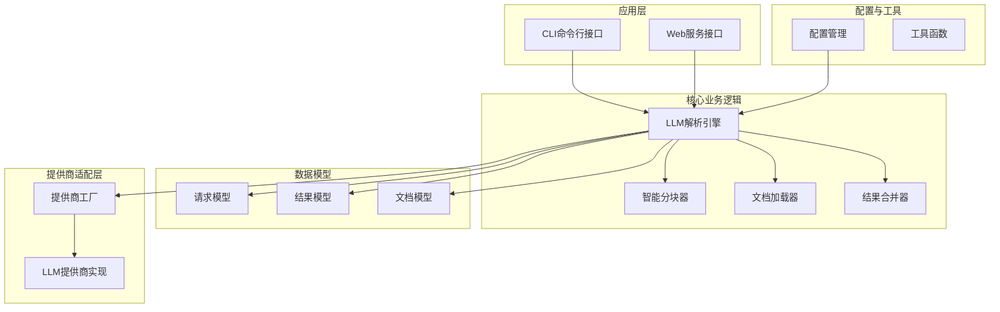
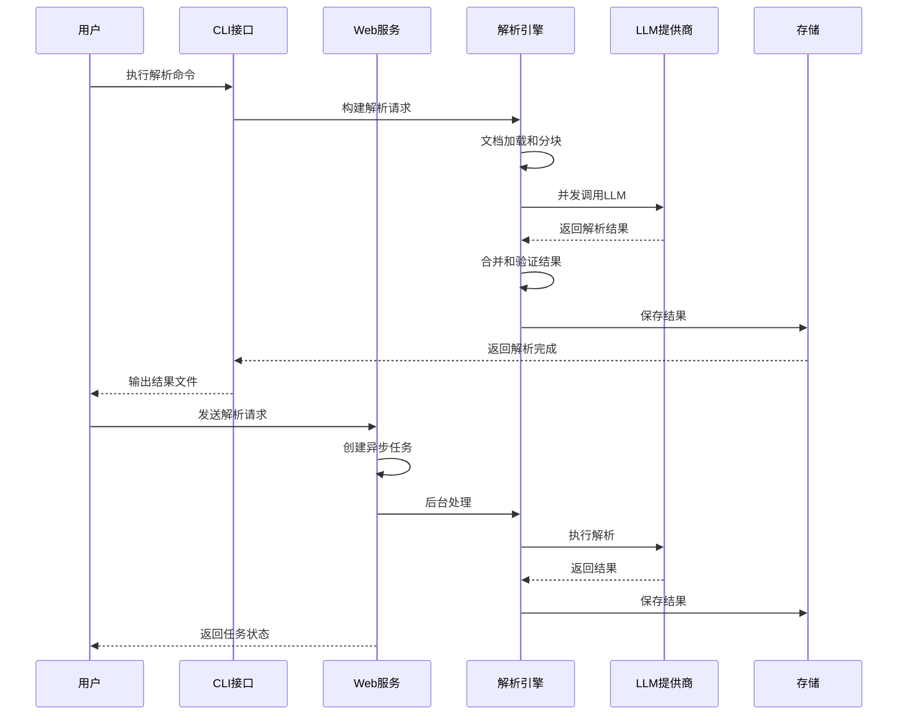
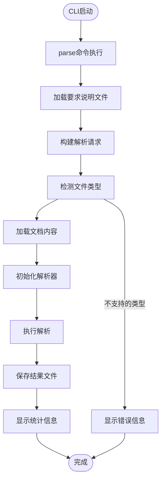
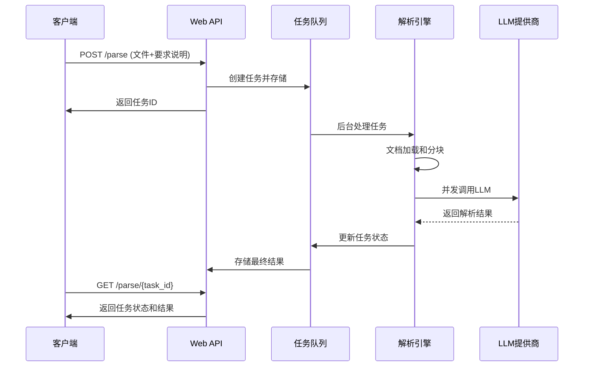
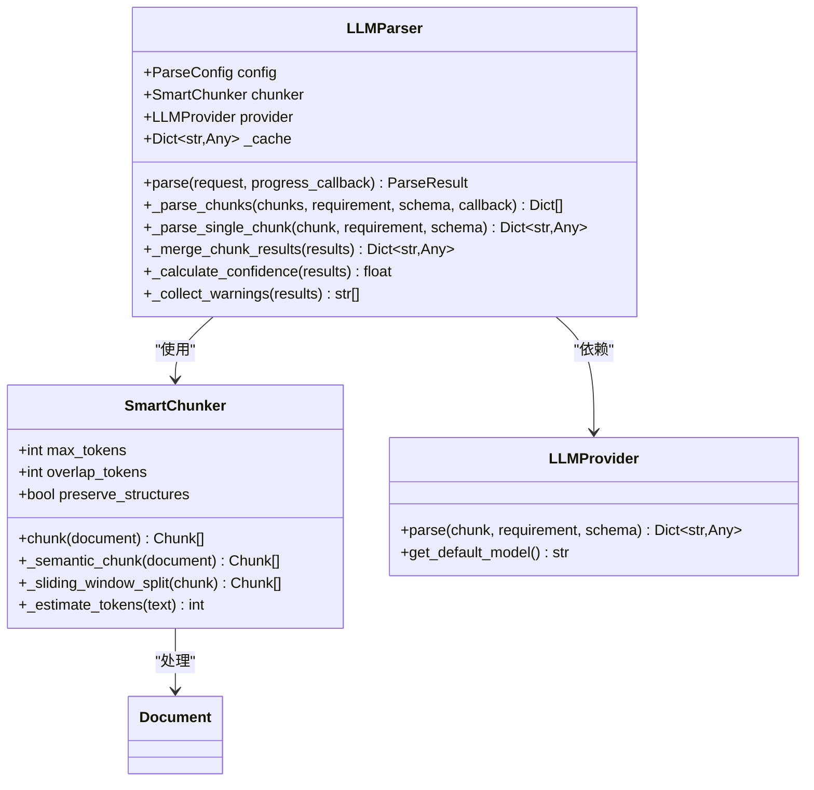

# 快速开始

<cite>
**本文引用的文件**
- [README.md](file://api-doc-parser/README.md)
- [pyproject.toml](file://api-doc-parser/pyproject.toml)
- [.env.example](file://api-doc-parser/.env.example)
- [cli.py](file://api-doc-parser/src/api_doc_parser/cli.py)
- [api.py](file://api-doc-parser/src/api_doc_parser/api.py)
- [config.py](file://api-doc-parser/src/api_doc_parser/config.py)
- [request.py](file://api-doc-parser/src/api_doc_parser/models/request.py)
- [result.py](file://api-doc-parser/src/api_doc_parser/models/result.py)
- [parser.py](file://api-doc-parser/src/api_doc_parser/core/parser.py)
- [chunker.py](file://api-doc-parser/src/api_doc_parser/core/chunker.py)
- [factory.py](file://api-doc-parser/src/api_doc_parser/providers/factory.py)
- [test_chunker.py](file://api-doc-parser/tests/test_chunker.py)
</cite>

## 目录
1. [简介](#简介)
2. [项目结构](#项目结构)
3. [核心组件](#核心组件)
4. [架构概览](#架构概览)
5. [详细组件分析](#详细组件分析)
6. [依赖关系分析](#依赖关系分析)
7. [性能考虑](#性能考虑)
8. [故障排除指南](#故障排除指南)
9. [结论](#结论)
10. [附录](#附录)

## 简介
API文档解析器是一个使用大语言模型智能解析API文档的工具，支持PDF、Word、Excel等多种格式，可输出结构化的JSON数据。项目提供了CLI命令行界面和Web服务两种使用方式，支持多种LLM提供商，包括OpenAI、Azure OpenAI、Anthropic Claude、Ollama本地模型以及自定义API。

## 项目结构
项目采用模块化设计，主要分为以下层次：



**图表来源**
- [cli.py](file://api-doc-parser/src/api_doc_parser/cli.py#L1-L393)
- [api.py](file://api-doc-parser/src/api_doc_parser/api.py#L1-L371)
- [parser.py](file://api-doc-parser/src/api_doc_parser/core/parser.py#L1-L304)
- [chunker.py](file://api-doc-parser/src/api_doc_parser/core/chunker.py#L1-L377)

**节来源**
- [README.md](file://api-doc-parser/README.md#L136-L157)
- [pyproject.toml](file://api-doc-parser/pyproject.toml#L1-L100)

## 核心组件
项目的核心组件包括：

### 1. CLI命令行接口
提供完整的命令行工具，支持文档解析、提供商列表查看、示例要求文件生成等功能。

### 2. Web服务接口
基于FastAPI构建的RESTful API服务，支持异步任务处理和同步解析。

### 3. LLM解析引擎
核心解析逻辑，负责文档加载、分块、并发解析、结果合并等。

### 4. 智能分块器
支持结构感知的文档分块，确保API端点和重要信息不被截断。

### 5. 配置管理系统
统一管理各种配置参数，支持环境变量配置。

**节来源**
- [cli.py](file://api-doc-parser/src/api_doc_parser/cli.py#L25-L47)
- [api.py](file://api-doc-parser/src/api_doc_parser/api.py#L24-L28)
- [parser.py](file://api-doc-parser/src/api_doc_parser/core/parser.py#L20-L31)
- [chunker.py](file://api-doc-parser/src/api_doc_parser/core/chunker.py#L10-L27)

## 架构概览
系统采用分层架构设计，各层职责清晰分离：



**图表来源**
- [cli.py](file://api-doc-parser/src/api_doc_parser/cli.py#L112-L231)
- [api.py](file://api-doc-parser/src/api_doc_parser/api.py#L76-L155)
- [parser.py](file://api-doc-parser/src/api_doc_parser/core/parser.py#L46-L128)

## 详细组件分析

### CLI命令行组件分析
CLI组件提供了完整的命令行接口，支持多种使用场景：

#### 主要命令
1. **parse命令** - 解析API文档
2. **providers命令** - 查看支持的LLM提供商
3. **example-requirement命令** - 生成示例要求文件

#### 关键配置选项
- `--provider/-p`: 指定LLM提供商（默认: openai）
- `--model/-m`: 指定模型名称
- `--api-base`: 自定义API基础URL
- `--api-key`: API密钥
- `--chunk-size`: 分块大小（默认: 3000）
- `--temperature/-t`: 模型温度参数（默认: 0.1）
- `--previous-result`: 增量更新的前一次结果



**图表来源**
- [cli.py](file://api-doc-parser/src/api_doc_parser/cli.py#L112-L231)

**节来源**
- [cli.py](file://api-doc-parser/src/api_doc_parser/cli.py#L50-L125)
- [cli.py](file://api-doc-parser/src/api_doc_parser/cli.py#L299-L323)
- [cli.py](file://api-doc-parser/src/api_doc_parser/cli.py#L325-L389)

### Web服务组件分析
Web服务基于FastAPI构建，提供RESTful API接口：

#### 主要API端点
1. **POST /parse** - 创建异步解析任务
2. **GET /parse/{task_id}** - 查询任务状态
3. **POST /parse/sync** - 同步解析（小文档）
4. **GET /providers** - 列出支持的LLM提供商

#### 异步任务处理流程


**图表来源**
- [api.py](file://api-doc-parser/src/api_doc_parser/api.py#L76-L155)
- [api.py](file://api-doc-parser/src/api_doc_parser/api.py#L302-L353)

**节来源**
- [api.py](file://api-doc-parser/src/api_doc_parser/api.py#L76-L255)
- [api.py](file://api-doc-parser/src/api_doc_parser/api.py#L257-L299)

### LLM解析引擎组件分析
解析引擎是系统的核心，负责整个解析流程：

#### 核心工作流程
1. **文档加载** - 支持多种格式的文档加载
2. **智能分块** - 基于结构感知的分块策略
3. **并发解析** - 并发调用LLM提供商
4. **结果合并** - 合并多个分块的解析结果
5. **质量评估** - 计算置信度和收集警告信息



**图表来源**
- [parser.py](file://api-doc-parser/src/api_doc_parser/core/parser.py#L20-L31)
- [chunker.py](file://api-doc-parser/src/api_doc_parser/core/chunker.py#L10-L27)

**节来源**
- [parser.py](file://api-doc-parser/src/api_doc_parser/core/parser.py#L46-L128)
- [chunker.py](file://api-doc-parser/src/api_doc_parser/core/chunker.py#L28-L62)

### 配置管理系统分析
配置系统采用Pydantic Settings，支持多种配置来源：

#### 主要配置类别
1. **应用配置** - 应用程序基本信息
2. **LLM提供商配置** - 各种LLM服务的配置
3. **解析配置** - 解析相关的参数设置
4. **文件上传配置** - 文件处理相关设置

**节来源**
- [config.py](file://api-doc-parser/src/api_doc_parser/config.py#L7-L56)

## 依赖关系分析
项目依赖关系清晰，采用标准的Python包管理方式：

```mermaid
graph TB
subgraph "核心依赖"
FastAPI[fastapi>=0.109.0]
Uvicorn[uvicorn[standard]>=0.27.0]
Typer[typer>=0.9.0]
Pydantic[pydantic>=2.5.0]
end
subgraph "LLM SDK"
OpenAI[openai>=1.10.0]
Anthropic[anthropic>=0.18.0]
end
subgraph "文档处理"
PyMuPDF[pymupdf>=1.23.0]
PDFPlumber[pdfplumber>=0.10.0]
Docx[python-docx>=1.1.0]
Excel[openpyxl>=3.1.0]
Pandas[pandas>=2.1.0]
end
subgraph "任务队列"
Celery[celery>=5.3.0]
Redis[redis>=5.0.0]
end
subgraph "开发工具"
Black[black>=23.12.0]
Ruff[ruff>=0.1.0]
Mypy[mypy>=1.8.0]
end
subgraph "应用"
APIDocParser[api-doc-parser]
end
APIDocParser --> FastAPI
APIDocParser --> Typer
APIDocParser --> Pydantic
APIDocParser --> OpenAI
APIDocParser --> Anthropic
APIDocParser --> PyMuPDF
APIDocParser --> Celery
APIDocParser --> Redis
```

**图表来源**
- [pyproject.toml](file://api-doc-parser/pyproject.toml#L25-L59)

**节来源**
- [pyproject.toml](file://api-doc-parser/pyproject.toml#L1-L100)

## 性能考虑
系统在设计时充分考虑了性能优化：

### 并发处理
- 使用信号量限制并发请求数量（默认5个）
- 异步I/O操作减少等待时间
- 内存缓存机制提升重复请求性能

### 分块策略
- 智能分块算法确保API端点完整性
- 滑动窗口分割避免信息截断
- 重叠缓冲区保证上下文连续性

### 缓存机制
- 基于内容指纹的内存缓存
- 自动去重和失效机制
- 支持禁用缓存进行调试

## 故障排除指南

### 常见安装问题
1. **Python版本不兼容**
   - 系统要求Python 3.11+
   - 使用虚拟环境隔离依赖

2. **依赖安装失败**
   - 确保网络连接正常
   - 使用国内镜像源加速下载

### 配置问题
1. **环境变量未生效**
   - 检查.env文件格式
   - 确认环境变量命名正确

2. **LLM提供商认证失败**
   - 验证API密钥有效性
   - 检查网络连接和代理设置

### 运行时错误
1. **CLI命令执行失败**
   - 检查输入文件路径和权限
   - 验证要求说明文件格式

2. **Web服务启动失败**
   - 确认端口未被占用
   - 检查防火墙设置

### 性能问题
1. **解析速度慢**
   - 调整chunk_size参数
   - 减少并发数量
   - 检查网络延迟

2. **内存使用过高**
   - 启用缓存清理
   - 降低并发数量
   - 检查任务队列清理

**节来源**
- [cli.py](file://api-doc-parser/src/api_doc_parser/cli.py#L148-L153)
- [api.py](file://api-doc-parser/src/api_doc_parser/api.py#L108-L112)

## 结论
API文档解析器提供了一个功能完整、易于使用的文档解析解决方案。通过CLI和Web两种使用方式，满足不同用户的需求。项目采用模块化设计，具有良好的扩展性和维护性。建议新用户从简单的CLI命令开始，逐步探索更高级的功能。

## 附录

### 安装步骤
1. 克隆仓库并进入目录
2. 创建虚拟环境并激活
3. 安装开发依赖
4. 配置环境变量
5. 验证安装结果

### 基本使用示例
1. 生成示例要求文件
2. 解析API文档
3. 查看提供商列表
4. 启动Web服务

### 高级配置选项
1. 自定义LLM提供商
2. 调整解析参数
3. 配置缓存策略
4. 设置并发限制

**节来源**
- [README.md](file://api-doc-parser/README.md#L14-L86)
- [pyproject.toml](file://api-doc-parser/pyproject.toml#L72-L73)