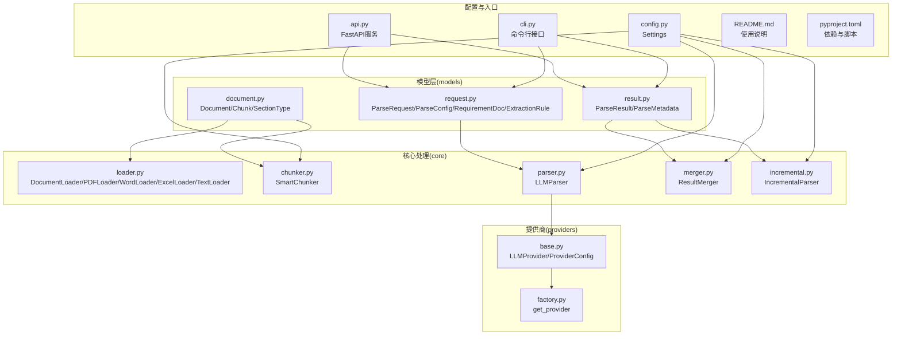
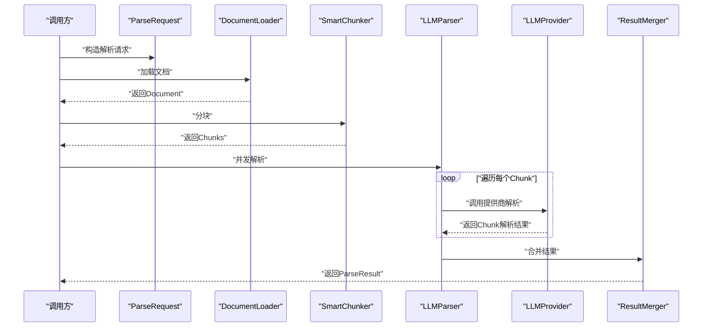
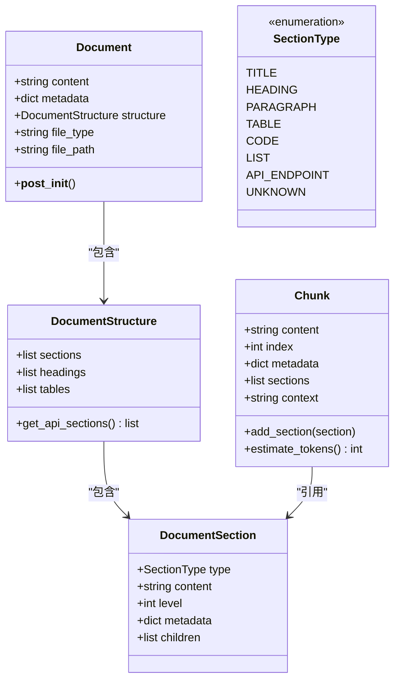
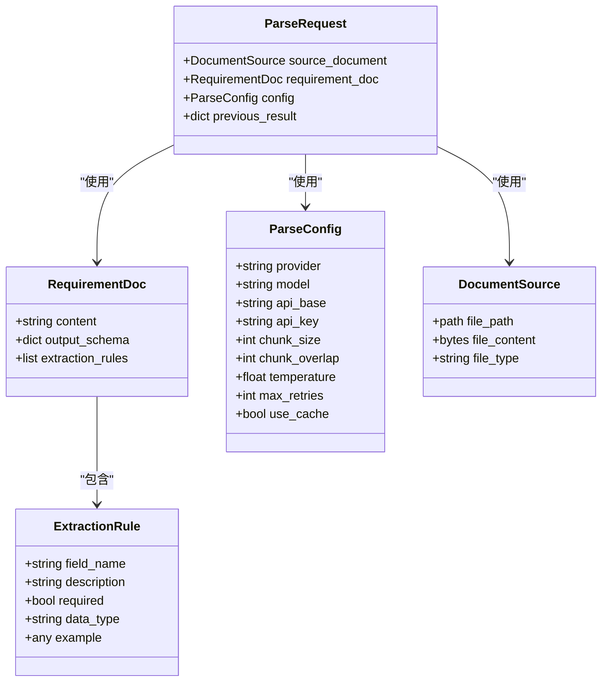
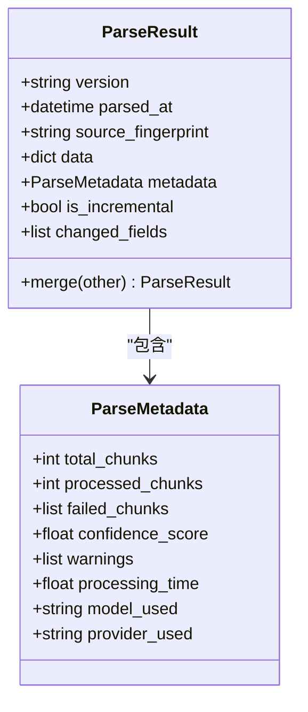
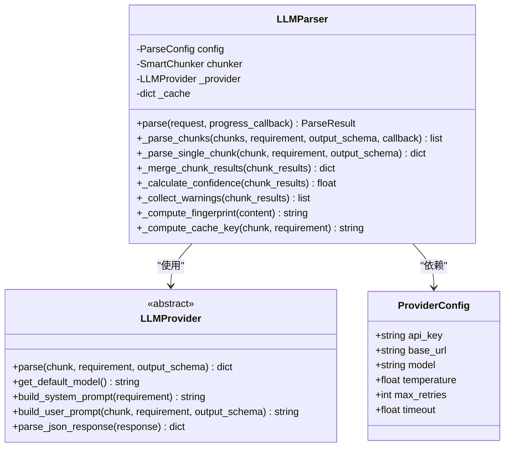
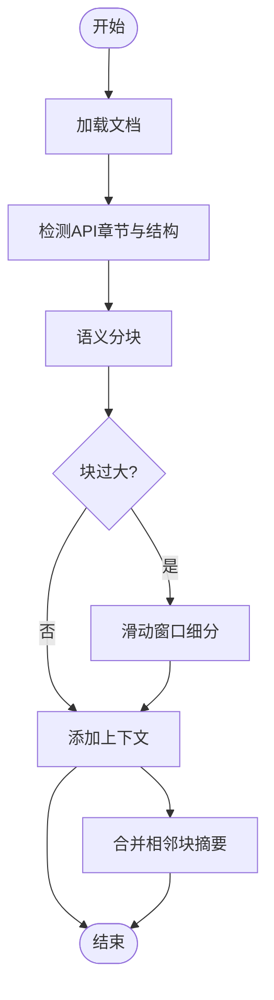
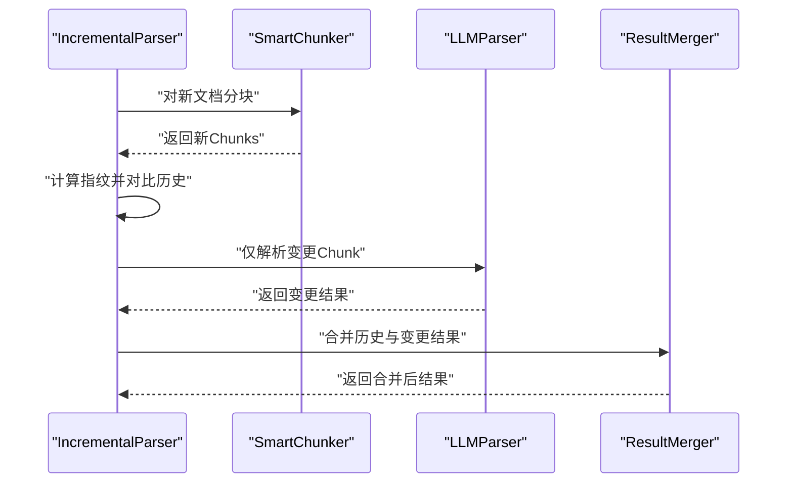
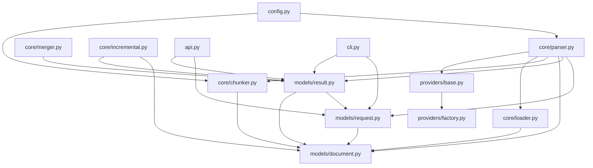

# 数据模型设计

<cite>
**本文引用的文件**
- [models/__init__.py](file://src/models/__init__.py)
- [models/document.py](file://src/models/document.py)
- [models/request.py](file://src/models/request.py)
- [models/result.py](file://src/models/result.py)
- [core/parser.py](file://src/core/parser.py)
- [core/chunker.py](file://src/core/chunker.py)
- [core/loader.py](file://src/core/loader.py)
- [core/merger.py](file://src/core/merger.py)
- [core/incremental.py](file://src/core/incremental.py)
- [providers/base.py](file://src/providers/base.py)
- [providers/factory.py](file://src/providers/factory.py)
- [config.py](file://src/config.py)
- [api.py](file://src/api.py)
- [cli.py](file://src/cli.py)
- [README.md](file://README.md)
- [pyproject.toml](file://pyproject.toml)
</cite>

## 更新摘要
**所做更改**
- 更新了核心数据模型的完整实现，包括 ParseRequest、ParseResult、Document 等关键组件
- 新增了详细的模型字段定义和数据类型说明
- 完善了数据验证规则和业务规则说明
- 更新了数据访问模式和缓存策略
- 增强了性能考虑和故障排除指南
- 补充了示例数据和使用场景说明

## 目录
1. [简介](#简介)
2. [项目结构](#项目结构)
3. [核心组件](#核心组件)
4. [架构概览](#架构概览)
5. [详细组件分析](#详细组件分析)
6. [依赖分析](#依赖分析)
7. [性能考虑](#性能考虑)
8. [故障排除指南](#故障排除指南)
9. [结论](#结论)
10. [附录](#附录)

## 简介
本文件为 API 文档解析系统的数据模型设计文档，聚焦于实体关系、字段定义、数据类型、主键/外键、索引与约束、数据验证规则与业务规则、数据库模式图、示例数据、数据访问模式、缓存策略、性能考量、数据生命周期与保留策略、归档规则、数据迁移路径与版本管理、数据安全与隐私要求以及访问控制。同时，重点阐述请求模型、结果模型与文档模型的设计理念与使用场景。

该系统通过多格式文档加载、智能分块、LLM 提供商抽象与工厂模式、结果合并与增量更新机制，形成完整的文档结构化解析流水线。数据模型围绕 Document、Chunk、ParseRequest、RequirementDoc、ParseConfig、ParseResult、ParseMetadata 等核心对象展开，采用 Pydantic BaseModel 与 dataclass 的组合，确保强类型与运行时校验。

## 项目结构
系统采用模块化组织，核心数据模型位于 models 目录，核心处理逻辑位于 core 目录，LLM 提供商抽象位于 providers 目录，配置与工具位于根目录。各模块职责清晰，耦合度低，便于扩展与维护。

**图表来源**
- [models/document.py](file://src/models/document.py#L1-L75)
- [models/request.py](file://src/models/request.py#L1-L57)
- [models/result.py](file://src/models/result.py#L1-L55)
- [core/loader.py](file://src/core/loader.py#L1-L328)
- [core/chunker.py](file://src/core/chunker.py#L1-L377)
- [core/parser.py](file://src/core/parser.py#L1-L304)
- [core/merger.py](file://src/core/merger.py#L1-L220)
- [core/incremental.py](file://src/core/incremental.py#L1-L209)
- [providers/base.py](file://src/providers/base.py#L1-L143)
- [providers/factory.py](file://src/providers/factory.py#L1-L71)
- [config.py](file://src/config.py#L1-L57)
- [api.py](file://src/api.py#L1-L371)
- [cli.py](file://src/cli.py#L1-L393)

**章节来源**
- [README.md](file://README.md#L154-L177)
- [pyproject.toml](file://pyproject.toml#L1-L100)

## 核心组件
本节概述数据模型的核心对象及其职责，包括文档模型、请求模型、结果模型与元数据模型，并说明它们之间的关系与交互。

- **文档模型**
  - Document：封装原始文档内容、元数据、结构化信息与文件类型/路径
  - DocumentStructure：包含章节列表、标题列表、表格列表，并提供筛选 API 相关章节的能力
  - DocumentSection：描述文档中的一个语义单元，包含类型、内容、层级、元数据与子节点
  - Chunk：文档分块，包含内容、索引、元数据、关联章节与上下文信息，并提供估算 token 数量的方法

- **请求模型**
  - ParseRequest：解析请求，包含源文档、要求文档与解析配置，支持增量更新
  - RequirementDoc：解析要求文档，包含要求说明文本、期望输出 JSON Schema 与提取规则列表
  - ParseConfig：解析配置，包含提供商、模型、API 基础 URL、API 密钥、分块大小、重叠大小、温度参数、最大重试次数与缓存开关
  - ExtractionRule：提取规则，定义字段名、描述、是否必需、数据类型与示例

- **结果模型**
  - ParseResult：解析结果，包含版本、解析时间、源文档指纹、动态结构化数据、元数据与增量更新相关字段
  - ParseMetadata：解析元数据，包含总分块数、已处理分块数、失败分块索引列表、置信度、警告信息、处理时间、使用的模型与提供商

**章节来源**
- [models/document.py](file://src/models/document.py#L20-L75)
- [models/request.py](file://src/models/request.py#L8-L57)
- [models/result.py](file://src/models/result.py#L8-L55)

## 架构概览
系统通过以下流程完成文档解析：文档加载 → 结构识别 → 智能分块 → 并发解析 → 结果合并 → 增量更新（可选）。数据模型贯穿整个流程，确保输入输出的一致性与可追踪性。

**图表来源**
- [core/parser.py](file://src/core/parser.py#L46-L128)
- [core/chunker.py](file://src/core/chunker.py#L28-L62)
- [core/loader.py](file://src/core/loader.py#L313-L327)
- [providers/base.py](file://src/providers/base.py#L34-L57)
- [core/merger.py](file://src/core/merger.py#L17-L79)

## 详细组件分析

### 文档模型分析
文档模型负责承载原始文档内容与结构化信息，支撑后续的分块与解析。

**图表来源**
- [models/document.py](file://src/models/document.py#L20-L75)

**章节来源**
- [models/document.py](file://src/models/document.py#L1-L75)

### 请求模型分析
请求模型定义了解析所需的输入参数与配置，确保解析过程可控且可复现。

**图表来源**
- [models/request.py](file://src/models/request.py#L1-L57)

**章节来源**
- [models/request.py](file://src/models/request.py#L1-L57)

### 结果模型分析
结果模型承载解析后的结构化数据与元数据，支持增量更新与合并。

**图表来源**
- [models/result.py](file://src/models/result.py#L1-L55)

**章节来源**
- [models/result.py](file://src/models/result.py#L1-L55)

### 解析引擎与提供商抽象
解析引擎协调文档加载、分块、并发解析与结果合并；提供商抽象统一不同 LLM 提供商的接口。

**图表来源**
- [core/parser.py](file://src/core/parser.py#L20-L304)
- [providers/base.py](file://src/providers/base.py#L27-L143)
- [providers/factory.py](file://src/providers/factory.py#L14-L71)

**章节来源**
- [core/parser.py](file://src/core/parser.py#L1-L304)
- [providers/base.py](file://src/providers/base.py#L1-L143)
- [providers/factory.py](file://src/providers/factory.py#L1-L71)

### 智能分块与文档加载
智能分块器基于文档结构进行语义分块，并在必要时使用滑动窗口与重叠缓冲避免信息截断；文档加载器支持多种格式并提取结构化信息。

**图表来源**
- [core/chunker.py](file://src/core/chunker.py#L28-L62)
- [core/loader.py](file://src/core/loader.py#L25-L77)

**章节来源**
- [core/chunker.py](file://src/core/chunker.py#L1-L377)
- [core/loader.py](file://src/core/loader.py#L1-L328)

### 增量更新与结果合并
增量解析器通过指纹检测文档变更，仅对变更分块进行解析，并与历史结果合并；结果合并器支持深度合并与列表去重。

**图表来源**
- [core/incremental.py](file://src/core/incremental.py#L29-L74)
- [core/merger.py](file://src/core/merger.py#L17-L79)

**章节来源**
- [core/incremental.py](file://src/core/incremental.py#L1-L209)
- [core/merger.py](file://src/core/merger.py#L1-L220)

## 依赖分析
系统依赖关系清晰，核心模块之间通过明确的接口耦合，便于替换与扩展。

**图表来源**
- [models/request.py](file://src/models/request.py#L1-L57)
- [models/document.py](file://src/models/document.py#L1-L75)
- [models/result.py](file://src/models/result.py#L1-L55)
- [core/parser.py](file://src/core/parser.py#L1-L304)
- [core/chunker.py](file://src/core/chunker.py#L1-L377)
- [core/loader.py](file://src/core/loader.py#L1-L328)
- [providers/base.py](file://src/providers/base.py#L1-L143)
- [providers/factory.py](file://src/providers/factory.py#L1-L71)
- [core/merger.py](file://src/core/merger.py#L1-L220)
- [core/incremental.py](file://src/core/incremental.py#L1-L209)
- [config.py](file://src/config.py#L1-L57)
- [api.py](file://src/api.py#L1-L371)
- [cli.py](file://src/cli.py#L1-L393)

**章节来源**
- [pyproject.toml](file://pyproject.toml#L25-L59)

## 性能考虑
- **并发解析**：解析引擎使用信号量限制并发数，避免过度占用资源
- **缓存策略**：基于内容与配置的哈希键缓存单块解析结果，减少重复调用
- **分块策略**：智能分块结合语义与长度限制，配合滑动窗口与重叠缓冲，平衡吞吐与准确性
- **内存管理**：使用内存字典作为简单缓存，适合短期会话；生产环境建议引入持久化缓存
- **日志与监控**：结构化日志记录关键指标，便于性能分析与问题定位
- **增量更新优化**：通过指纹检测减少重复解析，提高整体处理效率

**章节来源**
- [core/parser.py](file://src/core/parser.py#L130-L169)
- [core/parser.py](file://src/core/parser.py#L171-L201)
- [core/chunker.py](file://src/core/chunker.py#L166-L201)

## 故障排除指南
- **解析失败**：解析引擎捕获异常并记录错误，同时在元数据中记录失败分块索引与警告信息
- **JSON 解析**：提供商基类提供多种 JSON 提取策略，增强鲁棒性
- **配置校验**：Pydantic 模型自动进行字段校验，缺失或非法字段会抛出异常
- **并发问题**：通过信号量限制并发，避免资源争用；合理设置重试次数与超时
- **缓存失效**：内存缓存仅适用于单次会话，生产环境需使用持久化缓存
- **增量更新问题**：检查文档指纹计算和分块指纹映射是否正确

**章节来源**
- [core/parser.py](file://src/core/parser.py#L154-L201)
- [providers/base.py](file://src/providers/base.py#L112-L143)

## 结论
本数据模型设计以强类型与可验证为核心，围绕文档、请求与结果三大对象构建，辅以智能分块、并发解析、结果合并与增量更新机制，形成完整的文档结构化解析体系。通过清晰的模块划分与抽象接口，系统具备良好的扩展性与可维护性，适用于多格式文档与多提供商场景。

## 附录

### 数据模型与字段定义
- **文档模型**
  - Document
    - content: 字符串，原始文档内容
    - metadata: 字典，文档元数据
    - structure: 结构体，文档结构信息
    - file_type: 字符串，文件类型
    - file_path: 字符串，文件路径
  - DocumentStructure
    - sections: 列表，文档章节
    - headings: 列表，标题信息
    - tables: 列表，表格信息
  - DocumentSection
    - type: 枚举，章节类型
    - content: 字符串，章节内容
    - level: 整数，标题层级
    - metadata: 字典，元数据
    - children: 列表，子章节
  - Chunk
    - content: 字符串，分块内容
    - index: 整数，分块索引
    - metadata: 字典，分块元数据
    - sections: 列表，关联章节
    - context: 字符串，上下文信息

- **请求模型**
  - ParseRequest
    - source_document: 结构体，源文档
    - requirement_doc: 结构体，要求文档
    - config: 结构体，解析配置
    - previous_result: 字典，历史结果（增量更新）
  - RequirementDoc
    - content: 字符串，要求说明
    - output_schema: 字典，输出 JSON Schema
    - extraction_rules: 列表，提取规则
  - ParseConfig
    - provider: 字符串，提供商（openai、azure、anthropic、custom_openai、custom_anthropic、ollama）
    - model: 字符串，模型名称
    - api_base: 字符串，API 基础 URL
    - api_key: 字符串，API 密钥
    - chunk_size: 整数，分块大小（token）
    - chunk_overlap: 整数，分块重叠大小
    - temperature: 浮点数，温度参数
    - max_retries: 整数，最大重试次数
    - use_cache: 布尔，是否使用缓存
  - ExtractionRule
    - field_name: 字符串，字段名
    - description: 字符串，描述
    - required: 布尔，是否必需
    - data_type: 字符串，数据类型
    - example: 任意类型，示例值

- **结果模型**
  - ParseResult
    - version: 字符串，结果版本（默认 1.0）
    - parsed_at: 时间戳，解析时间
    - source_fingerprint: 字符串，源文档指纹
    - data: 字典，结构化数据
    - metadata: 结构体，解析元数据
    - is_incremental: 布尔，是否为增量更新
    - changed_fields: 列表，变更字段
  - ParseMetadata
    - total_chunks: 整数，总分块数
    - processed_chunks: 整数，已处理分块数
    - failed_chunks: 列表，失败分块索引
    - confidence_score: 浮点数，置信度
    - warnings: 列表，警告信息
    - processing_time: 浮点数，处理时间
    - model_used: 字符串，使用的模型
    - provider_used: 字符串，使用的提供商

**章节来源**
- [models/document.py](file://src/models/document.py#L20-L75)
- [models/request.py](file://src/models/request.py#L8-L57)
- [models/result.py](file://src/models/result.py#L8-L55)

### 主键/外键、索引与约束
- **主键/外键**
  - 系统未使用传统关系型数据库，数据模型以内存对象为主，未定义显式主键/外键
- **索引与约束**
  - 通过 Pydantic BaseModel 的字段校验与默认值实现约束
  - SectionType 枚举限定章节类型
  - ParseConfig 中 provider 字段限定提供商枚举值
  - 文件类型字段使用 Literal 类型限制取值范围
- **建议**
  - 若迁移到数据库，建议为 Document.source_fingerprint、Chunk.index、ParseResult.version 等建立索引以提升查询效率

**章节来源**
- [models/document.py](file://src/models/document.py#L8-L17)
- [models/request.py](file://src/models/request.py#L31-L48)

### 数据验证规则与业务规则
- **数据验证规则**
  - 字段类型校验：Pydantic 自动校验字段类型与必填性
  - 枚举值校验：SectionType、provider 等使用枚举限定取值范围
  - 默认值：大量字段提供默认值，确保对象初始化完整性
  - 文件类型校验：使用 Literal 类型限制文件类型为 pdf、docx、xlsx、txt、md
- **业务规则**
  - 分块策略：优先保持 API 端点与标题的完整性，避免跨段落截断
  - 合并策略：深度合并字典、列表去重、置信度计算与警告聚合
  - 增量更新：基于指纹检测变更，保留未变更部分，仅更新变更部分
  - JSON Schema 验证：根据 output_schema 确保输出数据结构一致性

**章节来源**
- [core/chunker.py](file://src/core/chunker.py#L64-L125)
- [core/merger.py](file://src/core/merger.py#L81-L136)
- [core/incremental.py](file://src/core/incremental.py#L29-L74)

### 数据访问模式、缓存策略与性能
- **数据访问模式**
  - 读取：DocumentLoader 读取文件并返回 Document
  - 写入：LLMParser 将解析结果写入 ParseResult
  - 合并：ResultMerger 深度合并多个 ParseResult
  - 增量：IncrementalParser 检测变更并合并结果
- **缓存策略**
  - 内存缓存：基于内容与配置的哈希键缓存单块解析结果
  - 缓存键：由 chunk.content、requirement.content 和 model 组成
  - 建议：生产环境引入 Redis 等持久化缓存，设置 TTL 与淘汰策略
- **性能优化**
  - 并发限制：通过信号量控制并发数（默认 5 个）
  - 分块优化：滑动窗口与重叠缓冲减少信息截断
  - 日志采样：结构化日志记录关键指标，避免过多 I/O
  - 增量更新：指纹检测减少重复解析

**章节来源**
- [core/parser.py](file://src/core/parser.py#L171-L201)
- [core/chunker.py](file://src/core/chunker.py#L166-L201)

### 数据生命周期、保留策略与归档规则
- **生命周期**
  - 创建：解析请求进入系统
  - 处理：并发解析与结果合并
  - 归档：结果可写入存储，保留指纹与元数据
  - 清理：临时中间数据定期清理
- **保留策略**
  - 建议：保留解析结果与指纹至少 30 天，以便增量更新与审计
  - 缓存：内存缓存仅适用于单次会话，生产环境需持久化
- **归档规则**
  - 建议：按月/季度归档历史结果，清理临时中间数据
  - 增量更新：保留历史结果用于变更检测

**章节来源**
- [models/result.py](file://src/models/result.py#L20-L55)
- [core/incremental.py](file://src/core/incremental.py#L90-L150)

### 数据迁移路径与版本管理
- **版本管理**
  - ParseResult.version：结果版本号，默认 1.0
  - 建议：每次重大变更增加版本号，兼容旧版本解析逻辑
  - 增量更新：通过 is_incremental 标记区分增量结果
- **迁移路径**
  - 新增字段：向后兼容，旧字段保持不变
  - 删除字段：标记为废弃，保留读取逻辑一段时间
  - 字段重命名：提供映射与迁移脚本
  - 数据格式升级：通过版本号控制兼容性

**章节来源**
- [models/result.py](file://src/models/result.py#L22-L23)

### 数据安全、隐私要求与访问控制
- **数据安全**
  - API 密钥：通过配置注入，避免硬编码
  - 缓存：敏感数据不应缓存，或进行加密存储
  - 文件上传：限制文件大小和类型，防止恶意文件
- **隐私要求**
  - 文档指纹：仅用于去重与增量更新，不存储原文
  - 日志：避免记录敏感内容，使用脱敏策略
  - 输出过滤：根据 JSON Schema 验证输出数据
- **访问控制**
  - 接口：通过 Web 服务或 CLI 控制访问
  - 权限：限制对解析结果的读取与修改权限
  - 身份验证：支持多种提供商的身份验证方式

**章节来源**
- [config.py](file://src/config.py#L20-L48)
- [providers/base.py](file://src/providers/base.py#L17-L25)
- [api.py](file://src/api.py#L108-L113)

### 示例数据
- **示例：要求说明文件格式**
  - content: 字符串，要求说明文本
  - output_schema: 字典，期望的输出 JSON Schema
  - extraction_rules: 列表，提取规则数组

- **示例：解析配置**
  - provider: "openai"
  - model: "gpt-4"
  - api_base: null
  - api_key: "sk-..."
  - chunk_size: 3000
  - chunk_overlap: 200
  - temperature: 0.1
  - max_retries: 3
  - use_cache: true

- **示例：解析结果**
  - version: "1.0"
  - parsed_at: "2024-01-01T00:00:00"
  - source_fingerprint: "abc123..."
  - data: {"endpoints": [...]}
  - metadata: {
    - total_chunks: 10
    - processed_chunks: 10
    - failed_chunks: []
    - confidence_score: 1.0
    - warnings: []
    - processing_time: 120.5
    - model_used: "gpt-4"
    - provider_used: "openai"
  }

**章节来源**
- [README.md](file://README.md#L113-L141)
- [cli.py](file://src/cli.py#L334-L388)

### 使用场景与最佳实践
- **Web 服务使用**
  - 异步解析：适合大文档处理，支持任务状态查询
  - 同步解析：适合小文档快速处理
  - 任务管理：内存中存储任务状态，生产环境建议使用 Redis

- **命令行使用**
  - 批量处理：支持多个文档的批量解析
  - 增量更新：支持基于历史结果的增量解析
  - 配置灵活：支持多种提供商和模型选择

- **集成建议**
  - 生产环境使用持久化缓存（Redis）
  - 监控关键指标：处理时间、成功率、错误率
  - 错误处理：完善的异常捕获和重试机制
  - 性能优化：根据文档特点调整分块大小和并发数

**章节来源**
- [api.py](file://src/api.py#L76-L254)
- [cli.py](file://src/cli.py#L50-L231)
- [README.md](file://README.md#L66-L112)