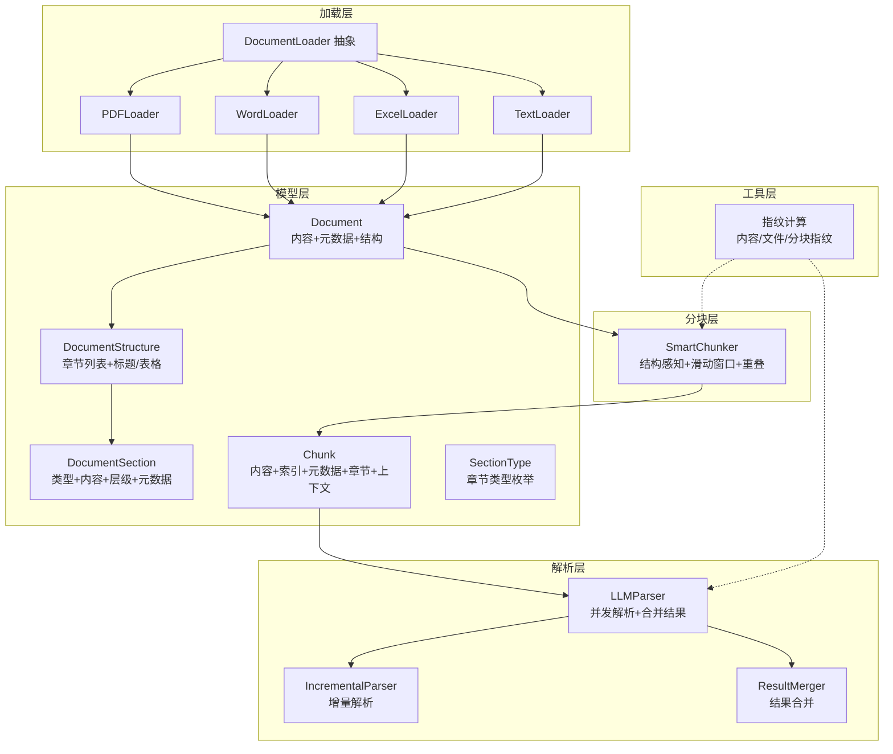
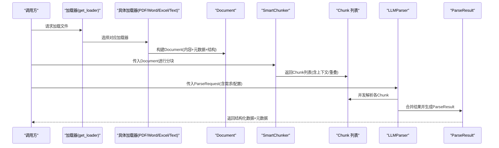
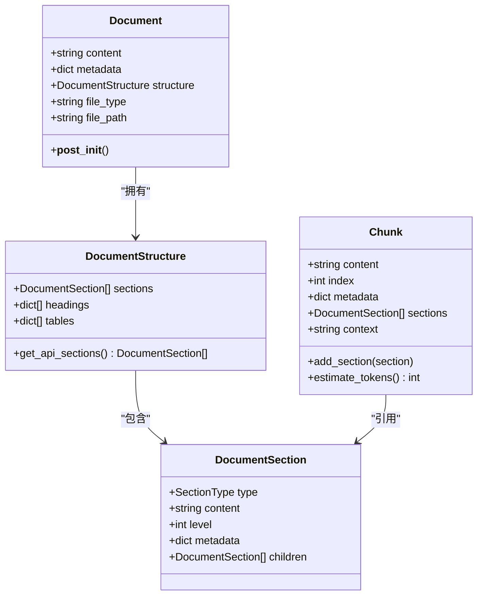
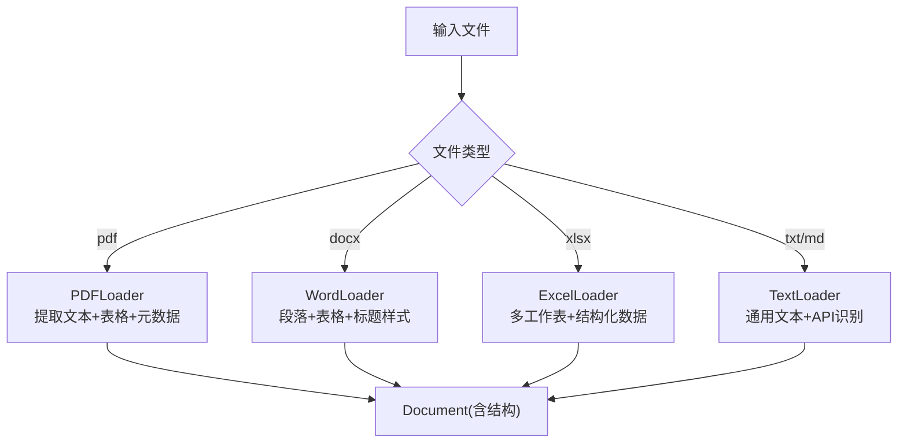
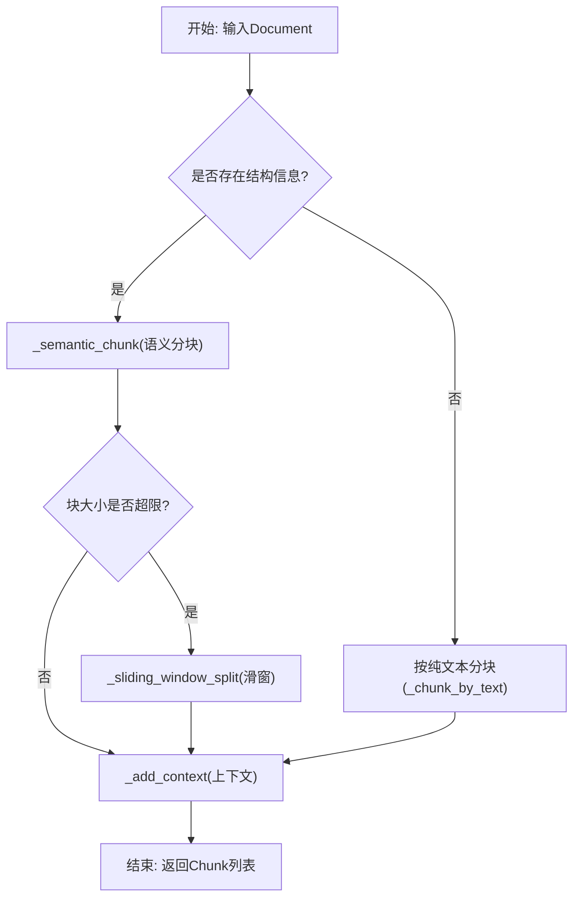
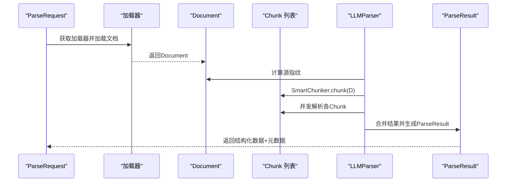
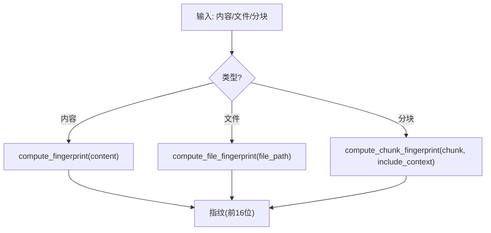
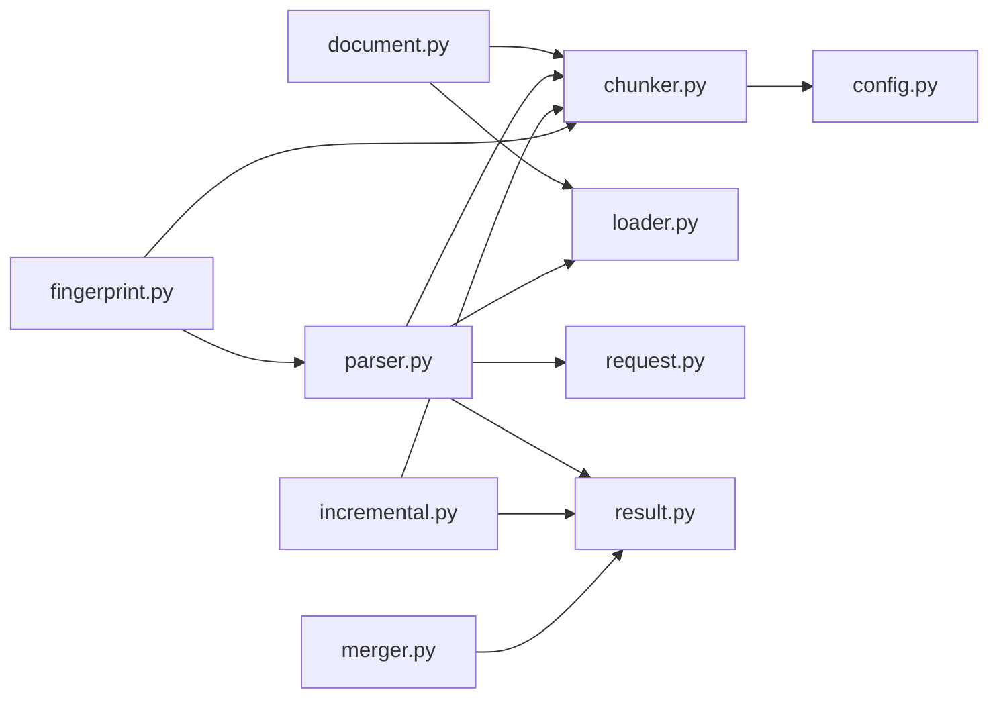

# 文档模型

<cite>
**本文引用的文件**
- [document.py](file://src/models/document.py)
- [__init__.py](file://src/models/__init__.py)
- [request.py](file://src/models/request.py)
- [result.py](file://src/models/result.py)
- [loader.py](file://src/core/loader.py)
- [chunker.py](file://src/core/chunker.py)
- [parser.py](file://src/core/parser.py)
- [incremental.py](file://src/core/incremental.py)
- [merger.py](file://src/core/merger.py)
- [fingerprint.py](file://src/utils/fingerprint.py)
- [config.py](file://src/config.py)
- [test_chunker.py](file://tests/test_chunker.py)
- [test_providers.py](file://tests/test_providers.py)
</cite>

## 更新摘要
**所做更改**
- 更新了文档模型的核心数据结构定义，包括 Document、DocumentStructure、DocumentSection 和 Chunk 的详细说明
- 新增了 SectionType 枚举类型的完整定义
- 完善了文档类型识别和内容提取的实现细节
- 更新了分块策略和上下文处理机制
- 增强了指纹计算和去重机制的说明
- 扩展了不同文档格式的处理差异和特殊字段说明

## 目录
1. [简介](#简介)
2. [项目结构](#项目结构)
3. [核心组件](#核心组件)
4. [架构总览](#架构总览)
5. [详细组件分析](#详细组件分析)
6. [依赖关系分析](#依赖关系分析)
7. [性能考量](#性能考量)
8. [故障排查指南](#故障排查指南)
9. [结论](#结论)
10. [附录](#附录)

## 简介
本文档围绕文档模型与分块模型，系统阐述 Document、Chunk、DocumentStructure 等核心数据结构的设计理念、数据定义、关键字段及其用途；说明文档元数据、内容结构、分块信息的组织方式；记录文档类型识别、内容提取与结构化存储的实现；给出不同文档格式（PDF、Word、Excel、TXT、MD）的处理差异与特殊字段；提供模型创建、操作与访问示例；解释文档指纹计算与去重机制；并阐明文档模型在整个解析流程中的作用及与各组件的交互关系。

## 项目结构
本项目采用"模型-加载-分块-解析-工具"的分层设计：
- 模型层：定义 Document、DocumentStructure、DocumentSection、Chunk 等核心数据结构
- 加载层：根据文件类型选择对应加载器，提取纯文本与结构化信息
- 分块层：基于结构感知与长度限制进行智能分块，并维护块间重叠与上下文
- 解析层：并发调用 LLM 提供商，合并结果并生成结构化输出
- 工具层：指纹计算、缓存键生成等辅助能力

**图表来源**
- [document.py](file://src/models/document.py#L8-L75)
- [loader.py](file://src/core/loader.py#L17-L328)
- [chunker.py](file://src/core/chunker.py#L10-L377)
- [parser.py](file://src/core/parser.py#L20-L304)
- [incremental.py](file://src/core/incremental.py#L14-L209)
- [merger.py](file://src/core/merger.py#L11-L220)
- [fingerprint.py](file://src/utils/fingerprint.py#L9-L80)

**章节来源**
- [document.py](file://src/models/document.py#L1-L75)
- [loader.py](file://src/core/loader.py#L1-L328)
- [chunker.py](file://src/core/chunker.py#L1-L377)
- [parser.py](file://src/core/parser.py#L1-L304)
- [incremental.py](file://src/core/incremental.py#L1-L209)
- [merger.py](file://src/core/merger.py#L1-L220)
- [fingerprint.py](file://src/utils/fingerprint.py#L1-L80)

## 核心组件
- **Document**：顶层文档对象，承载原始内容、元数据、结构化信息以及文件类型/路径等属性
- **DocumentStructure**：文档结构信息容器，包含章节列表、标题列表、表格列表，并提供筛选 API 章节的能力
- **DocumentSection**：文档章节，包含类型（标题、段落、表格、代码、列表、API端点、未知）、内容、层级、元数据与子节点
- **Chunk**：分块对象，包含内容、索引、元数据、关联章节集合、上下文信息，并提供估算 token 数量与追加章节的方法
- **SectionType**：章节类型枚举，定义文档中各种内容类型的分类标准

**章节来源**
- [document.py](file://src/models/document.py#L8-L75)

## 架构总览
文档模型贯穿"加载-分块-解析"全流程：
- **加载阶段**：根据文件类型选择加载器，提取纯文本与结构化元素（标题、表格、代码块），构建 Document 与 DocumentStructure
- **分块阶段**：基于结构感知策略与长度限制进行分块，必要时使用滑动窗口细分，保持块间重叠与上下文
- **解析阶段**：并发调用 LLM 提供商，合并结果，生成结构化输出与解析元数据

**图表来源**
- [loader.py](file://src/core/loader.py#L313-L328)
- [parser.py](file://src/core/parser.py#L46-L128)
- [chunker.py](file://src/core/chunker.py#L28-L62)

## 详细组件分析

### Document 与 DocumentStructure 设计
- **Document 字段**
  - content：原始文档内容字符串
  - metadata：字典形式的元数据，如页面数、作者、段落数、表格数、字符数、表格/表格页等
  - structure：可选的 DocumentStructure，若未提供则在初始化时自动创建
  - file_type：文件类型标识（pdf/docx/xlsx/txt/md）
  - file_path：文件本地路径（可选）
- **DocumentStructure 字段**
  - sections：章节列表，包含标题、段落、表格、代码、列表、API端点等
  - headings：标题信息列表（由加载器提取）
  - tables：表格信息列表（由加载器提取）
  - 方法：get_api_sections() 用于筛选 API 相关章节

**图表来源**
- [document.py](file://src/models/document.py#L42-L75)

**章节来源**
- [document.py](file://src/models/document.py#L42-L75)

### SectionType 枚举类型体系
- **SectionType 枚举包含**：title、heading、paragraph、table、code、list、api_endpoint、unknown
- **类型定义**：
  - TITLE：文档标题
  - HEADING：章节标题，支持层级嵌套
  - PARAGRAPH：普通段落文本
  - TABLE：表格内容
  - CODE：代码块
  - LIST：列表项
  - API_ENDPOINT：API端点定义
  - UNKNOWN：未知类型
- **DocumentSection 通过 type/content/level/metadata/children 组织章节树**
- **加载器在解析过程中识别标题、API端点、代码块等，并构造相应章节**

**章节来源**
- [document.py](file://src/models/document.py#L8-L28)
- [loader.py](file://src/core/loader.py#L25-L77)

### 加载器与文档类型识别
- **加载器抽象类提供统一接口**，具体实现包括：
  - **PDFLoader**：使用 PyMuPDF 提取文本与页码信息，使用 pdfplumber 提取表格，构建 Document 与 DocumentStructure
  - **WordLoader**：遍历段落与表格，识别标题样式，提取表格结构化数据，构建 Document
  - **ExcelLoader**：读取多工作表，转为文本与结构化数据，构建 Document
  - **TextLoader**：通用文本加载，支持 txt 与 md，识别 API 端点与结构
- **特殊字段**
  - **PDF**：page_count、title、author、tables
  - **Word**：paragraph_count、table_count、tables
  - **Excel**：sheet_count、sheet_names、sheets
  - **Text**：char_count

**图表来源**
- [loader.py](file://src/core/loader.py#L80-L328)

**章节来源**
- [loader.py](file://src/core/loader.py#L80-L328)

### 智能分块器 SmartChunker
- **设计目标**：在保持语义完整性的同时控制 token 数量，通过块间重叠避免信息截断
- **关键策略**
  - **语义分块**：优先按章节（标题、API端点）切分，避免跨章节打断
  - **长度限制**：超过阈值的大块使用滑动窗口细分
  - **结构保留**：表格/代码块尽量完整，必要时单独处理
  - **上下文增强**：为每个块附加全局信息与相邻块摘要
- **重要方法**
  - chunk(document)：主入口，返回 Chunk 列表
  - _semantic_chunk(document)：基于结构的语义分块
  - _sliding_window_split(chunk)：滑动窗口细分
  - _split_large_section(section)：大表格/代码块拆分
  - _add_context(chunks, document)：为块添加上下文
  - _estimate_tokens(text)：简单估算 token 数量（按字符数）

**图表来源**
- [chunker.py](file://src/core/chunker.py#L28-L62)
- [chunker.py](file://src/core/chunker.py#L64-L125)
- [chunker.py](file://src/core/chunker.py#L166-L201)
- [chunker.py](file://src/core/chunker.py#L292-L310)

**章节来源**
- [chunker.py](file://src/core/chunker.py#L10-L377)

### LLM 解析器与结果模型
- **LLMParser**
  - 负责加载文档、计算指纹、分块、并发解析、合并结果、生成 ParseResult
  - 支持缓存键计算与简单内存缓存
  - 合并策略：深度合并字典、列表去重（基于关键字段）
- **ParseResult**
  - 包含版本、解析时间、源指纹、结构化数据、解析元数据、增量更新标记与变更字段
  - 提供 merge 方法合并多个结果

**图表来源**
- [parser.py](file://src/core/parser.py#L46-L128)
- [result.py](file://src/models/result.py#L20-L55)

**章节来源**
- [parser.py](file://src/core/parser.py#L20-L304)
- [result.py](file://src/models/result.py#L1-L55)

### 指纹计算与去重机制
- **内容指纹**：对字符串或文件内容进行哈希（默认 sha256，取前 16 位）
- **分块指纹**：可选择是否包含上下文参与指纹计算
- **缓存键**：结合分块内容、需求说明与模型生成缓存键
- **去重策略**
  - 列表合并时基于关键字段（如 path/name/endpoint/url/id）去重
  - 字典合并时跳过内部字段，递归合并

**图表来源**
- [fingerprint.py](file://src/utils/fingerprint.py#L9-L80)
- [parser.py](file://src/core/parser.py#L296-L304)

**章节来源**
- [fingerprint.py](file://src/utils/fingerprint.py#L1-L80)
- [parser.py](file://src/core/parser.py#L296-L304)

### 不同文档格式的处理差异与特殊字段
- **PDF**
  - 文本提取：逐页提取并拼接
  - 表格提取：使用 pdfplumber 提取表格，记录页码与行列数据
  - 元数据：页数、标题、作者
- **Word**
  - 段落与标题：识别标题样式（Heading X），其余为段落
  - 表格：提取二维数组，同时将表格文本拼接到内容中
  - 元数据：段落数、表格数、表格详情
- **Excel**
  - 多工作表：逐表读取并转为文本与结构化数据
  - 元数据：工作表数量、名称、每表行数与列名
- **TXT/MD**
  - 通用文本加载，识别 API 端点与结构

**章节来源**
- [loader.py](file://src/core/loader.py#L80-L328)

### 文档模型的创建、操作与访问示例
- **创建 Document**
  - 通过加载器返回的 Document 实例，包含 content、metadata、structure、file_type、file_path
- **创建 DocumentStructure**
  - 通过 sections/headings/tables 构造，或由加载器自动填充
- **创建 DocumentSection**
  - 指定 type/content/level/metadata/children
- **创建 Chunk**
  - 通过 SmartChunker.chunk 返回的 Chunk 列表，包含 content/index/metadata/sections/context
  - 可调用 add_section 追加章节并同步更新 content
  - 可调用 estimate_tokens 估算 token 数量
- **访问与筛选**
  - 通过 DocumentStructure.get_api_sections() 获取 API 相关章节
  - 通过 Document.metadata 访问各类统计信息

**章节来源**
- [document.py](file://src/models/document.py#L42-L75)
- [chunker.py](file://src/core/chunker.py#L64-L125)
- [test_chunker.py](file://tests/test_chunker.py#L12-L86)

### 增量解析与结果合并
- **IncrementalParser**
  - 支持文档变更检测，计算文档和分块指纹
  - 自动区分变更和未变更的分块
  - 合并增量解析结果，保留未变更部分
- **ResultMerger**
  - 深度合并多个 ParseResult
  - 智能处理字典和列表的合并去重
  - 支持 API 端点的专门去重逻辑

**章节来源**
- [incremental.py](file://src/core/incremental.py#L14-L209)
- [merger.py](file://src/core/merger.py#L11-L220)

## 依赖关系分析
- **模型依赖**
  - Document 依赖 DocumentStructure
  - DocumentStructure 依赖 DocumentSection
  - Chunk 依赖 DocumentSection
- **加载器依赖**
  - PDFLoader 依赖 PyMuPDF 与 pdfplumber
  - WordLoader 依赖 python-docx
  - ExcelLoader 依赖 pandas
  - TextLoader 通用文本处理
- **分块器依赖**
  - 依赖 Document/DocumentSection/SectionType
  - 依赖配置 settings 中的默认分块大小与重叠
- **解析器依赖**
  - 依赖 LLM 提供商工厂与具体提供商
  - 依赖 SmartChunker 与 ParseRequest/RequirementDoc/ParseConfig

**图表来源**
- [document.py](file://src/models/document.py#L1-L75)
- [chunker.py](file://src/core/chunker.py#L1-L377)
- [loader.py](file://src/core/loader.py#L1-L328)
- [parser.py](file://src/core/parser.py#L1-L304)
- [request.py](file://src/models/request.py#L1-L57)
- [result.py](file://src/models/result.py#L1-L55)
- [config.py](file://src/config.py#L1-L57)
- [fingerprint.py](file://src/utils/fingerprint.py#L1-L80)
- [incremental.py](file://src/core/incremental.py#L1-L209)
- [merger.py](file://src/core/merger.py#L1-L220)

**章节来源**
- [document.py](file://src/models/document.py#L1-L75)
- [chunker.py](file://src/core/chunker.py#L1-L377)
- [loader.py](file://src/core/loader.py#L1-L328)
- [parser.py](file://src/core/parser.py#L1-L304)
- [request.py](file://src/models/request.py#L1-L57)
- [result.py](file://src/models/result.py#L1-L55)
- [config.py](file://src/config.py#L1-L57)
- [fingerprint.py](file://src/utils/fingerprint.py#L1-L80)
- [incremental.py](file://src/core/incremental.py#L1-L209)
- [merger.py](file://src/core/merger.py#L1-L220)

## 性能考量
- **Token 估算**：按 1 token ≈ 4 字符估算，便于快速判断分块大小
- **并发解析**：限制并发数（默认 5），避免资源争用
- **缓存**：基于内容+需求+模型生成缓存键，减少重复调用
- **重叠策略**：块间重叠有助于上下文连续性，但会增加处理量，需权衡
- **列表去重**：针对 API 端点等关键字段去重，避免冗余

**章节来源**
- [chunker.py](file://src/core/chunker.py#L23-L26)
- [parser.py](file://src/core/parser.py#L138-L149)
- [parser.py](file://src/core/parser.py#L238-L269)

## 故障排查指南
- **加载失败**
  - 检查文件类型是否受支持（pdf/docx/xlsx/txt/md）
  - 确认文件路径或字节流是否正确
- **分块异常**
  - 若结构为空，将回退到纯文本分块策略
  - 检查分块大小与重叠设置是否合理
- **解析失败**
  - 查看 ParseResult.metadata 中的 failed_chunks 与 warnings
  - 调整温度参数、最大重试次数与并发限制
- **指纹冲突**
  - 确保指纹算法一致（默认 sha256）
  - 如需包含上下文参与指纹，确保 include_context 选项一致

**章节来源**
- [loader.py](file://src/core/loader.py#L313-L328)
- [parser.py](file://src/core/parser.py#L99-L128)
- [parser.py](file://src/core/parser.py#L279-L294)
- [fingerprint.py](file://src/utils/fingerprint.py#L9-L80)

## 结论
文档模型以结构化为中心，通过 Document/DocumentStructure/DocumentSection/Chunk 的清晰分层，实现了从多格式文档到结构化分块再到 LLM 解析的完整链路。加载器负责格式差异与结构识别，分块器保证语义完整性与上下文连续，解析器完成并发处理与结果合并。指纹与缓存机制进一步提升效率与一致性。整体设计兼顾可扩展性与易用性，适合在复杂文档解析场景中稳定运行。

## 附录
- **配置项参考**
  - 分块大小与重叠：default_chunk_size/default_chunk_overlap
  - 温度与重试：default_temperature/max_retries
  - 各提供商默认模型与基础 URL
- **测试要点**
  - 分块单元测试验证语义分块、API 端点保留与重叠策略
  - 提供商工厂与具体提供商的可用性与参数校验

**章节来源**
- [config.py](file://src/config.py#L44-L48)
- [test_chunker.py](file://tests/test_chunker.py#L12-L86)
- [test_providers.py](file://tests/test_providers.py#L13-L45)