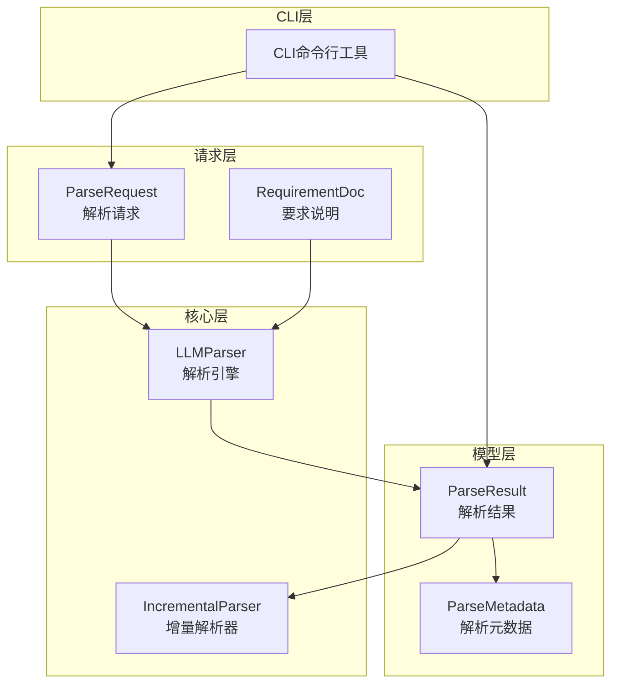
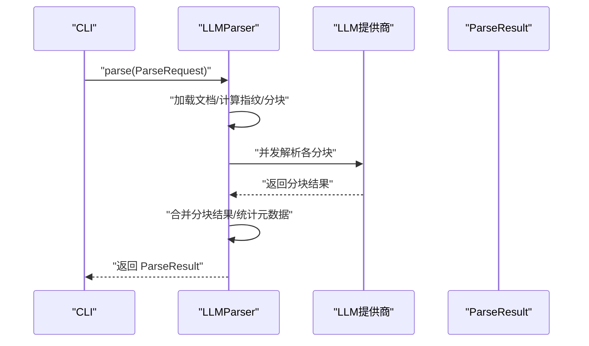
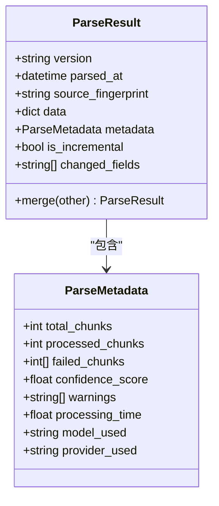
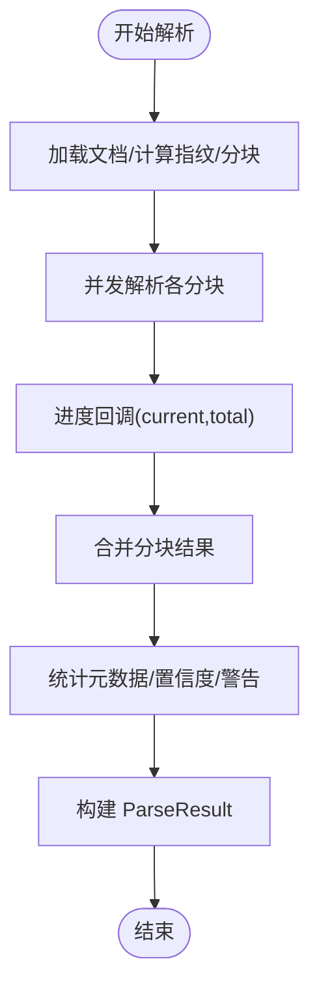
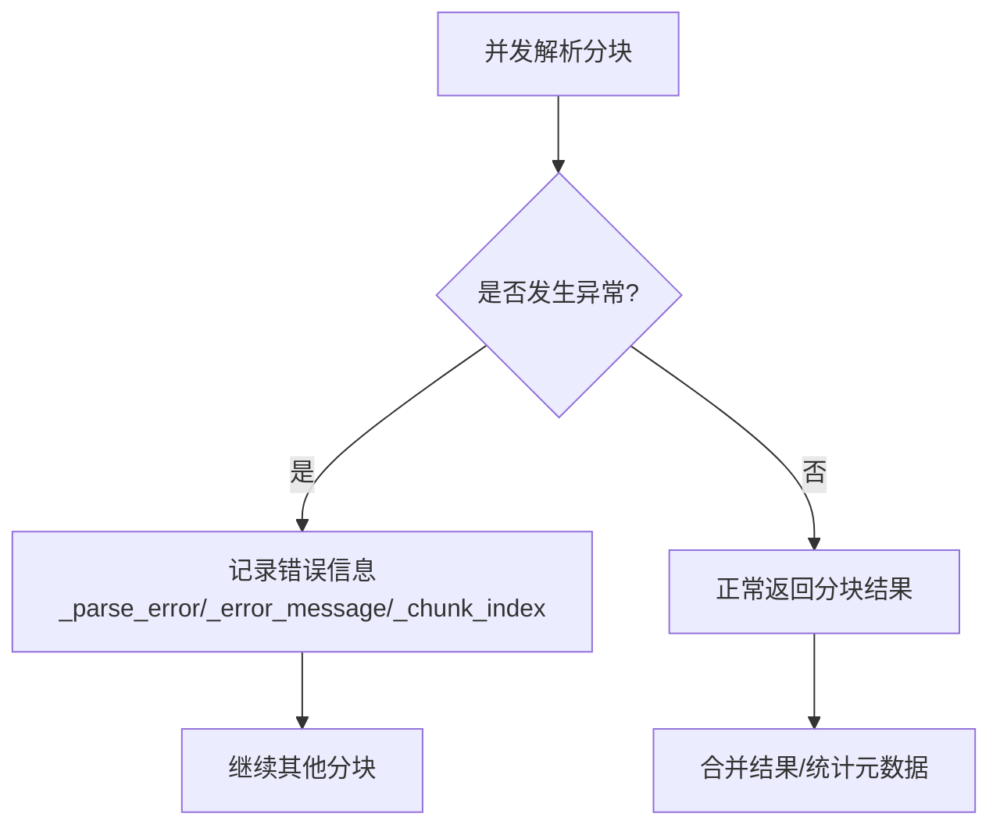
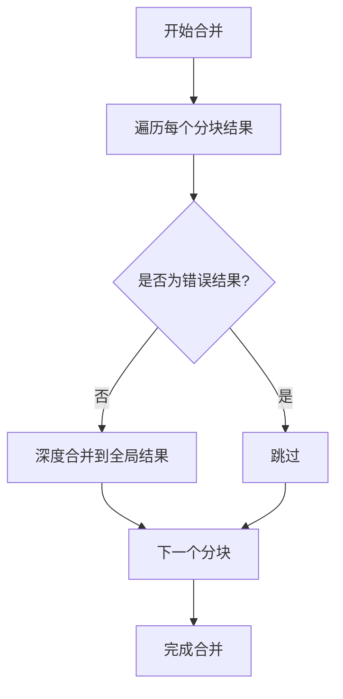
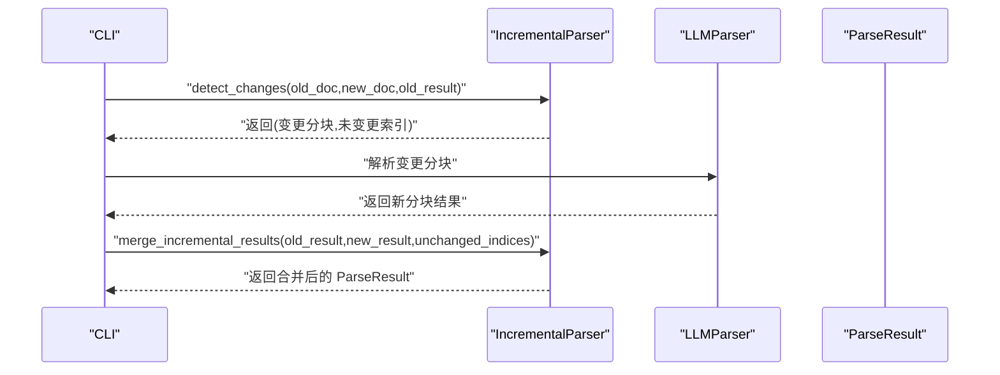
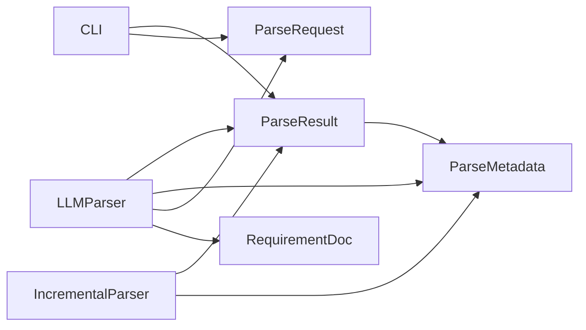

# 结果模型

<cite>
**本文引用的文件**
- [result.py](file://api-doc-parser/src/api_doc_parser/models/result.py)
- [parser.py](file://api-doc-parser/src/api_doc_parser/core/parser.py)
- [incremental.py](file://api-doc-parser/src/api_doc_parser/core/incremental.py)
- [request.py](file://api-doc-parser/src/api_doc_parser/models/request.py)
- [cli.py](file://api-doc-parser/src/api_doc_parser/cli.py)
</cite>

## 目录
1. [简介](#简介)
2. [项目结构](#项目结构)
3. [核心组件](#核心组件)
4. [架构概览](#架构概览)
5. [详细组件分析](#详细组件分析)
6. [依赖分析](#依赖分析)
7. [性能考虑](#性能考虑)
8. [故障排查指南](#故障排查指南)
9. [结论](#结论)
10. [附录](#附录)

## 简介
本文件为“结果模型”提供全面的技术文档，重点围绕 ParseResult 模型的结构设计、字段定义与数据类型、状态管理、进度跟踪、错误信息处理、结果数据的组织结构与层次关系、成功与失败结果格式、访问与处理模式、增量更新的特殊结构与使用场景，以及结果数据的序列化与反序列化实践进行系统化说明。文档同时结合实际代码实现，帮助开发者快速理解并正确使用该模型。

## 项目结构
结果模型位于模型层，与解析器、增量解析器、请求模型等共同构成文档解析流水线：
- 模型层：定义 ParseResult、ParseMetadata 等数据结构
- 核心层：LLMParser 负责解析流程；IncrementalParser 负责增量更新
- 请求层：ParseRequest、RequirementDoc 等定义输入与约束
- CLI 层：演示如何加载先前结果并进行增量更新

图表来源
- [result.py](file://api-doc-parser/src/api_doc_parser/models/result.py#L20-L55)
- [parser.py](file://api-doc-parser/src/api_doc_parser/core/parser.py#L20-L128)
- [incremental.py](file://api-doc-parser/src/api_doc_parser/core/incremental.py#L14-L150)
- [request.py](file://api-doc-parser/src/api_doc_parser/models/request.py#L51-L57)
- [cli.py](file://api-doc-parser/src/api_doc_parser/cli.py#L170-L210)

章节来源
- [result.py](file://api-doc-parser/src/api_doc_parser/models/result.py#L1-L55)
- [parser.py](file://api-doc-parser/src/api_doc_parser/core/parser.py#L1-L128)
- [incremental.py](file://api-doc-parser/src/api_doc_parser/core/incremental.py#L1-L150)
- [request.py](file://api-doc-parser/src/api_doc_parser/models/request.py#L1-L57)
- [cli.py](file://api-doc-parser/src/api_doc_parser/cli.py#L170-L210)

## 核心组件
- ParseResult：封装一次解析的最终结果，包含版本、解析时间、源文档指纹、动态结构化的解析数据、解析元数据，以及增量更新相关字段。
- ParseMetadata：封装解析过程中的统计与运行信息，如总分块数、已处理分块数、失败分块索引、置信度、警告、处理时间、模型与提供商等。
- LLMParser：负责文档加载、分块、并发解析、合并结果、构建 ParseResult。
- IncrementalParser：负责检测文档变更、增量合并结果、维护 is_incremental 与 changed_fields 字段。
- ParseRequest/RequirementDoc：定义输入约束与输出期望，驱动解析器生成符合 schema 的数据。

章节来源
- [result.py](file://api-doc-parser/src/api_doc_parser/models/result.py#L8-L55)
- [parser.py](file://api-doc-parser/src/api_doc_parser/core/parser.py#L20-L128)
- [incremental.py](file://api-doc-parser/src/api_doc_parser/core/incremental.py#L14-L150)
- [request.py](file://api-doc-parser/src/api_doc_parser/models/request.py#L51-L57)

## 架构概览
解析流程从请求开始，经过分块、并发解析、合并、统计与构建 ParseResult，最终输出结构化结果。增量解析在已有结果基础上仅对变更部分进行解析，并合并到旧结果中。

图表来源
- [parser.py](file://api-doc-parser/src/api_doc_parser/core/parser.py#L46-L128)
- [result.py](file://api-doc-parser/src/api_doc_parser/models/result.py#L20-L55)

章节来源
- [parser.py](file://api-doc-parser/src/api_doc_parser/core/parser.py#L46-L128)
- [result.py](file://api-doc-parser/src/api_doc_parser/models/result.py#L20-L55)

## 详细组件分析

### ParseResult 类结构与字段定义
- 版本号 version：字符串，默认“1.0”，用于标识结果格式版本。
- 解析时间 parsed_at：datetime，记录解析完成的时间。
- 源文档指纹 source_fingerprint：可选字符串，用于标识源文档内容的指纹。
- 结果数据 data：动态字典，键为字符串，值为任意类型，表示解析得到的结构化数据，其结构由 RequirementDoc.output_schema 决定。
- 解析元数据 metadata：ParseMetadata，包含统计与运行信息。
- 增量更新字段 is_incremental：布尔值，标记是否为增量更新结果。
- 变更字段 changed_fields：字符串列表，记录本次增量更新涉及的字段名。

图表来源
- [result.py](file://api-doc-parser/src/api_doc_parser/models/result.py#L8-L55)

章节来源
- [result.py](file://api-doc-parser/src/api_doc_parser/models/result.py#L8-L55)

### ParseMetadata 字段与含义
- total_chunks：总分块数，来源于分块阶段。
- processed_chunks：已成功处理的分块数，用于计算置信度。
- failed_chunks：失败分块索引列表，便于定位问题分块。
- confidence_score：整体置信度，按成功分块占比计算。
- warnings：警告信息列表，汇总各分块的警告与错误信息。
- processing_time：处理耗时（秒），用于性能评估。
- model_used/provider_used：使用的模型与提供商名称，便于溯源。

章节来源
- [result.py](file://api-doc-parser/src/api_doc_parser/models/result.py#L8-L18)
- [parser.py](file://api-doc-parser/src/api_doc_parser/core/parser.py#L99-L113)

### 状态管理与进度跟踪
- 进度回调：解析器在并发处理每个分块后调用进度回调，传入当前进度与总数，可用于 UI 进度条展示。
- 元数据统计：解析完成后，根据失败分块索引、成功分块数、处理时间等构建 ParseMetadata，作为状态快照。
- 置信度计算：通过成功分块数占总分块数的比例计算置信度，反映整体解析质量。

图表来源
- [parser.py](file://api-doc-parser/src/api_doc_parser/core/parser.py#L46-L128)

章节来源
- [parser.py](file://api-doc-parser/src/api_doc_parser/core/parser.py#L46-L128)

### 错误信息处理
- 异常捕获：并发解析过程中捕获异常，记录分块索引与错误消息，避免中断整个流程。
- 失败分块索引：通过遍历分块结果，收集带有错误标记的分块索引，便于后续重试或诊断。
- 警告聚合：从各分块结果中提取 warnings 字段，统一汇总到 ParseMetadata.warnings 中。

图表来源
- [parser.py](file://api-doc-parser/src/api_doc_parser/core/parser.py#L130-L169)
- [parser.py](file://api-doc-parser/src/api_doc_parser/core/parser.py#L99-L113)

章节来源
- [parser.py](file://api-doc-parser/src/api_doc_parser/core/parser.py#L130-L169)
- [parser.py](file://api-doc-parser/src/api_doc_parser/core/parser.py#L99-L113)

### 结果数据的组织结构与层次关系
- 动态结构：data 字段为字典，键为字符串，值为任意类型，结构由 RequirementDoc.output_schema 决定。
- 嵌套关系：支持嵌套对象与数组，解析器在合并时采用深度合并策略，递归合并字典、去重合并列表。
- 内部字段过滤：合并时跳过以“_”开头的内部字段，避免污染业务数据。

图表来源
- [parser.py](file://api-doc-parser/src/api_doc_parser/core/parser.py#L202-L236)

章节来源
- [parser.py](file://api-doc-parser/src/api_doc_parser/core/parser.py#L202-L236)

### 成功解析与失败处理的不同结果格式
- 成功格式：data 包含符合 schema 的结构化数据；metadata 中 processed_chunks > 0；confidence_score > 0；无 failed_chunks。
- 失败格式：部分或全部分块返回错误标记；failed_chunks 包含对应索引；warnings 中包含错误信息；confidence_score 降低。

章节来源
- [parser.py](file://api-doc-parser/src/api_doc_parser/core/parser.py#L99-L113)
- [parser.py](file://api-doc-parser/src/api_doc_parser/core/parser.py#L130-L169)

### 结果数据的访问模式与处理方法
- 直接访问：通过属性访问 version、parsed_at、source_fingerprint、metadata、data。
- 统计访问：通过 metadata 获取 total_chunks、processed_chunks、failed_chunks、confidence_score、warnings、processing_time、model_used、provider_used。
- 增量访问：当 is_incremental 为真时，通过 changed_fields 快速定位变更字段。

章节来源
- [result.py](file://api-doc-parser/src/api_doc_parser/models/result.py#L20-L55)

### 增量更新结果的特殊结构与使用场景
- 触发条件：CLI 或上层逻辑传入 previous_result（旧的 ParseResult），驱动增量解析。
- 检测变更：IncrementalParser 比较新旧文档指纹与分块指纹，区分变更与未变更分块。
- 合并策略：保留未变更部分，仅合并变更部分；更新元数据统计与置信度；设置 is_incremental 为真，记录 changed_fields。
- 使用场景：文档局部更新、版本迭代、持续集成中的增量解析。

图表来源
- [incremental.py](file://api-doc-parser/src/api_doc_parser/core/incremental.py#L29-L74)
- [incremental.py](file://api-doc-parser/src/api_doc_parser/core/incremental.py#L90-L150)
- [cli.py](file://api-doc-parser/src/api_doc_parser/cli.py#L170-L190)

章节来源
- [incremental.py](file://api-doc-parser/src/api_doc_parser/core/incremental.py#L14-L150)
- [cli.py](file://api-doc-parser/src/api_doc_parser/cli.py#L170-L190)

### 结果数据的序列化与反序列化示例
- 序列化：CLI 在保存结果时，将 ParseResult 转换为字典并写入 JSON 文件，便于持久化与传输。
- 反序列化：CLI 在增量更新前，读取旧 JSON 文件，将其转换为 ParseResult 对象，再作为 previous_result 传入解析请求。
- 注意事项：使用 Pydantic 的 dict() 方法导出；注意字段命名与类型兼容性；必要时进行字段校验与清理。

章节来源
- [cli.py](file://api-doc-parser/src/api_doc_parser/cli.py#L170-L190)

## 依赖分析
- ParseResult 依赖 ParseMetadata；两者均来自模型层。
- LLMParser 依赖 ParseResult、ParseMetadata、RequirementDoc、Document、Chunk；负责构建与填充结果。
- IncrementalParser 依赖 ParseResult、ParseMetadata、Document、Chunk；负责增量合并。
- CLI 依赖 ParseResult、ParseRequest；负责加载旧结果与保存新结果。

图表来源
- [result.py](file://api-doc-parser/src/api_doc_parser/models/result.py#L20-L55)
- [parser.py](file://api-doc-parser/src/api_doc_parser/core/parser.py#L20-L128)
- [incremental.py](file://api-doc-parser/src/api_doc_parser/core/incremental.py#L14-L150)
- [request.py](file://api-doc-parser/src/api_doc_parser/models/request.py#L51-L57)
- [cli.py](file://api-doc-parser/src/api_doc_parser/cli.py#L170-L190)

章节来源
- [result.py](file://api-doc-parser/src/api_doc_parser/models/result.py#L20-L55)
- [parser.py](file://api-doc-parser/src/api_doc_parser/core/parser.py#L20-L128)
- [incremental.py](file://api-doc-parser/src/api_doc_parser/core/incremental.py#L14-L150)
- [request.py](file://api-doc-parser/src/api_doc_parser/models/request.py#L51-L57)
- [cli.py](file://api-doc-parser/src/api_doc_parser/cli.py#L170-L190)

## 性能考虑
- 并发控制：解析器使用信号量限制并发数，避免资源争用。
- 缓存机制：基于内容与配置计算缓存键，命中则直接返回缓存结果，减少重复调用。
- 列表合并去重：针对列表字段，优先基于关键字段（如 path/name/endpoint/url/id）去重，提升合并效率与准确性。
- 处理时间统计：记录整体处理时间，便于性能监控与优化。

章节来源
- [parser.py](file://api-doc-parser/src/api_doc_parser/core/parser.py#L130-L169)
- [parser.py](file://api-doc-parser/src/api_doc_parser/core/parser.py#L300-L304)
- [parser.py](file://api-doc-parser/src/api_doc_parser/core/parser.py#L238-L269)

## 故障排查指南
- 分块失败定位：检查 failed_chunks 列表，结合错误消息定位具体分块。
- 置信度低：若 processed_chunks 远小于 total_chunks，需检查模型配置、分块大小与重试策略。
- 警告信息：查看 warnings 列表，关注分块级与全局级警告，及时调整要求说明或输出 schema。
- 增量更新异常：确认旧结果的 source_fingerprint 与文档指纹一致；检查 changed_fields 是否合理。

章节来源
- [parser.py](file://api-doc-parser/src/api_doc_parser/core/parser.py#L99-L113)
- [parser.py](file://api-doc-parser/src/api_doc_parser/core/parser.py#L279-L294)
- [incremental.py](file://api-doc-parser/src/api_doc_parser/core/incremental.py#L90-L150)

## 结论
ParseResult 作为解析流水线的最终产物，不仅承载了结构化的业务数据，还提供了丰富的元数据与状态信息，支持成功与失败场景的统一表达。结合增量解析能力，可在文档频繁更新的场景中显著提升效率。通过合理的序列化与反序列化实践，可实现结果的持久化与跨系统共享。

## 附录
- 字段速查：version、parsed_at、source_fingerprint、data、metadata、is_incremental、changed_fields。
- 关键流程：并发解析、深度合并、统计与置信度计算、增量合并。
- 实践建议：在 CLI 中保存 ParseResult 为 JSON；在增量更新前先加载旧结果；根据 warnings 与 failed_chunks 定位问题并优化 schema。