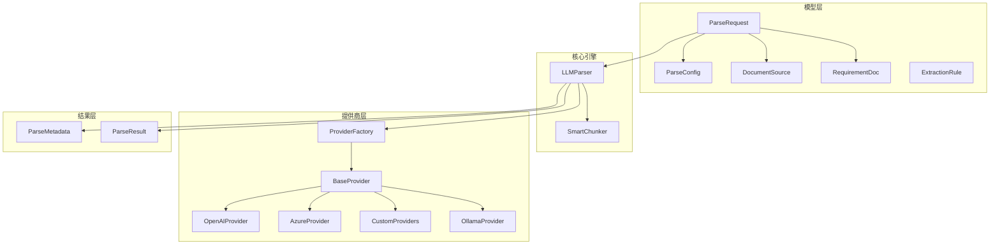
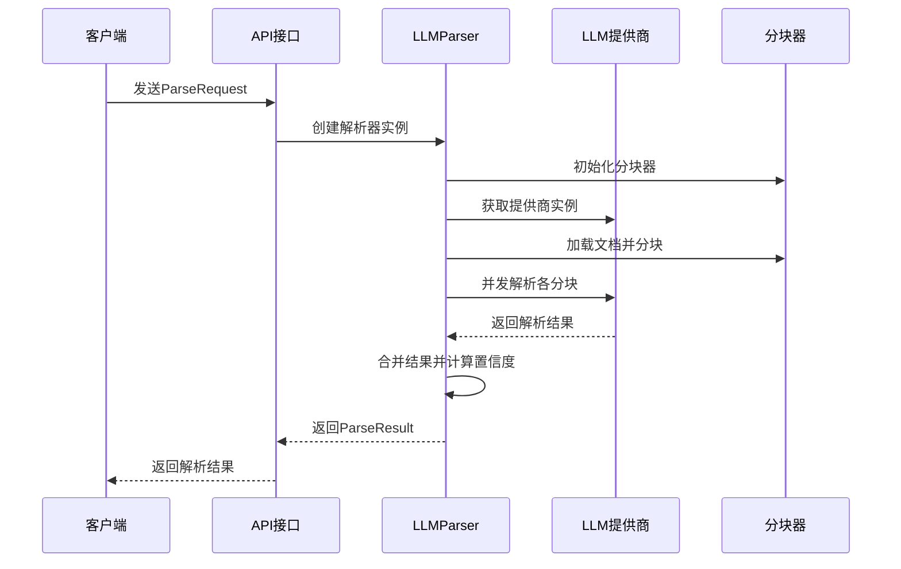
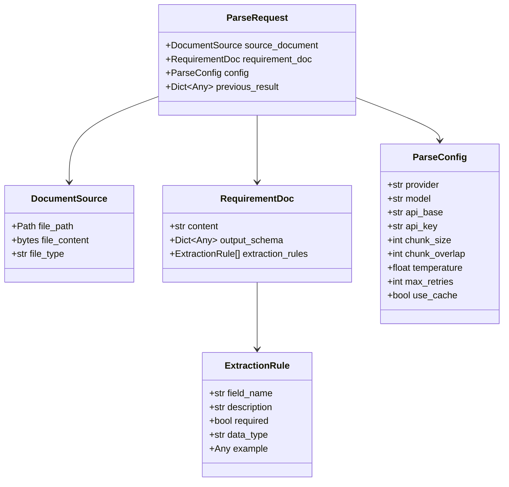

# 请求模型

<cite>
**本文引用的文件**
- [request.py](file://src/models/request.py)
- [parser.py](file://src/core/parser.py)
- [base.py](file://src/providers/base.py)
- [factory.py](file://src/providers/factory.py)
- [document.py](file://src/models/document.py)
- [result.py](file://src/models/result.py)
- [api.py](file://src/api.py)
- [cli.py](file://src/cli.py)
- [__init__.py](file://src/models/__init__.py)
- [README.md](file://README.md)
</cite>

## 更新摘要
**所做更改**
- 更新了ParseRequest主模型的字段定义和使用方式
- 新增了RequirementDoc的详细说明和使用场景
- 补充了ExtractionRule的字段验证和约束规则
- 更新了ParseConfig的提供商配置和参数说明
- 增加了增量更新功能的详细说明
- 补充了实际使用示例和最佳实践

## 目录
1. [简介](#简介)
2. [项目结构](#项目结构)
3. [核心组件](#核心组件)
4. [架构概览](#架构概览)
5. [详细组件分析](#详细组件分析)
6. [依赖分析](#依赖分析)
7. [性能考虑](#性能考虑)
8. [故障排除指南](#故障排除指南)
9. [结论](#结论)
10. [附录](#附录)

## 简介
本文档详细解释了 ParseRequest 请求模型的设计理念、字段定义和数据类型。ParseRequest 是整个 API 文档解析系统的核心输入模型，负责封装文档来源、解析要求、提供商配置和解析选项等关键信息。本文将深入分析其设计理念、字段作用、验证规则、默认值设置、业务逻辑约束，并提供具体的使用示例和最佳实践。

## 项目结构
该项目采用模块化设计，核心解析流程围绕 ParseRequest 模型展开：



**图表来源**
- [request.py](file://src/models/request.py#L51-L57)
- [parser.py](file://src/core/parser.py#L20-L31)
- [factory.py](file://src/providers/factory.py#L14-L71)

**章节来源**
- [request.py](file://src/models/request.py#L1-L57)
- [parser.py](file://src/core/parser.py#L1-L304)

## 核心组件
ParseRequest 模型由四个主要组件构成，每个组件都有明确的职责和验证规则：

### 主要组件概述
- **DocumentSource**: 文档来源信息，支持文件路径和文件内容两种方式
- **RequirementDoc**: 解析要求文档，包含需求说明、输出模式和提取规则
- **ParseConfig**: 解析配置，控制提供商选择、模型参数和解析行为
- **ParseRequest**: 主请求模型，整合所有解析相关信息

### 字段验证和默认值
- 所有字段均使用 Pydantic 验证，确保数据类型正确性和完整性
- 关键字段提供合理的默认值，降低使用复杂度
- 必填字段在模型层面强制验证，防止运行时错误

**章节来源**
- [request.py](file://src/models/request.py#L8-L57)

## 架构概览
ParseRequest 在整个解析系统中的作用和交互关系如下：



**图表来源**
- [parser.py](file://src/core/parser.py#L46-L128)
- [api.py](file://src/api.py#L76-L155)

## 详细组件分析

### ParseRequest 主模型
ParseRequest 是最顶层的请求模型，负责协调整个解析流程。

#### 字段定义和作用
- **source_document**: 文档来源信息，决定解析的数据来源
- **requirement_doc**: 解析要求，定义期望的输出格式和提取规则
- **config**: 解析配置，控制提供商和模型参数
- **previous_result**: 增量更新支持，允许基于历史结果进行增量解析

#### 设计理念
- **组合优于继承**: 通过组合多个专门的模型实现复杂功能
- **可扩展性**: 支持多种提供商和解析策略
- **向后兼容**: 通过可选字段保持向后兼容性

**章节来源**
- [request.py](file://src/models/request.py#L51-L57)

### DocumentSource 文档来源
DocumentSource 提供灵活的文档输入方式，支持文件路径和文件内容两种模式。

#### 字段详解
- **file_path**: 文件系统路径，适用于服务器端文件访问
- **file_content**: 二进制文件内容，适用于内存中的文件处理
- **file_type**: 文档类型，支持 pdf、docx、xlsx、txt、md 五种格式

#### 选择原则
- 当处理服务器上的静态文件时使用 file_path
- 当处理上传的文件或内存中的文件时使用 file_content
- 两种方式互斥，只能选择其一

**章节来源**
- [request.py](file://src/models/request.py#L17-L22)

### RequirementDoc 解析要求
RequirementDoc 定义了解析的具体要求和期望输出格式。

#### 核心字段
- **content**: 解析要求的详细说明，指导 LLM 如何提取信息
- **output_schema**: JSON Schema 输出模式，定义期望的结构
- **extraction_rules**: 提取规则列表，提供字段级别的详细说明

#### 使用场景
- 当需要严格控制输出格式时使用 output_schema
- 当需要详细说明提取规则时使用 extraction_rules
- 两者可以结合使用，提供更精确的控制

**章节来源**
- [request.py](file://src/models/request.py#L24-L29)

### ExtractionRule 提取规则
ExtractionRule 提供字段级的提取规则定义。

#### 字段含义
- **field_name**: 字段名称，对应输出数据中的键名
- **description**: 字段描述，详细说明字段含义和提取要求
- **required**: 是否必需，控制字段的存在性要求
- **data_type**: 数据类型，默认为 string
- **example**: 示例值，提供字段值的参考格式

#### 验证规则
- required 字段控制字段的必要性
- data_type 影响字段的类型转换和验证
- example 提供字段值的参考格式

**章节来源**
- [request.py](file://src/models/request.py#L8-L15)

### ParseConfig 解析配置
ParseConfig 控制整个解析过程的行为和参数。

#### 提供商配置
- **provider**: LLM 提供商选择，默认 openai
- **model**: 模型名称，可选覆盖默认模型
- **api_base**: 自定义 API 基础 URL，用于自定义提供商
- **api_key**: API 密钥，用于身份验证

#### 解析行为配置
- **chunk_size**: 分块大小，默认 3000 token
- **chunk_overlap**: 分块重叠大小，默认 200 token
- **temperature**: 模型温度参数，默认 0.1
- **max_retries**: 最大重试次数，默认 3
- **use_cache**: 是否使用缓存，默认 True

#### 验证和约束
- provider 必须是预定义的提供商之一
- 自定义提供商需要 api_base 参数
- 数值字段有合理的默认范围

**章节来源**
- [request.py](file://src/models/request.py#L31-L49)

## 依赖分析

### 组件耦合关系


**图表来源**
- [request.py](file://src/models/request.py#L8-L57)

### 外部依赖
- **Pydantic**: 数据验证和序列化
- **structlog**: 日志记录
- **asyncio**: 异步处理
- **typing**: 类型注解

**章节来源**
- [request.py](file://src/models/request.py#L3-L5)
- [parser.py](file://src/core/parser.py#L3-L17)

## 性能考虑
ParseRequest 模型在设计时充分考虑了性能优化：

### 缓存机制
- **内存缓存**: 使用字典存储解析结果，避免重复计算
- **缓存键**: 基于内容指纹和配置生成唯一键
- **命中率优化**: 相同输入的重复解析可显著提升性能

### 并发处理
- **并发限制**: 使用信号量控制最大并发数
- **异步解析**: 支持大规模文档的高效处理
- **进度回调**: 提供实时进度反馈

### 内存管理
- **流式处理**: 支持大文件的分块处理
- **垃圾回收**: 及时清理临时数据
- **资源限制**: 配置最大文件大小和处理时间

## 故障排除指南

### 常见错误和解决方案

#### 提供商配置错误
- **问题**: 选择了不支持的提供商
- **解决方案**: 检查提供商名称是否在支持列表中
- **预防**: 使用工厂方法进行提供商创建

#### 文件类型不支持
- **问题**: file_type 不在支持范围内
- **解决方案**: 确认文件扩展名正确
- **预防**: 使用内置的文件类型检测

#### 配置参数错误
- **问题**: 自定义提供商缺少 api_base
- **解决方案**: 提供完整的 API 基础 URL
- **预防**: 在创建配置时进行参数验证

#### 内存不足
- **问题**: 处理超大文档时内存溢出
- **解决方案**: 减小 chunk_size 或增加系统内存
- **预防**: 监控内存使用情况

**章节来源**
- [factory.py](file://src/providers/factory.py#L66-L69)
- [config.py](file://src/config.py#L50-L52)

## 结论
ParseRequest 模型通过精心设计的组件结构和严格的验证机制，为 API 文档解析提供了强大而灵活的基础设施。其设计理念体现了现代软件工程的最佳实践：高内聚、低耦合、可扩展和易维护。通过合理使用该模型，开发者可以轻松构建各种复杂的文档解析应用场景。

## 附录

### 使用示例和最佳实践

#### 基本使用模式
1. **简单解析**: 使用默认配置解析标准文档
2. **定制解析**: 通过 RequirementDoc 和 ParseConfig 定制解析行为
3. **增量更新**: 利用 previous_result 实现文档变更的增量解析

#### 异步解析 vs 同步解析
- **异步解析**: 适用于大文档和批量处理，通过任务队列管理
- **同步解析**: 适用于小文档和实时场景，直接返回结果

#### 错误处理策略
- **重试机制**: 自动重试失败的请求
- **降级处理**: 在提供商不可用时使用备用方案
- **日志记录**: 详细记录解析过程和错误信息

#### 实际使用示例

**基本请求示例**
```python
from src.models.request import ParseRequest, DocumentSource, RequirementDoc, ParseConfig

# 创建文档来源
source_document = DocumentSource(
    file_path="api_document.pdf",
    file_type="pdf"
)

# 创建解析要求
requirement_doc = RequirementDoc(
    content="从API文档中提取所有API端点信息，包括路径、方法、描述和参数",
    output_schema={
        "type": "object",
        "properties": {
            "endpoints": {
                "type": "array",
                "items": {
                    "type": "object",
                    "properties": {
                        "path": {"type": "string"},
                        "method": {"type": "string"},
                        "description": {"type": "string"}
                    }
                }
            }
        }
    }
)

# 创建解析配置
config = ParseConfig(
    provider="openai",
    model="gpt-4",
    temperature=0.1,
    chunk_size=3000
)

# 创建完整请求
request = ParseRequest(
    source_document=source_document,
    requirement_doc=requirement_doc,
    config=config
)
```

**增量更新示例**
```python
# 加载之前的解析结果
prev_result = ParseResult.parse_file("previous_result.json")

# 创建增量更新请求
incremental_request = ParseRequest(
    source_document=DocumentSource(
        file_path="updated_document.pdf",
        file_type="pdf"
    ),
    requirement_doc=requirement_doc,
    config=config,
    previous_result=prev_result.dict()
)
```

**章节来源**
- [api.py](file://src/api.py#L177-L200)
- [cli.py](file://src/cli.py#L111-L210)
- [README.md](file://README.md#L95-L123)