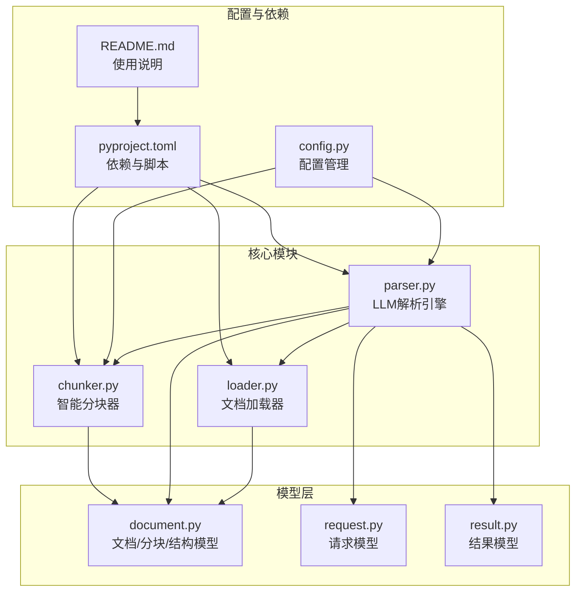
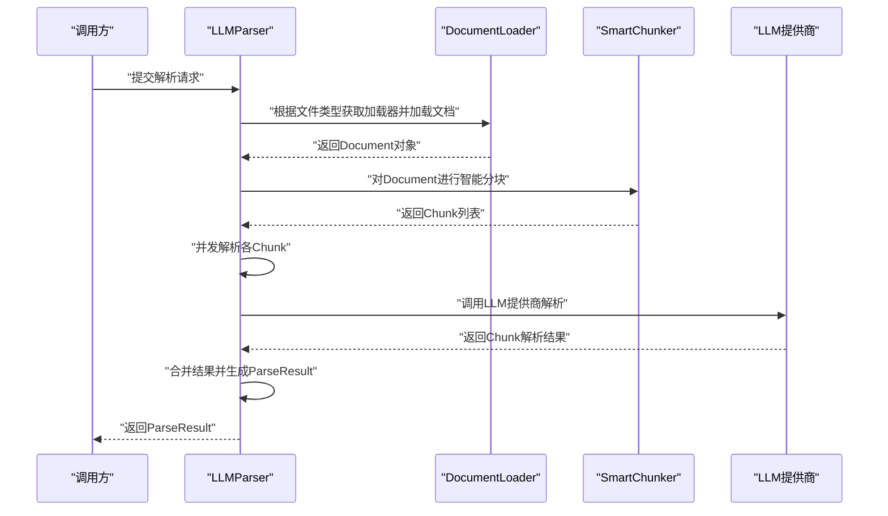
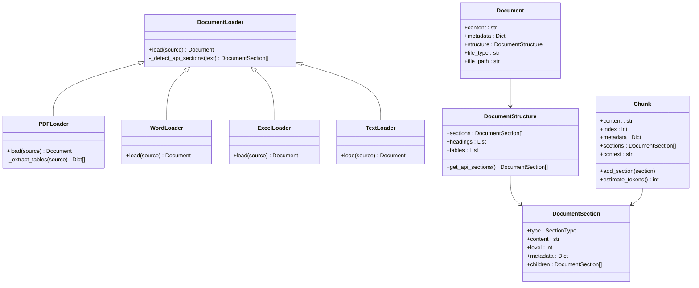

# 文档加载器

<cite>
**本文引用的文件**
- [loader.py](file://api-doc-parser/src/api_doc_parser/core/loader.py)
- [document.py](file://api-doc-parser/src/api_doc_parser/models/document.py)
- [chunker.py](file://api-doc-parser/src/api_doc_parser/core/chunker.py)
- [parser.py](file://api-doc-parser/src/api_doc_parser/core/parser.py)
- [request.py](file://api-doc-parser/src/api_doc_parser/models/request.py)
- [result.py](file://api-doc-parser/src/api_doc_parser/models/result.py)
- [config.py](file://api-doc-parser/src/api_doc_parser/config.py)
- [pyproject.toml](file://api-doc-parser/pyproject.toml)
- [README.md](file://api-doc-parser/README.md)
- [test_chunker.py](file://api-doc-parser/tests/test_chunker.py)
</cite>

## 目录
1. [简介](#简介)
2. [项目结构](#项目结构)
3. [核心组件](#核心组件)
4. [架构总览](#架构总览)
5. [详细组件分析](#详细组件分析)
6. [依赖关系分析](#依赖关系分析)
7. [性能考量](#性能考量)
8. [故障排查指南](#故障排查指南)
9. [结论](#结论)
10. [附录](#附录)

## 简介
本技术文档围绕“文档加载器”展开，系统性阐述多格式文档（PDF、Word、Excel、纯文本、Markdown）的加载实现原理，重点说明 DocumentLoader 抽象类的设计架构、具体加载策略、错误处理机制，以及与“智能分块模块”的集成关系与数据传递流程。同时给出扩展新格式支持的方法、常见问题排查与性能优化建议，帮助开发者快速理解并高效使用该能力。

## 项目结构
该项目采用“核心模块 + 模型层 + 提供商适配 + 工具与配置”的分层组织方式，文档加载器位于核心模块中，负责将不同格式的输入统一为结构化的 Document 对象，供后续解析与分块使用。

图表来源
- [loader.py](file://api-doc-parser/src/api_doc_parser/core/loader.py#L1-L328)
- [chunker.py](file://api-doc-parser/src/api_doc_parser/core/chunker.py#L1-L377)
- [parser.py](file://api-doc-parser/src/api_doc_parser/core/parser.py#L1-L304)
- [document.py](file://api-doc-parser/src/api_doc_parser/models/document.py#L1-L75)
- [request.py](file://api-doc-parser/src/api_doc_parser/models/request.py#L1-L57)
- [result.py](file://api-doc-parser/src/api_doc_parser/models/result.py#L1-L55)
- [config.py](file://api-doc-parser/src/api_doc_parser/config.py#L1-L57)
- [pyproject.toml](file://api-doc-parser/pyproject.toml#L1-L100)
- [README.md](file://api-doc-parser/README.md#L1-L176)

章节来源
- [README.md](file://api-doc-parser/README.md#L136-L157)
- [pyproject.toml](file://api-doc-parser/pyproject.toml#L25-L59)

## 核心组件
- 文档加载器（DocumentLoader 及其子类）：负责将外部输入（路径、字节流、字符串）解析为统一的 Document 对象，内置通用的 API 章节检测逻辑。
- 文档模型（Document/DocumentSection/DocumentStructure/Chunk）：定义文档结构、章节类型、分块等数据结构。
- 智能分块器（SmartChunker）：基于结构感知与长度限制的分块策略，支持滑动窗口与重叠缓冲，确保语义完整性。
- LLM 解析引擎（LLMParser）：串联加载、分块、并发解析、结果合并与元数据统计。

章节来源
- [loader.py](file://api-doc-parser/src/api_doc_parser/core/loader.py#L17-L328)
- [document.py](file://api-doc-parser/src/api_doc_parser/models/document.py#L8-L75)
- [chunker.py](file://api-doc-parser/src/api_doc_parser/core/chunker.py#L10-L377)
- [parser.py](file://api-doc-parser/src/api_doc_parser/core/parser.py#L20-L304)

## 架构总览
文档加载器在整体解析流程中的位置如下：

图表来源
- [parser.py](file://api-doc-parser/src/api_doc_parser/core/parser.py#L63-L128)
- [loader.py](file://api-doc-parser/src/api_doc_parser/core/loader.py#L313-L327)
- [chunker.py](file://api-doc-parser/src/api_doc_parser/core/chunker.py#L28-L62)

## 详细组件分析

### DocumentLoader 抽象类与加载策略
- 设计要点
  - 抽象基类定义统一接口 load(source)，支持 Path、bytes、str 三种输入形式。
  - 内置 _detect_api_sections：通过正则与结构识别，将文本划分为标题、段落、代码块、API端点等章节类型。
- 错误处理
  - PDFLoader 在 finally 中确保文档句柄关闭；表格提取失败不影响主流程。
  - WordLoader/ExcelLoader/TextLoader 对异常进行捕获，保证加载过程稳定。
- 性能与限制
  - PDF 多页顺序读取，文本拼接成本与页数线性相关；表格提取额外开销。
  - Word/Excel 的结构化数据（段落、表格、工作表）会增加元数据体积。
  - TextLoader 仅做简单文本处理，开销最小。

章节来源
- [loader.py](file://api-doc-parser/src/api_doc_parser/core/loader.py#L17-L78)
- [loader.py](file://api-doc-parser/src/api_doc_parser/core/loader.py#L80-L152)
- [loader.py](file://api-doc-parser/src/api_doc_parser/core/loader.py#L155-L230)
- [loader.py](file://api-doc-parser/src/api_doc_parser/core/loader.py#L233-L282)
- [loader.py](file://api-doc-parser/src/api_doc_parser/core/loader.py#L285-L310)

### 具体加载器实现

#### PDFLoader
- 实现要点
  - 支持文件路径与字节流两种输入；使用 PyMuPDF 提取文本，pdfplumber 提取表格。
  - 生成 Document，包含页数、作者、标题等元数据，以及结构化的章节列表。
- 性能与限制
  - 大PDF文件读取与拼接文本成本较高；表格提取可能受页面布局影响。
  - 异常捕获确保表格提取失败不影响整体加载。

章节来源
- [loader.py](file://api-doc-parser/src/api_doc_parser/core/loader.py#L80-L152)

#### WordLoader
- 实现要点
  - 读取段落与表格，识别标题样式并构建章节；表格内容也会写入正文以便后续结构化处理。
- 性能与限制
  - 段落数与表格行列数决定处理复杂度；样式识别依赖 docx 格式规范。

章节来源
- [loader.py](file://api-doc-parser/src/api_doc_parser/core/loader.py#L155-L230)

#### ExcelLoader
- 实现要点
  - 逐表读取，将 DataFrame 转换为文本与结构化数据，汇总到 Document。
- 性能与限制
  - 大表格转文本会产生大量字符串拼接；建议控制 sheet 数量与行数。

章节来源
- [loader.py](file://api-doc-parser/src/api_doc_parser/core/loader.py#L233-L282)

#### TextLoader
- 实现要点
  - 支持字符串、字节流与文件路径；直接进行 API 章节检测。
- 性能与限制
  - 最轻量级，适合纯文本与 Markdown。

章节来源
- [loader.py](file://api-doc-parser/src/api_doc_parser/core/loader.py#L285-L310)

### 文档模型与分块关系
- Document/DocumentSection/DocumentStructure/Chunk 定义了统一的数据结构，便于跨模块传递。
- SmartChunker 以 Document.structure 为依据进行语义分块，优先保持 API 端点、标题、表格、代码块的完整性，再对超长块使用滑动窗口细分，并保留重叠缓冲。

章节来源
- [document.py](file://api-doc-parser/src/api_doc_parser/models/document.py#L20-L75)
- [chunker.py](file://api-doc-parser/src/api_doc_parser/core/chunker.py#L64-L125)
- [chunker.py](file://api-doc-parser/src/api_doc_parser/core/chunker.py#L166-L201)

### 与智能分块模块的集成
- LLMParser 在加载完成后调用 SmartChunker 对 Document 进行分块，随后并发调用 LLM 提供商解析各块，最后合并结果。
- 分块策略考虑：
  - 遇到 API 端点或一级标题即切分；
  - 表格/代码块尽量整块保留；
  - 超长块使用滑动窗口并保留重叠；
  - 为每个块附加上下文摘要，提升下游解析质量。

章节来源
- [parser.py](file://api-doc-parser/src/api_doc_parser/core/parser.py#L63-L128)
- [chunker.py](file://api-doc-parser/src/api_doc_parser/core/chunker.py#L28-L62)

### 类关系图（代码级）

图表来源
- [loader.py](file://api-doc-parser/src/api_doc_parser/core/loader.py#L17-L328)
- [document.py](file://api-doc-parser/src/api_doc_parser/models/document.py#L42-L75)

## 依赖关系分析
- 外部依赖
  - 文档处理：PyMuPDF、pdfplumber、python-docx、openpyxl、pandas
  - LLM SDK：openai、anthropic
  - Web/CLI：fastapi、uvicorn、typer、rich
  - 工具链：structlog、tiktoken、celery、redis、aiofiles、httpx
- 内部耦合
  - LLMParser 依赖 loader、chunker、models、providers
  - SmartChunker 依赖 models 中的 Document/Chunk/SectionType
  - 配置通过 settings 影响默认分块大小、重叠、温度等

章节来源
- [pyproject.toml](file://api-doc-parser/pyproject.toml#L25-L59)
- [parser.py](file://api-doc-parser/src/api_doc_parser/core/parser.py#L13-L15)
- [chunker.py](file://api-doc-parser/src/api_doc_parser/core/chunker.py#L7-L7)

## 性能考量
- 文档加载阶段
  - PDF：页数越多，文本拼接与表格提取成本越高；建议对超大文件拆分或预处理。
  - Word/Excel：段落数与表格规模直接影响处理时间；可限制 sheet 数量与行数。
  - Text：最轻量，适合大批量纯文本处理。
- 分块阶段
  - SmartChunker 的分块大小与重叠设置直接影响下游 LLM 调用次数与成本；默认 3000 token/200 token 的配置适合大多数场景。
  - 对超长表格/代码块采用行级切分并保留表头/代码注释，减少信息丢失。
- 并发与缓存
  - LLMParser 使用信号量限制并发，避免资源争用；支持结果缓存以降低重复解析成本。
- 日志与可观测性
  - 使用 structlog 记录加载、分块、解析关键事件，便于定位性能瓶颈。

章节来源
- [config.py](file://api-doc-parser/src/api_doc_parser/config.py#L43-L48)
- [chunker.py](file://api-doc-parser/src/api_doc_parser/core/chunker.py#L13-L27)
- [parser.py](file://api-doc-parser/src/api_doc_parser/core/parser.py#L130-L169)

## 故障排查指南
- 常见问题
  - PDF 无法打开/乱码：确认文件路径或字节流有效；检查编码与加密情况。
  - Word/Excel 解析异常：检查文件格式是否损坏；确保安装对应依赖。
  - 表格提取失败：pdfplumber 在复杂布局下可能失败，属于预期降级。
  - LLM 解析失败：查看失败块索引与错误消息，调整提示词或模型参数。
- 排查步骤
  - 检查日志：关注“document_loaded”、“document_chunked”、“parse_completed”等关键事件。
  - 验证分块：使用单元测试验证分块行为（如标题切分、API端点保留、重叠校验）。
  - 评估性能：对比不同分块大小与重叠设置下的处理时间与成本。
- 相关测试参考
  - 测试覆盖：基本分块、带标题的语义分块、API端点保留、分块重叠等。

章节来源
- [test_chunker.py](file://api-doc-parser/tests/test_chunker.py#L12-L86)
- [parser.py](file://api-doc-parser/src/api_doc_parser/core/parser.py#L99-L127)

## 结论
文档加载器通过统一抽象与多格式适配，将异构文档标准化为结构化数据，为后续智能分块与 LLM 解析奠定基础。其设计兼顾健壮性（异常捕获与降级）、可扩展性（易于新增格式）与性能（分块策略与缓存）。结合合理的配置与监控，可在生产环境中稳定运行并持续优化。

## 附录

### 如何扩展新的文档格式支持
- 步骤
  - 新建一个继承自 DocumentLoader 的类，实现 load(source) 方法，返回符合 Document 结构的对象。
  - 在 get_loader 中注册新格式映射，确保类型名与文件扩展一致。
  - 若需要表格/结构化信息，可在 Document.metadata 或 DocumentStructure 中补充。
- 示例路径参考
  - 新类定义位置：[loader.py](file://api-doc-parser/src/api_doc_parser/core/loader.py#L17-L328)
  - 注册映射位置：[loader.py](file://api-doc-parser/src/api_doc_parser/core/loader.py#L313-L327)
  - 模型结构参考：[document.py](file://api-doc-parser/src/api_doc_parser/models/document.py#L42-L75)

章节来源
- [loader.py](file://api-doc-parser/src/api_doc_parser/core/loader.py#L17-L328)
- [document.py](file://api-doc-parser/src/api_doc_parser/models/document.py#L42-L75)

### 与智能分块模块的数据传递流程
- 输入：Document（content、metadata、structure）
- 输出：List[Chunk]（content、sections、context、metadata）
- 关键点：结构感知切分、API端点与标题切分、表格/代码块整块保留、滑动窗口与重叠

章节来源
- [chunker.py](file://api-doc-parser/src/api_doc_parser/core/chunker.py#L28-L62)
- [document.py](file://api-doc-parser/src/api_doc_parser/models/document.py#L42-L75)

### 使用与配置参考
- CLI/Web 使用与提供商支持详见 README
- 配置项（分块大小、重叠、温度、最大重试等）详见 config.py

章节来源
- [README.md](file://api-doc-parser/README.md#L51-L94)
- [config.py](file://api-doc-parser/src/api_doc_parser/config.py#L43-L48)