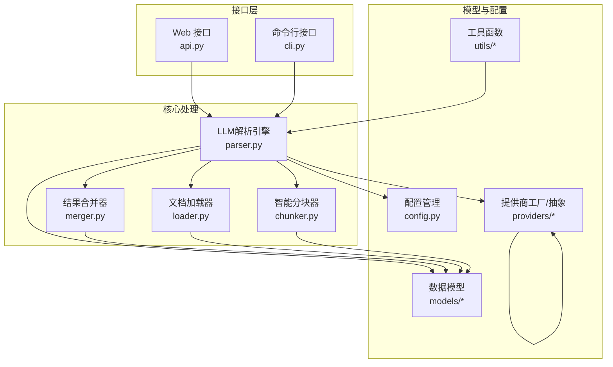
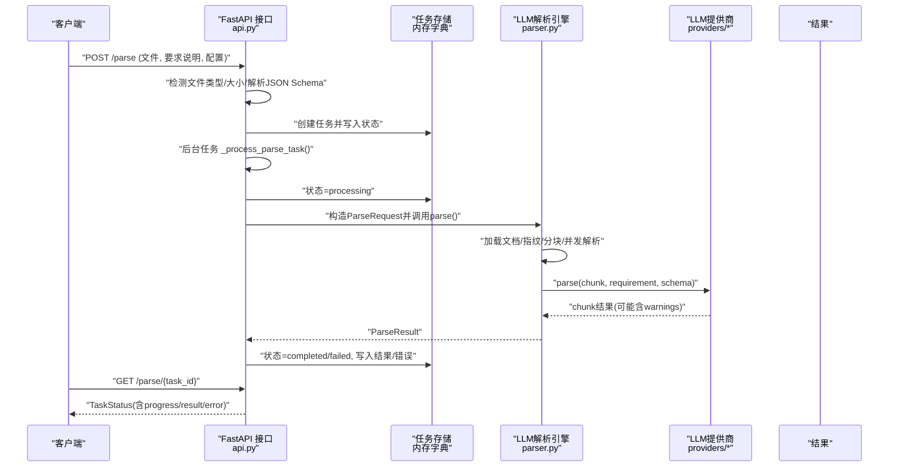
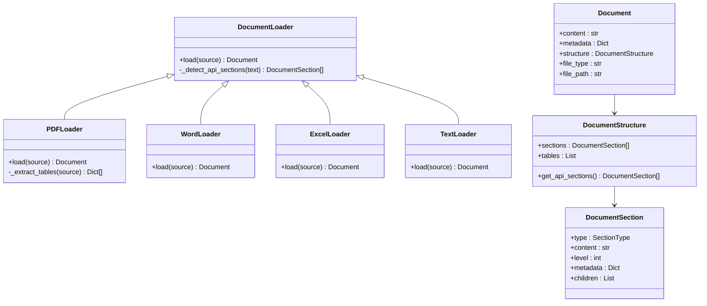
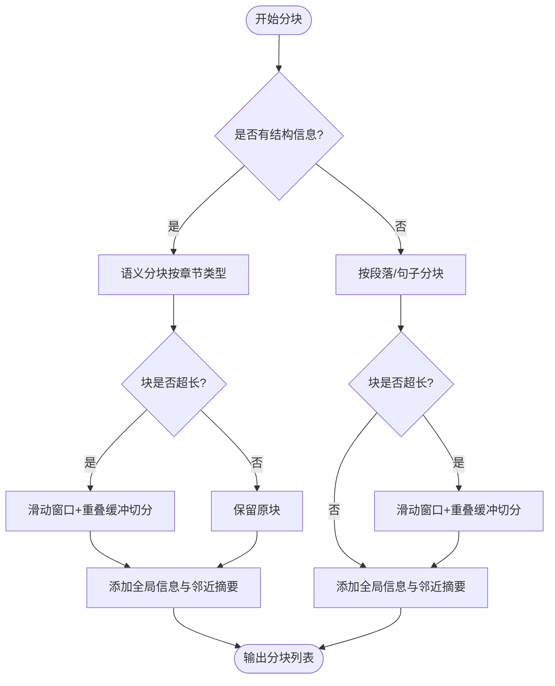
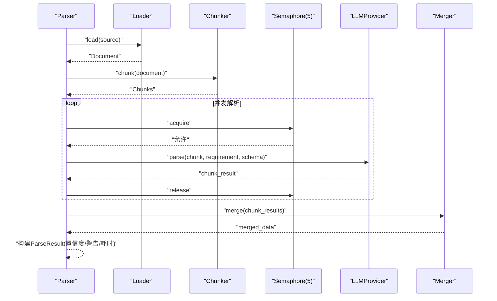
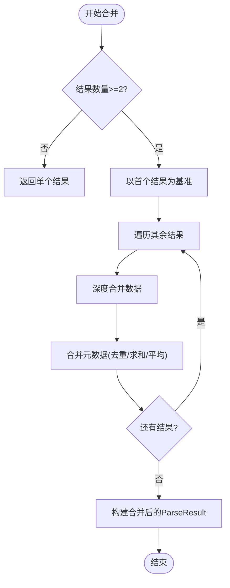
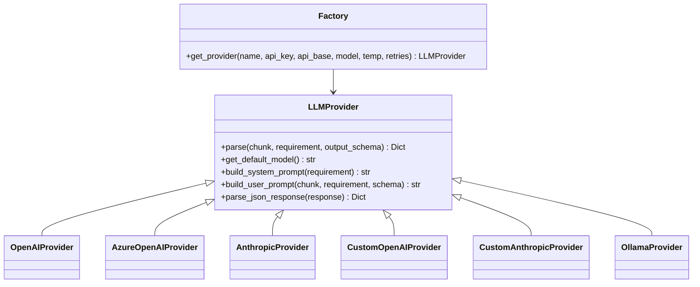
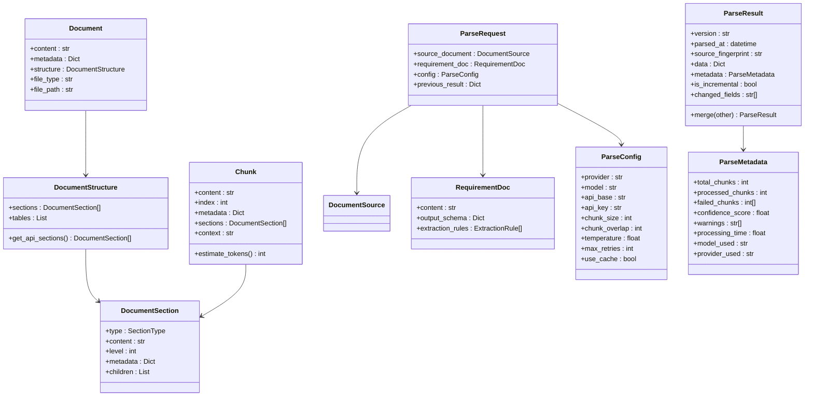
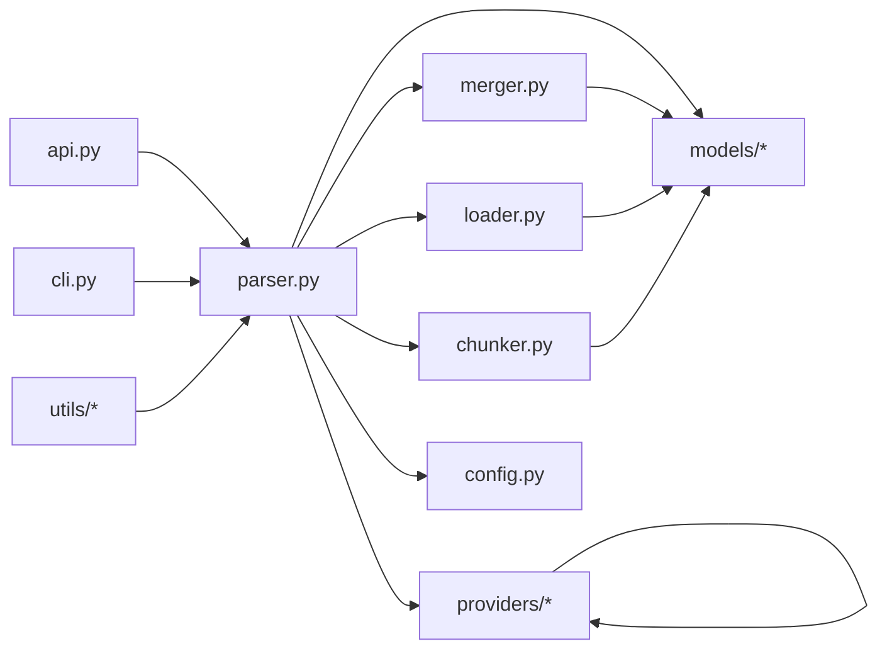

# 文档处理模块

<cite>
**本文引用的文件**
- [api.py](file://api-doc-parser/src/api_doc_parser/api.py)
- [cli.py](file://api-doc-parser/src/api_doc_parser/cli.py)
- [config.py](file://api-doc-parser/src/api_doc_parser/config.py)
- [parser.py](file://api-doc-parser/src/api_doc_parser/core/parser.py)
- [chunker.py](file://api-doc-parser/src/api_doc_parser/core/chunker.py)
- [loader.py](file://api-doc-parser/src/api_doc_parser/core/loader.py)
- [merger.py](file://api-doc-parser/src/api_doc_parser/core/merger.py)
- [request.py](file://api-doc-parser/src/api_doc_parser/models/request.py)
- [result.py](file://api-doc-parser/src/api_doc_parser/models/result.py)
- [document.py](file://api-doc-parser/src/api_doc_parser/models/document.py)
- [factory.py](file://api-doc-parser/src/api_doc_parser/providers/factory.py)
- [base.py](file://api-doc-parser/src/api_doc_parser/providers/base.py)
- [fingerprint.py](file://api-doc-parser/src/api_doc_parser/utils/fingerprint.py)
- [README.md](file://api-doc-parser/README.md)
</cite>

## 目录
1. [简介](#简介)
2. [项目结构](#项目结构)
3. [核心组件](#核心组件)
4. [架构总览](#架构总览)
5. [详细组件分析](#详细组件分析)
6. [依赖关系分析](#依赖关系分析)
7. [性能考量](#性能考量)
8. [故障排查指南](#故障排查指南)
9. [结论](#结论)
10. [附录](#附录)

## 简介
本模块提供“多格式文档 → 结构化数据”的智能解析能力，支持 PDF、Word、Excel、纯文本、Markdown 等格式；通过“结构感知 + 长度限制 + 重叠缓冲”的智能分块策略，结合多 LLM 提供商（OpenAI、Azure OpenAI、Anthropic、Ollama、自定义 OpenAI/Anthropic 协议），实现高鲁棒性的 API 文档解析。模块同时提供 CLI 和 Web 两种使用方式，并内置缓存、进度回调、增量更新、结果合并与指纹校验等工程化能力。

## 项目结构
- 核心目录
  - api.py：FastAPI Web 服务入口，提供异步/同步解析接口、任务状态查询、提供商列表等
  - cli.py：Typer CLI，支持解析、提供商列表、示例要求生成、进度可视化
  - config.py：配置管理，集中管理各提供商默认参数、文件大小限制、分块参数、重试策略等
  - core/：核心处理流水线
    - loader.py：多格式文档加载器（PDF/Word/Excel/Text/Markdown）
    - chunker.py：智能分块器（结构感知 + 滑动窗口 + 上下文增强）
    - parser.py：LLM 解析引擎（并发分块解析、缓存、合并、元数据统计）
    - merger.py：结果合并器（深度合并、列表去重、端点去重）
  - models/：Pydantic 数据模型（请求、结果、文档结构）
  - providers/：LLM 提供商抽象与工厂
  - utils/：工具函数（指纹计算）
- 测试与文档：tests/、README.md

图表来源
- [api.py](file://api-doc-parser/src/api_doc_parser/api.py#L1-L371)
- [cli.py](file://api-doc-parser/src/api_doc_parser/cli.py#L1-L393)
- [parser.py](file://api-doc-parser/src/api_doc_parser/core/parser.py#L1-L304)
- [loader.py](file://api-doc-parser/src/api_doc_parser/core/loader.py#L1-L328)
- [chunker.py](file://api-doc-parser/src/api_doc_parser/core/chunker.py#L1-L377)
- [merger.py](file://api-doc-parser/src/api_doc_parser/core/merger.py#L1-L220)
- [config.py](file://api-doc-parser/src/api_doc_parser/config.py#L1-L57)
- [factory.py](file://api-doc-parser/src/api_doc_parser/providers/factory.py#L1-L71)
- [base.py](file://api-doc-parser/src/api_doc_parser/providers/base.py#L1-L143)
- [fingerprint.py](file://api-doc-parser/src/api_doc_parser/utils/fingerprint.py#L1-L80)

章节来源
- [README.md](file://api-doc-parser/README.md#L1-L176)

## 核心组件
- 文档加载器（多格式支持）
  - PDF：文本抽取 + 表格提取（pdfplumber），并识别 API 端点、标题、代码块等结构
  - Word：段落与表格抽取，识别标题样式，构建结构化章节
  - Excel：逐表转文本 + DataFrame 结构化数据，辅助结构识别
  - Text/Markdown：统一走结构识别逻辑，便于后续分块与解析
- 智能分块器
  - 优先按结构（标题、API 端点、表格、代码块）进行语义分块
  - 对超长块采用滑动窗口 + 句子边界 + 重叠缓冲，确保上下文连续
  - 为每个块注入全局信息与邻近块摘要，提升 LLM 上下文质量
- LLM 解析引擎
  - 并发解析各分块（信号量限制并发度），支持缓存、重试、进度回调
  - 统计置信度、失败分块、警告信息，构建 ParseResult
- 结果合并器
  - 深度合并字典、列表去重（含端点去重）、聚合元数据
- 提供商抽象与工厂
  - 统一接口：parse(chunk, requirement, output_schema) → Dict
  - 工厂按 provider 名称选择具体实现，支持自定义协议与本地模型
- 配置与工具
  - 集中配置默认分块大小/重叠、温度、最大重试、文件大小限制
  - 指纹计算用于缓存键与源文档比对

章节来源
- [loader.py](file://api-doc-parser/src/api_doc_parser/core/loader.py#L1-L328)
- [chunker.py](file://api-doc-parser/src/api_doc_parser/core/chunker.py#L1-L377)
- [parser.py](file://api-doc-parser/src/api_doc_parser/core/parser.py#L1-L304)
- [merger.py](file://api-doc-parser/src/api_doc_parser/core/merger.py#L1-L220)
- [factory.py](file://api-doc-parser/src/api_doc_parser/providers/factory.py#L1-L71)
- [base.py](file://api-doc-parser/src/api_doc_parser/providers/base.py#L1-L143)
- [config.py](file://api-doc-parser/src/api_doc_parser/config.py#L1-L57)
- [fingerprint.py](file://api-doc-parser/src/api_doc_parser/utils/fingerprint.py#L1-L80)

## 架构总览
以下序列图展示“Web 异步解析”流程，体现从请求到结果的全链路：

图表来源
- [api.py](file://api-doc-parser/src/api_doc_parser/api.py#L76-L155)
- [api.py](file://api-doc-parser/src/api_doc_parser/api.py#L302-L353)
- [parser.py](file://api-doc-parser/src/api_doc_parser/core/parser.py#L46-L128)
- [base.py](file://api-doc-parser/src/api_doc_parser/providers/base.py#L34-L57)

章节来源
- [api.py](file://api-doc-parser/src/api_doc_parser/api.py#L1-L371)
- [parser.py](file://api-doc-parser/src/api_doc_parser/core/parser.py#L1-L304)

## 详细组件分析

### 文档加载器（多格式支持）
- 设计要点
  - 抽象基类 DocumentLoader + 多实现（PDF/Word/Excel/Text/Markdown）
  - 统一输出 Document（content、metadata、structure、file_type、file_path）
  - 内置 API 端点/标题/代码块识别，为分块提供结构信息
- 关键行为
  - PDF：pymupdf 抽取文本 + pdfplumber 抽取表格；保留页码信息
  - Word：段落与表格抽取；识别标题样式；表格转文本并追加到正文
  - Excel：逐表转 DataFrame + 文本；记录 sheet 信息
  - Text/Markdown：统一结构识别，便于后续分块
- 性能与健壮性
  - 表格提取失败不影响主流程（捕获异常）
  - 通过结构信息减少无效分块，提高 LLM 效率

图表来源
- [loader.py](file://api-doc-parser/src/api_doc_parser/core/loader.py#L17-L327)
- [document.py](file://api-doc-parser/src/api_doc_parser/models/document.py#L20-L75)

章节来源
- [loader.py](file://api-doc-parser/src/api_doc_parser/core/loader.py#L1-L328)
- [document.py](file://api-doc-parser/src/api_doc_parser/models/document.py#L1-L75)

### 智能分块器（结构感知 + 滑动窗口 + 重叠缓冲）
- 设计要点
  - 若有结构信息：按章节类型（标题、API 端点、表格、代码块）进行语义分块
  - 若块过大：按句子边界 + 滑动窗口 + 重叠缓冲切分
  - 为每个块注入全局信息与邻近块摘要，提升上下文质量
- 关键规则
  - 遇到 API 端点或一级标题即切分，保证语义完整性
  - 表格/代码块超过阈值时单独切分，保留表头/注释等关键前缀
  - 重叠长度按字符估算（1 token ≈ 4 字符），尽量在句界处截断
- 复杂度与优化
  - 估算 token 数量为 O(n)，分块过程受结构数量与内容长度影响
  - 通过重叠与邻近摘要降低跨块信息缺失风险

图表来源
- [chunker.py](file://api-doc-parser/src/api_doc_parser/core/chunker.py#L28-L62)
- [chunker.py](file://api-doc-parser/src/api_doc_parser/core/chunker.py#L166-L201)
- [chunker.py](file://api-doc-parser/src/api_doc_parser/core/chunker.py#L292-L311)

章节来源
- [chunker.py](file://api-doc-parser/src/api_doc_parser/core/chunker.py#L1-L377)

### LLM 解析引擎（并发 + 缓存 + 合并）
- 处理流程
  - 加载文档 → 计算指纹 → 分块 → 并发解析各块 → 合并结果 → 构建 ParseResult（含置信度、警告、处理时间、提供商/模型信息）
- 并发与限流
  - 使用信号量限制并发数（默认 5），避免 LLM 速率限制与资源争用
  - 支持进度回调，便于 UI/任务系统反馈
- 缓存与重试
  - 基于内容指纹与要求的缓存键，命中则直接返回
  - 提供商层具备最大重试次数与延迟策略
- 合并与去重
  - 深度合并字典，列表按字段去重（优先 path+method），失败块索引与警告汇总

图表来源
- [parser.py](file://api-doc-parser/src/api_doc_parser/core/parser.py#L46-L128)
- [parser.py](file://api-doc-parser/src/api_doc_parser/core/parser.py#L130-L169)
- [parser.py](file://api-doc-parser/src/api_doc_parser/core/parser.py#L202-L236)
- [base.py](file://api-doc-parser/src/api_doc_parser/providers/base.py#L34-L57)

章节来源
- [parser.py](file://api-doc-parser/src/api_doc_parser/core/parser.py#L1-L304)

### 结果合并器（深度合并 + 列表去重）
- 能力
  - 深度合并字典、列表去重（含端点去重）
  - 聚合多个 ParseResult 的元数据（总块数、成功块数、失败块索引、置信度、警告、处理时间）
- 端点去重策略
  - 优先使用 path+method 组合作为唯一键，其次 name/url/id 等
  - 无法确定唯一键时退化为简单去重

图表来源
- [merger.py](file://api-doc-parser/src/api_doc_parser/core/merger.py#L17-L79)
- [merger.py](file://api-doc-parser/src/api_doc_parser/core/merger.py#L116-L135)

章节来源
- [merger.py](file://api-doc-parser/src/api_doc_parser/core/merger.py#L1-L220)

### 提供商抽象与工厂
- 抽象
  - LLMProvider 抽象定义 parse(chunk, requirement, output_schema) → Dict
  - 提供系统提示词构建、用户提示词构建、JSON 响应解析等通用逻辑
- 工厂
  - 支持 openai、azure、anthropic、custom_openai、custom_anthropic、ollama
  - 自定义协议需提供 api_base；工厂负责参数校验与实例化

图表来源
- [base.py](file://api-doc-parser/src/api_doc_parser/providers/base.py#L27-L143)
- [factory.py](file://api-doc-parser/src/api_doc_parser/providers/factory.py#L14-L71)

章节来源
- [base.py](file://api-doc-parser/src/api_doc_parser/providers/base.py#L1-L143)
- [factory.py](file://api-doc-parser/src/api_doc_parser/providers/factory.py#L1-L71)

### 数据模型与领域对象
- 文档与分块
  - Document/DocumentStructure/DocumentSection：承载内容、结构、元数据
  - Chunk：承载分块内容、索引、元数据、上下文、章节集合
- 请求与结果
  - ParseRequest/RequirementDoc/ParseConfig：输入请求与配置
  - ParseResult/ParseMetadata：输出结果与元数据（置信度、警告、处理时间、提供商/模型）

图表来源
- [document.py](file://api-doc-parser/src/api_doc_parser/models/document.py#L20-L75)
- [request.py](file://api-doc-parser/src/api_doc_parser/models/request.py#L17-L57)
- [result.py](file://api-doc-parser/src/api_doc_parser/models/result.py#L8-L55)

章节来源
- [document.py](file://api-doc-parser/src/api_doc_parser/models/document.py#L1-L75)
- [request.py](file://api-doc-parser/src/api_doc_parser/models/request.py#L1-L57)
- [result.py](file://api-doc-parser/src/api_doc_parser/models/result.py#L1-L55)

### CLI 与 Web 接口
- CLI
  - 支持解析、提供商列表、示例要求生成、进度可视化、详细输出
  - 支持增量更新（previous_result）
- Web
  - 异步解析：上传文件 + 要求说明 → 返回任务ID → 轮询状态
  - 同步解析：直接返回结果（适合小文档）
  - 提供提供商列表接口

章节来源
- [cli.py](file://api-doc-parser/src/api_doc_parser/cli.py#L1-L393)
- [api.py](file://api-doc-parser/src/api_doc_parser/api.py#L1-L371)

## 依赖关系分析
- 组件耦合
  - Parser 依赖 Loader、Chunker、Merger、Providers、Config、Models
  - API/CLI 仅依赖 Parser 与 Models，职责清晰
- 外部依赖
  - PDF/Word/Excel：fitz、pdfplumber、pandas、docx
  - LLM：通过 Provider 抽象屏蔽差异
- 可能的循环依赖
  - 当前模块间无循环导入；Parser 在运行时动态导入 Loader，避免静态循环

图表来源
- [api.py](file://api-doc-parser/src/api_doc_parser/api.py#L13-L21)
- [cli.py](file://api-doc-parser/src/api_doc_parser/cli.py#L16-L23)
- [parser.py](file://api-doc-parser/src/api_doc_parser/core/parser.py#L10-L16)

章节来源
- [api.py](file://api-doc-parser/src/api_doc_parser/api.py#L1-L371)
- [cli.py](file://api-doc-parser/src/api_doc_parser/cli.py#L1-L393)
- [parser.py](file://api-doc-parser/src/api_doc_parser/core/parser.py#L1-L304)

## 性能考量
- 并发控制
  - 使用信号量限制并发（默认 5），避免 LLM 限速与资源争用
- 缓存策略
  - 基于内容指纹与要求的缓存键，命中直接返回，显著降低重复请求成本
- 分块策略
  - 结构感知 + 滑动窗口 + 重叠缓冲，减少跨块信息丢失导致的重跑
- I/O 优化
  - Web 异步任务完成后清理文件内容，降低内存占用
- 配置优化
  - 通过配置文件设置默认分块大小、重叠、温度、最大重试与文件大小上限

章节来源
- [parser.py](file://api-doc-parser/src/api_doc_parser/core/parser.py#L130-L169)
- [parser.py](file://api-doc-parser/src/api_doc_parser/core/parser.py#L171-L201)
- [config.py](file://api-doc-parser/src/api_doc_parser/config.py#L43-L52)
- [api.py](file://api-doc-parser/src/api_doc_parser/api.py#L346-L348)

## 故障排查指南
- 常见错误与定位
  - 不支持的文件类型：检查后缀映射与文件检测逻辑
  - 文件过大：确认 max_file_size 配置与前端上传限制
  - output_schema 非法：确认 JSON Schema 有效性
  - LLM 解析失败：查看 ParseResult.metadata.warnings 与 failed_chunks
  - 自定义提供商缺少 api_base：工厂会显式报错
- 建议排查步骤
  - 使用 CLI 的详细输出与进度条定位卡顿阶段
  - 检查 ParseResult.metadata.confidence_score 与 warnings
  - 对大文档适当增大 chunk_size 或降低并发
  - 启用缓存以减少重复请求
- 相关实现参考
  - Web 异步任务状态与错误回写
  - CLI 进度回调与统计面板
  - Provider JSON 解析容错与日志记录

章节来源
- [api.py](file://api-doc-parser/src/api_doc_parser/api.py#L98-L124)
- [api.py](file://api-doc-parser/src/api_doc_parser/api.py#L349-L353)
- [cli.py](file://api-doc-parser/src/api_doc_parser/cli.py#L208-L218)
- [base.py](file://api-doc-parser/src/api_doc_parser/providers/base.py#L112-L143)

## 结论
该模块以“结构感知分块 + 并发 LLM 解析 + 智能合并”为核心，兼顾多格式支持、多提供商适配与工程化可用性。通过缓存、重试、进度反馈与去重策略，能够在复杂 API 文档场景下稳定产出高质量结构化结果。建议在生产环境中结合 Redis 任务队列、数据库持久化与更细粒度的监控埋点进一步增强可靠性与可观测性。

## 附录

### 配置选项与参数总览
- 解析配置（ParseConfig）
  - provider：提供商名称（openai/azure/anthropic/custom_openai/custom_anthropic/ollama）
  - model：模型名称（可为空，使用提供商默认）
  - api_base：自定义 API 基础 URL（自定义协议必填）
  - api_key：API 密钥（按提供商需要）
  - chunk_size：分块大小（token）
  - chunk_overlap：分块重叠（token）
  - temperature：模型温度
  - max_retries：最大重试次数
  - use_cache：是否启用缓存
- 应用配置（Settings）
  - 各提供商默认参数、默认分块大小/重叠、温度、最大重试、文件大小上限、上传目录、Redis 地址等

章节来源
- [request.py](file://api-doc-parser/src/api_doc_parser/models/request.py#L31-L49)
- [config.py](file://api-doc-parser/src/api_doc_parser/config.py#L7-L56)

### 接口与使用模式
- Web 接口
  - POST /parse：异步解析，返回任务ID
  - GET /parse/{task_id}：查询任务状态（含进度/结果/错误）
  - POST /parse/sync：同步解析（小文档）
  - GET /providers：列出支持的提供商
- CLI
  - api-doc-parser parse：解析文档并输出 JSON
  - api-doc-parser providers：列出提供商
  - api-doc-parser example-requirement：生成示例要求文件

章节来源
- [api.py](file://api-doc-parser/src/api_doc_parser/api.py#L76-L155)
- [api.py](file://api-doc-parser/src/api_doc_parser/api.py#L177-L254)
- [api.py](file://api-doc-parser/src/api_doc_parser/api.py#L257-L299)
- [cli.py](file://api-doc-parser/src/api_doc_parser/cli.py#L50-L124)
- [cli.py](file://api-doc-parser/src/api_doc_parser/cli.py#L299-L322)
- [cli.py](file://api-doc-parser/src/api_doc_parser/cli.py#L325-L389)

### 多格式文档支持清单
- PDF：文本 + 表格抽取，结构识别
- Word：段落 + 表格抽取，标题样式识别
- Excel：逐表转文本 + DataFrame，结构识别
- Text/Markdown：统一结构识别

章节来源
- [loader.py](file://api-doc-parser/src/api_doc_parser/core/loader.py#L80-L327)

### 智能分块算法要点
- 语义分块：按章节类型切分，优先保留 API 端点与表格/代码块完整性
- 滑动窗口：句子边界 + 重叠缓冲，避免信息截断
- 上下文增强：全局信息 + 邻近块摘要，提升 LLM 上下文质量

章节来源
- [chunker.py](file://api-doc-parser/src/api_doc_parser/core/chunker.py#L64-L125)
- [chunker.py](file://api-doc-parser/src/api_doc_parser/core/chunker.py#L166-L201)
- [chunker.py](file://api-doc-parser/src/api_doc_parser/core/chunker.py#L292-L341)

### 性能优化策略
- 并发限制：信号量控制并发度
- 缓存：基于内容指纹的内存缓存
- 分块：结构感知 + 重叠缓冲
- I/O：异步任务完成后清理文件内容
- 配置：合理设置分块大小、重叠、温度与重试

章节来源
- [parser.py](file://api-doc-parser/src/api_doc_parser/core/parser.py#L130-L169)
- [parser.py](file://api-doc-parser/src/api_doc_parser/core/parser.py#L171-L201)
- [parser.py](file://api-doc-parser/src/api_doc_parser/core/parser.py#L296-L304)
- [api.py](file://api-doc-parser/src/api_doc_parser/api.py#L346-L348)
- [config.py](file://api-doc-parser/src/api_doc_parser/config.py#L43-L52)