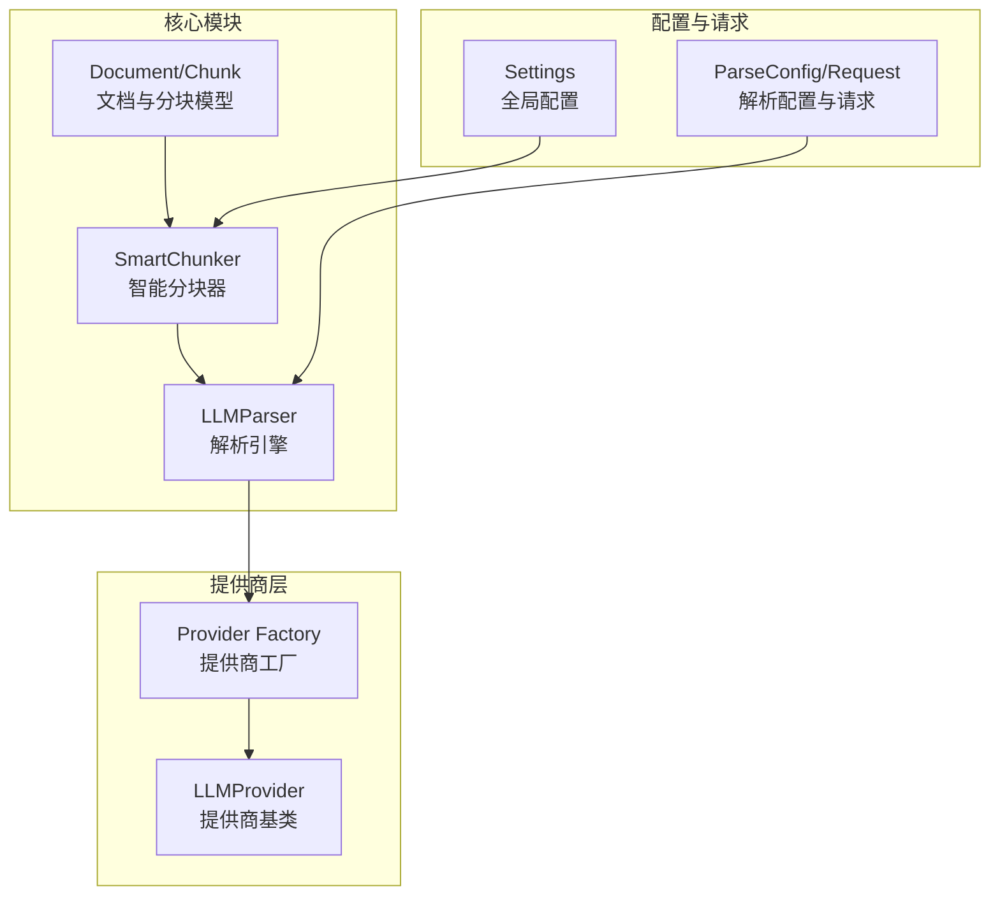
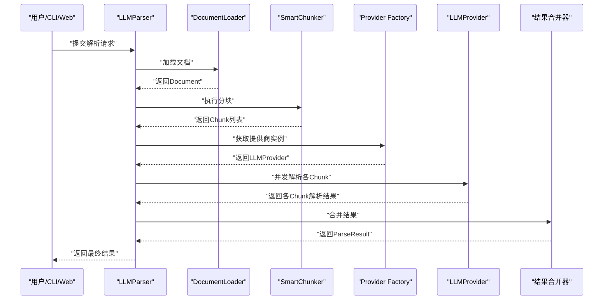
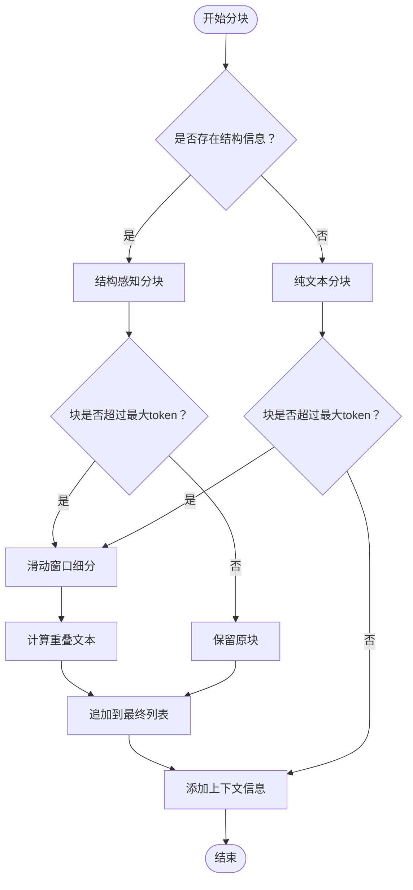
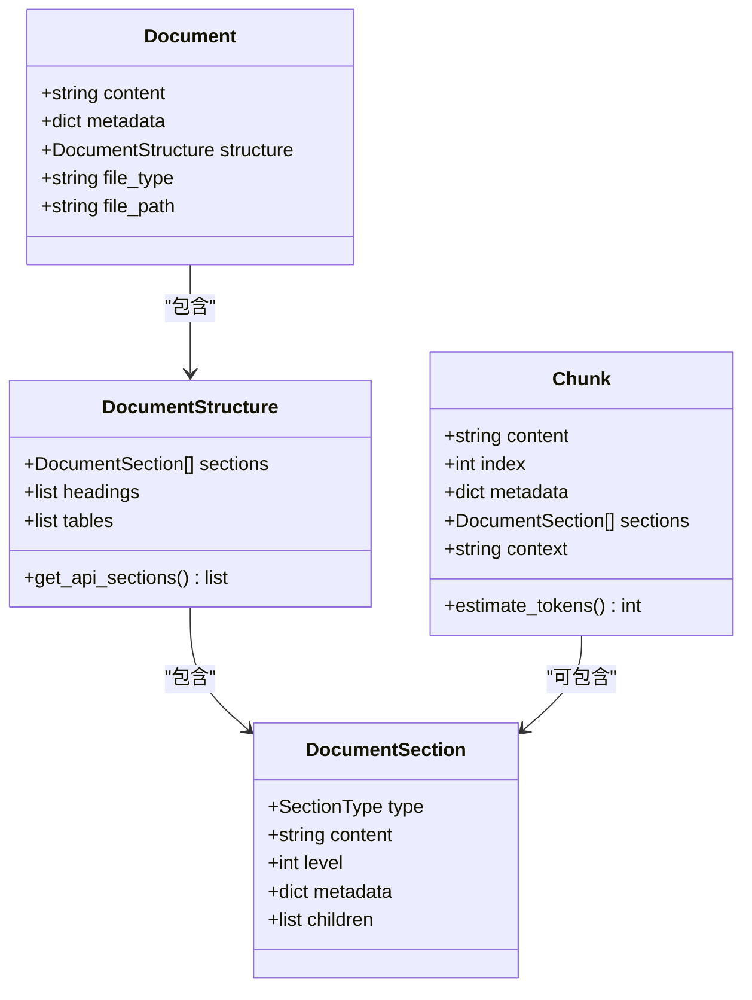
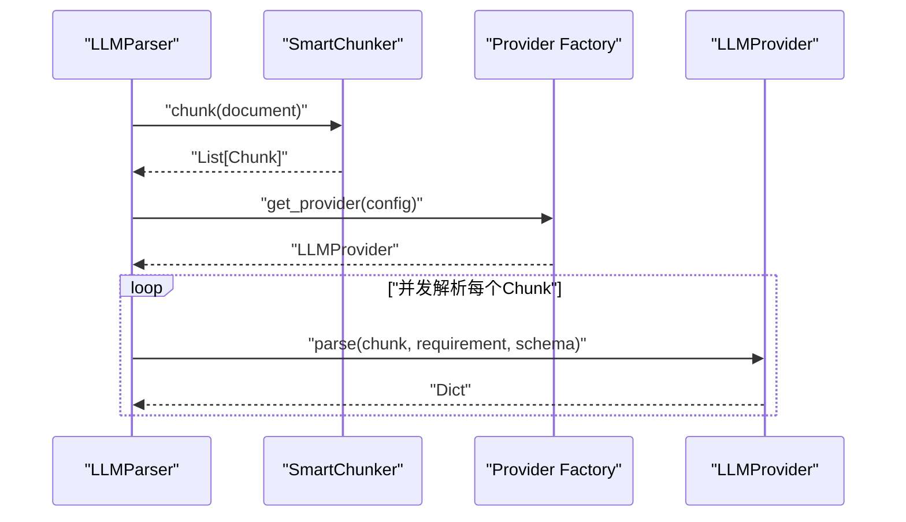
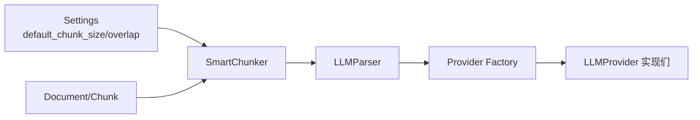

# 智能分块器

<cite>
**本文引用的文件**
- [chunker.py](file://api-doc-parser/src/api_doc_parser/core/chunker.py)
- [document.py](file://api-doc-parser/src/api_doc_parser/models/document.py)
- [parser.py](file://api-doc-parser/src/api_doc_parser/core/parser.py)
- [config.py](file://api-doc-parser/src/api_doc_parser/config.py)
- [request.py](file://api-doc-parser/src/api_doc_parser/models/request.py)
- [base.py](file://api-doc-parser/src/api_doc_parser/providers/base.py)
- [factory.py](file://api-doc-parser/src/api_doc_parser/providers/factory.py)
- [test_chunker.py](file://api-doc-parser/tests/test_chunker.py)
- [README.md](file://api-doc-parser/README.md)
</cite>

## 目录
1. [简介](#简介)
2. [项目结构](#项目结构)
3. [核心组件](#核心组件)
4. [架构概览](#架构概览)
5. [详细组件分析](#详细组件分析)
6. [依赖关系分析](#依赖关系分析)
7. [性能考量](#性能考量)
8. [故障排查指南](#故障排查指南)
9. [结论](#结论)
10. [附录](#附录)

## 简介
本技术文档围绕“智能分块器”展开，系统阐述其核心原理、实现细节与最佳实践。智能分块器通过“结构感知分块 + 滑动窗口分割 + 上下文信息保留”的组合策略，确保在满足LLM输入长度限制的同时，最大化保留语义完整性与上下文连贯性。本文将重点说明：
- 结构感知分块规则与优先级
- 滑动窗口分割与重叠策略
- 上下文信息保留机制
- Chunker类的实现逻辑、分块策略选择与参数配置
- token估算方法、最大分块大小限制与重叠策略
- 与LLM提供商的集成关系与性能优化技巧
- 分块质量评估方法与调试工具使用

## 项目结构
智能分块器位于核心模块中，与文档模型、解析引擎、配置与提供商工厂紧密协作，形成“加载-分块-并发解析-合并结果”的完整链路。

图表来源
- [chunker.py](file://api-doc-parser/src/api_doc_parser/core/chunker.py#L10-L62)
- [parser.py](file://api-doc-parser/src/api_doc_parser/core/parser.py#L20-L44)
- [config.py](file://api-doc-parser/src/api_doc_parser/config.py#L44-L48)
- [request.py](file://api-doc-parser/src/api_doc_parser/models/request.py#L31-L49)
- [factory.py](file://api-doc-parser/src/api_doc_parser/providers/factory.py#L14-L71)
- [base.py](file://api-doc-parser/src/api_doc_parser/providers/base.py#L27-L57)

章节来源
- [README.md](file://api-doc-parser/README.md#L1-L176)

## 核心组件
- SmartChunker：负责将结构化文档切分为适合LLM输入的分块，并在必要时进行滑动窗口细分与上下文补充。
- Document/Chunk：定义文档与分块的数据结构，包含内容、元数据、上下文与章节集合。
- LLMParser：协调加载、分块、并发解析与结果合并，同时管理提供商选择与缓存。
- Provider Factory/LLMProvider：抽象LLM提供商接口，统一构建系统提示词与用户提示词，解析JSON响应。
- 配置与请求：提供全局默认分块参数与解析配置项，支持CLI/Web调用。

章节来源
- [chunker.py](file://api-doc-parser/src/api_doc_parser/core/chunker.py#L10-L62)
- [document.py](file://api-doc-parser/src/api_doc_parser/models/document.py#L20-L75)
- [parser.py](file://api-doc-parser/src/api_doc_parser/core/parser.py#L20-L44)
- [config.py](file://api-doc-parser/src/api_doc_parser/config.py#L44-L48)
- [request.py](file://api-doc-parser/src/api_doc_parser/models/request.py#L31-L49)
- [factory.py](file://api-doc-parser/src/api_doc_parser/providers/factory.py#L14-L71)
- [base.py](file://api-doc-parser/src/api_doc_parser/providers/base.py#L27-L57)

## 架构概览
智能分块器在解析流程中的位置如下：

图表来源
- [parser.py](file://api-doc-parser/src/api_doc_parser/core/parser.py#L46-L128)
- [chunker.py](file://api-doc-parser/src/api_doc_parser/core/chunker.py#L28-L62)
- [factory.py](file://api-doc-parser/src/api_doc_parser/providers/factory.py#L14-L71)
- [base.py](file://api-doc-parser/src/api_doc_parser/providers/base.py#L34-L57)

## 详细组件分析

### SmartChunker：智能分块器
SmartChunker是分块流程的核心，遵循“结构感知优先 + 大块滑窗 + 上下文保留”的策略。

- 初始化与参数
  - 接收最大token数与重叠token数；若未指定，则使用全局配置中的默认值。
  - 内部以“每token约4字符”进行字符数与token数的换算，便于快速估算与阈值判断。
- 主流程
  - 若文档无结构信息，退化为纯文本分块策略。
  - 若存在结构信息，先按语义规则进行分块，再对超长块进行滑动窗口细分，并为每个块附加上下文。
- 结构感知分块规则
  - 遇到API端点时强制开启新块，确保API信息完整。
  - 遇到一级标题时强制开启新块，便于语义边界清晰。
  - 当前块与新节合并不应超过最大token数。
  - 表格与代码块尽量保持完整；当单个节超过阈值时，单独拆分。
- 滑动窗口分割
  - 在句子边界进行切分，避免破坏语义单元。
  - 新块与旧块之间保留重叠，重叠长度由overlap_tokens决定。
- 上下文信息保留
  - 为每个块附加“全局信息”与“相邻块摘要”，提升LLM理解能力。
- token估算
  - 采用字符数除以每token字符数的近似估算，简单高效。

图表来源
- [chunker.py](file://api-doc-parser/src/api_doc_parser/core/chunker.py#L28-L62)
- [chunker.py](file://api-doc-parser/src/api_doc_parser/core/chunker.py#L64-L125)
- [chunker.py](file://api-doc-parser/src/api_doc_parser/core/chunker.py#L166-L201)
- [chunker.py](file://api-doc-parser/src/api_doc_parser/core/chunker.py#L292-L310)

章节来源
- [chunker.py](file://api-doc-parser/src/api_doc_parser/core/chunker.py#L10-L62)
- [chunker.py](file://api-doc-parser/src/api_doc_parser/core/chunker.py#L64-L125)
- [chunker.py](file://api-doc-parser/src/api_doc_parser/core/chunker.py#L127-L164)
- [chunker.py](file://api-doc-parser/src/api_doc_parser/core/chunker.py#L166-L201)
- [chunker.py](file://api-doc-parser/src/api_doc_parser/core/chunker.py#L203-L233)
- [chunker.py](file://api-doc-parser/src/api_doc_parser/core/chunker.py#L235-L253)
- [chunker.py](file://api-doc-parser/src/api_doc_parser/core/chunker.py#L254-L272)
- [chunker.py](file://api-doc-parser/src/api_doc_parser/core/chunker.py#L273-L291)
- [chunker.py](file://api-doc-parser/src/api_doc_parser/core/chunker.py#L292-L310)
- [chunker.py](file://api-doc-parser/src/api_doc_parser/core/chunker.py#L312-L341)
- [chunker.py](file://api-doc-parser/src/api_doc_parser/core/chunker.py#L342-L350)
- [chunker.py](file://api-doc-parser/src/api_doc_parser/core/chunker.py#L351-L371)
- [chunker.py](file://api-doc-parser/src/api_doc_parser/core/chunker.py#L372-L377)

### 数据模型：Document/Chunk
- Document：包含原始内容、元数据、文档结构（章节列表）、文件类型与路径。
- DocumentStructure：维护章节列表与API相关章节查询方法。
- Chunk：包含内容、索引、元数据、所属章节列表与上下文信息；提供估算token的方法。

图表来源
- [document.py](file://api-doc-parser/src/api_doc_parser/models/document.py#L20-L75)

章节来源
- [document.py](file://api-doc-parser/src/api_doc_parser/models/document.py#L20-L75)

### 与LLM提供商的集成
- 解析引擎在初始化时创建SmartChunker，并在解析流程中调用其chunk方法得到Chunk列表。
- 解析引擎通过Provider Factory获取具体LLMProvider实例，统一构建系统提示词与用户提示词，解析JSON响应。
- LLMProvider基类提供通用的提示词构建与JSON解析逻辑，子类实现具体提供商的API调用细节。

图表来源
- [parser.py](file://api-doc-parser/src/api_doc_parser/core/parser.py#L20-L44)
- [parser.py](file://api-doc-parser/src/api_doc_parser/core/parser.py#L81-L91)
- [factory.py](file://api-doc-parser/src/api_doc_parser/providers/factory.py#L14-L71)
- [base.py](file://api-doc-parser/src/api_doc_parser/providers/base.py#L34-L57)

章节来源
- [parser.py](file://api-doc-parser/src/api_doc_parser/core/parser.py#L20-L44)
- [parser.py](file://api-doc-parser/src/api_doc_parser/core/parser.py#L81-L91)
- [factory.py](file://api-doc-parser/src/api_doc_parser/providers/factory.py#L14-L71)
- [base.py](file://api-doc-parser/src/api_doc_parser/providers/base.py#L59-L111)

## 依赖关系分析
- SmartChunker依赖Document/Chunk模型与全局配置设置，用于token估算与默认参数。
- LLMParser依赖SmartChunker进行分块，并通过Provider Factory与LLMProvider交互。
- Provider Factory根据提供商名称返回对应的具体实现类，支持OpenAI/Azure/OpenAI自定义、Anthropic/Azure Anthropic自定义、Ollama等。

图表来源
- [config.py](file://api-doc-parser/src/api_doc_parser/config.py#L44-L48)
- [chunker.py](file://api-doc-parser/src/api_doc_parser/core/chunker.py#L13-L26)
- [parser.py](file://api-doc-parser/src/api_doc_parser/core/parser.py#L23-L44)
- [factory.py](file://api-doc-parser/src/api_doc_parser/providers/factory.py#L14-L71)

章节来源
- [config.py](file://api-doc-parser/src/api_doc_parser/config.py#L44-L48)
- [chunker.py](file://api-doc-parser/src/api_doc_parser/core/chunker.py#L13-L26)
- [parser.py](file://api-doc-parser/src/api_doc_parser/core/parser.py#L23-L44)
- [factory.py](file://api-doc-parser/src/api_doc_parser/providers/factory.py#L14-L71)

## 性能考量
- token估算与字符换算
  - 采用“每token≈4字符”的近似估算，兼顾速度与实用性；在中文场景下较为稳定。
  - 估算用于快速判断是否需要进一步细分，避免昂贵的外部token计数API。
- 分块大小与重叠策略
  - 默认分块大小与重叠大小来自全局配置；可根据模型上下文长度与文档复杂度调整。
  - 重叠策略在块边界处保留上下文，有助于LLM在跨块推理时保持一致性。
- 并发解析与缓存
  - 解析引擎对Chunk并发解析，使用信号量限制并发度，避免资源争用。
  - 提供简单的内存缓存，基于内容指纹与模型名生成缓存键，减少重复请求。
- 大块处理
  - 对超过阈值的块采用滑动窗口细分，优先在句子边界切分，降低信息截断风险。
  - 表格与代码块单独处理，保留表头或代码注释等关键前缀，维持结构完整性。

章节来源
- [chunker.py](file://api-doc-parser/src/api_doc_parser/core/chunker.py#L23-L26)
- [chunker.py](file://api-doc-parser/src/api_doc_parser/core/chunker.py#L166-L201)
- [chunker.py](file://api-doc-parser/src/api_doc_parser/core/chunker.py#L203-L233)
- [parser.py](file://api-doc-parser/src/api_doc_parser/core/parser.py#L130-L169)
- [parser.py](file://api-doc-parser/src/api_doc_parser/core/parser.py#L171-L200)
- [parser.py](file://api-doc-parser/src/api_doc_parser/core/parser.py#L296-L304)

## 故障排查指南
- 分块过大导致LLM拒绝
  - 检查分块大小与重叠设置；适当减小分块大小或增大重叠，确保跨块上下文充足。
  - 关注滑动窗口细分逻辑，确认是否在句子边界切分。
- 结构信息缺失导致分块质量差
  - 确认文档加载器是否正确提取结构信息；若无结构，分块将退化为纯文本分块。
- 上下文信息不足
  - 检查上下文构建逻辑，确保全局信息与相邻块摘要正确生成。
- JSON解析失败
  - LLMProvider会尝试解析多种JSON形式；若仍失败，检查提示词构建与输出Schema是否匹配。
- 缓存命中率低
  - 确认缓存键生成逻辑与内容指纹计算是否一致；避免无关配置差异导致缓存失效。

章节来源
- [chunker.py](file://api-doc-parser/src/api_doc_parser/core/chunker.py#L292-L310)
- [base.py](file://api-doc-parser/src/api_doc_parser/providers/base.py#L112-L143)
- [parser.py](file://api-doc-parser/src/api_doc_parser/core/parser.py#L171-L200)
- [parser.py](file://api-doc-parser/src/api_doc_parser/core/parser.py#L296-L304)

## 结论
智能分块器通过“结构感知 + 滑动窗口 + 上下文保留”的策略，在保证LLM输入长度限制的前提下，最大化保留语义完整性与上下文连贯性。结合解析引擎的并发与缓存机制，能够在大规模文档解析中取得良好的吞吐与稳定性。建议在实际部署中：
- 根据目标模型上下文长度与文档复杂度调整分块大小与重叠；
- 在API密集型文档中优先保留API端点与表格/代码块的完整性；
- 使用上下文信息增强LLM理解，提高解析准确率；
- 合理利用缓存与并发控制，平衡性能与资源消耗。

## 附录

### 参数配置与默认值
- 全局默认分块大小与重叠大小来自配置模块，默认值可在运行时通过解析配置覆盖。
- 解析配置支持提供商、模型、温度、最大重试次数与是否启用缓存等选项。

章节来源
- [config.py](file://api-doc-parser/src/api_doc_parser/config.py#L44-L48)
- [request.py](file://api-doc-parser/src/api_doc_parser/models/request.py#L31-L49)

### 分块策略选择与参数配置示例
- 基本分块：适用于无结构文本，按段落与句子边界切分。
- 结构感知分块：优先按章节、标题与API端点切分，保持语义边界。
- 大块滑窗：对超长块按句子边界细分，保留重叠。
- 上下文保留：为每个块附加全局信息与相邻块摘要。

章节来源
- [chunker.py](file://api-doc-parser/src/api_doc_parser/core/chunker.py#L28-L62)
- [chunker.py](file://api-doc-parser/src/api_doc_parser/core/chunker.py#L64-L125)
- [chunker.py](file://api-doc-parser/src/api_doc_parser/core/chunker.py#L166-L201)
- [chunker.py](file://api-doc-parser/src/api_doc_parser/core/chunker.py#L292-L310)

### 代码示例路径（不展示具体代码）
- 基本分块场景：参考测试用例中对长段落的分块断言。
  - 示例路径：[test_chunker.py](file://api-doc-parser/tests/test_chunker.py#L12-L22)
- 带标题的语义分块：参考测试用例中按章节切分的断言。
  - 示例路径：[test_chunker.py](file://api-doc-parser/tests/test_chunker.py#L23-L42)
- API端点保持完整：参考测试用例中对API端点的断言。
  - 示例路径：[test_chunker.py](file://api-doc-parser/tests/test_chunker.py#L43-L69)
- 分块重叠验证：参考测试用例中相邻块重叠的断言。
  - 示例路径：[test_chunker.py](file://api-doc-parser/tests/test_chunker.py#L70-L86)