# 数据流设计

<cite>
**本文引用的文件**
- [api.py](file://api-doc-parser/src/api_doc_parser/api.py)
- [parser.py](file://api-doc-parser/src/api_doc_parser/core/parser.py)
- [chunker.py](file://api-doc-parser/src/api_doc_parser/core/chunker.py)
- [loader.py](file://api-doc-parser/src/api_doc_parser/core/loader.py)
- [merger.py](file://api-doc-parser/src/api_doc_parser/core/merger.py)
- [incremental.py](file://api-doc-parser/src/api_doc_parser/core/incremental.py)
- [document.py](file://api-doc-parser/src/api_doc_parser/models/document.py)
- [result.py](file://api-doc-parser/src/api_doc_parser/models/result.py)
- [request.py](file://api-doc-parser/src/api_doc_parser/models/request.py)
- [factory.py](file://api-doc-parser/src/api_doc_parser/providers/factory.py)
- [config.py](file://api-doc-parser/src/api_doc_parser/config.py)
- [test_chunker.py](file://api-doc-parser/tests/test_chunker.py)
- [README.md](file://api-doc-parser/README.md)
- [pyproject.toml](file://api-doc-parser/pyproject.toml)
</cite>

## 目录
1. [简介](#简介)
2. [项目结构](#项目结构)
3. [核心组件](#核心组件)
4. [架构总览](#架构总览)
5. [详细组件分析](#详细组件分析)
6. [依赖关系分析](#依赖关系分析)
7. [性能考量](#性能考量)
8. [故障排查指南](#故障排查指南)
9. [结论](#结论)
10. [附录](#附录)

## 简介
本文件面向API文档解析器的“数据流设计”，系统性描述从用户输入到最终输出的完整数据处理流程，涵盖文档加载、智能分块、LLM解析、结果合并与增量更新等关键步骤。文档重点解释数据在各组件之间的传递方式、格式转换与验证机制，并提供异步处理的数据流控制与并发策略、错误处理与重试机制、数据一致性保障以及增量更新与缓存策略的设计说明。同时给出数据流图与状态转换图，帮助读者快速把握端到端处理逻辑。

## 项目结构
该项目采用“模块化+分层”的组织方式：
- Web服务层：FastAPI接口，负责接收请求、异步任务调度与状态查询
- 核心处理层：文档加载、智能分块、LLM解析、结果合并、增量更新
- 模型层：统一的数据模型（Document、Chunk、ParseResult等）
- 提供商层：LLM提供商工厂与适配器
- 配置与工具：全局配置、指纹工具等

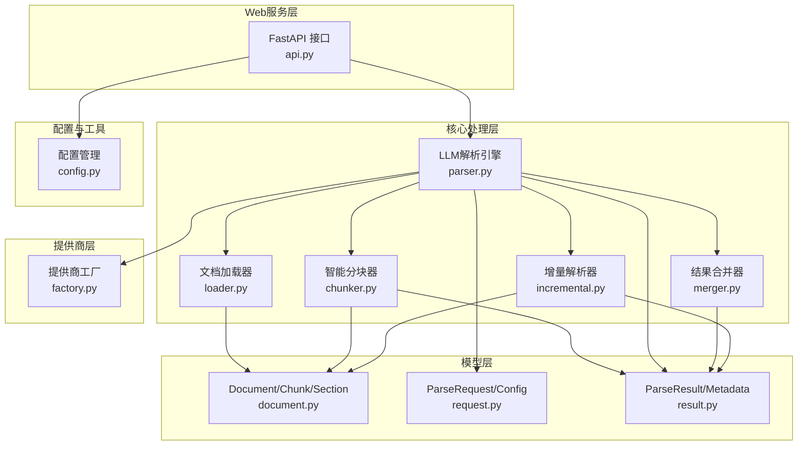

图表来源
- [api.py](file://api-doc-parser/src/api_doc_parser/api.py#L24-L371)
- [parser.py](file://api-doc-parser/src/api_doc_parser/core/parser.py#L20-L304)
- [loader.py](file://api-doc-parser/src/api_doc_parser/core/loader.py#L17-L328)
- [chunker.py](file://api-doc-parser/src/api_doc_parser/core/chunker.py#L10-L377)
- [merger.py](file://api-doc-parser/src/api_doc_parser/core/merger.py#L11-L220)
- [incremental.py](file://api-doc-parser/src/api_doc_parser/core/incremental.py#L14-L209)
- [document.py](file://api-doc-parser/src/api_doc_parser/models/document.py#L20-L75)
- [result.py](file://api-doc-parser/src/api_doc_parser/models/result.py#L8-L55)
- [request.py](file://api-doc-parser/src/api_doc_parser/models/request.py#L17-L57)
- [factory.py](file://api-doc-parser/src/api_doc_parser/providers/factory.py#L14-L71)
- [config.py](file://api-doc-parser/src/api_doc_parser/config.py#L7-L57)

章节来源
- [README.md](file://api-doc-parser/README.md#L136-L157)
- [pyproject.toml](file://api-doc-parser/pyproject.toml#L1-L100)

## 核心组件
- 文档加载器：支持PDF、Word、Excel、TXT/MD，统一输出结构化Document对象，内置API端点检测与章节结构识别
- 智能分块器：基于结构感知与长度限制的分块策略，支持滑动窗口与重叠缓冲，确保API信息完整性
- LLM解析引擎：异步并发解析各分块，提供缓存、重试与进度回调，最终合并为统一结构化结果
- 结果合并器：对多个ParseResult进行深度合并与去重，支持增量场景下的字段级合并
- 增量解析器：基于文档/分块指纹检测变更，仅重新解析变更部分并合并历史结果
- 模型层：统一的数据结构定义，确保跨组件的数据一致性
- 提供商工厂：抽象不同LLM提供商的接入，支持OpenAI/Azure/Anthropic/Ollama及自定义协议

章节来源
- [loader.py](file://api-doc-parser/src/api_doc_parser/core/loader.py#L17-L328)
- [chunker.py](file://api-doc-parser/src/api_doc_parser/core/chunker.py#L10-L377)
- [parser.py](file://api-doc-parser/src/api_doc_parser/core/parser.py#L20-L304)
- [merger.py](file://api-doc-parser/src/api_doc_parser/core/merger.py#L11-L220)
- [incremental.py](file://api-doc-parser/src/api_doc_parser/core/incremental.py#L14-L209)
- [document.py](file://api-doc-parser/src/api_doc_parser/models/document.py#L20-L75)
- [result.py](file://api-doc-parser/src/api_doc_parser/models/result.py#L8-L55)
- [request.py](file://api-doc-parser/src/api_doc_parser/models/request.py#L17-L57)
- [factory.py](file://api-doc-parser/src/api_doc_parser/providers/factory.py#L14-L71)

## 架构总览
下图展示从用户输入到最终输出的端到端数据流，包括同步与异步两种模式、并发解析与结果合并、以及增量更新路径。

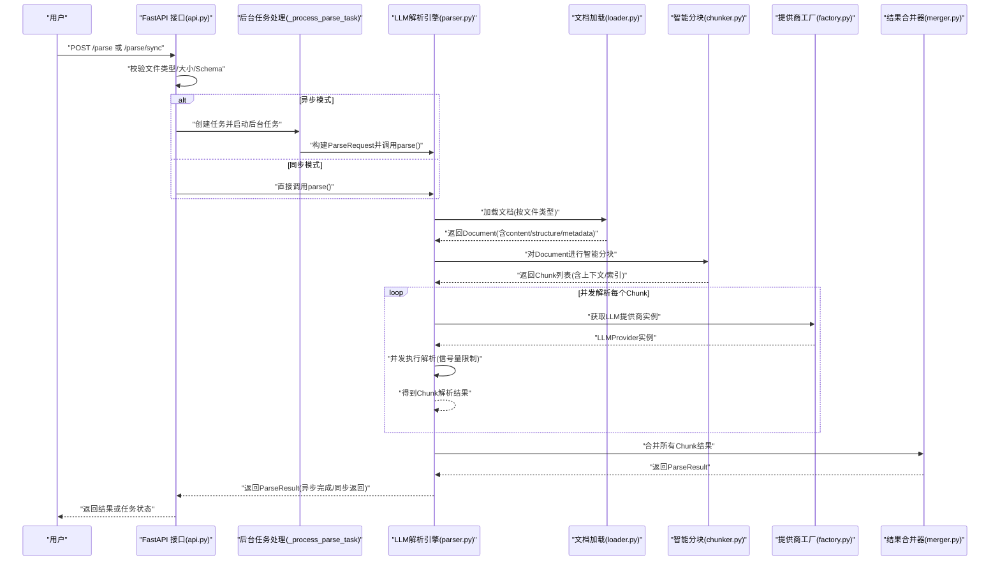

图表来源
- [api.py](file://api-doc-parser/src/api_doc_parser/api.py#L76-L255)
- [parser.py](file://api-doc-parser/src/api_doc_parser/core/parser.py#L46-L128)
- [loader.py](file://api-doc-parser/src/api_doc_parser/core/loader.py#L80-L328)
- [chunker.py](file://api-doc-parser/src/api_doc_parser/core/chunker.py#L28-L62)
- [factory.py](file://api-doc-parser/src/api_doc_parser/providers/factory.py#L14-L71)
- [merger.py](file://api-doc-parser/src/api_doc_parser/core/merger.py#L17-L79)

## 详细组件分析

### 组件A：文档加载与结构识别
- 输入：用户上传的文件（PDF/Word/Excel/TXT/MD），或文件二进制内容
- 输出：Document对象，包含content、metadata、structure（sections、headings、tables）
- 关键能力：
  - 多格式解析：PDF使用pymupdf/pdfplumber；Word使用python-docx；Excel使用pandas/openpyxl；TXT/MD直接读取
  - API端点检测：正则匹配REST端点、URL、Endpoint声明等
  - 章节结构识别：标题层级、代码块、表格等
- 数据格式转换：二进制→文本/结构化表格→Document
- 验证机制：文件类型检测、大小限制、异常捕获

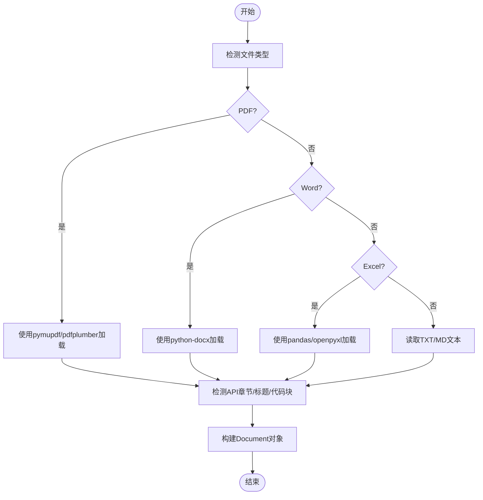

图表来源
- [loader.py](file://api-doc-parser/src/api_doc_parser/core/loader.py#L80-L328)

章节来源
- [loader.py](file://api-doc-parser/src/api_doc_parser/core/loader.py#L17-L328)
- [api.py](file://api-doc-parser/src/api_doc_parser/api.py#L355-L366)

### 组件B：智能分块与上下文增强
- 输入：Document（含content与structure）
- 输出：Chunk列表，每个Chunk包含content、index、metadata、sections、context
- 关键策略：
  - 语义分块：按标题、API端点、表格/代码块等结构边界切分
  - 长度限制：按token估算（1token≈4字符）控制每块大小
  - 滑动窗口：超长块按句子边界细分，保留重叠缓冲
  - 上下文注入：为每个Chunk附加全局信息与邻近Chunk摘要
- 数据格式转换：Document→Chunk[]
- 验证机制：token估算、边界检测、重叠一致性

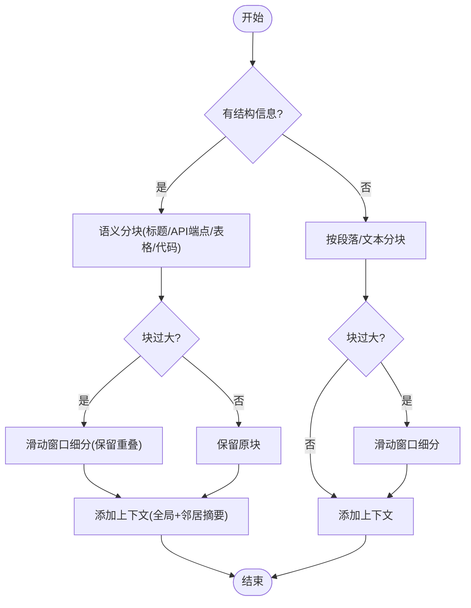

图表来源
- [chunker.py](file://api-doc-parser/src/api_doc_parser/core/chunker.py#L28-L377)

章节来源
- [chunker.py](file://api-doc-parser/src/api_doc_parser/core/chunker.py#L10-L377)
- [test_chunker.py](file://api-doc-parser/tests/test_chunker.py#L12-L86)

### 组件C：LLM解析与并发控制
- 输入：ParseRequest（包含DocumentSource、RequirementDoc、ParseConfig）
- 输出：ParseResult（data、metadata、source_fingerprint）
- 关键流程：
  - 文档指纹计算（content SHA256前16位）
  - 并发解析：信号量限制并发数，支持进度回调
  - 缓存策略：基于chunk+requirement+model的缓存键
  - 错误处理：异常转为内部错误标记，不影响整体流程
  - 结果合并：深度合并字典、列表去重合并
- 数据格式转换：Chunk[]→ParseResult
- 验证机制：置信度计算、警告收集、处理时间统计

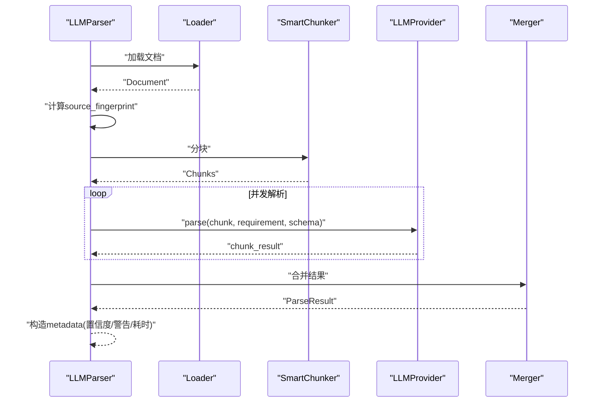

图表来源
- [parser.py](file://api-doc-parser/src/api_doc_parser/core/parser.py#L46-L128)
- [factory.py](file://api-doc-parser/src/api_doc_parser/providers/factory.py#L14-L71)
- [merger.py](file://api-doc-parser/src/api_doc_parser/core/merger.py#L17-L79)

章节来源
- [parser.py](file://api-doc-parser/src/api_doc_parser/core/parser.py#L20-L304)
- [request.py](file://api-doc-parser/src/api_doc_parser/models/request.py#L51-L57)
- [result.py](file://api-doc-parser/src/api_doc_parser/models/result.py#L20-L55)

### 组件D：结果合并与去重
- 输入：多个ParseResult（或增量更新产生的新结果）
- 输出：合并后的ParseResult
- 关键策略：
  - 深度合并字典、列表去重合并
  - 基于关键字段（path/method/name/url/id等）对API端点去重
  - 合并元数据：总块数、已处理块数、失败块索引、置信度、警告、处理时间
- 数据格式转换：List[ParseResult]→ParseResult
- 验证机制：字段唯一性检查、集合去重

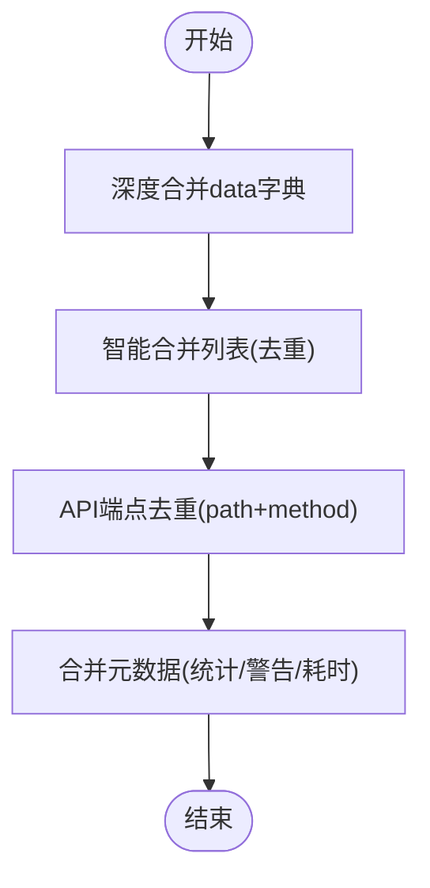

图表来源
- [merger.py](file://api-doc-parser/src/api_doc_parser/core/merger.py#L17-L220)

章节来源
- [merger.py](file://api-doc-parser/src/api_doc_parser/core/merger.py#L11-L220)

### 组件E：增量更新与缓存
- 输入：旧Document、新Document、旧ParseResult、新Chunk解析结果
- 输出：增量合并后的ParseResult
- 关键策略：
  - 文档指纹与分块指纹对比，识别变更/未变更块
  - 未变更块保留旧结果，变更块重新解析后合并
  - 可选全量重解析阈值判断（基于文档大小差异比例）
  - 缓存：内存缓存（可扩展为Redis等持久化缓存）
- 数据格式转换：旧结果+新结果→合并结果
- 验证机制：指纹集合、变更比例阈值

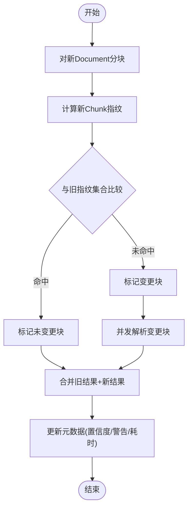

图表来源
- [incremental.py](file://api-doc-parser/src/api_doc_parser/core/incremental.py#L29-L151)

章节来源
- [incremental.py](file://api-doc-parser/src/api_doc_parser/core/incremental.py#L14-L209)

### 组件F：Web服务与异步任务
- 输入：HTTP请求（文件、要求说明、输出Schema、配置）
- 输出：ParseTaskResponse（异步）或ParseResult（同步）
- 关键流程：
  - 文件类型检测、大小限制、Schema解析
  - 异步模式：内存任务池维护状态，后台任务执行解析，支持进度回调
  - 同步模式：直接返回ParseResult
  - 提供提供商列表查询
- 数据格式转换：HTTP请求→ParseRequest→ParseResult
- 验证机制：文件类型映射、JSON Schema校验、异常捕获

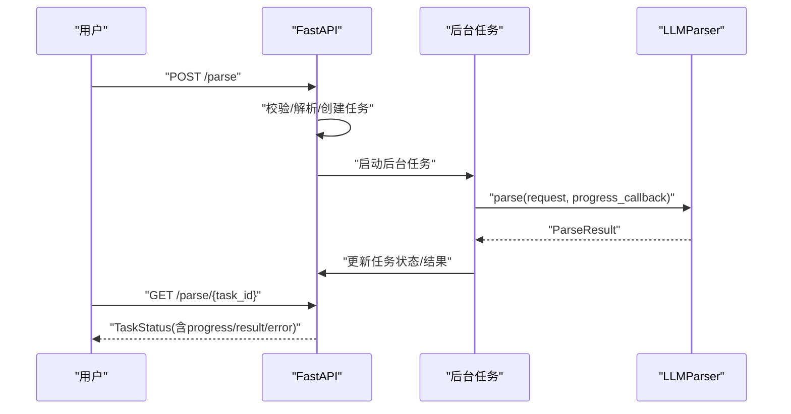

图表来源
- [api.py](file://api-doc-parser/src/api_doc_parser/api.py#L76-L355)

章节来源
- [api.py](file://api-doc-parser/src/api_doc_parser/api.py#L24-L371)

## 依赖关系分析
- 组件耦合与内聚：
  - LLMParser与SmartChunker强耦合（分块策略由其决定）
  - LLMParser与LLMProvider弱耦合（通过工厂解耦）
  - Loader与Document模型强耦合（输出统一结构）
  - Merger与Result模型强耦合（合并策略依赖结构）
  - IncrementalParser与Document/Chunk/Result模型强耦合（指纹与结构）
- 外部依赖：
  - 文档处理：pymupdf、pdfplumber、python-docx、openpyxl、pandas
  - LLM SDK：openai、anthropic
  - Web框架：fastapi、uvicorn
  - 任务队列：celery、redis（可选）

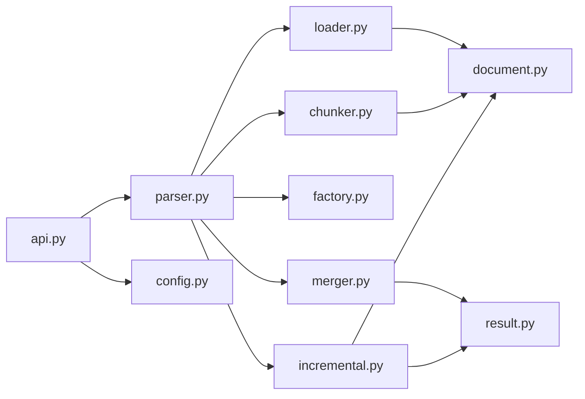

图表来源
- [parser.py](file://api-doc-parser/src/api_doc_parser/core/parser.py#L20-L304)
- [chunker.py](file://api-doc-parser/src/api_doc_parser/core/chunker.py#L10-L377)
- [loader.py](file://api-doc-parser/src/api_doc_parser/core/loader.py#L17-L328)
- [merger.py](file://api-doc-parser/src/api_doc_parser/core/merger.py#L11-L220)
- [incremental.py](file://api-doc-parser/src/api_doc_parser/core/incremental.py#L14-L209)
- [document.py](file://api-doc-parser/src/api_doc_parser/models/document.py#L20-L75)
- [result.py](file://api-doc-parser/src/api_doc_parser/models/result.py#L8-L55)
- [api.py](file://api-doc-parser/src/api_doc_parser/api.py#L24-L371)
- [config.py](file://api-doc-parser/src/api_doc_parser/config.py#L7-L57)

章节来源
- [pyproject.toml](file://api-doc-parser/pyproject.toml#L25-L59)

## 性能考量
- 并发解析：通过信号量限制并发数，避免LLM提供商限流或资源争用
- 缓存策略：基于chunk+requirement+model的缓存键，减少重复请求
- 分块策略：语义分块+滑动窗口+重叠缓冲，兼顾吞吐与信息完整性
- 异步任务：后台任务池避免阻塞主线程，支持进度回调
- 增量更新：指纹对比仅重解析变更块，显著降低处理成本

[本节为通用性能建议，无需特定文件引用]

## 故障排查指南
- 常见问题与定位：
  - 文件类型不支持：检查文件后缀映射与支持列表
  - 文件过大：检查max_file_size配置
  - JSON Schema无效：检查output_schema的JSON格式
  - LLM提供商配置错误：检查api_key/api_base/model/provider
  - 并发异常：查看信号量限制与异常处理日志
- 日志与监控：
  - 使用structlog记录关键事件（document_loaded、document_chunked、parse_completed、chunk_parse_failed等）
  - 通过TaskStatus的progress字段观察解析进度
- 重试与容错：
  - LLMProvider层具备最大重试次数配置
  - 解析失败的Chunk会标记错误并继续处理其他Chunk，保证整体可用性

章节来源
- [api.py](file://api-doc-parser/src/api_doc_parser/api.py#L108-L124)
- [parser.py](file://api-doc-parser/src/api_doc_parser/core/parser.py#L130-L201)

## 结论
本数据流设计围绕“结构感知分块+并发LLM解析+智能合并与增量更新”展开，通过统一的数据模型与工厂化提供商接入，实现了从多格式文档到结构化结果的高可靠、高性能处理。异步任务与缓存策略进一步提升了用户体验与系统吞吐。建议在生产环境中引入持久化缓存（如Redis）与任务队列（Celery+Redis），并结合监控与告警体系完善可观测性。

[本节为总结性内容，无需特定文件引用]

## 附录

### 数据模型概览
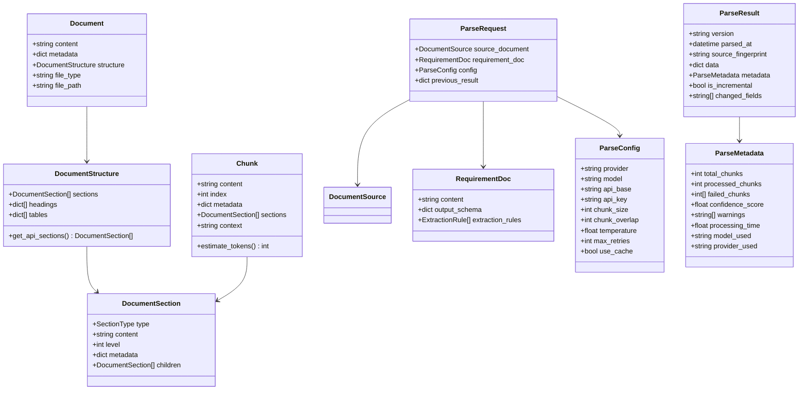

图表来源
- [document.py](file://api-doc-parser/src/api_doc_parser/models/document.py#L20-L75)
- [result.py](file://api-doc-parser/src/api_doc_parser/models/result.py#L8-L55)
- [request.py](file://api-doc-parser/src/api_doc_parser/models/request.py#L17-L57)

### 状态转换图（任务生命周期）
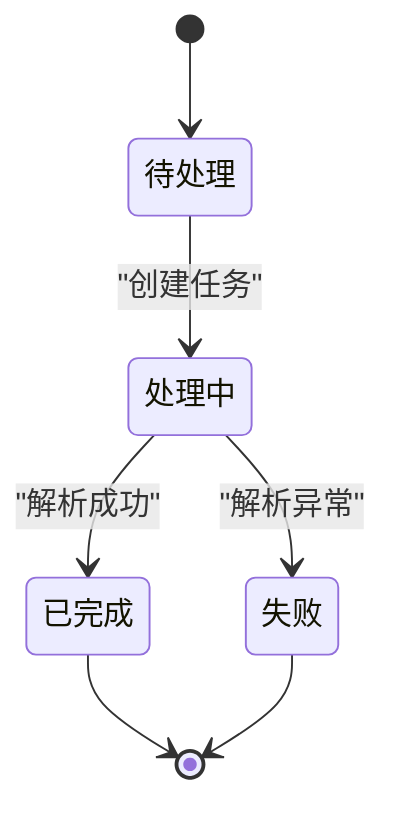

图表来源
- [api.py](file://api-doc-parser/src/api_doc_parser/api.py#L302-L355)