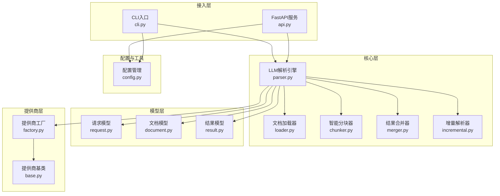
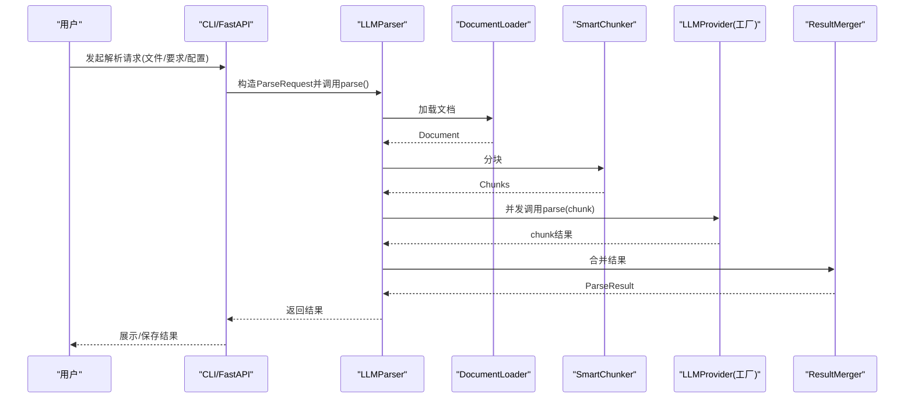
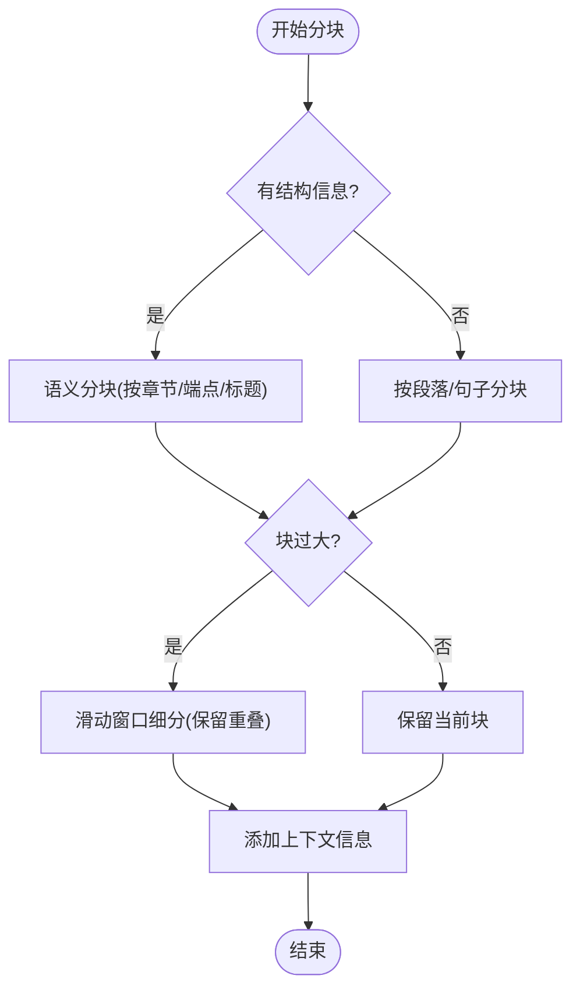
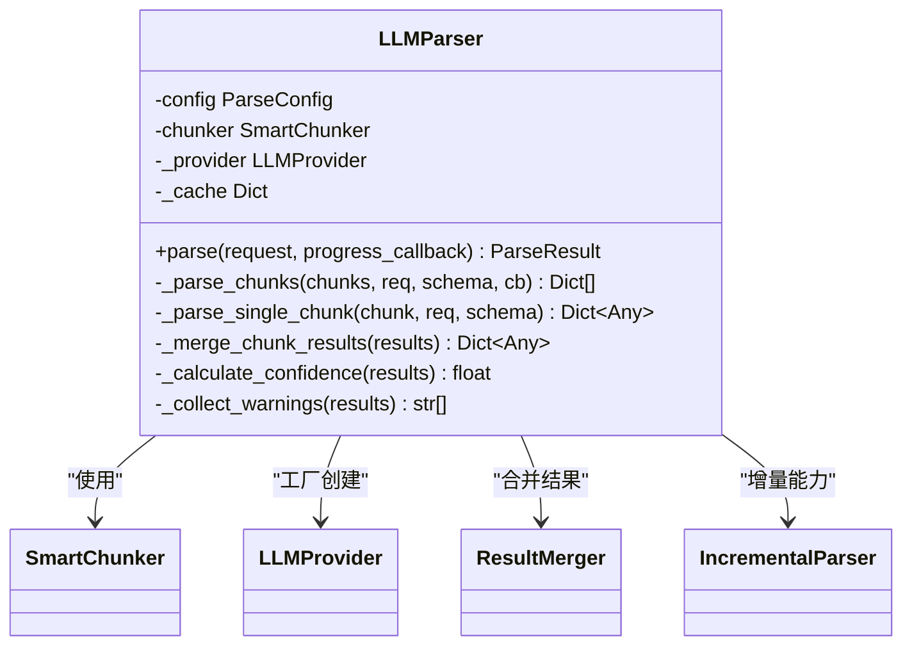
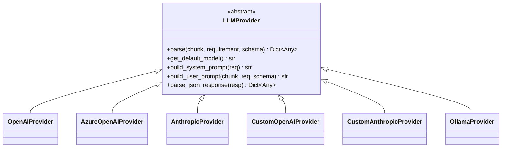
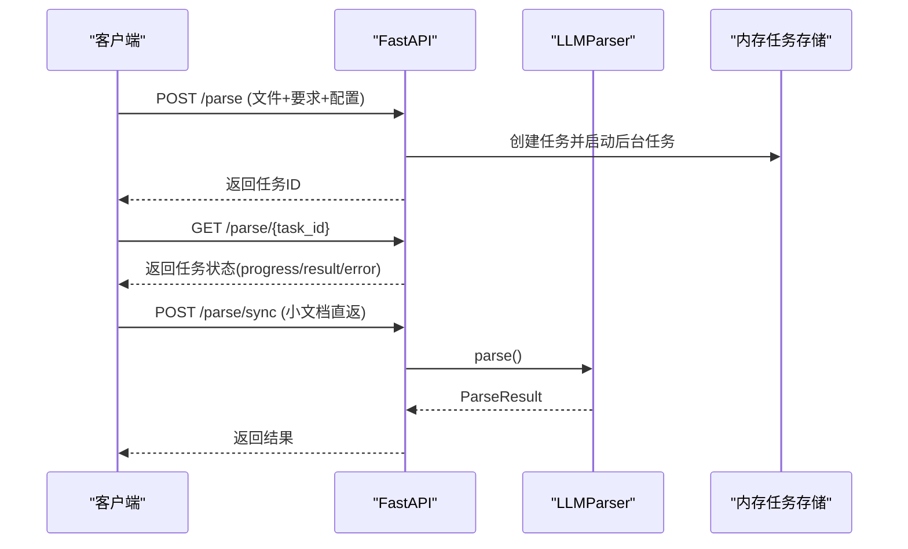
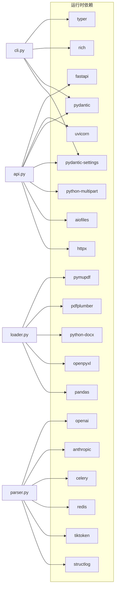

# 架构设计

<cite>
**本文引用的文件**
- [README.md](file://README.md)
- [pyproject.toml](file://pyproject.toml)
- [__init__.py](file://src/api_doc_parser/__init__.py)
- [api.py](file://src/api_doc_parser/api.py)
- [cli.py](file://src/api_doc_parser/cli.py)
- [config.py](file://src/api_doc_parser/config.py)
- [loader.py](file://src/api_doc_parser/core/loader.py)
- [chunker.py](file://src/api_doc_parser/core/chunker.py)
- [parser.py](file://src/api_doc_parser/core/parser.py)
- [merger.py](file://src/api_doc_parser/core/merger.py)
- [incremental.py](file://src/api_doc_parser/core/incremental.py)
- [document.py](file://src/api_doc_parser/models/document.py)
- [request.py](file://src/api_doc_parser/models/request.py)
- [result.py](file://src/api_doc_parser/models/result.py)
- [base.py](file://src/api_doc_parser/providers/base.py)
- [factory.py](file://src/api_doc_parser/providers/factory.py)
</cite>

## 目录
1. [简介](#简介)
2. [项目结构](#项目结构)
3. [核心组件](#核心组件)
4. [架构总览](#架构总览)
5. [详细组件分析](#详细组件分析)
6. [依赖分析](#依赖分析)
7. [性能考量](#性能考量)
8. [故障排查指南](#故障排查指南)
9. [结论](#结论)
10. [附录](#附录)

## 简介
本项目为“API文档解析器”，旨在利用大语言模型（LLM）对PDF、Word、Excel、纯文本等格式的API文档进行智能解析，输出结构化JSON结果。系统同时提供CLI命令行与FastAPI Web服务两种使用方式，并支持OpenAI、Azure OpenAI、Anthropic Claude、Ollama以及自定义OpenAI/Anthropic协议的LLM提供商。系统采用模块化设计，通过抽象基类与工厂模式解耦不同LLM提供商，支持智能分块、并发解析、结果合并与增量更新。

## 项目结构
项目采用“分层+功能域”混合组织方式：
- 核心层：文档加载、智能分块、解析引擎、结果合并、增量更新
- 模型层：请求/结果/文档数据模型
- 提供商层：LLM提供商抽象与工厂
- 接入层：CLI与Web服务
- 配置与工具：配置管理、指纹工具

图表来源
- [cli.py](file://src/api_doc_parser/cli.py#L1-L393)
- [api.py](file://src/api_doc_parser/api.py#L1-L371)
- [loader.py](file://src/api_doc_parser/core/loader.py#L1-L328)
- [chunker.py](file://src/api_doc_parser/core/chunker.py#L1-L377)
- [parser.py](file://src/api_doc_parser/core/parser.py#L1-L304)
- [merger.py](file://src/api_doc_parser/core/merger.py#L1-L220)
- [incremental.py](file://src/api_doc_parser/core/incremental.py#L1-L209)
- [request.py](file://src/api_doc_parser/models/request.py#L1-L57)
- [document.py](file://src/api_doc_parser/models/document.py#L1-L75)
- [result.py](file://src/api_doc_parser/models/result.py#L1-L55)
- [base.py](file://src/api_doc_parser/providers/base.py#L1-L143)
- [factory.py](file://src/api_doc_parser/providers/factory.py#L1-L71)
- [config.py](file://src/api_doc_parser/config.py#L1-L57)

章节来源
- [README.md](file://README.md#L136-L157)
- [pyproject.toml](file://pyproject.toml#L1-L100)

## 核心组件
- 文档加载器（DocumentLoader 抽象 + PDF/Word/Excel/Text 实现）：负责从多格式文件中抽取文本、表格与结构化章节。
- 智能分块器（SmartChunker）：基于文档结构与长度限制进行语义分块，结合滑动窗口与重叠缓冲，确保API端点与表格/代码块完整性。
- LLM解析引擎（LLMParser）：协调加载、分块、并发调用提供商、合并结果与统计元数据；内置简单内存缓存。
- 结果合并器（ResultMerger）：对多个结果进行深度合并与去重，支持增量场景。
- 增量解析器（IncrementalParser）：基于文档与分块指纹检测变更，合并历史结果与新增解析。
- 提供商抽象与工厂（LLMProvider + Factory）：统一接口与工厂创建不同提供商实例，支持OpenAI/Azure/OpenAI自定义/Ollama等。
- 数据模型（ParseRequest/ParseResult/Document/Chunk等）：Pydantic模型定义输入输出规范。
- 接入层（CLI/Web）：Typer CLI与FastAPI服务，提供同步/异步解析与提供商列表查询。

章节来源
- [loader.py](file://src/api_doc_parser/core/loader.py#L17-L328)
- [chunker.py](file://src/api_doc_parser/core/chunker.py#L10-L377)
- [parser.py](file://src/api_doc_parser/core/parser.py#L20-L304)
- [merger.py](file://src/api_doc_parser/core/merger.py#L11-L220)
- [incremental.py](file://src/api_doc_parser/core/incremental.py#L14-L209)
- [base.py](file://src/api_doc_parser/providers/base.py#L27-L143)
- [factory.py](file://src/api_doc_parser/providers/factory.py#L14-L71)
- [request.py](file://src/api_doc_parser/models/request.py#L8-L57)
- [document.py](file://src/api_doc_parser/models/document.py#L20-L75)
- [result.py](file://src/api_doc_parser/models/result.py#L8-L55)
- [cli.py](file://src/api_doc_parser/cli.py#L50-L393)
- [api.py](file://src/api_doc_parser/api.py#L76-L371)

## 架构总览
系统采用“请求驱动 + 并发解析 + 统一合并”的流水线式架构。CLI与Web均通过统一的解析流程：加载文档 → 智能分块 → 并发调用LLM → 合并结果 → 返回/持久化。提供商通过工厂与抽象基类解耦，便于扩展与替换。

图表来源
- [cli.py](file://src/api_doc_parser/cli.py#L127-L231)
- [api.py](file://src/api_doc_parser/api.py#L177-L255)
- [parser.py](file://src/api_doc_parser/core/parser.py#L46-L128)
- [loader.py](file://src/api_doc_parser/core/loader.py#L80-L127)
- [chunker.py](file://src/api_doc_parser/core/chunker.py#L28-L62)
- [merger.py](file://src/api_doc_parser/core/merger.py#L17-L79)
- [factory.py](file://src/api_doc_parser/providers/factory.py#L14-L71)

## 详细组件分析

### 文档加载器（DocumentLoader 抽象与实现）
- 设计要点
  - 抽象基类定义统一load接口，子类按文件类型实现。
  - 统一的API章节检测逻辑，提升后续分块与解析质量。
  - PDF使用pymupdf提取文本与pdfplumber提取表格；Word/Excel/Text分别处理段落、表格与纯文本。
- 关键行为
  - load返回Document对象，包含content、metadata、DocumentStructure与文件类型/路径。
  - 支持从文件路径或二进制流加载。
- 复杂度
  - 文本扫描与结构识别近似O(n)，表格/段落遍历线性于内容规模。

```mermaid
classDiagram
class DocumentLoader {
<<abstract>>
+load(source) Document
-_detect_api_sections(text) DocumentSection[]
}
class PDFLoader {
+load(source) Document
-_extract_tables(source) Dict[]
}
class WordLoader {
+load(source) Document
}
class ExcelLoader {
+load(source) Document
}
class TextLoader {
+load(source) Document
}
DocumentLoader <|-- PDFLoader
DocumentLoader <|-- WordLoader
DocumentLoader <|-- ExcelLoader
DocumentLoader <|-- TextLoader
```

图表来源
- [loader.py](file://src/api_doc_parser/core/loader.py#L17-L328)

章节来源
- [loader.py](file://src/api_doc_parser/core/loader.py#L17-L328)

### 智能分块器（SmartChunker）
- 设计要点
  - 优先按文档结构（标题、API端点、表格/代码块）进行语义分块。
  - 对超长块使用滑动窗口细分，保留overlap以避免信息截断。
  - 为每个块注入上下文摘要（全局信息+邻近块摘要）。
- 关键行为
  - 估算token数（字符数/4），控制每块最大token数。
  - 特殊处理表格/代码块，保留表头或代码声明作为前缀。
- 复杂度
  - 语义分块O(n)，滑动窗口O(n)，总体近似O(n)。

图表来源
- [chunker.py](file://src/api_doc_parser/core/chunker.py#L28-L377)

章节来源
- [chunker.py](file://src/api_doc_parser/core/chunker.py#L10-L377)

### LLM解析引擎（LLMParser）
- 设计要点
  - 通过工厂动态选择LLM提供商，支持OpenAI/Azure/Anthropic/Ollama及自定义协议。
  - 并发限制（信号量）控制并发度，避免资源争用。
  - 结果合并采用深度合并与列表去重策略，置信度与警告聚合。
  - 内置简单内存缓存，基于chunk+要求+模型的哈希键。
- 关键行为
  - parse主流程：加载→指纹→分块→并发解析→合并→统计→返回。
  - _parse_chunks并发执行，_parse_single_chunk带缓存与异常兜底。
- 复杂度
  - 并发解析受限于semaphore，整体近似O(n_chunks)。

图表来源
- [parser.py](file://src/api_doc_parser/core/parser.py#L20-L304)
- [chunker.py](file://src/api_doc_parser/core/chunker.py#L10-L377)
- [merger.py](file://src/api_doc_parser/core/merger.py#L11-L220)
- [incremental.py](file://src/api_doc_parser/core/incremental.py#L14-L209)
- [factory.py](file://src/api_doc_parser/providers/factory.py#L14-L71)

章节来源
- [parser.py](file://src/api_doc_parser/core/parser.py#L20-L304)

### 结果合并器（ResultMerger）
- 设计要点
  - 深度合并字典，列表按类型与关键字段去重合并。
  - 支持增量场景的合并与置信度再计算。
- 关键行为
  - _merge_data递归合并；_smart_merge_lists基于关键字段去重。
  - deduplicate_endpoints针对常见端点字段做专门去重。

章节来源
- [merger.py](file://src/api_doc_parser/core/merger.py#L11-L220)

### 增量解析器（IncrementalParser）
- 设计要点
  - 基于文档指纹与分块指纹检测变更，区分未变更与变更块。
  - 合并历史结果与新解析结果，保留未变更部分，更新变更部分。
  - 提供should_full_reparse启发式判断是否全量重解析。
- 关键行为
  - detect_changes返回变更块与未变更索引。
  - merge_incremental_results合并数据与元数据。

章节来源
- [incremental.py](file://src/api_doc_parser/core/incremental.py#L14-L209)

### 提供商抽象与工厂（LLMProvider + Factory）
- 设计要点
  - 抽象基类定义parse接口与通用提示词构建、JSON解析辅助。
  - 工厂根据提供商名称创建对应实现，支持自定义协议需提供api_base。
- 关键行为
  - get_provider校验参数并返回具体提供商实例。
  - build_system_prompt/build_user_prompt统一提示词模板。

图表来源
- [base.py](file://src/api_doc_parser/providers/base.py#L27-L143)
- [factory.py](file://src/api_doc_parser/providers/factory.py#L14-L71)

章节来源
- [base.py](file://src/api_doc_parser/providers/base.py#L27-L143)
- [factory.py](file://src/api_doc_parser/providers/factory.py#L14-L71)

### 数据模型（请求/结果/文档）
- 设计要点
  - Pydantic模型确保输入输出一致性与类型安全。
  - Document/Chunk封装文档结构与分块上下文。
  - ParseResult包含版本、指纹、数据与元数据，支持增量标记。
- 关键行为
  - ParseRequest携带文档来源、要求说明与配置。
  - ParseResult.merge支持结果合并。

章节来源
- [request.py](file://src/api_doc_parser/models/request.py#L8-L57)
- [document.py](file://src/api_doc_parser/models/document.py#L20-L75)
- [result.py](file://src/api_doc_parser/models/result.py#L8-L55)

### 接入层（CLI 与 Web 服务）
- CLI
  - Typer命令行，支持解析、提供商列表、示例要求生成。
  - 异步解析，进度回调与统计展示。
- Web 服务
  - FastAPI提供健康检查、同步解析、异步任务创建与查询、提供商列表。
  - 内存任务存储（生产建议Redis）。

图表来源
- [api.py](file://src/api_doc_parser/api.py#L76-L300)
- [parser.py](file://src/api_doc_parser/core/parser.py#L46-L128)

章节来源
- [cli.py](file://src/api_doc_parser/cli.py#L50-L393)
- [api.py](file://src/api_doc_parser/api.py#L76-L371)

## 依赖分析
- 技术栈与版本
  - Web框架：FastAPI、Uvicorn
  - CLI：Typer、Rich
  - 数据验证与配置：Pydantic、Pydantic-Settings
  - LLM SDK：OpenAI、Anthropic
  - 文档处理：PyMuPDF、pdfplumber、python-docx、openpyxl、pandas
  - 任务队列：Celery、Redis（可选，用于生产任务队列）
  - 工具：tiktoken、structlog、python-multipart、aiofiles、httpx
- 依赖关系
  - 接入层依赖核心层与模型层。
  - 核心层依赖提供商抽象与工厂。
  - 提供商实现依赖SDK与HTTP客户端。
  - 配置模块被接入层与核心层共享。

图表来源
- [pyproject.toml](file://pyproject.toml#L25-L59)
- [api.py](file://src/api_doc_parser/api.py#L9-L21)
- [cli.py](file://src/api_doc_parser/cli.py#L16-L23)
- [parser.py](file://src/api_doc_parser/core/parser.py#L10-L15)
- [loader.py](file://src/api_doc_parser/core/loader.py#L9-L12)

章节来源
- [pyproject.toml](file://pyproject.toml#L25-L59)

## 性能考量
- 并发与限流
  - LLMParser使用信号量限制并发，避免LLM提供商或网络资源耗尽。
- 缓存
  - 内置简单内存缓存，减少重复chunk解析开销。
- 分块策略
  - 语义分块+滑动窗口+重叠，平衡吞吐与准确性。
- I/O与内存
  - Web异步上传与读取；任务完成后清理文件内容以降低内存占用。
- 可扩展性
  - 提供商抽象与工厂便于扩展新提供商。
  - 增量解析减少重复工作量。

## 故障排查指南
- 常见问题
  - 文件类型不支持：确认后缀与类型映射。
  - 文件过大：检查max_file_size配置。
  - LLM提供商参数缺失：自定义协议需提供api_base。
  - JSON解析失败：查看日志与parse_json_response回退逻辑。
- 日志与监控
  - 使用structlog记录关键事件（document_loaded、parse_completed、chunk_parse_failed等）。
  - Web服务提供/health健康检查端点。
- 增量更新
  - 若结果不一致，检查变更检测阈值与指纹计算。

章节来源
- [api.py](file://src/api_doc_parser/api.py#L94-L113)
- [api.py](file://src/api_doc_parser/api.py#L194-L209)
- [parser.py](file://src/api_doc_parser/core/parser.py#L160-L200)
- [base.py](file://src/api_doc_parser/providers/base.py#L112-L143)

## 结论
本架构以“模块化 + 工厂 + 抽象基类”为核心设计原则，实现了对多格式文档的智能解析与多提供商的灵活适配。通过智能分块、并发解析与结果合并，系统在准确性和吞吐量之间取得良好平衡；通过增量解析进一步提升大规模文档与频繁更新场景的效率。建议在生产环境中引入Redis任务队列、结构化日志与指标监控体系，以增强可观测性与可靠性。

## 附录
- 系统边界
  - 外部依赖：OpenAI、Anthropic、Azure OpenAI、Ollama、自定义LLM服务。
  - 输入：多格式API文档、解析要求说明（含JSON Schema）、配置参数。
  - 输出：结构化JSON结果与解析元数据。
- 部署拓扑
  - 单机模式：CLI或本地Uvicorn服务。
  - 生产模式：Web服务 + Redis/Celery队列 + LLM提供商API。
- 安全与合规
  - 通过配置管理集中管理API密钥与基础URL。
  - 建议在网关层增加速率限制与访问鉴权。
- 可观测性
  - 建议集成指标（处理时延、成功率、并发度）与分布式追踪。