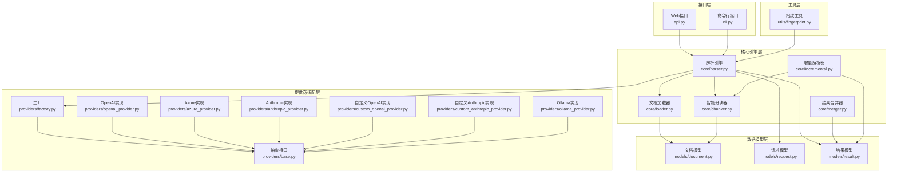
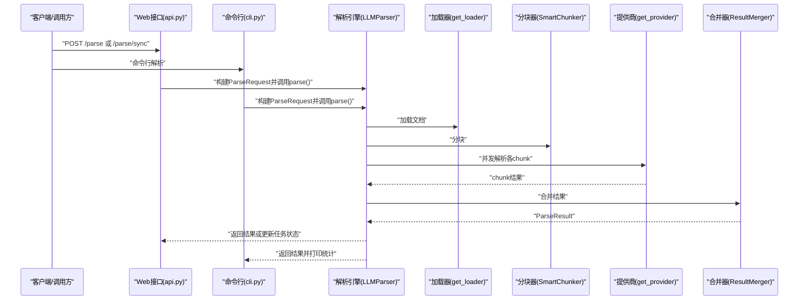
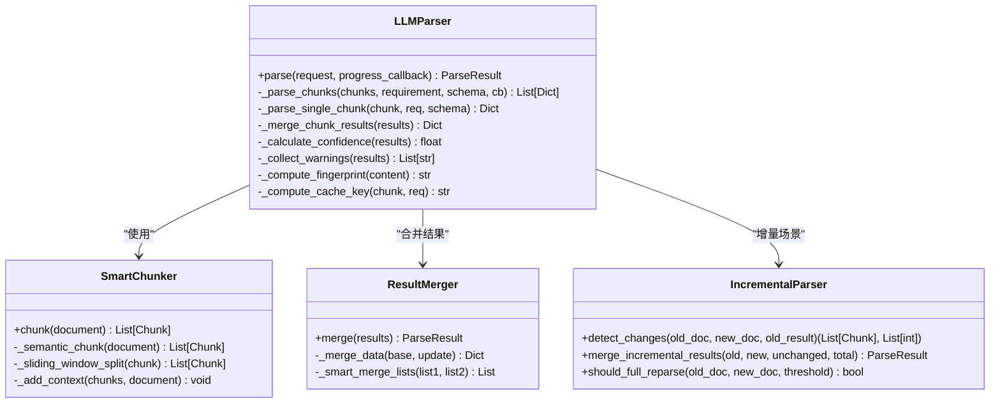
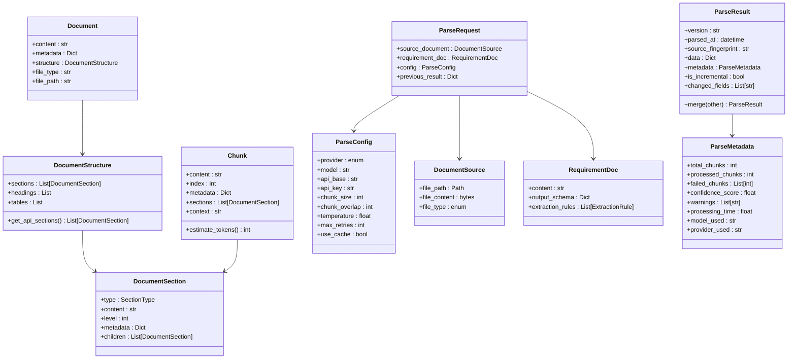
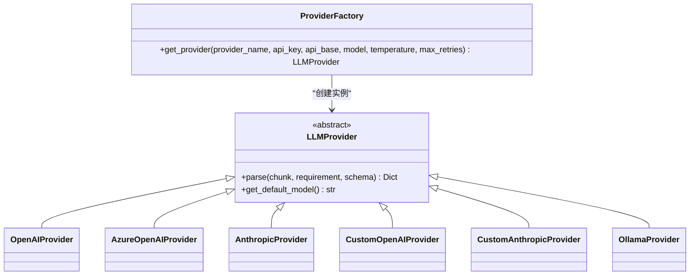
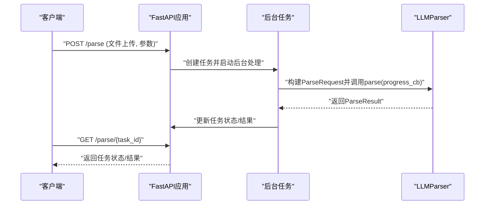
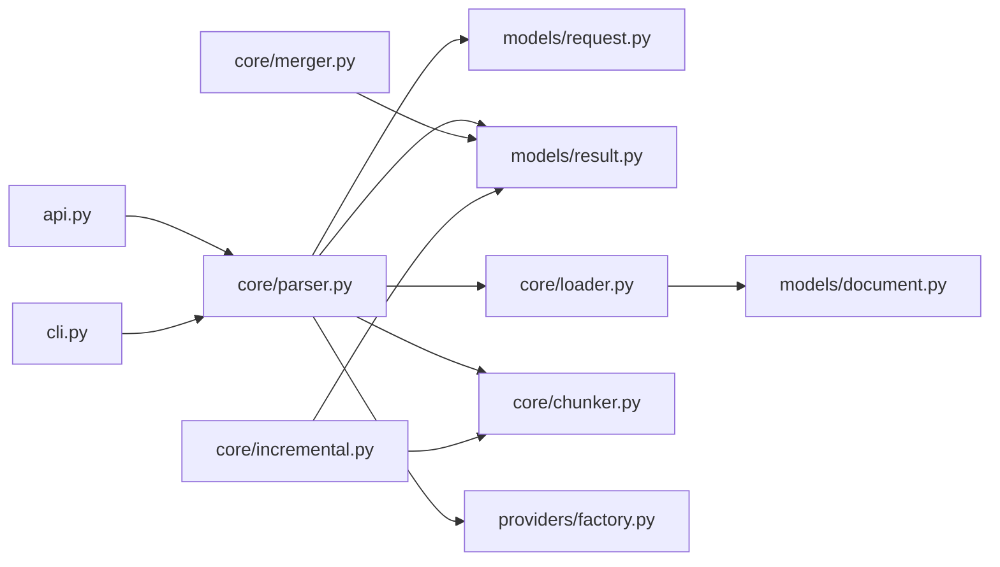

# 模块设计

<cite>
**本文引用的文件**
- [src/__init__.py](file://src/__init__.py)
- [src/api.py](file://src/api.py)
- [src/cli.py](file://src/cli.py)
- [src/config.py](file://src/config.py)
- [src/core/__init__.py](file://src/core/__init__.py)
- [src/core/parser.py](file://src/core/parser.py)
- [src/core/loader.py](file://src/core/loader.py)
- [src/core/chunker.py](file://src/core/chunker.py)
- [src/core/merger.py](file://src/core/merger.py)
- [src/core/incremental.py](file://src/core/incremental.py)
- [src/models/__init__.py](file://src/models/__init__.py)
- [src/models/document.py](file://src/models/document.py)
- [src/models/request.py](file://src/models/request.py)
- [src/models/result.py](file://src/models/result.py)
- [src/providers/__init__.py](file://src/providers/__init__.py)
- [src/providers/base.py](file://src/providers/base.py)
- [src/providers/factory.py](file://src/providers/factory.py)
- [src/providers/openai_provider.py](file://src/providers/openai_provider.py)
- [src/providers/azure_provider.py](file://src/providers/azure_provider.py)
- [src/providers/anthropic_provider.py](file://src/providers/anthropic_provider.py)
- [src/providers/custom_openai_provider.py](file://src/providers/custom_openai_provider.py)
- [src/providers/custom_anthropic_provider.py](file://src/providers/custom_anthropic_provider.py)
- [src/providers/ollama_provider.py](file://src/providers/ollama_provider.py)
- [src/utils/__init__.py](file://src/utils/__init__.py)
- [src/utils/fingerprint.py](file://src/utils/fingerprint.py)
</cite>

## 更新摘要
**所做更改**
- 更新了模块结构图以反映新的核心模块（core）、数据模型模块（models）、提供商适配模块（providers）、工具模块（utils）设计
- 新增了详细的模块职责划分和接口定义说明
- 完善了模块间的通信机制和数据传递方式
- 增加了模块初始化顺序、生命周期管理和错误传播机制
- 更新了模块依赖图和接口契约说明
- 强化了模块化设计优势和扩展性考虑

## 目录
1. [简介](#简介)
2. [项目结构](#项目结构)
3. [核心组件](#核心组件)
4. [架构总览](#架构总览)
5. [详细组件分析](#详细组件分析)
6. [依赖分析](#依赖分析)
7. [性能考量](#性能考量)
8. [故障排查指南](#故障排查指南)
9. [结论](#结论)
10. [附录](#附录)

## 简介
本模块设计文档面向"API文档解析器"项目，系统阐述模块职责划分、接口定义与依赖关系，重点覆盖核心模块（core）、数据模型模块（models）、提供商适配模块（providers）与工具模块（utils）。文档解释模块间的通信机制与数据传递方式，给出模块初始化顺序、生命周期管理与错误传播机制，并提供模块依赖图与接口契约说明。最后总结模块化设计的优势与扩展性考虑。

## 项目结构
项目采用按功能域分层的组织方式：
- 接口层：Web服务（FastAPI）与命令行（Typer），负责请求接入、参数校验与任务调度
- 核心引擎层：文档加载、智能分块、LLM解析、结果合并与增量更新
- 数据模型层：统一的输入/输出数据结构与枚举
- 提供商适配层：抽象LLM提供商接口与多厂商实现工厂
- 工具层：通用工具（如指纹计算）

**图表来源**
- [src/api.py](file://src/api.py#L1-L371)
- [src/cli.py](file://src/cli.py#L1-L393)
- [src/core/parser.py](file://src/core/parser.py#L1-L304)
- [src/core/loader.py](file://src/core/loader.py#L1-L328)
- [src/core/chunker.py](file://src/core/chunker.py#L1-L377)
- [src/core/merger.py](file://src/core/merger.py#L1-L220)
- [src/core/incremental.py](file://src/core/incremental.py#L1-L209)
- [src/models/document.py](file://src/models/document.py#L1-L75)
- [src/models/request.py](file://src/models/request.py#L1-L57)
- [src/models/result.py](file://src/models/result.py#L1-L55)
- [src/providers/__init__.py](file://src/providers/__init__.py#L1-L23)
- [src/utils/fingerprint.py](file://src/utils/fingerprint.py)

**章节来源**
- [src/api.py](file://src/api.py#L1-L371)
- [src/cli.py](file://src/cli.py#L1-L393)
- [src/core/__init__.py](file://src/core/__init__.py#L1-L19)

## 核心组件
- 接口层
  - Web接口：提供异步任务提交、同步解析、任务状态查询、提供商列表等REST能力；内部维护内存任务池，支持进度回调与错误回传
  - CLI接口：提供命令行解析、提供商列表展示、示例要求生成、进度可视化与统计输出
- 核心引擎层
  - 解析引擎：编排文档加载、分块、并发调用LLM、结果合并与元数据统计
  - 文档加载器：多格式（PDF/Word/Excel/文本/Markdown）加载与结构识别
  - 智能分块器：结构感知、长度控制、重叠缓冲与上下文增强
  - 结果合并器：多结果合并、去重与置信度聚合
  - 增量解析器：变更检测、未变更块复用与增量合并
- 数据模型层
  - 统一的输入/输出数据结构，确保跨模块契约稳定
- 提供商适配层
  - 抽象LLMProvider接口与工厂，屏蔽不同提供商差异
- 工具层
  - 指纹工具：用于缓存键与文档指纹计算

**章节来源**
- [src/api.py](file://src/api.py#L1-L371)
- [src/cli.py](file://src/cli.py#L1-L393)
- [src/core/parser.py](file://src/core/parser.py#L1-L304)
- [src/core/loader.py](file://src/core/loader.py#L1-L328)
- [src/core/chunker.py](file://src/core/chunker.py#L1-L377)
- [src/core/merger.py](file://src/core/merger.py#L1-L220)
- [src/core/incremental.py](file://src/core/incremental.py#L1-L209)
- [src/models/document.py](file://src/models/document.py#L1-L75)
- [src/models/request.py](file://src/models/request.py#L1-L57)
- [src/models/result.py](file://src/models/result.py#L1-L55)
- [src/providers/__init__.py](file://src/providers/__init__.py#L1-L23)
- [src/utils/fingerprint.py](file://src/utils/fingerprint.py)

## 架构总览
解析流程自上而下分为三层：接口层负责请求接入与任务编排；核心引擎层负责文档处理与LLM调用；数据模型层提供稳定的契约；提供商适配层屏蔽外部差异。

**图表来源**
- [src/api.py](file://src/api.py#L76-L254)
- [src/cli.py](file://src/cli.py#L111-L231)
- [src/core/parser.py](file://src/core/parser.py#L46-L128)
- [src/core/loader.py](file://src/core/loader.py#L313-L327)
- [src/core/chunker.py](file://src/core/chunker.py#L28-L62)
- [src/core/merger.py](file://src/core/merger.py#L17-L79)

## 详细组件分析

### 核心模块（core）
- 职责
  - 解析引擎：文档加载、分块、并发调用LLM、结果合并、元数据统计与缓存
  - 文档加载器：多格式文档加载与结构识别
  - 智能分块器：结构感知、长度控制、重叠缓冲与上下文增强
  - 结果合并器：多结果合并、去重与置信度聚合
  - 增量解析器：变更检测、未变更块复用与增量合并
- 关键接口
  - LLMParser.parse：主流程编排
  - DocumentLoader.load：文档加载
  - SmartChunker.chunk：智能分块
  - ResultMerger.merge：结果合并
  - IncrementalParser.detect_changes/merge_incremental_results：增量更新
- 生命周期
  - 初始化：解析引擎根据配置构造分块器与提供商工厂
  - 运行期：并发解析各chunk，汇总结果并生成元数据
  - 结束：记录处理时间、置信度、警告与失败索引
- 错误传播
  - 单chunk异常被捕获并标记，不影响整体流程
  - 最终结果包含失败chunk索引与警告集合

**图表来源**
- [src/core/parser.py](file://src/core/parser.py#L20-L304)
- [src/core/chunker.py](file://src/core/chunker.py#L10-L377)
- [src/core/merger.py](file://src/core/merger.py#L11-L220)
- [src/core/incremental.py](file://src/core/incremental.py#L14-L209)

**章节来源**
- [src/core/parser.py](file://src/core/parser.py#L1-L304)
- [src/core/chunker.py](file://src/core/chunker.py#L1-L377)
- [src/core/merger.py](file://src/core/merger.py#L1-L220)
- [src/core/incremental.py](file://src/core/incremental.py#L1-L209)

### 数据模型模块（models）
- 职责
  - 定义输入/输出数据结构，确保跨模块契约稳定
- 关键实体
  - 文档模型：Document、DocumentStructure、Chunk
  - 请求模型：ParseRequest、ParseConfig、DocumentSource、RequirementDoc、ExtractionRule
  - 结果模型：ParseResult、ParseMetadata
- 设计要点
  - 使用Pydantic BaseModel确保数据校验与序列化
  - 增量更新字段与版本控制

**图表来源**
- [src/models/document.py](file://src/models/document.py#L8-L75)
- [src/models/request.py](file://src/models/request.py#L8-L57)
- [src/models/result.py](file://src/models/result.py#L8-L55)

**章节来源**
- [src/models/document.py](file://src/models/document.py#L1-L75)
- [src/models/request.py](file://src/models/request.py#L1-L57)
- [src/models/result.py](file://src/models/result.py#L1-L55)

### 提供商适配模块（providers）
- 职责
  - 抽象LLMProvider接口，屏蔽不同提供商差异
  - 工厂get_provider按配置选择具体实现
- 实现
  - OpenAI/Azure/Anthropic/Ollama及自定义OpenAI/Anthropic
- 通信机制
  - 解析引擎通过工厂注入LLMProvider，按chunk并发调用parse接口
  - 配置驱动（provider、model、api_base、api_key、temperature、max_retries）

**图表来源**
- [src/providers/__init__.py](file://src/providers/__init__.py#L1-L23)
- [src/core/parser.py](file://src/core/parser.py#L32-L44)

**章节来源**
- [src/providers/__init__.py](file://src/providers/__init__.py#L1-L23)
- [src/core/parser.py](file://src/core/parser.py#L1-L60)

### 工具模块（utils）
- 职责
  - 通用工具函数，如指纹计算
- 作用
  - 缓存键与文档指纹计算，提升重复解析效率

**章节来源**
- [src/utils/fingerprint.py](file://src/utils/fingerprint.py)

### 接口层（Web与CLI）
- Web接口
  - 异步任务：创建任务、后台处理、进度回调、状态查询
  - 同步解析：直接返回结果
  - 提供商列表：列举支持的LLM提供商及其要求
- CLI接口
  - 命令行解析、提供商列表、示例要求生成、进度与统计输出

**图表来源**
- [src/api.py](file://src/api.py#L76-L174)
- [src/api.py](file://src/api.py#L302-L353)

**章节来源**
- [src/api.py](file://src/api.py#L1-L371)
- [src/cli.py](file://src/cli.py#L1-L393)

## 依赖分析
- 模块内聚与耦合
  - 核心引擎对提供商与数据模型存在明确依赖，通过工厂与Pydantic模型解耦
  - 接口层仅依赖核心引擎与配置，低耦合高内聚
- 外部依赖
  - Pydantic（数据校验）、structlog（日志）、FastAPI/Typer（接口）、第三方PDF/Word/Excel解析库
- 循环依赖
  - 未发现循环导入；提供商工厂在核心引擎中按需引入，避免环状依赖

**图表来源**
- [src/api.py](file://src/api.py#L13-L21)
- [src/cli.py](file://src/cli.py#L16-L23)
- [src/core/parser.py](file://src/core/parser.py#L10-L15)

**章节来源**
- [src/api.py](file://src/api.py#L1-L371)
- [src/cli.py](file://src/cli.py#L1-L393)
- [src/core/parser.py](file://src/core/parser.py#L1-L60)

## 性能考量
- 并发控制：解析引擎使用信号量限制并发数，避免LLM提供商限流或资源耗尽
- 缓存策略：基于chunk+要求+模型的缓存键，命中后跳过LLM调用
- 分块策略：结构感知与重叠缓冲减少信息截断，提高召回率
- 增量更新：变更检测与未变更块复用，显著降低重复工作量
- 日志与监控：结构化日志记录关键指标，便于定位性能瓶颈

## 故障排查指南
- 常见问题
  - 文件类型不支持：检查文件后缀与加载器映射
  - 文件过大：参考配置中的最大文件大小限制
  - 输出Schema无效：确认JSON字符串格式正确
  - LLM调用失败：查看提供商配置（API Key/Base URL/模型名）与重试设置
- 错误传播
  - 单chunk异常被捕获并记录，不影响整体流程
  - 任务状态包含错误信息，便于前端/CLI展示
- 建议
  - 开启详细日志，结合任务状态追踪失败原因
  - 对大文档启用增量更新，减少重复解析成本

**章节来源**
- [src/api.py](file://src/api.py#L94-L124)
- [src/api.py](file://src/api.py#L108-L124)
- [src/api.py](file://src/api.py#L211-L221)
- [src/core/parser.py](file://src/core/parser.py#L156-L169)

## 结论
该模块设计通过清晰的分层与职责划分，实现了高内聚、低耦合与强扩展性。接口层与核心引擎分离，数据模型与提供商适配解耦，使得系统易于维护与演进。并发、缓存、分块与增量更新等机制共同保障了解析性能与稳定性。未来可在提供商工厂中引入更多实现、扩展更多文档格式与输出Schema，并完善持久化任务队列与分布式部署方案。

## 附录
- 初始化顺序建议
  - 配置加载（config.py）
  - 接口层启动（api.py/cli.py）
  - 核心引擎按需初始化（解析引擎、分块器、加载器）
  - 提供商工厂按请求动态创建
- 生命周期管理
  - Web任务：内存任务池，完成后清理文件内容
  - CLI：一次性解析，结束后退出
- 错误传播机制
  - 单点异常捕获与聚合，最终结果包含失败索引与警告