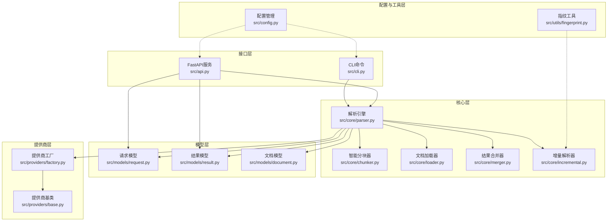
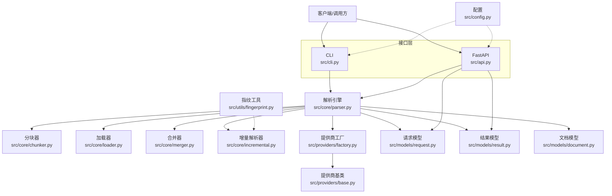
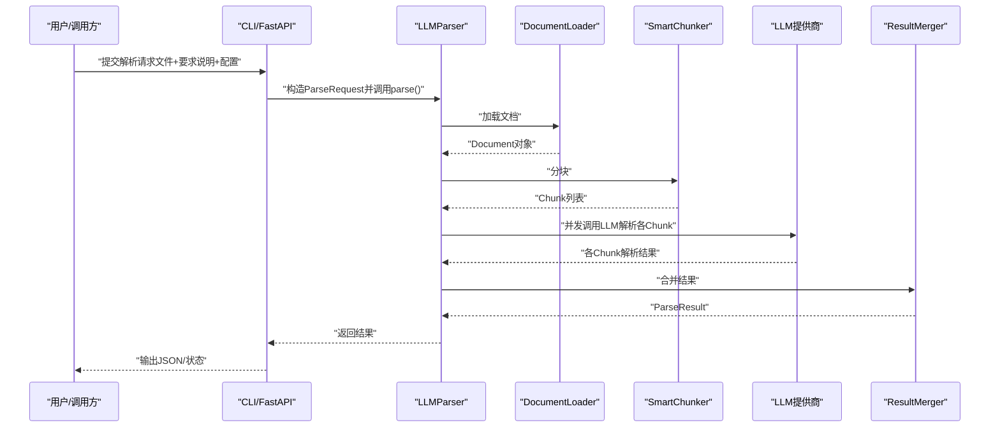
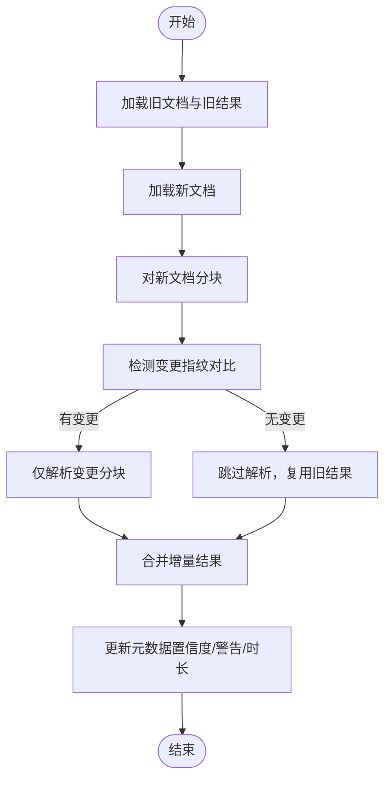
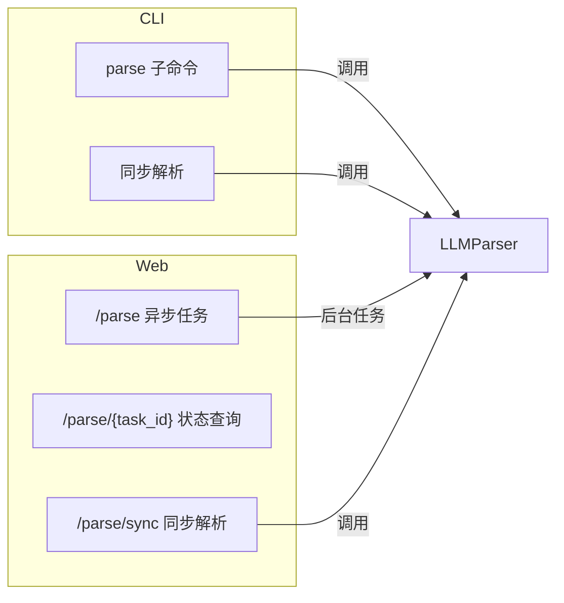
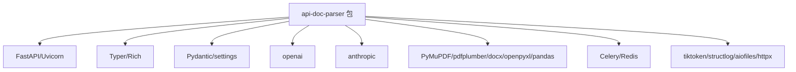

# 系统概览

<cite>
**本文引用的文件**
- [src/__init__.py](file://src/__init__.py)
- [src/config.py](file://src/config.py)
- [src/api.py](file://src/api.py)
- [src/cli.py](file://src/cli.py)
- [src/core/parser.py](file://src/core/parser.py)
- [src/core/chunker.py](file://src/core/chunker.py)
- [src/core/loader.py](file://src/core/loader.py)
- [src/core/merger.py](file://src/core/merger.py)
- [src/core/incremental.py](file://src/core/incremental.py)
- [src/models/request.py](file://src/models/request.py)
- [src/models/result.py](file://src/models/result.py)
- [src/models/document.py](file://src/models/document.py)
- [src/providers/factory.py](file://src/providers/factory.py)
- [src/providers/base.py](file://src/providers/base.py)
- [src/utils/fingerprint.py](file://src/utils/fingerprint.py)
</cite>

## 目录
1. [简介](#简介)
2. [项目结构](#项目结构)
3. [核心组件](#核心组件)
4. [架构总览](#架构总览)
5. [详细组件分析](#详细组件分析)
6. [依赖分析](#依赖分析)
7. [性能考虑](#性能考虑)
8. [故障排查指南](#故障排查指南)
9. [结论](#结论)
10. [附录](#附录)

## 简介
本系统是一个"API文档解析器"，旨在利用大语言模型（LLM）对多种格式的API文档（PDF、Word、Excel、纯文本、Markdown）进行结构化抽取，输出符合用户定义Schema的JSON结果。系统同时提供命令行（CLI）与Web服务（FastAPI）两种使用方式，并支持多提供商（OpenAI、Azure OpenAI、Anthropic Claude、Ollama、自定义OpenAI/Anthropic协议）与增量更新能力。

业务价值与技术优势
- 多格式输入：统一的文档加载层支持主流格式，降低上游准备成本
- 结构感知分块：结合文档结构与滑动窗口，兼顾语义完整性与长度控制
- 多LLM提供商：统一抽象与工厂模式，便于切换与扩展
- 增量更新：基于指纹与分块对比，仅重算变更部分，显著提升大规模文档迭代效率
- 可观测性：内置进度回调、置信度统计、警告聚合与处理时长统计
- 可运维性：CLI与Web双形态，便于集成到脚本、CI/CD与在线平台

## 项目结构
系统采用"分层+模块化"组织方式，完整实现了五层架构设计：
- 接口层：CLI命令与FastAPI服务，提供统一的用户交互入口
- 核心层：解析引擎、分块器、加载器、合并器、增量解析器，实现核心业务逻辑
- 模型层：请求/结果/文档数据模型，定义清晰的输入输出契约
- 提供商层：抽象基类与多提供商实现，工厂统一创建与管理
- 配置与工具层：Pydantic设置、环境变量绑定、指纹计算工具

**图表来源**
- [src/cli.py](file://src/cli.py#L1-L393)
- [src/api.py](file://src/api.py#L1-L371)
- [src/core/parser.py](file://src/core/parser.py#L1-L304)
- [src/core/chunker.py](file://src/core/chunker.py#L1-L377)
- [src/core/loader.py](file://src/core/loader.py#L1-L328)
- [src/core/merger.py](file://src/core/merger.py#L1-L220)
- [src/core/incremental.py](file://src/core/incremental.py#L1-L209)
- [src/models/request.py](file://src/models/request.py#L1-L57)
- [src/models/result.py](file://src/models/result.py#L1-L55)
- [src/models/document.py](file://src/models/document.py#L1-L75)
- [src/providers/factory.py](file://src/providers/factory.py#L1-L71)
- [src/providers/base.py](file://src/providers/base.py#L1-L143)
- [src/config.py](file://src/config.py#L1-L57)
- [src/utils/fingerprint.py](file://src/utils/fingerprint.py#L1-L80)

**章节来源**
- [src/__init__.py](file://src/__init__.py#L1-L9)
- [src/config.py](file://src/config.py#L1-L57)

## 核心组件
- 解析引擎（LLMParser）
  - 负责加载文档、分块、并发调用LLM提供商、合并结果、统计元数据
  - 支持缓存、进度回调、异常处理与置信度计算
- 智能分块器（SmartChunker）
  - 基于文档结构（标题、API端点、表格、代码块）进行语义分块；对超长块使用滑动窗口与重叠缓冲
- 文档加载器（DocumentLoader）
  - 统一抽象，针对PDF、Word、Excel、文本/Markdown分别实现；内置API章节检测
- 结果合并器（ResultMerger）
  - 深度合并字典与列表，按关键字段去重，支持增量合并
- 增量解析器（IncrementalParser）
  - 基于文档/分块指纹检测变更，仅重算变更部分
- 提供商工厂与基类（ProviderFactory/LLMProvider）
  - 统一抽象不同LLM提供商，支持OpenAI/Azure/Anthropic/Ollama及自定义协议
- 请求/结果/文档模型（Pydantic）
  - 明确输入输出契约，便于校验与序列化
- 配置管理（Settings）
  - 读取.env，集中管理LLM提供商默认参数、并发与文件大小限制等
- 指纹计算工具（FingerprintUtils）
  - 提供文档级和分块级指纹计算，支持多种哈希算法

**章节来源**
- [src/core/parser.py](file://src/core/parser.py#L20-L304)
- [src/core/chunker.py](file://src/core/chunker.py#L10-L377)
- [src/core/loader.py](file://src/core/loader.py#L17-L328)
- [src/core/merger.py](file://src/core/merger.py#L11-L220)
- [src/core/incremental.py](file://src/core/incremental.py#L14-L209)
- [src/providers/factory.py](file://src/providers/factory.py#L14-L71)
- [src/providers/base.py](file://src/providers/base.py#L27-L143)
- [src/models/request.py](file://src/models/request.py#L8-L57)
- [src/models/result.py](file://src/models/result.py#L8-L55)
- [src/models/document.py](file://src/models/document.py#L20-L75)
- [src/config.py](file://src/config.py#L7-L57)
- [src/utils/fingerprint.py](file://src/utils/fingerprint.py#L9-L80)

## 架构总览
系统边界与集成接口
- 系统边界
  - 输入：API文档（PDF/Word/Excel/文本/Markdown），要求说明（文本+JSON Schema+提取规则），可选上一次解析结果（用于增量）
  - 输出：结构化JSON结果（遵循输出Schema），解析元数据（置信度、处理时长、警告等）
- 外部依赖
  - LLM提供商SDK（OpenAI、Anthropic、Azure OpenAI）
  - 文档处理库（PDF、Word、Excel、表格解析）
  - Web框架（FastAPI）、ASGI服务器（Uvicorn）
  - 任务队列（Celery）与消息中间件（Redis，用于扩展）
  - 日志与结构化日志（structlog）

**图表来源**
- [src/cli.py](file://src/cli.py#L1-L393)
- [src/api.py](file://src/api.py#L1-L371)
- [src/core/parser.py](file://src/core/parser.py#L1-L304)
- [src/core/chunker.py](file://src/core/chunker.py#L1-L377)
- [src/core/loader.py](file://src/core/loader.py#L1-L328)
- [src/core/merger.py](file://src/core/merger.py#L1-L220)
- [src/core/incremental.py](file://src/core/incremental.py#L1-L209)
- [src/providers/factory.py](file://src/providers/factory.py#L1-L71)
- [src/providers/base.py](file://src/providers/base.py#L1-L143)
- [src/models/request.py](file://src/models/request.py#L1-L57)
- [src/models/result.py](file://src/models/result.py#L1-L55)
- [src/models/document.py](file://src/models/document.py#L1-L75)
- [src/config.py](file://src/config.py#L1-L57)
- [src/utils/fingerprint.py](file://src/utils/fingerprint.py#L1-L80)

## 详细组件分析

### 解析流程（CLI与Web共用）

**图表来源**
- [src/core/parser.py](file://src/core/parser.py#L46-L128)
- [src/core/loader.py](file://src/core/loader.py#L80-L127)
- [src/core/chunker.py](file://src/core/chunker.py#L28-L62)
- [src/core/merger.py](file://src/core/merger.py#L17-L79)
- [src/providers/base.py](file://src/providers/base.py#L34-L57)
- [src/api.py](file://src/api.py#L177-L254)
- [src/cli.py](file://src/cli.py#L127-L231)

**章节来源**
- [src/core/parser.py](file://src/core/parser.py#L46-L128)
- [src/api.py](file://src/api.py#L177-L254)
- [src/cli.py](file://src/cli.py#L127-L231)

### 增量更新流程

**图表来源**
- [src/core/incremental.py](file://src/core/incremental.py#L29-L150)
- [src/core/parser.py](file://src/core/parser.py#L46-L128)

**章节来源**
- [src/core/incremental.py](file://src/core/incremental.py#L14-L209)

### CLI与Web使用方式的架构差异
- CLI（命令行）
  - 同步执行，适合小/中文档；支持进度条、统计信息展示与详细日志
  - 通过Typer提供子命令（parse、providers、example-requirement）
- Web服务（FastAPI）
  - 异步任务队列：/parse创建任务，/parse/{task_id}轮询状态
  - 同步接口：/parse/sync直接返回结果，适合小文档直连
  - 内存任务存储（开发用途），生产建议接入Redis+Celery

**图表来源**
- [src/cli.py](file://src/cli.py#L50-L125)
- [src/api.py](file://src/api.py#L76-L155)
- [src/api.py](file://src/api.py#L177-L254)

**章节来源**
- [src/cli.py](file://src/cli.py#L50-L125)
- [src/api.py](file://src/api.py#L76-L155)
- [src/api.py](file://src/api.py#L177-L254)

## 依赖分析
- 运行时依赖（摘录）
  - Web框架：FastAPI、Uvicorn
  - CLI框架：Typer、Rich
  - 数据校验与配置：Pydantic、pydantic-settings
  - LLM SDK：openai、anthropic
  - 文档处理：PyMuPDF、pdfplumber、python-docx、openpyxl、pandas
  - 任务队列：Celery、Redis（可选）
  - 工具：tiktoken、structlog、aiofiles、httpx
- 开发依赖：pytest、black、ruff、mypy、pre-commit

**图表来源**
- [src/api.py](file://src/api.py#L1-L371)
- [src/cli.py](file://src/cli.py#L1-L393)

**章节来源**
- [src/api.py](file://src/api.py#L1-L371)
- [src/cli.py](file://src/cli.py#L1-L393)

## 性能考虑
- 并发与限流
  - 解析阶段使用信号量限制并发（默认5），避免LLM速率限制与资源争用
- 分块策略
  - 语义优先：按标题、API端点、表格/代码块切分；超长块采用滑动窗口与重叠缓冲
  - Token估算：按字符数估算，确保不超过模型上下文
- 缓存与去重
  - 提供商层可启用缓存，减少重复请求
  - 合并器按关键字段对列表（尤其是API端点）去重
- 增量更新
  - 基于指纹快速定位变更，仅重算变更分块，显著降低大规模文档更新成本
- I/O与内存
  - Web端对大文件进行大小限制；后台任务完成后清理文件内容以节省内存

**章节来源**
- [src/core/parser.py](file://src/core/parser.py#L130-L169)
- [src/core/chunker.py](file://src/core/chunker.py#L13-L26)
- [src/core/merger.py](file://src/core/merger.py#L98-L135)
- [src/api.py](file://src/api.py#L108-L112)
- [src/api.py](file://src/api.py#L346-L347)

## 故障排查指南
- 常见问题
  - 不支持的文件类型：检查后缀是否在支持列表内
  - 文件过大：参考配置中的最大文件大小限制
  - LLM提供商参数缺失：自定义提供商需提供API基础URL；Azure需提供Endpoint
  - JSON解析失败：LLM返回非标准JSON时，系统会尝试提取与回退
- 可观测性
  - CLI输出统计面板（总分块、成功/失败、置信度、处理时间、警告）
  - Web端任务状态包含进度、结果与错误信息
- 建议排查步骤
  - 检查环境变量与配置文件
  - 减小分块大小或温度参数，提高稳定性
  - 使用示例要求说明文件进行最小复现
  - 在Web端使用/parse/sync进行小文档验证

**章节来源**
- [src/cli.py](file://src/cli.py#L246-L296)
- [src/api.py](file://src/api.py#L97-L112)
- [src/api.py](file://src/api.py#L138-L146)
- [src/providers/base.py](file://src/providers/base.py#L112-L142)

## 结论
本系统通过清晰的分层设计与模块化实现，提供了高扩展性的API文档结构化抽取能力。其核心优势在于：
- 统一的多格式加载与结构感知分块
- 多提供商抽象与工厂模式
- 增量更新与可观测性
- CLI与Web双形态满足不同使用场景

建议在生产环境中：
- 使用Web服务+Redis+Celery进行异步任务编排
- 针对不同文档类型调整分块大小与重叠策略
- 通过示例要求说明文件规范输出Schema，提升稳定性

## 附录
- 支持的LLM提供商一览（节选）
  - openai、azure、anthropic、custom_openai、custom_anthropic、ollama
- 关键配置项（节选）
  - 默认分块大小、重叠、温度、最大重试、文件大小限制、Redis连接等

**章节来源**
- [src/api.py](file://src/api.py#L257-L299)
- [src/config.py](file://src/config.py#L43-L52)
- [src/cli.py](file://src/cli.py#L300-L323)