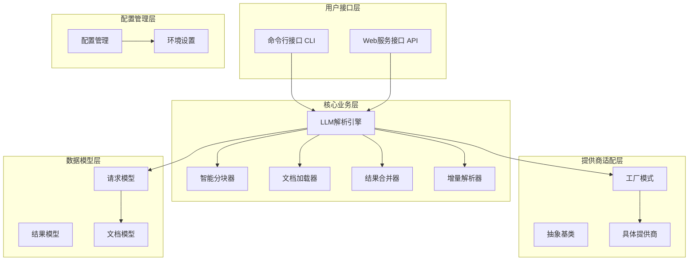
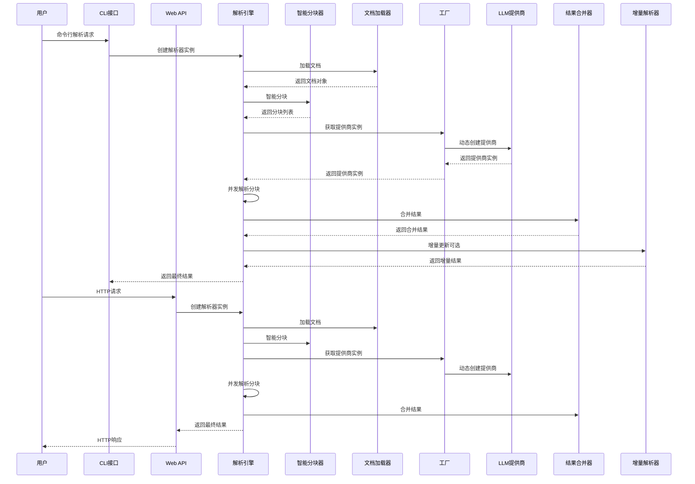
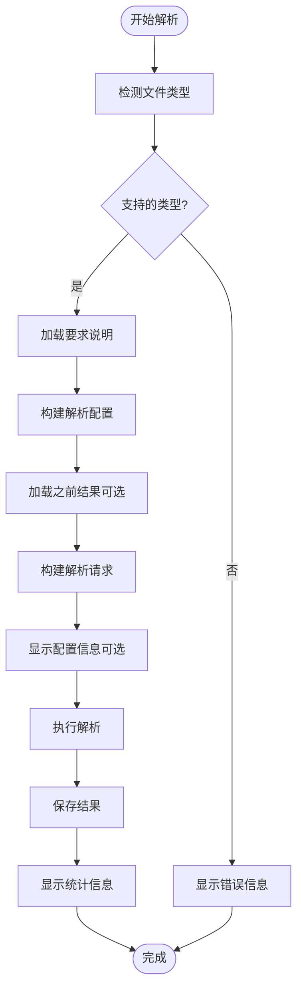
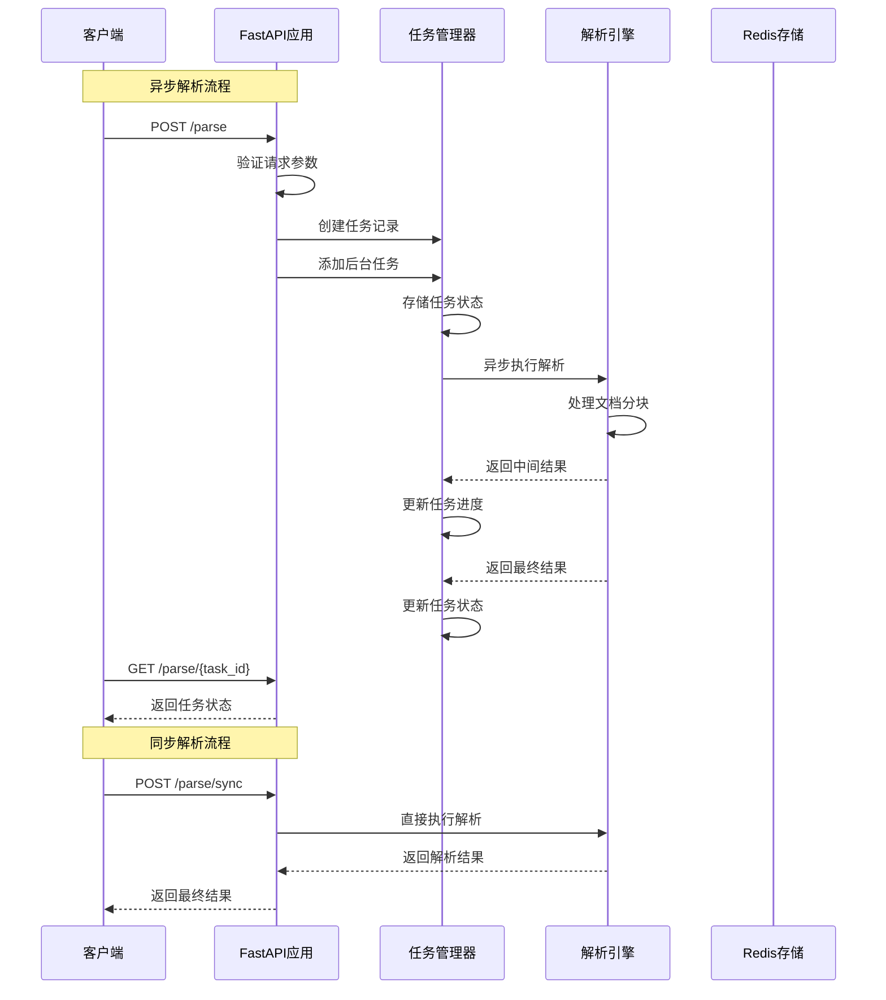
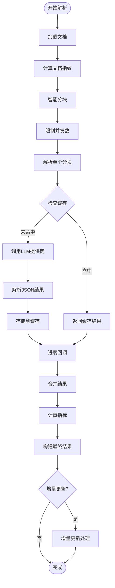
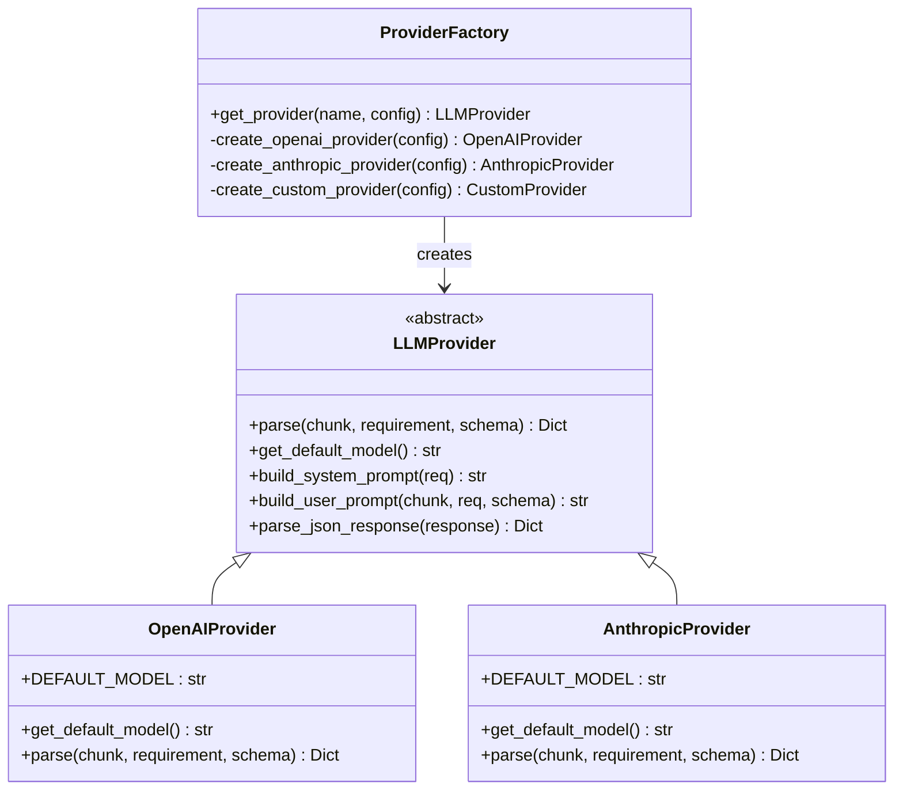
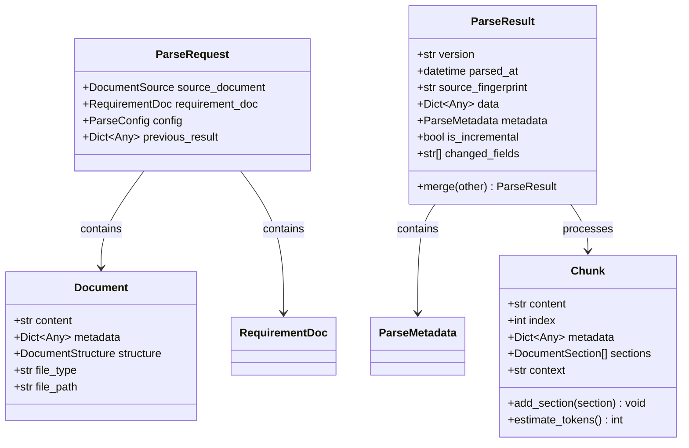
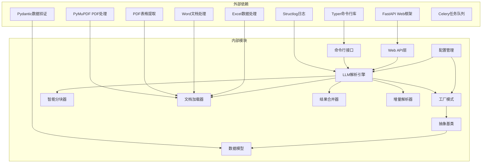

# 组件交互

<cite>
**本文档引用的文件**
- [cli.py](file://api-doc-parser/src/cli.py)
- [api.py](file://api-doc-parser/src/api.py)
- [parser.py](file://api-doc-parser/src/core/parser.py)
- [chunker.py](file://api-doc-parser/src/core/chunker.py)
- [loader.py](file://api-doc-parser/src/core/loader.py)
- [merger.py](file://api-doc-parser/src/core/merger.py)
- [incremental.py](file://api-doc-parser/src/core/incremental.py)
- [factory.py](file://api-doc-parser/src/providers/factory.py)
- [base.py](file://api-doc-parser/src/providers/base.py)
- [request.py](file://api-doc-parser/src/models/request.py)
- [result.py](file://api-doc-parser/src/models/result.py)
- [openai_provider.py](file://api-doc-parser/src/providers/openai_provider.py)
- [anthropic_provider.py](file://api-doc-parser/src/providers/anthropic_provider.py)
- [document.py](file://api-doc-parser/src/models/document.py)
- [test_providers.py](file://api-doc-parser/tests/test_providers.py)
- [pyproject.toml](file://api-doc-parser/pyproject.toml)
</cite>

## 更新摘要
**变更内容**
- 新增CLI与Web服务接口的详细交互机制分析
- 完善LLM解析引擎的组件交互流程图
- 增加智能分块器的结构感知分块策略说明
- 补充文档加载器的多格式支持机制
- 新增结果合并器的增量更新处理逻辑
- 完善提供商工厂的动态创建机制
- 增加增量解析器的文档变更检测功能

## 目录
1. [简介](#简介)
2. [项目结构](#项目结构)
3. [核心组件](#核心组件)
4. [架构概览](#架构概览)
5. [详细组件分析](#详细组件分析)
6. [依赖关系分析](#依赖关系分析)
7. [性能考量](#性能考量)
8. [故障排除指南](#故障排除指南)
9. [结论](#结论)

## 简介

API文档解析器是一个基于大语言模型的智能文档处理系统，专门用于从各种格式的API文档中提取结构化信息。该系统采用模块化设计，支持多种LLM提供商，并提供了完整的异步处理能力。

系统的核心目标是通过统一的接口抽象，为不同类型的LLM提供商提供一致的使用体验，同时保持高度的可扩展性和可维护性。系统现已支持CLI命令行接口和Web服务接口两种交互方式，为用户提供灵活的使用选择。

## 项目结构

项目采用清晰的分层架构，按照功能职责进行模块划分：

**图表来源**
- [cli.py](file://api-doc-parser/src/cli.py#L1-L393)
- [api.py](file://api-doc-parser/src/api.py#L1-L371)
- [parser.py](file://api-doc-parser/src/core/parser.py#L1-L304)
- [factory.py](file://api-doc-parser/src/providers/factory.py#L1-L71)

**章节来源**
- [pyproject.toml](file://api-doc-parser/pyproject.toml#L1-L100)

## 核心组件

### CLI命令行接口 (Command Line Interface)

CLI接口提供了完整的命令行交互体验，支持以下主要功能：

- **文档解析命令**：`api-doc-parser parse` 命令用于解析API文档
- **提供商列表**：`api-doc-parser providers` 显示支持的LLM提供商
- **示例生成**：`api-doc-parser example-requirement` 生成示例要求说明文件
- **进度可视化**：使用rich库提供实时进度条和统计信息
- **配置管理**：支持多种配置选项，包括提供商、模型、温度参数等

### Web服务接口 (Web API)

Web服务接口基于FastAPI构建，提供RESTful API：

- **异步任务处理**：`/parse` 端点创建异步解析任务
- **同步解析**：`/parse/sync` 端点直接返回解析结果
- **任务状态查询**：`/parse/{task_id}` 查询任务执行状态
- **健康检查**：`/health` 端点提供服务健康状态
- **提供商查询**：`/providers` 端点列出支持的LLM提供商

### LLM解析引擎 (LLMParser)

LLM解析引擎是整个系统的核心，负责协调文档处理的完整流程。它实现了以下关键功能：

- **文档加载与预处理**：支持多种文档格式的加载和解析
- **智能分块**：基于文档结构和长度的智能分块策略
- **并发解析**：异步并发处理多个文档分块
- **结果合并**：将多个分块的结果进行智能合并
- **缓存管理**：内存级缓存机制提升性能
- **增量更新**：支持文档变更的增量解析功能

### 智能分块器 (SmartChunker)

智能分块器实现了结构感知的文档分块策略：

- **语义分块**：基于文档结构（标题、章节、API端点）进行语义分块
- **长度限制**：根据token数量限制分块大小
- **重叠缓冲**：保持分块间的上下文连续性
- **结构保持**：确保表格、代码块等复杂结构的完整性
- **上下文增强**：为每个分块添加全局和邻近上下文信息

### 文档加载器 (DocumentLoader)

文档加载器支持多种文档格式的加载：

- **PDF支持**：使用PyMuPDF和pdfplumber提取文本和表格
- **Word支持**：使用python-docx处理.docx文档
- **Excel支持**：使用pandas解析.xlsx文档
- **文本支持**：处理.txt和.md文件
- **结构检测**：自动识别API端点、标题、代码块等结构

### 结果合并器 (ResultMerger)

结果合并器提供智能的结果合并功能：

- **深度合并**：递归合并嵌套的字典结构
- **列表去重**：基于关键字段对列表进行去重合并
- **增量合并**：支持增量更新的结果合并
- **冲突解决**：处理合并过程中的数据冲突
- **元数据整合**：合并处理统计和错误信息

### 增量解析器 (IncrementalParser)

增量解析器支持文档变更的增量更新：

- **指纹计算**：计算文档和分块的指纹用于变更检测
- **变更检测**：比较新旧文档识别变更部分
- **部分重解析**：仅重新解析变更的分块
- **结果合并**：合并增量结果与历史结果
- **性能优化**：显著减少重复解析的工作量

**章节来源**
- [cli.py](file://api-doc-parser/src/cli.py#L50-L393)
- [api.py](file://api-doc-parser/src/api.py#L76-L371)
- [parser.py](file://api-doc-parser/src/core/parser.py#L20-L304)
- [chunker.py](file://api-doc-parser/src/core/chunker.py#L10-L377)
- [loader.py](file://api-doc-parser/src/core/loader.py#L17-L328)
- [merger.py](file://api-doc-parser/src/core/merger.py#L11-L220)
- [incremental.py](file://api-doc-parser/src/core/incremental.py#L14-L209)

## 架构概览

系统采用分层架构设计，各层之间职责明确，耦合度低。CLI和Web服务接口通过统一的解析引擎协调各个组件：

**图表来源**
- [cli.py](file://api-doc-parser/src/cli.py#L112-L228)
- [api.py](file://api-doc-parser/src/api.py#L76-L255)
- [parser.py](file://api-doc-parser/src/core/parser.py#L46-L128)
- [factory.py](file://api-doc-parser/src/providers/factory.py#L14-L71)

## 详细组件分析

### CLI接口交互机制

CLI接口提供了完整的命令行交互体验，具有以下特点：

#### 命令行参数解析

CLI接口使用Typer库实现命令行参数解析，支持以下主要命令：

- **parse命令**：解析API文档，支持多种配置选项
- **providers命令**：显示支持的LLM提供商列表
- **example-requirement命令**：生成示例要求说明文件

#### 进度可视化和统计

CLI接口使用Rich库提供丰富的进度可视化：

- **实时进度条**：显示解析进度和分块数量
- **统计面板**：展示处理时间、置信度、警告信息等
- **彩色输出**：使用不同颜色区分不同类型的信息

#### 文件类型检测

CLI接口实现了智能的文件类型检测机制：

**图表来源**
- [cli.py](file://api-doc-parser/src/cli.py#L127-L231)

**章节来源**
- [cli.py](file://api-doc-parser/src/cli.py#L50-L393)

### Web服务接口交互机制

Web服务接口基于FastAPI构建，提供RESTful API和异步任务处理：

#### 异步任务处理流程

Web服务接口实现了完整的异步任务处理机制：

**图表来源**
- [api.py](file://api-doc-parser/src/api.py#L76-L155)
- [api.py](file://api-doc-parser/src/api.py#L177-L255)

#### 请求参数验证

Web服务接口实现了严格的请求参数验证：

- **文件类型验证**：检查上传文件的扩展名
- **文件大小限制**：基于配置限制文件大小
- **JSON格式验证**：验证output_schema的JSON格式
- **提供商参数验证**：确保提供商配置的完整性

**章节来源**
- [api.py](file://api-doc-parser/src/api.py#L76-L371)

### 解析引擎工作流程

解析引擎实现了完整的文档处理流水线，支持增量更新：

**图表来源**
- [parser.py](file://api-doc-parser/src/core/parser.py#L46-L128)
- [parser.py](file://api-doc-parser/src/core/parser.py#L130-L169)

#### 并发控制机制

解析引擎采用了多层并发控制机制：

- **信号量限制**：使用信号量限制同时进行的解析任务数量
- **异常处理**：捕获并处理单个分块解析过程中的异常
- **进度跟踪**：实时跟踪和报告解析进度
- **缓存优化**：内存级缓存减少重复解析

**章节来源**
- [parser.py](file://api-doc-parser/src/core/parser.py#L130-L169)

### 智能分块器分块策略

智能分块器实现了多层分块策略，确保分块质量和上下文完整性：

#### 语义分块策略

智能分块器首先尝试基于文档结构进行语义分块：

- **API端点优先**：遇到API端点时强制开始新分块
- **一级标题分割**：遇到一级标题时开始新分块
- **结构完整性**：确保表格、代码块等复杂结构的完整性
- **长度控制**：根据token数量限制控制分块大小

#### 大块处理机制

对于超过长度限制的大分块，智能分块器使用滑动窗口技术：

- **句子边界分割**：尽量在句子边界进行分割
- **重叠缓冲**：保留分块间的重叠内容
- **结构前缀**：为大表格和代码块保留必要的前缀信息

#### 上下文增强

智能分块器为每个分块添加丰富的上下文信息：

- **全局信息**：提取文档的全局信息（API基础URL、认证方式等）
- **邻近摘要**：为每个分块添加相邻分块的摘要信息
- **结构类型**：标记分块包含的结构类型信息

**章节来源**
- [chunker.py](file://api-doc-parser/src/core/chunker.py#L28-L62)
- [chunker.py](file://api-doc-parser/src/core/chunker.py#L166-L201)

### 文档加载器多格式支持

文档加载器实现了统一的接口来支持多种文档格式：

#### PDF文档处理

PDF文档加载器使用PyMuPDF和pdfplumber：

- **文本提取**：使用PyMuPDF提取PDF文本内容
- **表格识别**：使用pdfplumber识别和提取表格
- **元数据提取**：提取PDF的标题、作者等元数据
- **页面遍历**：逐页处理PDF内容

#### Word文档处理

Word文档加载器使用python-docx：

- **段落提取**：提取文档段落内容
- **标题识别**：识别和标记文档标题
- **表格处理**：提取表格数据并转换为文本
- **样式分析**：分析段落样式以识别标题级别

#### Excel文档处理

Excel文档加载器使用pandas：

- **多工作表支持**：处理包含多个工作表的Excel文件
- **数据框转换**：将表格数据转换为字符串格式
- **结构化数据**：保存每张工作表的结构化数据
- **元数据记录**：记录工作表数量和名称等信息

#### 文本文件处理

文本文件加载器支持.txt和.md文件：

- **内容读取**：读取纯文本文件内容
- **API结构检测**：自动检测API相关的结构信息
- **章节识别**：识别标题、代码块等结构

**章节来源**
- [loader.py](file://api-doc-parser/src/core/loader.py#L80-L153)
- [loader.py](file://api-doc-parser/src/core/loader.py#L155-L231)
- [loader.py](file://api-doc-parser/src/core/loader.py#L233-L283)
- [loader.py](file://api-doc-parser/src/core/loader.py#L285-L311)

### 结果合并器智能合并

结果合并器提供了多种合并策略来处理不同类型的结构：

#### 深度合并算法

结果合并器实现了递归的深度合并算法：

- **字典合并**：递归合并嵌套的字典结构
- **列表去重**：基于关键字段对列表进行去重合并
- **类型判断**：根据数据类型选择合适的合并策略
- **冲突处理**：处理合并过程中的数据冲突

#### 关键字段识别

结果合并器能够智能识别关键字段进行去重：

- **常见API字段**：识别path、method、name等关键字段
- **字段组合**：支持多个字段的组合作为唯一标识
- **优先级排序**：根据字段的重要性排序
- **回退机制**：当无法识别关键字段时使用回退策略

#### 增量合并支持

结果合并器支持增量更新的合并：

- **部分更新**：仅合并变更的部分
- **元数据整合**：合并处理统计和错误信息
- **置信度计算**：重新计算整体置信度
- **警告聚合**：合并所有警告信息

**章节来源**
- [merger.py](file://api-doc-parser/src/core/merger.py#L81-L96)
- [merger.py](file://api-doc-parser/src/core/merger.py#L116-L135)
- [merger.py](file://api-doc-parser/src/core/merger.py#L176-L220)

### 增量解析器变更检测

增量解析器实现了高效的文档变更检测机制：

#### 指纹计算

增量解析器使用哈希算法计算指纹：

- **文档指纹**：计算整个文档的SHA256指纹
- **分块指纹**：计算每个分块的指纹用于精确匹配
- **快速比较**：通过指纹快速识别文档变更

#### 变更检测算法

增量解析器实现了智能的变更检测算法：

- **分块对比**：比较新旧文档的分块指纹
- **未变更识别**：识别不需要重新解析的分块
- **变更范围评估**：评估变更的影响范围
- **阈值判断**：根据变更比例决定是否全量重解析

#### 增量合并策略

增量解析器提供了多种增量合并策略：

- **数据保留**：保留未变更部分的数据
- **部分更新**：仅更新变更部分的数据
- **统计整合**：合并处理统计信息
- **警告聚合**：合并所有警告信息

**章节来源**
- [incremental.py](file://api-doc-parser/src/core/incremental.py#L29-L74)
- [incremental.py](file://api-doc-parser/src/core/incremental.py#L90-L150)
- [incremental.py](file://api-doc-parser/src/core/incremental.py#L177-L209)

### 提供商工厂动态创建

提供商工厂实现了LLM提供商的动态创建和管理：

#### 工厂方法设计

**图表来源**
- [factory.py](file://api-doc-parser/src/providers/factory.py#L14-L71)
- [base.py](file://api-doc-parser/src/providers/base.py#L27-L57)
- [openai_provider.py](file://api-doc-parser/src/providers/openai_provider.py#L13-L40)
- [anthropic_provider.py](file://api-doc-parser/src/providers/anthropic_provider.py#L13-L40)

#### 配置管理机制

工厂模式通过统一的配置管理，实现了以下特性：

- **参数验证**：对提供商名称和必需参数进行验证
- **默认值处理**：为缺失的配置参数提供合理的默认值
- **环境变量集成**：支持从环境变量中读取配置信息
- **自定义提供商支持**：支持自定义API协议的提供商

**章节来源**
- [factory.py](file://api-doc-parser/src/providers/factory.py#L14-L71)
- [base.py](file://api-doc-parser/src/providers/base.py#L16-L25)

### 数据模型设计

系统采用了严格的类型安全设计，确保数据的一致性和完整性：

**图表来源**
- [request.py](file://api-doc-parser/src/models/request.py#L51-L57)
- [result.py](file://api-doc-parser/src/models/result.py#L20-L55)
- [document.py](file://api-doc-parser/src/models/document.py#L42-L75)

**章节来源**
- [request.py](file://api-doc-parser/src/models/request.py#L1-L57)
- [result.py](file://api-doc-parser/src/models/result.py#L1-L55)
- [document.py](file://api-doc-parser/src/models/document.py#L1-L75)

## 依赖关系分析

系统采用了清晰的依赖层次结构，确保了良好的模块化设计：

**图表来源**
- [pyproject.toml](file://api-doc-parser/pyproject.toml#L25-L59)
- [cli.py](file://api-doc-parser/src/cli.py#L9-L30)
- [api.py](file://api-doc-parser/src/api.py#L9-L21)

### 依赖注入机制

系统实现了基于构造函数的依赖注入：

- **解析器依赖注入**：解析器通过构造函数接收配置参数
- **提供商依赖注入**：提供商通过工厂模式动态注入
- **配置依赖注入**：配置通过环境变量和构造函数注入
- **组件依赖注入**：各个组件通过构造函数接收依赖

**章节来源**
- [parser.py](file://api-doc-parser/src/core/parser.py#L23-L44)
- [factory.py](file://api-doc-parser/src/providers/factory.py#L42-L70)

## 性能考量

系统在设计时充分考虑了性能优化：

### 缓存策略

- **内存缓存**：使用简单的字典实现内存级缓存
- **指纹校验**：通过内容指纹确保缓存的有效性
- **配置控制**：缓存功能可通过配置启用或禁用
- **增量缓存**：支持增量更新的缓存机制

### 并发优化

- **信号量控制**：限制同时进行的解析任务数量
- **异常隔离**：单个分块的异常不影响整体处理
- **进度反馈**：实时提供处理进度信息
- **资源池管理**：提供商使用连接池管理API连接

### 资源管理

- **内存清理**：任务完成后及时清理内存资源
- **文件处理**：支持内存和文件两种处理模式
- **超时控制**：统一的超时和重试机制
- **任务队列**：支持异步任务队列处理

### 增量处理优化

- **指纹计算**：快速识别文档变更
- **部分重解析**：仅重新解析变更的分块
- **数据保留**：保留未变更部分的数据
- **统计合并**：合并处理统计信息

**章节来源**
- [parser.py](file://api-doc-parser/src/core/parser.py#L178-L201)
- [incremental.py](file://api-doc-parser/src/core/incremental.py#L21-L28)

## 故障排除指南

### 常见问题及解决方案

#### 提供商配置错误

**问题**：`Unknown provider` 错误
**原因**：提供商名称不在支持列表中
**解决方案**：检查提供商名称拼写，确认在支持列表中

#### API密钥配置错误

**问题**：`API key required` 错误
**原因**：某些提供商需要API密钥
**解决方案**：在请求中提供正确的API密钥

#### 文档格式不支持

**问题**：`Unsupported file type` 错误
**原因**：文件扩展名不在支持列表中
**解决方案**：检查文件扩展名，支持的格式包括：pdf, docx, xlsx, txt, md

#### 内存不足

**问题**：`MemoryError` 错误
**解决方案**：
- 减少分块大小
- 禁用缓存功能
- 降低并发数量
- 使用文件路径而非内存内容

#### 任务超时

**问题**：任务处理超时
**解决方案**：
- 增加超时配置
- 减少并发数量
- 优化提供商配置
- 检查网络连接

**章节来源**
- [factory.py](file://api-doc-parser/src/providers/factory.py#L60-L68)
- [api.py](file://api-doc-parser/src/api.py#L98-L113)

## 结论

API文档解析器通过精心设计的架构和组件交互模式，成功实现了以下目标：

### 设计优势

- **高度解耦**：各组件职责明确，耦合度低
- **强扩展性**：工厂模式和抽象基类设计便于添加新功能
- **多接口支持**：CLI和Web服务两种交互方式满足不同需求
- **异步处理**：全面的异步支持提升了系统性能
- **类型安全**：严格的类型定义确保了数据一致性
- **增量更新**：支持文档变更的增量解析功能

### 架构特点

- **模块化设计**：清晰的分层架构便于维护和扩展
- **配置驱动**：灵活的配置管理支持多种部署场景
- **错误处理**：完善的错误处理和恢复机制
- **监控友好**：丰富的日志记录便于问题诊断
- **性能优化**：多层缓存和并发控制机制

### 未来发展方向

- **更多提供商支持**：计划添加更多LLM提供商的原生支持
- **分布式处理**：支持更大规模文档的分布式处理
- **智能路由**：根据文档特征自动选择最优处理策略
- **性能监控**：增加详细的性能指标和监控功能
- **插件系统**：支持第三方插件扩展功能

该系统为API文档解析提供了一个强大而灵活的解决方案，既满足了当前的需求，也为未来的扩展奠定了坚实的基础。通过CLI和Web服务两种接口，用户可以根据自己的需求选择最适合的使用方式，享受高效、可靠的文档解析服务。