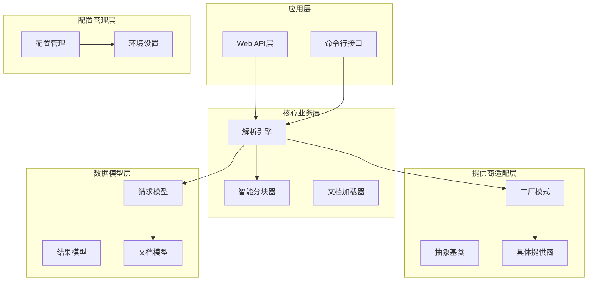
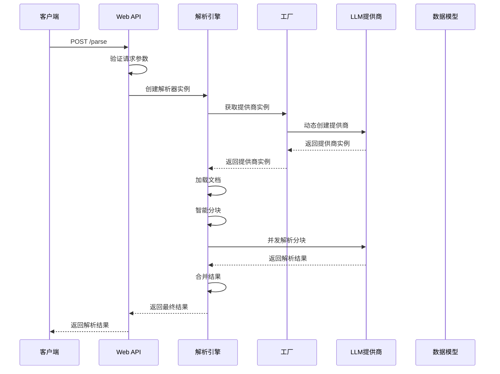
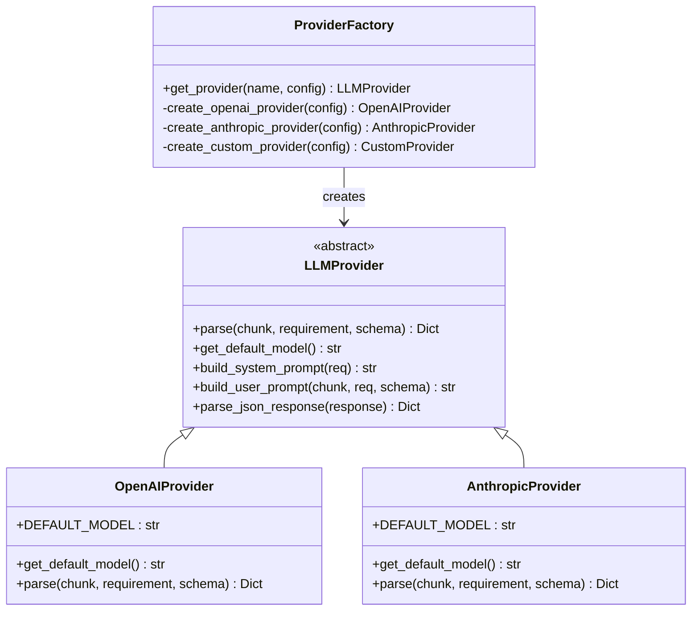
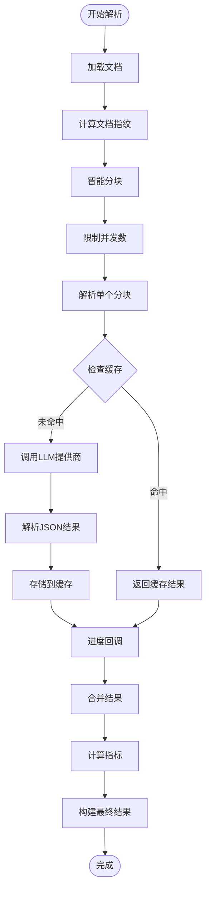
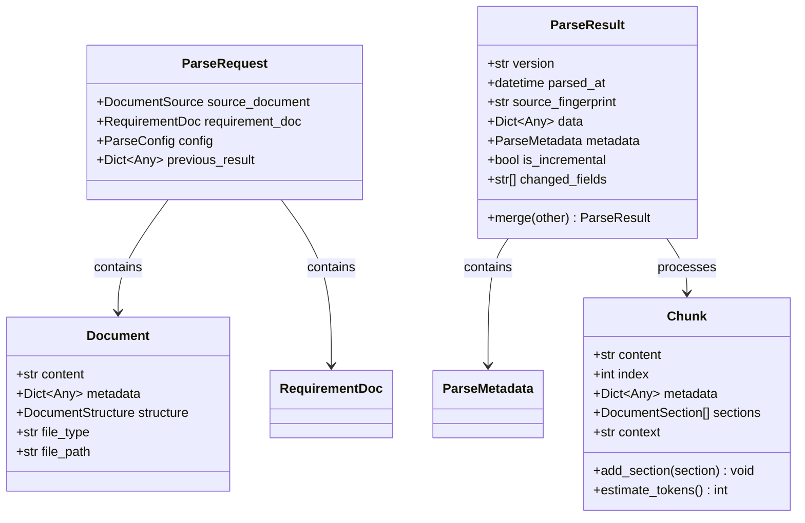
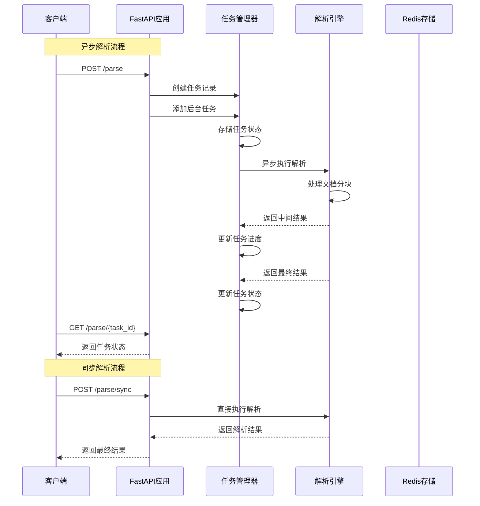
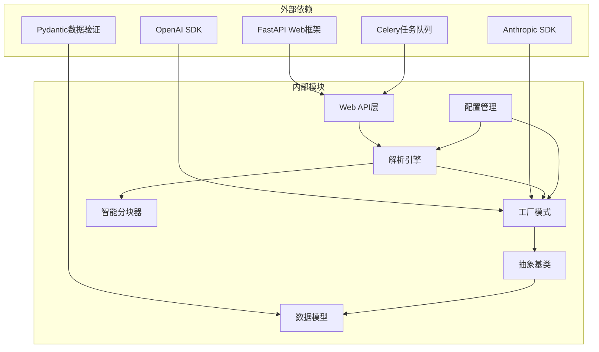

# 组件交互

<cite>
**本文档引用的文件**
- [factory.py](file://api-doc-parser/src/api_doc_parser/providers/factory.py)
- [base.py](file://api-doc-parser/src/api_doc_parser/providers/base.py)
- [parser.py](file://api-doc-parser/src/api_doc_parser/core/parser.py)
- [api.py](file://api-doc-parser/src/api_doc_parser/api.py)
- [config.py](file://api-doc-parser/src/api_doc_parser/config.py)
- [request.py](file://api-doc-parser/src/api_doc_parser/models/request.py)
- [result.py](file://api-doc-parser/src/api_doc_parser/models/result.py)
- [chunker.py](file://api-doc-parser/src/api_doc_parser/core/chunker.py)
- [openai_provider.py](file://api-doc-parser/src/api_doc_parser/providers/openai_provider.py)
- [anthropic_provider.py](file://api-doc-parser/src/api_doc_parser/providers/anthropic_provider.py)
- [document.py](file://api-doc-parser/src/api_doc_parser/models/document.py)
- [test_providers.py](file://api-doc-parser/tests/test_providers.py)
- [pyproject.toml](file://api-doc-parser/pyproject.toml)
</cite>

## 目录
1. [简介](#简介)
2. [项目结构](#项目结构)
3. [核心组件](#核心组件)
4. [架构概览](#架构概览)
5. [详细组件分析](#详细组件分析)
6. [依赖关系分析](#依赖关系分析)
7. [性能考量](#性能考量)
8. [故障排除指南](#故障排除指南)
9. [结论](#结论)

## 简介

API文档解析器是一个基于大语言模型的智能文档处理系统，专门用于从各种格式的API文档中提取结构化信息。该系统采用模块化设计，支持多种LLM提供商，并提供了完整的异步处理能力。

系统的核心目标是通过统一的接口抽象，为不同类型的LLM提供商提供一致的使用体验，同时保持高度的可扩展性和可维护性。

## 项目结构

项目采用清晰的分层架构，按照功能职责进行模块划分：

**图表来源**
- [api.py](file://api-doc-parser/src/api_doc_parser/api.py#L1-L371)
- [parser.py](file://api-doc-parser/src/api_doc_parser/core/parser.py#L1-L304)
- [factory.py](file://api-doc-parser/src/api_doc_parser/providers/factory.py#L1-L71)

**章节来源**
- [pyproject.toml](file://api-doc-parser/pyproject.toml#L1-L100)

## 核心组件

### LLM解析引擎 (LLMParser)

LLM解析引擎是整个系统的核心，负责协调文档处理的完整流程。它实现了以下关键功能：

- **文档加载与预处理**：支持多种文档格式的加载和解析
- **智能分块**：基于文档结构和长度的智能分块策略
- **并发解析**：异步并发处理多个文档分块
- **结果合并**：将多个分块的结果进行智能合并
- **缓存管理**：内存级缓存机制提升性能

### 抽象提供商基类 (LLMProvider)

抽象基类定义了所有LLM提供商的统一接口，确保不同提供商的兼容性：

- **统一接口设计**：定义了标准的解析方法和配置接口
- **提示词构建**：提供系统提示词和用户提示词的构建机制
- **JSON解析**：内置的JSON响应解析和容错处理
- **日志记录**：统一的日志记录和错误处理机制

### 工厂模式 (Provider Factory)

工厂模式实现了LLM提供商的动态创建和管理：

- **动态实例化**：根据提供商名称动态创建对应实例
- **配置管理**：集中管理提供商的配置参数
- **扩展性设计**：易于添加新的LLM提供商支持

**章节来源**
- [parser.py](file://api-doc-parser/src/api_doc_parser/core/parser.py#L20-L304)
- [base.py](file://api-doc-parser/src/api_doc_parser/providers/base.py#L27-L143)
- [factory.py](file://api-doc-parser/src/api_doc_parser/providers/factory.py#L14-L71)

## 架构概览

系统采用分层架构设计，各层之间职责明确，耦合度低：

**图表来源**
- [api.py](file://api-doc-parser/src/api_doc_parser/api.py#L76-L155)
- [parser.py](file://api-doc-parser/src/api_doc_parser/core/parser.py#L46-L128)
- [factory.py](file://api-doc-parser/src/api_doc_parser/providers/factory.py#L14-L71)

## 详细组件分析

### 工厂模式实现

工厂模式在LLM提供商创建中发挥着关键作用，实现了以下设计原则：

#### 工厂方法设计

**图表来源**
- [factory.py](file://api-doc-parser/src/api_doc_parser/providers/factory.py#L14-L71)
- [base.py](file://api-doc-parser/src/api_doc_parser/providers/base.py#L27-L57)
- [openai_provider.py](file://api-doc-parser/src/api_doc_parser/providers/openai_provider.py#L13-L40)
- [anthropic_provider.py](file://api-doc-parser/src/api_doc_parser/providers/anthropic_provider.py#L13-L40)

#### 配置管理机制

工厂模式通过统一的配置管理，实现了以下特性：

- **参数验证**：对提供商名称和必需参数进行验证
- **默认值处理**：为缺失的配置参数提供合理的默认值
- **环境变量集成**：支持从环境变量中读取配置信息

**章节来源**
- [factory.py](file://api-doc-parser/src/api_doc_parser/providers/factory.py#L14-L71)
- [config.py](file://api-doc-parser/src/api_doc_parser/config.py#L7-L57)

### 解析引擎工作流程

解析引擎实现了完整的文档处理流水线：

**图表来源**
- [parser.py](file://api-doc-parser/src/api_doc_parser/core/parser.py#L46-L128)
- [parser.py](file://api-doc-parser/src/api_doc_parser/core/parser.py#L130-L169)

#### 并发控制机制

解析引擎采用了多层并发控制机制：

- **信号量限制**：使用信号量限制同时进行的解析任务数量
- **异常处理**：捕获并处理单个分块解析过程中的异常
- **进度跟踪**：实时跟踪和报告解析进度

**章节来源**
- [parser.py](file://api-doc-parser/src/api_doc_parser/core/parser.py#L130-L169)

### 数据模型设计

系统采用了严格的类型安全设计，确保数据的一致性和完整性：

**图表来源**
- [request.py](file://api-doc-parser/src/api_doc_parser/models/request.py#L51-L57)
- [result.py](file://api-doc-parser/src/api_doc_parser/models/result.py#L20-L55)
- [document.py](file://api-doc-parser/src/api_doc_parser/models/document.py#L42-L75)

**章节来源**
- [request.py](file://api-doc-parser/src/api_doc_parser/models/request.py#L1-L57)
- [result.py](file://api-doc-parser/src/api_doc_parser/models/result.py#L1-L55)
- [document.py](file://api-doc-parser/src/api_doc_parser/models/document.py#L1-L75)

### Web API接口设计

Web API层提供了RESTful接口，支持同步和异步两种处理模式：

**图表来源**
- [api.py](file://api-doc-parser/src/api_doc_parser/api.py#L76-L155)
- [api.py](file://api-doc-parser/src/api_doc_parser/api.py#L177-L254)

**章节来源**
- [api.py](file://api-doc-parser/src/api_doc_parser/api.py#L1-L371)

## 依赖关系分析

系统采用了清晰的依赖层次结构，确保了良好的模块化设计：

**图表来源**
- [pyproject.toml](file://api-doc-parser/pyproject.toml#L25-L59)
- [api.py](file://api-doc-parser/src/api_doc_parser/api.py#L9-L21)

### 依赖注入机制

系统实现了基于构造函数的依赖注入：

- **解析器依赖注入**：解析器通过构造函数接收配置参数
- **提供商依赖注入**：提供商通过工厂模式动态注入
- **配置依赖注入**：配置通过环境变量和构造函数注入

**章节来源**
- [parser.py](file://api-doc-parser/src/api_doc_parser/core/parser.py#L23-L44)
- [factory.py](file://api-doc-parser/src/api_doc_parser/providers/factory.py#L42-L70)

## 性能考量

系统在设计时充分考虑了性能优化：

### 缓存策略

- **内存缓存**：使用简单的字典实现内存级缓存
- **指纹校验**：通过内容指纹确保缓存的有效性
- **配置控制**：缓存功能可通过配置启用或禁用

### 并发优化

- **信号量控制**：限制同时进行的解析任务数量
- **异常隔离**：单个分块的异常不影响整体处理
- **进度反馈**：实时提供处理进度信息

### 资源管理

- **连接池**：LLM提供商使用连接池管理API连接
- **超时控制**：统一的超时和重试机制
- **内存清理**：任务完成后及时清理内存资源

## 故障排除指南

### 常见问题及解决方案

#### 提供商配置错误

**问题**：`Unknown provider` 错误
**原因**：提供商名称不在支持列表中
**解决方案**：检查提供商名称拼写，确认在支持列表中

#### API密钥配置错误

**问题**：`API key required` 错误
**原因**：某些提供商需要API密钥
**解决方案**：在请求中提供正确的API密钥

#### 文档格式不支持

**问题**：`Unsupported file type` 错误
**原因**：文件扩展名不在支持列表中
**解决方案**：检查文件扩展名，支持的格式包括：pdf, docx, xlsx, txt, md

#### 内存不足

**问题**：`MemoryError` 错误
**解决方案**：
- 减少分块大小
- 禁用缓存功能
- 降低并发数量

**章节来源**
- [factory.py](file://api-doc-parser/src/api_doc_parser/providers/factory.py#L60-L68)
- [api.py](file://api-doc-parser/src/api_doc_parser/api.py#L98-L113)

## 结论

API文档解析器通过精心设计的架构和组件交互模式，成功实现了以下目标：

### 设计优势

- **高度解耦**：各组件职责明确，耦合度低
- **强扩展性**：工厂模式和抽象基类设计便于添加新功能
- **异步处理**：全面的异步支持提升了系统性能
- **类型安全**：严格的类型定义确保了数据一致性

### 架构特点

- **模块化设计**：清晰的分层架构便于维护和扩展
- **配置驱动**：灵活的配置管理支持多种部署场景
- **错误处理**：完善的错误处理和恢复机制
- **监控友好**：丰富的日志记录便于问题诊断

### 未来发展方向

- **更多提供商支持**：计划添加更多LLM提供商的原生支持
- **分布式处理**：支持更大规模文档的分布式处理
- **增量解析**：实现文档变更的增量解析功能
- **性能优化**：持续优化内存使用和处理速度

该系统为API文档解析提供了一个强大而灵活的解决方案，既满足了当前的需求，也为未来的扩展奠定了坚实的基础。