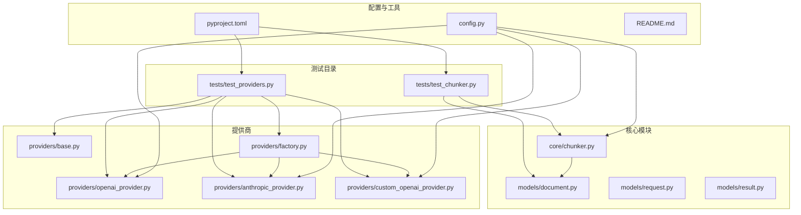
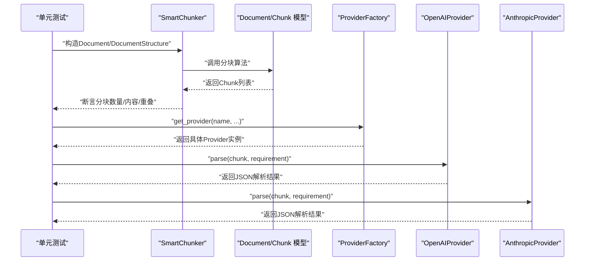
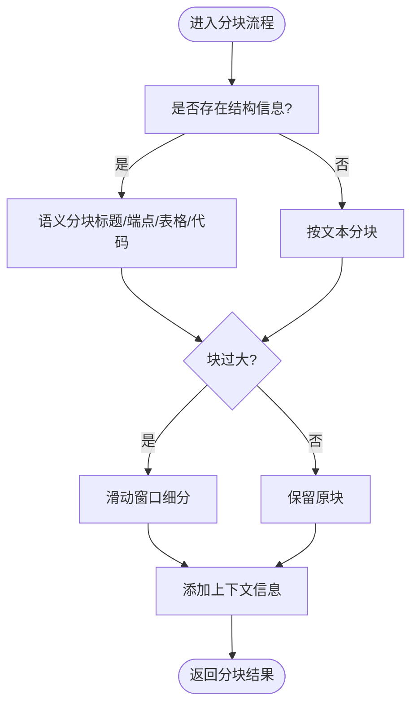
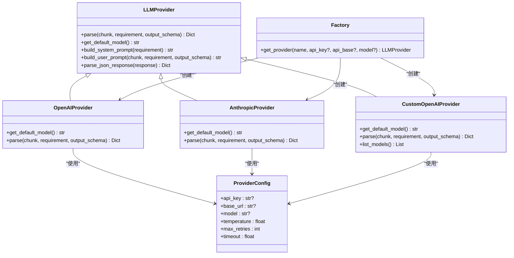
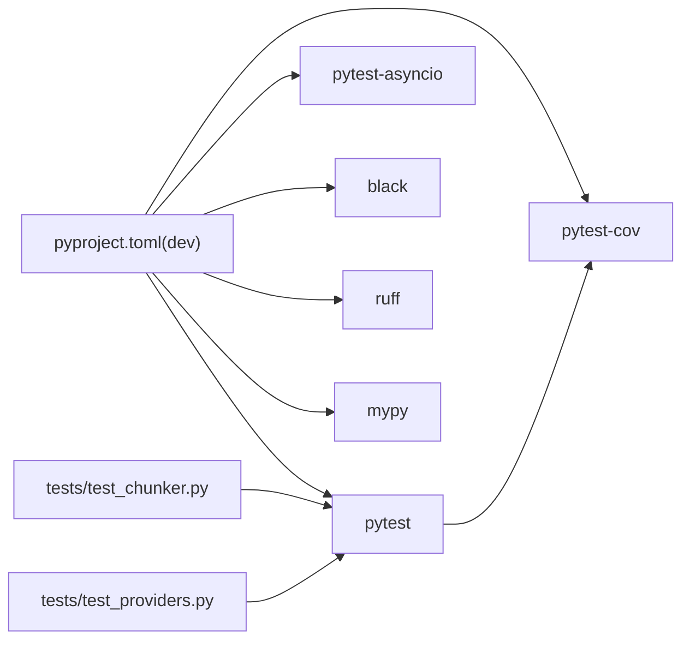

# 测试指南

<cite>
**本文引用的文件**
- [README.md](file://doc_ai_parser/README.md)
- [pyproject.toml](file://doc_ai_parser/pyproject.toml)
- [tests/test_chunker.py](file://doc_ai_parser/tests/test_chunker.py)
- [tests/test_providers.py](file://doc_ai_parser/tests/test_providers.py)
- [src/core/chunker.py](file://doc_ai_parser/src/core/chunker.py)
- [src/models/document.py](file://doc_ai_parser/src/models/document.py)
- [src/models/request.py](file://doc_ai_parser/src/models/request.py)
- [src/models/result.py](file://doc_ai_parser/src/models/result.py)
- [src/providers/base.py](file://doc_ai_parser/src/providers/base.py)
- [src/providers/factory.py](file://doc_ai_parser/src/providers/factory.py)
- [src/providers/openai_provider.py](file://doc_ai_parser/src/providers/openai_provider.py)
- [src/providers/anthropic_provider.py](file://doc_ai_parser/src/providers/anthropic_provider.py)
- [src/providers/custom_openai_provider.py](file://doc_ai_parser/src/providers/custom_openai_provider.py)
- [src/config.py](file://doc_ai_parser/src/config.py)
</cite>

## 更新摘要
**变更内容**
- 更新了智能分块器的单元测试实现细节
- 增强了提供商工厂和多个提供商的测试覆盖
- 添加了自定义提供商的测试策略
- 完善了异步测试的最佳实践
- 更新了测试框架配置和覆盖率要求

## 目录
1. [简介](#简介)
2. [项目结构](#项目结构)
3. [核心组件](#核心组件)
4. [架构总览](#架构总览)
5. [详细组件分析](#详细组件分析)
6. [依赖分析](#依赖分析)
7. [性能考虑](#性能考虑)
8. [故障排查指南](#故障排查指南)
9. [结论](#结论)
10. [附录](#附录)

## 简介
本测试指南面向不同层次的开发者，提供针对本项目的测试策略与实践，包括单元测试、集成测试、测试覆盖率要求、测试框架选择与配置、测试用例设计原则与编写规范、测试环境搭建与维护、以及持续集成与自动化测试建议。内容以仓库现有实现为基础，结合最新的测试文件与核心模块，帮助快速建立高质量的测试体系。

## 项目结构
本项目采用"按功能域分层"的组织方式，核心业务逻辑集中在 src 目录下，测试位于 tests 目录。测试框架与开发工具在 pyproject.toml 中统一配置，便于本地与 CI 环境一致运行。

**图表来源**
- [pyproject.toml](file://doc_ai_parser/pyproject.toml#L97-L100)
- [tests/test_chunker.py](file://doc_ai_parser/tests/test_chunker.py#L1-L90)
- [tests/test_providers.py](file://doc_ai_parser/tests/test_providers.py#L1-L106)
- [src/core/chunker.py](file://doc_ai_parser/src/core/chunker.py#L1-L377)
- [src/models/document.py](file://doc_ai_parser/src/models/document.py#L1-L75)
- [src/models/request.py](file://doc_ai_parser/src/models/request.py#L1-L57)
- [src/models/result.py](file://doc_ai_parser/src/models/result.py#L1-L55)
- [src/providers/base.py](file://doc_ai_parser/src/providers/base.py#L1-L143)
- [src/providers/factory.py](file://doc_ai_parser/src/providers/factory.py#L1-L71)
- [src/providers/openai_provider.py](file://doc_ai_parser/src/providers/openai_provider.py#L1-L82)
- [src/providers/anthropic_provider.py](file://doc_ai_parser/src/providers/anthropic_provider.py#L1-L82)
- [src/providers/custom_openai_provider.py](file://doc_ai_parser/src/providers/custom_openai_provider.py#L1-L122)
- [src/config.py](file://doc_ai_parser/src/config.py#L1-L57)

**章节来源**
- [README.md](file://doc_ai_parser/README.md#L154-L177)
- [pyproject.toml](file://doc_ai_parser/pyproject.toml#L97-L100)

## 核心组件
- **智能分块器（SmartChunker）**：负责将文档按结构与长度进行智能分块，并保持上下文与重叠，确保 LLM 解析的完整性与连续性。
- **数据模型**：Document、DocumentSection、DocumentStructure、RequirementDoc、ParseResult 等，定义了输入、中间与输出的数据结构。
- **提供商抽象与工厂**：LLMProvider 抽象定义统一接口，ProviderConfig 统一配置，工厂方法根据名称创建具体提供商实例。
- **配置管理**：Settings 读取 .env 并提供默认值，影响分块大小、超时、重试等行为。

**章节来源**
- [src/core/chunker.py](file://doc_ai_parser/src/core/chunker.py#L10-L62)
- [src/models/document.py](file://doc_ai_parser/src/models/document.py#L20-L75)
- [src/models/request.py](file://doc_ai_parser/src/models/request.py#L24-L57)
- [src/models/result.py](file://doc_ai_parser/src/models/result.py#L20-L55)
- [src/providers/base.py](file://doc_ai_parser/src/providers/base.py#L27-L80)
- [src/providers/factory.py](file://doc_ai_parser/src/providers/factory.py#L14-L71)
- [src/config.py](file://doc_ai_parser/src/config.py#L7-L57)

## 架构总览
测试覆盖从底层模块到上层提供商的关键路径，确保：
- 分块器在无结构与有结构场景下的正确性
- 提供商工厂与具体提供商的行为一致性
- JSON 响应解析的健壮性
- 配置注入对行为的影响

**图表来源**
- [tests/test_chunker.py](file://doc_ai_parser/tests/test_chunker.py#L12-L86)
- [tests/test_providers.py](file://doc_ai_parser/tests/test_providers.py#L16-L102)
- [src/core/chunker.py](file://doc_ai_parser/src/core/chunker.py#L28-L62)
- [src/models/document.py](file://doc_ai_parser/src/models/document.py#L42-L75)
- [src/providers/factory.py](file://doc_ai_parser/src/providers/factory.py#L14-L71)
- [src/providers/openai_provider.py](file://doc_ai_parser/src/providers/openai_provider.py#L41-L82)
- [src/providers/anthropic_provider.py](file://doc_ai_parser/src/providers/anthropic_provider.py#L40-L82)

## 详细组件分析

### 智能分块器测试（单元测试）
- **测试目标**
  - 基础分块：验证内容被切分为非空块
  - 语义分块：依据标题与结构保持完整性
  - API端点保护：确保API端点不被截断
  - 重叠策略：相邻块之间存在重叠，避免信息丢失
- **关键断言**
  - 块数量与非空性
  - 包含特定API端点字符串
  - 相邻块重叠交集非空
- **设计要点**
  - 使用 Document 与 DocumentStructure 构造不同场景
  - 控制 max_tokens 与 overlap_tokens 影响分块行为
  - 验证分块后上下文信息与摘要生成

**图表来源**
- [src/core/chunker.py](file://doc_ai_parser/src/core/chunker.py#L28-L62)
- [src/core/chunker.py](file://doc_ai_parser/src/core/chunker.py#L166-L201)
- [src/core/chunker.py](file://doc_ai_parser/src/core/chunker.py#L292-L311)

**章节来源**
- [tests/test_chunker.py](file://doc_ai_parser/tests/test_chunker.py#L12-L86)
- [src/core/chunker.py](file://doc_ai_parser/src/core/chunker.py#L28-L62)
- [src/models/document.py](file://doc_ai_parser/src/models/document.py#L42-L75)

### 提供商工厂与提供商测试（单元测试）
- **测试目标**
  - 工厂：根据名称返回对应提供商；未知名称抛出异常；自定义提供商需提供 base_url
  - OpenAI/Anthropic：parse 返回 JSON；错误日志记录；响应解析健壮性
  - 自定义提供商：支持 vLLM、TGI 等自定义 API
- **关键断言**
  - 实例类型匹配
  - 异常消息与参数校验
  - JSON 解析结果包含预期字段
- **设计要点**
  - 使用 AsyncMock 模拟异步客户端
  - 构造 RequirementDoc 与 Chunk 作为输入
  - 断言日志事件与 tokens 使用情况

**图表来源**
- [src/providers/base.py](file://doc_ai_parser/src/providers/base.py#L27-L143)
- [src/providers/factory.py](file://doc_ai_parser/src/providers/factory.py#L14-L71)
- [src/providers/openai_provider.py](file://doc_ai_parser/src/providers/openai_provider.py#L13-L82)
- [src/providers/anthropic_provider.py](file://doc_ai_parser/src/providers/anthropic_provider.py#L13-L82)
- [src/providers/custom_openai_provider.py](file://doc_ai_parser/src/providers/custom_openai_provider.py#L12-L122)

**章节来源**
- [tests/test_providers.py](file://doc_ai_parser/tests/test_providers.py#L16-L102)
- [src/providers/factory.py](file://doc_ai_parser/src/providers/factory.py#L14-L71)
- [src/providers/base.py](file://doc_ai_parser/src/providers/base.py#L59-L143)
- [src/providers/openai_provider.py](file://doc_ai_parser/src/providers/openai_provider.py#L41-L82)
- [src/providers/anthropic_provider.py](file://doc_ai_parser/src/providers/anthropic_provider.py#L40-L82)
- [src/providers/custom_openai_provider.py](file://doc_ai_parser/src/providers/custom_openai_provider.py#L35-L102)

### 集成测试示例（概念性）
- **场景建议**
  - 端到端：从文档加载、分块、提供商解析到结果合并的完整链路
  - 配置驱动：通过 Settings 注入不同模型与分块参数，观察行为差异
  - 错误恢复：模拟网络异常与 JSON 解析失败，验证重试与日志
- **关键断言**
  - ParseResult 的 data 与 metadata 合法
  - 增量更新场景下字段合并与变更追踪
- **实施建议**
  - 使用临时 .env 或环境变量覆盖默认配置
  - 使用 pytest-markers 标记慢速或外部依赖场景

（本节为概念性指导，不直接分析具体文件）

## 依赖分析
- **测试框架与工具**
  - pytest、pytest-asyncio、pytest-cov 在 dev 依赖中定义
  - black、ruff、mypy 作为质量门禁
- **运行配置**
  - testpaths、asyncio_mode 在 pytest.ini_options 中设置
- **外部依赖与集成点**
  - OpenAI/Anthropic 客户端异步调用
  - 配置来源于 .env 与 Settings，默认值保障最小可用性

**图表来源**
- [pyproject.toml](file://doc_ai_parser/pyproject.toml#L61-L100)
- [tests/test_chunker.py](file://doc_ai_parser/tests/test_chunker.py#L1-L90)
- [tests/test_providers.py](file://doc_ai_parser/tests/test_providers.py#L1-L106)

**章节来源**
- [pyproject.toml](file://doc_ai_parser/pyproject.toml#L61-L100)
- [README.md](file://doc_ai_parser/README.md#L179-L196)

## 性能考虑
- **分块策略**
  - 合理设置 default_chunk_size 与 default_chunk_overlap，平衡吞吐与上下文完整性
  - 重叠策略减少跨块信息丢失，但会增加 LLM 调用次数
- **JSON 解析**
  - parse_json_response 具备回退策略，建议在 CI 中加入边界样例（非标准 JSON、代码块包裹等）
- **日志与可观测性**
  - Provider 中的日志事件可用于定位耗时与失败点，建议在测试中验证关键事件出现

（本节为通用指导，不直接分析具体文件）

## 故障排查指南
- **常见问题**
  - 未设置 API Key 或 Base URL：工厂创建自定义提供商时报错
  - 未知提供商名称：工厂抛出异常，检查名称拼写与支持列表
  - JSON 解析失败：parse_json_response 记录 warning 并返回原始内容，检查 LLM 输出格式
- **排查步骤**
  - 校验 .env 与 Settings 是否正确加载
  - 使用最小化输入复现问题，逐步缩小范围
  - 在测试中打印/断言关键日志事件与 tokens 使用情况
- **相关实现参考**
  - 工厂异常与参数校验
  - JSON 解析回退逻辑
  - Provider 错误日志记录

**章节来源**
- [src/providers/factory.py](file://doc_ai_parser/src/providers/factory.py#L59-L69)
- [src/providers/base.py](file://doc_ai_parser/src/providers/base.py#L112-L143)
- [src/providers/openai_provider.py](file://doc_ai_parser/src/providers/openai_provider.py#L75-L82)
- [src/providers/anthropic_provider.py](file://doc_ai_parser/src/providers/anthropic_provider.py#L75-L82)

## 结论
本指南基于现有测试与核心实现，给出了覆盖智能分块器与提供商的关键测试策略。建议在现有基础上扩展端到端集成测试与性能回归测试，并将测试覆盖率纳入质量门禁，持续提升代码可靠性与可维护性。

## 附录

### 测试框架选择与配置
- **选择 pytest 的原因**
  - 异步支持（pytest-asyncio）、丰富的插件生态（pytest-cov）、标记与夹具机制完善
- **配置要点**
  - testpaths 指向 tests 目录
  - asyncio_mode 设置为 auto，适配异步提供商
  - dev 依赖包含 pytest、pytest-asyncio、pytest-cov，便于本地与 CI 统一执行

**章节来源**
- [pyproject.toml](file://doc_ai_parser/pyproject.toml#L97-L100)
- [README.md](file://doc_ai_parser/README.md#L179-L196)

### 测试用例设计原则与编写规范
- **原则**
  - 单一职责：每个测试聚焦一个行为或边界条件
  - 可重复性：使用固定输入与 Mock，避免外部状态干扰
  - 可观测性：断言明确、日志关键事件、必要时输出中间结果
- **规范**
  - 使用 pytest 标记区分异步与慢速用例
  - 使用 AsyncMock 替代真实异步客户端
  - 使用最小化数据结构构造输入（如 RequirementDoc、Chunk）

**章节来源**
- [tests/test_providers.py](file://doc_ai_parser/tests/test_providers.py#L50-L102)
- [tests/test_chunker.py](file://doc_ai_parser/tests/test_chunker.py#L12-L86)

### 测试覆盖率要求
- **建议目标**
  - 语句覆盖率：≥80%
  - 分支覆盖率：≥70%
  - 行覆盖率：≥80%
- **工具与启用**
  - pytest-cov 已在 dev 依赖中，可在 CI 中开启覆盖率报告
  - 将覆盖率阈值纳入质量门禁，阻止低于阈值的 PR 合并

**章节来源**
- [pyproject.toml](file://doc_ai_parser/pyproject.toml#L61-L70)

### 测试环境搭建与维护
- **本地环境**
  - 安装开发依赖：pip install -e ".[dev]"
  - 准备 .env 示例文件，按需填写 API Key 与 Base URL
- **维护建议**
  - 新增模块同步新增单元测试
  - 重要分支逻辑补充边界与异常用例
  - 定期运行 black、ruff、mypy 与 pytest，确保风格与类型一致

**章节来源**
- [README.md](file://doc_ai_parser/README.md#L22-L46)
- [pyproject.toml](file://doc_ai_parser/pyproject.toml#L61-L70)

### 持续集成与自动化测试
- **建议流水线步骤**
  - 安装依赖与虚拟环境
  - 运行 pytest（启用 asyncio_mode）
  - 生成覆盖率报告并上传
  - 代码格式化与静态检查（black、ruff、mypy）
- **触发策略**
  - push 与 pull_request 触发
  - 对 dev 分支进行全量测试，对主分支进行关键模块重点测试

**章节来源**
- [pyproject.toml](file://doc_ai_parser/pyproject.toml#L97-L100)
- [README.md](file://doc_ai_parser/README.md#L179-L196)

### 异步测试最佳实践
- **AsyncMock 使用**
  - 在测试中使用 AsyncMock 替换异步客户端
  - 确保测试方法标注 @pytest.mark.asyncio
  - 验证异步调用的参数和返回值
- **错误处理测试**
  - 模拟 HTTP 异常和网络错误
  - 验证重试机制和错误日志
  - 测试超时和连接失败场景

**章节来源**
- [tests/test_providers.py](file://doc_ai_parser/tests/test_providers.py#L50-L102)
- [src/providers/openai_provider.py](file://doc_ai_parser/src/providers/openai_provider.py#L75-L82)
- [src/providers/anthropic_provider.py](file://doc_ai_parser/src/providers/anthropic_provider.py#L75-L82)

### 自定义提供商测试策略
- **测试重点**
  - 基础 URL 验证和必需参数检查
  - HTTP 请求构建和响应处理
  - 模型列表查询功能
  - 错误状态码处理
- **实现建议**
  - 使用 httpx.AsyncClient 进行异步 HTTP 调用
  - 模拟不同的响应状态和错误场景
  - 验证请求头和负载格式

**章节来源**
- [src/providers/custom_openai_provider.py](file://doc_ai_parser/src/providers/custom_openai_provider.py#L35-L102)
- [tests/test_providers.py](file://doc_ai_parser/tests/test_providers.py#L27-L39)