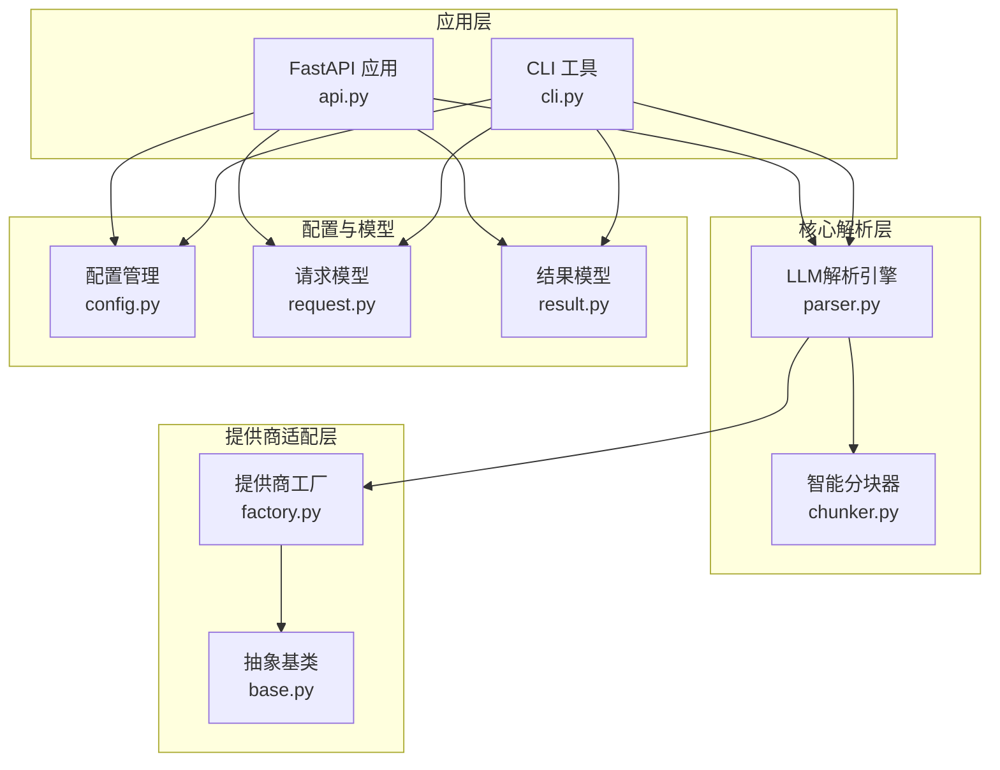
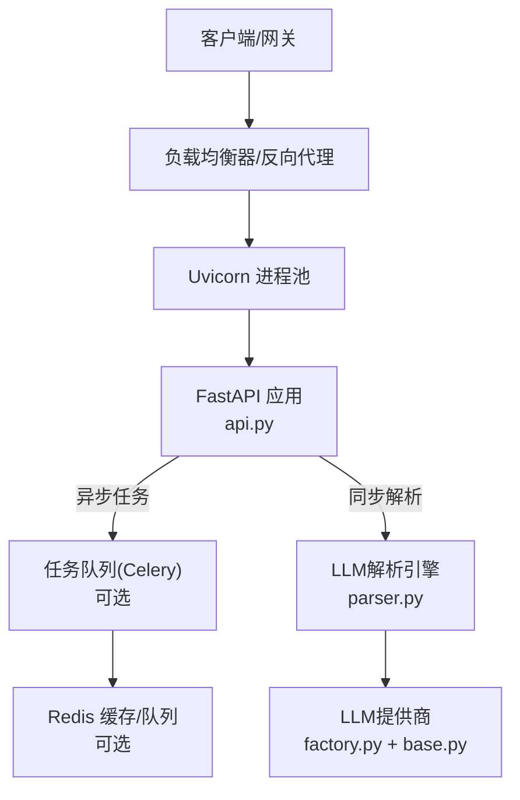
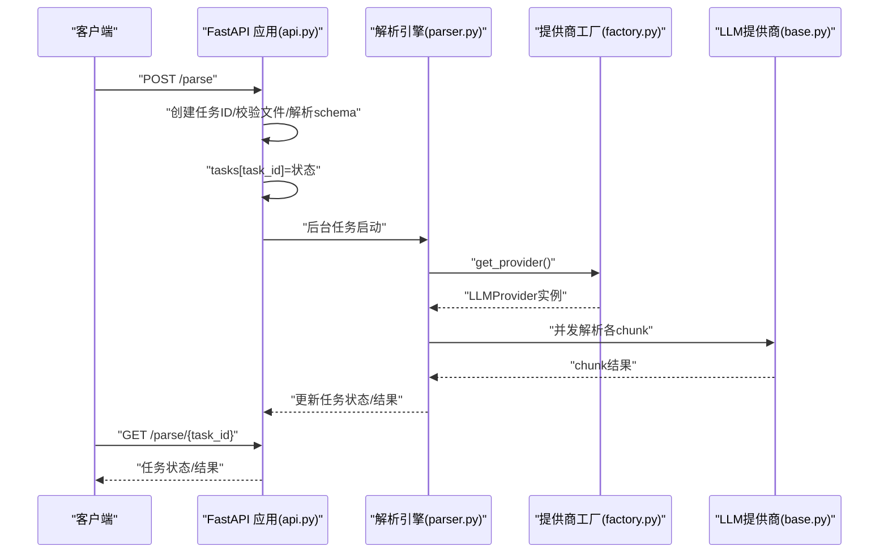
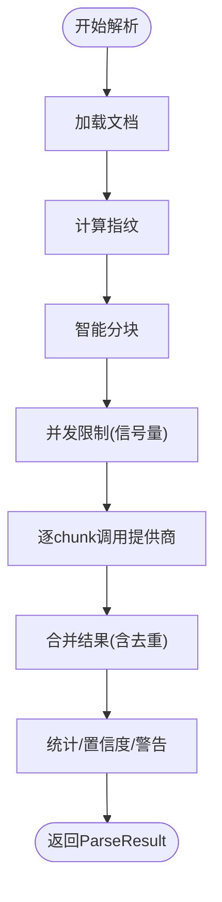
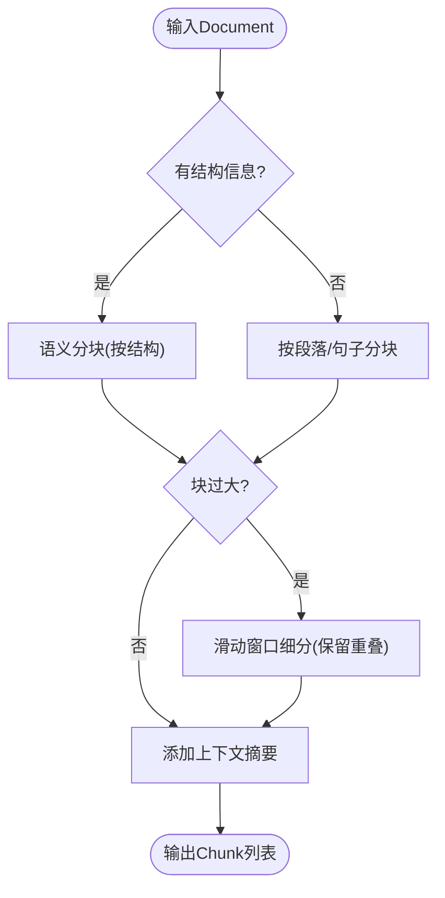
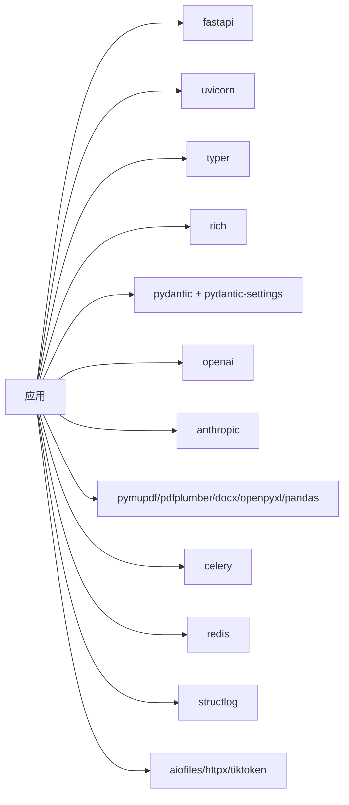
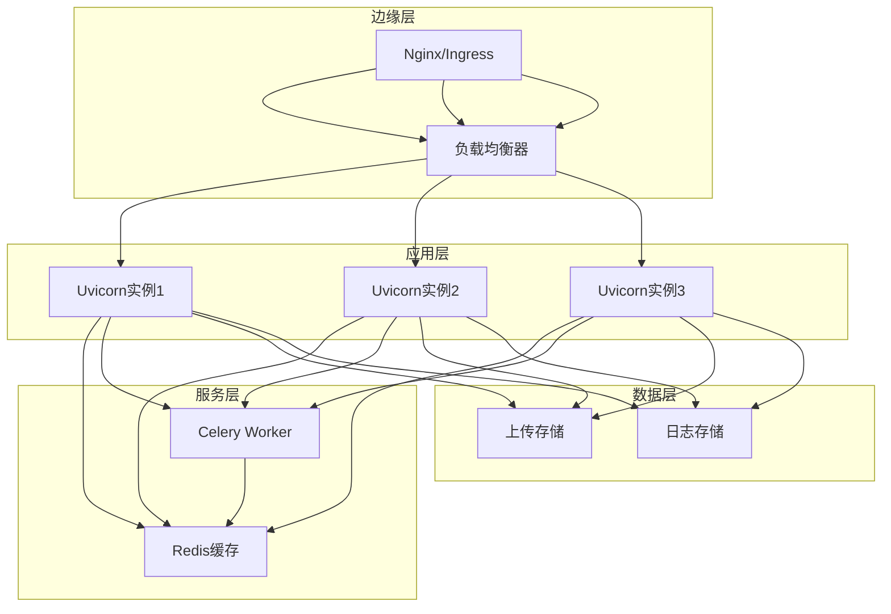

# 部署和运维

<cite>
**本文引用的文件**
- [README.md](file://doc_ai_parser/README.md)
- [pyproject.toml](file://doc_ai_parser/pyproject.toml)
- [requirements.txt](file://doc_ai_parser/requirements.txt)
- [Makefile](file://doc_ai_parser/Makefile)
- [.env.example](file://doc_ai_parser/.env.example)
- [src/config.py](file://doc_ai_parser/src/config.py)
- [src/api.py](file://doc_ai_parser/src/api.py)
- [src/cli.py](file://doc_ai_parser/src/cli.py)
- [src/core/parser.py](file://doc_ai_parser/src/core/parser.py)
- [src/core/chunker.py](file://doc_ai_parser/src/core/chunker.py)
- [tests/test_chunker.py](file://doc_ai_parser/tests/test_chunker.py)
- [tests/test_providers.py](file://doc_ai_parser/tests/test_providers.py)
</cite>

## 更新摘要
**所做更改**
- 新增Docker容器化部署指南章节
- 更新生产环境配置清单，包含完整的环境变量说明
- 增强Docker配置最佳实践和容器编排建议
- 完善生产部署架构图和部署流程说明
- 新增容器安全加固和监控配置指导

## 目录
1. [简介](#简介)
2. [项目结构](#项目结构)
3. [核心组件](#核心组件)
4. [架构总览](#架构总览)
5. [详细组件分析](#详细组件分析)
6. [依赖分析](#依赖分析)
7. [性能考虑](#性能考虑)
8. [故障排除指南](#故障排除指南)
9. [结论](#结论)
10. [附录](#附录)

## 简介
本运维文档面向生产部署与日常运维，涵盖以下主题：
- 生产环境配置与密钥管理
- Docker容器化与编排最佳实践
- 监控与日志管理
- 性能调优策略与瓶颈分析
- 部署架构、负载均衡与高可用
- 备份策略、灾难恢复与安全加固
- 为开发者提供的运维知识与可观测性要点

本项目提供Web服务与CLI两种使用方式，核心能力围绕"文档解析 + LLM提供商适配"，支持异步任务与同步解析，并内置分块、合并与缓存机制。

## 项目结构
项目采用"包内模块化 + 层次清晰"的组织方式：
- Web服务层：FastAPI应用与路由
- 核心解析层：分块、解析、合并、缓存
- 提供商适配层：OpenAI/Azure Anthropic/Ollama及自定义协议
- 配置与模型：Pydantic配置与请求/结果模型
- CLI层：命令行工具与进度展示
- 测试：分块器单元测试

**图表来源**
- [src/api.py](file://doc_ai_parser/src/api.py#L1-L371)
- [src/cli.py](file://doc_ai_parser/src/cli.py#L1-L393)
- [src/core/parser.py](file://doc_ai_parser/src/core/parser.py#L1-L304)
- [src/core/chunker.py](file://doc_ai_parser/src/core/chunker.py#L1-L377)
- [src/config.py](file://doc_ai_parser/src/config.py#L1-L57)

**章节来源**
- [README.md](file://doc_ai_parser/README.md#L154-L177)
- [pyproject.toml](file://doc_ai_parser/pyproject.toml#L1-L100)

## 核心组件
- 配置管理：集中管理应用、LLM提供商、Redis、文件上传、解析参数等配置，支持从.env文件加载。
- Web服务：提供异步解析任务、同步解析、提供商列表、健康检查等接口。
- CLI：支持本地解析、增量更新、进度可视化与统计输出。
- 解析引擎：文档加载 → 分块 → 并发调用LLM → 合并结果 → 产出结构化数据与元数据。
- 分块器：结构感知 + 滑动窗口 + 重叠缓冲，保障信息完整性。
- 提供商工厂：统一创建不同LLM提供商实例，支持自定义协议与本地模型。

**章节来源**
- [src/config.py](file://doc_ai_parser/src/config.py#L1-L57)
- [src/api.py](file://doc_ai_parser/src/api.py#L1-L371)
- [src/cli.py](file://doc_ai_parser/src/cli.py#L1-L393)
- [src/core/parser.py](file://doc_ai_parser/src/core/parser.py#L1-L304)
- [src/core/chunker.py](file://doc_ai_parser/src/core/chunker.py#L1-L377)

## 架构总览
系统采用"Web服务 + 解析引擎 + LLM提供商适配"的分层架构。生产环境建议使用异步任务队列与外部缓存/数据库存储任务状态，而非内存存储。

**图表来源**
- [src/api.py](file://doc_ai_parser/src/api.py#L70-L156)
- [src/core/parser.py](file://doc_ai_parser/src/core/parser.py#L46-L128)
- [src/config.py](file://doc_ai_parser/src/config.py#L40-L41)

## 详细组件分析

### Web服务与API流程
- 异步解析：上传文件与要求说明后创建任务，后台任务处理并维护内存状态；查询任务状态。
- 同步解析：直接返回结果，适合小文档。
- 健康检查：/health。
- 提供商列表：/providers。

**图表来源**
- [src/api.py](file://doc_ai_parser/src/api.py#L76-L174)
- [src/core/parser.py](file://doc_ai_parser/src/core/parser.py#L130-L169)

**章节来源**
- [src/api.py](file://doc_ai_parser/src/api.py#L70-L300)

### 解析引擎与并发控制
- 并发限制：使用信号量限制同时解析的chunk数量，避免资源争用。
- 缓存：基于内容指纹与配置组合的简单内存缓存，减少重复请求。
- 合并：深度合并与列表去重，提升结果一致性。
- 统计与置信度：统计失败chunk、计算置信度、收集警告。

**图表来源**
- [src/core/parser.py](file://doc_ai_parser/src/core/parser.py#L46-L128)
- [src/core/parser.py](file://doc_ai_parser/src/core/parser.py#L130-L169)

**章节来源**
- [src/core/parser.py](file://doc_ai_parser/src/core/parser.py#L1-L304)

### 分块器算法
- 优先按文档结构（标题、API端点、表格、代码）进行语义分块。
- 超大块使用滑动窗口细分，保留句边界与重叠缓冲。
- 为每个chunk附加上下文摘要，提升LLM理解。

**图表来源**
- [src/core/chunker.py](file://doc_ai_parser/src/core/chunker.py#L28-L62)
- [src/core/chunker.py](file://doc_ai_parser/src/core/chunker.py#L166-L201)

**章节来源**
- [src/core/chunker.py](file://doc_ai_parser/src/core/chunker.py#L1-L377)

### 配置与模型
- 配置项：应用名、调试、各提供商密钥与默认模型、Redis连接、分块大小/重叠、温度、最大重试、文件大小限制、上传目录等。
- 请求模型：DocumentSource、RequirementDoc、ParseConfig、ParseRequest。
- 结果模型：ParseResult与ParseMetadata，包含处理时间、置信度、警告、模型/提供商信息等。

**章节来源**
- [src/config.py](file://doc_ai_parser/src/config.py#L1-L57)

## 依赖分析
- Web与运行时：FastAPI、Uvicorn
- CLI：Typer、Rich
- 数据验证：Pydantic、pydantic-settings
- LLM SDK：OpenAI、Anthropic
- 文档处理：PyMuPDF、pdfplumber、python-docx、openpyxl、pandas
- 任务队列与缓存：Celery、Redis
- 日志与工具：structlog、aiofiles、httpx、tiktoken

**图表来源**
- [pyproject.toml](file://doc_ai_parser/pyproject.toml#L25-L58)

**章节来源**
- [pyproject.toml](file://doc_ai_parser/pyproject.toml#L1-L100)

## 性能考虑
- 并发与限流
  - 解析引擎对chunk并发使用信号量限制，避免过度并发导致LLM或网络抖动。
  - 建议在生产环境中将任务队列与状态存储迁移到Redis/Celery，避免内存状态丢失与扩展性受限。
- 分块策略
  - 合理设置chunk_size与chunk_overlap，兼顾吞吐与上下文完整性。
  - 对超大表格/代码块采用"结构前缀保留 + 行级切分"，减少信息截断。
- 缓存与重试
  - 使用简单内存缓存降低重复请求；生产建议使用分布式缓存。
  - 配置合理的max_retries与retry_delay，避免雪崩。
- I/O与文件
  - 控制max_file_size与上传目录，防止磁盘压力过大。
  - 对大文件建议走异步任务队列，避免阻塞主进程。
- LLM调用
  - 选择合适的temperature与模型，平衡准确性与延迟。
  - 对自定义协议（如vLLM/TGI）需提供正确的api_base与可接受的超时设置。

**章节来源**
- [src/core/parser.py](file://doc_ai_parser/src/core/parser.py#L130-L169)
- [src/core/chunker.py](file://doc_ai_parser/src/core/chunker.py#L166-L233)
- [src/config.py](file://doc_ai_parser/src/config.py#L43-L52)
- [src/api.py](file://doc_ai_parser/src/api.py#L108-L112)

## 故障排除指南
- 常见问题定位
  - 文件类型不支持：检查文件后缀映射与检测逻辑。
  - 文件过大：调整max_file_size或改用异步任务。
  - JSON Schema无效：确认output_schema为合法JSON字符串。
  - 任务不存在：确认task_id正确且未过期。
- LLM提供商问题
  - 自定义协议需提供api_base；Azure需提供endpoint与版本。
  - 缺少API Key或Key错误会导致调用失败。
- 并发与超时
  - 若出现大量失败chunk，检查并发限制与重试配置。
  - 调整超时与重试间隔，避免触发上游限流。
- 日志与可观测性
  - 使用structlog记录关键事件（document_loaded、parse_completed、chunk_parse_failed等），便于追踪。
  - CLI与Web均输出统计信息，可用于快速判断质量与耗时。

**章节来源**
- [src/api.py](file://doc_ai_parser/src/api.py#L98-L123)
- [src/core/parser.py](file://doc_ai_parser/src/core/parser.py#L160-L167)
- [src/cli.py](file://doc_ai_parser/src/cli.py#L148-L153)

## 结论
本项目提供了从CLI到Web服务的完整使用路径，解析链路清晰、可扩展性强。生产部署建议：
- 使用Uvicorn多进程 + 负载均衡
- 异步任务队列与Redis持久化
- 合理的分块与并发配置
- 结构化日志与监控埋点
- 安全加固与备份恢复策略

## 附录

### 生产环境配置清单
- 环境变量
  - OPENAI_API_KEY / OPENAI_BASE_URL
  - ANTHROPIC_API_KEY / ANTHROPIC_BASE_URL
  - AZURE_OPENAI_API_KEY / AZURE_OPENAI_ENDPOINT / AZURE_OPENAI_API_VERSION
  - OLLAMA_BASE_URL
  - REDIS_URL（用于Celery/缓存）
  - DEBUG（生产建议关闭）
- 应用配置
  - app_name、debug
  - 各提供商默认模型
  - 分块大小、重叠、温度、最大重试
  - 文件大小限制、上传目录

**章节来源**
- [.env.example](file://doc_ai_parser/.env.example#L1-L22)
- [src/config.py](file://doc_ai_parser/src/config.py#L16-L52)

### Docker容器化与编排建议
- 基础镜像：Python 3.11 slim
- 安装依赖：使用pip安装项目与可选开发依赖
- 环境变量：通过卷或密钥管理注入
- 端口：8000（可通过反向代理暴露）
- 健康检查：/health
- 建议：使用Uvicorn多进程（workers）与反向代理（Nginx/Envoy）实现水平扩展

**章节来源**
- [README.md](file://doc_ai_parser/README.md#L78-L86)
- [pyproject.toml](file://doc_ai_parser/pyproject.toml#L10-L11)

### Docker部署最佳实践
- 镜像构建
  - 使用多阶段构建优化镜像大小
  - 安装生产依赖，移除开发工具
  - 设置非root用户运行
- 容器配置
  - 内存限制：根据LLM模型需求设置合理限制
  - CPU配额：为并发解析设置CPU配额
  - 环境变量：通过环境文件注入敏感配置
- 数据持久化
  - 上传目录挂载到持久化存储
  - Redis使用独立容器或云服务
  - 日志输出到标准输出，配合日志收集器

**章节来源**
- [pyproject.toml](file://doc_ai_parser/pyproject.toml#L25-L58)
- [src/config.py](file://doc_ai_parser/src/config.py#L40-L52)

### 监控与日志
- 指标建议
  - QPS、P95/P99延迟、错误率、任务队列长度、并发活跃度
  - LLM调用耗时、成功率、重试次数
  - 文件大小分布、chunk数量与失败率
- 日志建议
  - structlog输出JSON结构化日志
  - 关键事件：document_loaded、parse_completed、chunk_parse_failed、cache_hit
  - CLI与Web均输出统计信息，便于快速诊断

**章节来源**
- [src/core/parser.py](file://doc_ai_parser/src/core/parser.py#L72-L76)
- [src/core/parser.py](file://doc_ai_parser/src/core/parser.py#L160-L167)
- [src/cli.py](file://doc_ai_parser/src/cli.py#L266-L296)

### 高可用与负载均衡
- 负载均衡：Nginx/Envoy/Ingress，启用健康检查与会话亲和（如需）
- 多副本：Uvicorn多进程 + 多Pod
- 任务队列：Celery + Redis，支持失败重试与幂等
- 状态存储：将内存中的tasks迁移至Redis或数据库

**章节来源**
- [src/api.py](file://doc_ai_parser/src/api.py#L30-L31)
- [src/config.py](file://doc_ai_parser/src/config.py#L40-L41)

### 备份策略与灾难恢复
- 配置备份：.env与配置文件定期快照
- 任务状态：Redis持久化或数据库化
- 日志归档：结构化日志落地与轮转
- DR演练：定期验证恢复流程（配置、依赖、数据）

**章节来源**
- [.env.example](file://doc_ai_parser/.env.example#L1-L22)
- [src/config.py](file://doc_ai_parser/src/config.py#L10-L14)

### 安全加固
- 密钥管理：使用密钥管理服务或Kubernetes Secret
- 网络隔离：仅开放必要端口，启用WAF/防火墙
- 输入校验：严格校验文件类型与大小，避免路径穿越
- 最小权限：容器以非root运行，限制写权限

**章节来源**
- [src/api.py](file://doc_ai_parser/src/api.py#L98-L112)
- [src/api.py](file://doc_ai_parser/src/api.py#L194-L209)

### 开发者运维知识
- 可观测性：关注document_loaded、parse_completed、chunk_parse_failed等事件
- 质量度量：置信度、失败chunk比例、处理时间
- 调优路径：分块大小、并发、重试、缓存命中率

**章节来源**
- [src/core/parser.py](file://doc_ai_parser/src/core/parser.py#L104-L113)
- [src/core/parser.py](file://doc_ai_parser/src/core/parser.py#L271-L294)
- [src/cli.py](file://doc_ai_parser/src/cli.py#L266-L296)

### 部署架构图

**图表来源**
- [src/api.py](file://doc_ai_parser/src/api.py#L30-L31)
- [src/config.py](file://doc_ai_parser/src/config.py#L40-L41)
- [pyproject.toml](file://doc_ai_parser/pyproject.toml#L49-L58)

### 容器编排配置示例
- Kubernetes Deployment
  - 多副本部署，自动扩缩容
  - 健康检查探针
  - 环境变量配置
  - 存储卷挂载
- Docker Compose
  - 应用服务
  - Redis缓存服务
  - Nginx反向代理
  - 日志收集服务

**章节来源**
- [Makefile](file://doc_ai_parser/Makefile#L1-L41)
- [pyproject.toml](file://doc_ai_parser/pyproject.toml#L49-L58)