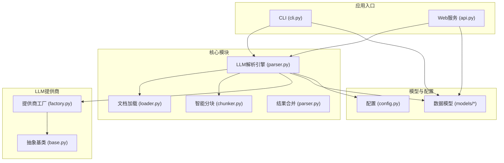
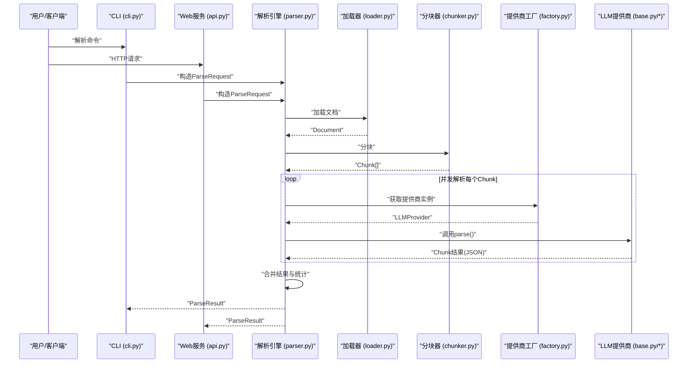
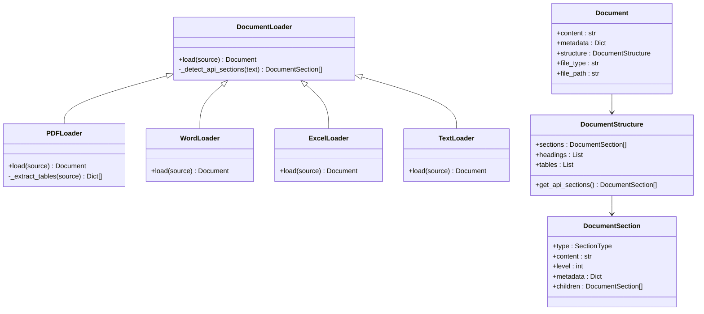
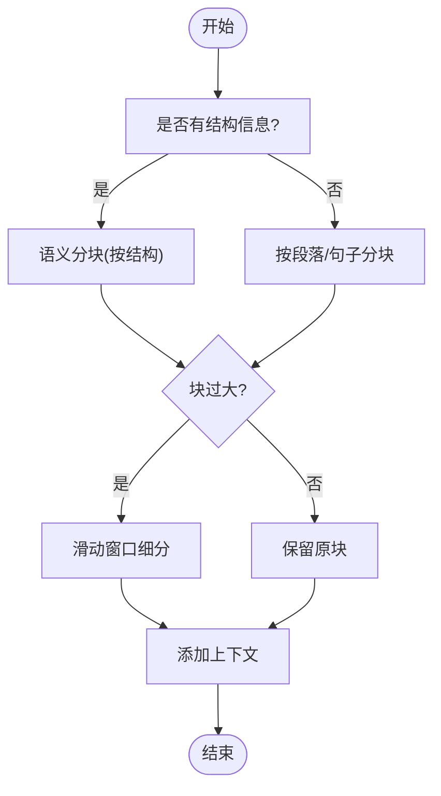
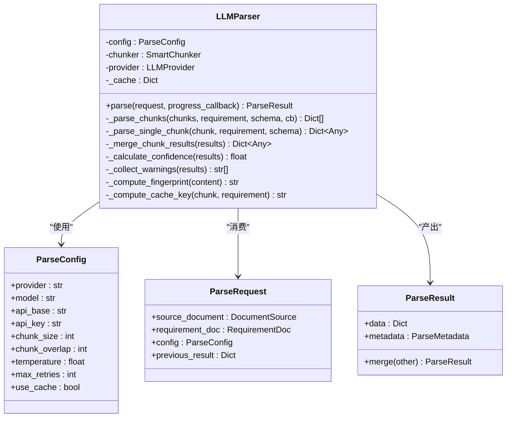
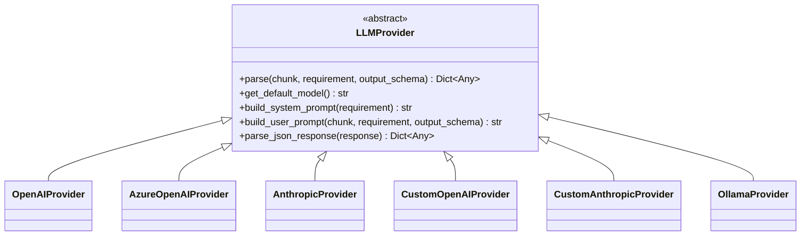
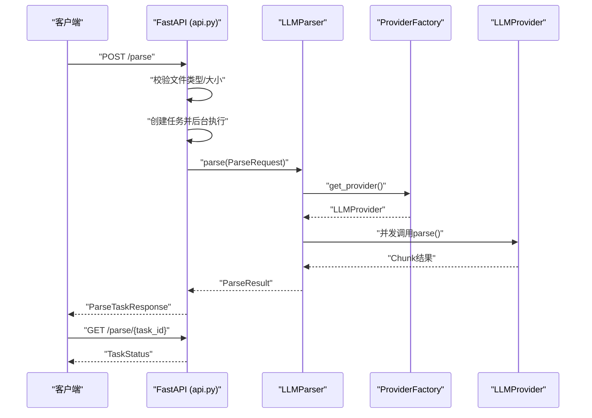
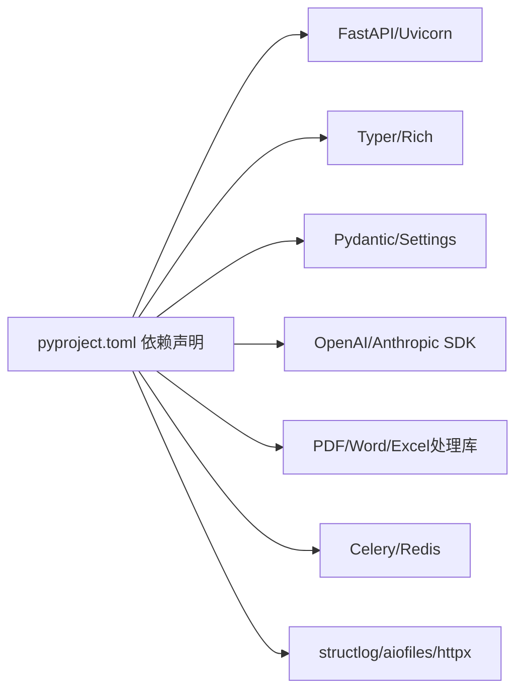

# 项目概述

<cite>
**本文引用的文件**
- [README.md](file://api-doc-parser/README.md)
- [pyproject.toml](file://api-doc-parser/pyproject.toml)
- [__init__.py](file://api-doc-parser/src/api_doc_parser/__init__.py)
- [api.py](file://api-doc-parser/src/api_doc_parser/api.py)
- [cli.py](file://api-doc-parser/src/api_doc_parser/cli.py)
- [parser.py](file://api-doc-parser/src/api_doc_parser/core/parser.py)
- [loader.py](file://api-doc-parser/src/api_doc_parser/core/loader.py)
- [chunker.py](file://api-doc-parser/src/api_doc_parser/core/chunker.py)
- [request.py](file://api-doc-parser/src/api_doc_parser/models/request.py)
- [result.py](file://api-doc-parser/src/api_doc_parser/models/result.py)
- [document.py](file://api-doc-parser/src/api_doc_parser/models/document.py)
- [base.py](file://api-doc-parser/src/api_doc_parser/providers/base.py)
- [factory.py](file://api-doc-parser/src/api_doc_parser/providers/factory.py)
- [config.py](file://api-doc-parser/src/api_doc_parser/config.py)
</cite>

## 目录
1. [简介](#简介)
2. [项目结构](#项目结构)
3. [核心组件](#核心组件)
4. [架构总览](#架构总览)
5. [详细组件分析](#详细组件分析)
6. [依赖关系分析](#依赖关系分析)
7. [性能考量](#性能考量)
8. [故障排查指南](#故障排查指南)
9. [结论](#结论)
10. [附录](#附录)

## 简介
本项目是一个“API文档解析器”，旨在利用大语言模型（LLM）对API文档进行智能解析，将PDF、Word、Excel、纯文本等格式的文档转换为结构化的JSON数据。其核心价值在于：
- 多格式输入：统一支持PDF、Word、Excel、纯文本等常见文档格式
- 智能分块：结合文档结构与滑动窗口，确保信息完整性
- 多LLM支持：内置OpenAI、Azure OpenAI、Anthropic Claude、Ollama及自定义协议提供商
- 多种使用方式：命令行CLI与FastAPI Web服务双入口
- 增量更新：支持基于历史解析结果的增量更新，提升迭代效率

应用场景包括但不限于：
- API文档自动化抽取，生成标准化的接口清单与数据结构
- 文档版本演进追踪，快速定位变更字段
- 与后端服务集成，实现API文档到代码生成、测试用例生成等自动化流程

## 项目结构
项目采用“分层+模块化”的组织方式，核心目录与职责如下：
- src/api_doc_parser/core：核心解析流水线（加载、分块、解析、合并）
- src/api_doc_parser/models：数据模型（请求、结果、文档结构）
- src/api_doc_parser/providers：LLM提供商抽象与工厂
- src/api_doc_parser/utils：工具函数（如指纹）
- src/api_doc_parser/api.py：FastAPI Web服务
- src/api_doc_parser/cli.py：Typer CLI入口
- pyproject.toml：项目依赖与脚本配置
- README.md：功能特性、安装与使用说明

图表来源
- [api.py](file://api-doc-parser/src/api_doc_parser/api.py#L1-L371)
- [cli.py](file://api-doc-parser/src/api_doc_parser/cli.py#L1-L393)
- [parser.py](file://api-doc-parser/src/api_doc_parser/core/parser.py#L1-L304)
- [loader.py](file://api-doc-parser/src/api_doc_parser/core/loader.py#L1-L328)
- [chunker.py](file://api-doc-parser/src/api_doc_parser/core/chunker.py#L1-L377)
- [factory.py](file://api-doc-parser/src/api_doc_parser/providers/factory.py#L1-L71)
- [base.py](file://api-doc-parser/src/api_doc_parser/providers/base.py#L1-L143)
- [config.py](file://api-doc-parser/src/api_doc_parser/config.py#L1-L57)

章节来源
- [README.md](file://api-doc-parser/README.md#L136-L157)
- [pyproject.toml](file://api-doc-parser/pyproject.toml#L1-L100)

## 核心组件
- 文档加载器（DocumentLoader）：负责从PDF、Word、Excel、文本等格式中提取纯文本与结构信息（标题、表格、代码块、API端点等），并构建Document对象。
- 智能分块器（SmartChunker）：基于文档结构与长度限制进行语义分块，对超长块采用滑动窗口细分，并保留上下文重叠，确保LLM在有限上下文中仍能准确解析。
- LLM解析引擎（LLMParser）：串联加载、分块、并发调用LLM提供商、合并结果与统计元数据；支持缓存、并发限制与进度回调。
- 数据模型（Pydantic）：统一定义ParseRequest、ParseConfig、RequirementDoc、ParseResult、Document/Chunk等结构，保障输入输出一致性。
- 提供商抽象与工厂（LLMProvider + Factory）：屏蔽不同LLM提供商差异，统一接口与提示词构建、JSON解析策略。
- Web服务与CLI：分别提供REST API与命令行两种使用方式，支持同步与异步解析、任务状态查询、提供商列表等。

章节来源
- [loader.py](file://api-doc-parser/src/api_doc_parser/core/loader.py#L1-L328)
- [chunker.py](file://api-doc-parser/src/api_doc_parser/core/chunker.py#L1-L377)
- [parser.py](file://api-doc-parser/src/api_doc_parser/core/parser.py#L1-L304)
- [request.py](file://api-doc-parser/src/api_doc_parser/models/request.py#L1-L57)
- [result.py](file://api-doc-parser/src/api_doc_parser/models/result.py#L1-L55)
- [base.py](file://api-doc-parser/src/api_doc_parser/providers/base.py#L1-L143)
- [factory.py](file://api-doc-parser/src/api_doc_parser/providers/factory.py#L1-L71)
- [api.py](file://api-doc-parser/src/api_doc_parser/api.py#L1-L371)
- [cli.py](file://api-doc-parser/src/api_doc_parser/cli.py#L1-L393)

## 架构总览
整体架构遵循“输入适配—结构感知—LLM解析—结果聚合”的流水线设计，具备良好的扩展性与可维护性。

图表来源
- [cli.py](file://api-doc-parser/src/api_doc_parser/cli.py#L110-L231)
- [api.py](file://api-doc-parser/src/api_doc_parser/api.py#L177-L255)
- [parser.py](file://api-doc-parser/src/api_doc_parser/core/parser.py#L46-L128)
- [loader.py](file://api-doc-parser/src/api_doc_parser/core/loader.py#L80-L127)
- [chunker.py](file://api-doc-parser/src/api_doc_parser/core/chunker.py#L28-L62)
- [factory.py](file://api-doc-parser/src/api_doc_parser/providers/factory.py#L14-L71)
- [base.py](file://api-doc-parser/src/api_doc_parser/providers/base.py#L34-L57)

## 详细组件分析

### 文档加载器（PDF/Word/Excel/Text）
- 设计要点
  - 统一接口DocumentLoader，子类实现具体格式解析
  - PDF：使用pymupdf提取文本，pdfplumber提取表格；Word：docx_paragraphs与tables；Excel：openpyxl/pandas转文本与结构化数据
  - 检测API相关章节（标题、端点、代码块、表格），构建DocumentStructure
- 关键能力
  - 结构感知：识别标题层级、API端点、代码块、表格等
  - 表格/代码块处理：尽量保持结构完整性，避免截断
- 性能与健壮性
  - 异常降级：表格提取失败不影响主流程
  - 元数据丰富：页数、段落数、表数量、表格详情等

图表来源
- [loader.py](file://api-doc-parser/src/api_doc_parser/core/loader.py#L17-L328)
- [document.py](file://api-doc-parser/src/api_doc_parser/models/document.py#L20-L75)

章节来源
- [loader.py](file://api-doc-parser/src/api_doc_parser/core/loader.py#L80-L328)
- [document.py](file://api-doc-parser/src/api_doc_parser/models/document.py#L20-L75)

### 智能分块器（SmartChunker）
- 设计要点
  - 语义优先：按标题、API端点、表格/代码块等结构切分
  - 长度控制：超过阈值时采用滑动窗口细分，保留重叠上下文
  - 上下文增强：为每个Chunk附加全局信息与邻近Chunk摘要
- 算法流程

图表来源
- [chunker.py](file://api-doc-parser/src/api_doc_parser/core/chunker.py#L28-L62)
- [chunker.py](file://api-doc-parser/src/api_doc_parser/core/chunker.py#L166-L201)
- [chunker.py](file://api-doc-parser/src/api_doc_parser/core/chunker.py#L292-L341)

章节来源
- [chunker.py](file://api-doc-parser/src/api_doc_parser/core/chunker.py#L10-L377)

### LLM解析引擎（LLMParser）
- 设计要点
  - 解析流程：加载→指纹→分块→并发解析→合并→统计元数据
  - 缓存机制：基于内容+要求+模型的键缓存LLM结果，减少重复调用
  - 并发控制：信号量限制并发数，避免资源争用
  - 错误处理：捕获异常并记录，保留失败块索引与错误信息
- 结果合并策略
  - 深度合并字典，列表去重（基于关键字段如path/name等）
  - 统计置信度、警告信息、处理时间、模型与提供商信息

图表来源
- [parser.py](file://api-doc-parser/src/api_doc_parser/core/parser.py#L20-L304)
- [request.py](file://api-doc-parser/src/api_doc_parser/models/request.py#L31-L57)
- [result.py](file://api-doc-parser/src/api_doc_parser/models/result.py#L20-L55)

章节来源
- [parser.py](file://api-doc-parser/src/api_doc_parser/core/parser.py#L20-L304)
- [request.py](file://api-doc-parser/src/api_doc_parser/models/request.py#L1-L57)
- [result.py](file://api-doc-parser/src/api_doc_parser/models/result.py#L1-L55)

### 提供商抽象与工厂（LLMProvider + Factory）
- 抽象基类（LLMProvider）
  - 统一parse接口、默认模型查询、系统提示词与用户提示词构建、JSON响应解析
- 工厂（get_provider）
  - 根据提供商名称返回对应实现，支持openai、azure、anthropic、custom_openai、custom_anthropic、ollama
  - 自定义提供商需提供api_base，否则抛错
- 提示词策略
  - 系统提示词强调结构化JSON输出、字段类型一致性、API端点关联识别
  - 用户提示词包含需求说明、输出Schema、上下文信息与待解析内容

图表来源
- [base.py](file://api-doc-parser/src/api_doc_parser/providers/base.py#L27-L143)
- [factory.py](file://api-doc-parser/src/api_doc_parser/providers/factory.py#L14-L71)

章节来源
- [base.py](file://api-doc-parser/src/api_doc_parser/providers/base.py#L1-L143)
- [factory.py](file://api-doc-parser/src/api_doc_parser/providers/factory.py#L1-L71)

### Web服务与CLI
- Web服务（FastAPI）
  - 提供/parse（异步）、/parse/{task_id}（查询状态）、/parse/sync（同步）、/providers（提供商列表）
  - 支持文件类型检测、output_schema校验、任务状态持久化（内存，生产建议Redis）
- CLI
  - parse命令：支持增量更新、进度显示、统计信息输出
  - providers命令：列出支持的LLM提供商及其要求
  - example-requirement命令：生成示例要求说明文件

图表来源
- [api.py](file://api-doc-parser/src/api_doc_parser/api.py#L76-L156)
- [api.py](file://api-doc-parser/src/api_doc_parser/api.py#L158-L174)
- [api.py](file://api-doc-parser/src/api_doc_parser/api.py#L302-L353)
- [parser.py](file://api-doc-parser/src/api_doc_parser/core/parser.py#L46-L128)
- [factory.py](file://api-doc-parser/src/api_doc_parser/providers/factory.py#L14-L71)

章节来源
- [api.py](file://api-doc-parser/src/api_doc_parser/api.py#L1-L371)
- [cli.py](file://api-doc-parser/src/api_doc_parser/cli.py#L1-L393)

## 依赖关系分析
- 语言与运行时
  - Python 3.11+，使用pyproject.toml声明依赖与脚本入口
- Web与CLI
  - FastAPI + Uvicorn（Web服务），Typer + Rich（CLI）
- 数据验证与配置
  - Pydantic + pydantic-settings（模型与环境配置）
- LLM SDK
  - openai、anthropic（官方SDK）
- 文档处理
  - pymupdf/pdfplumber（PDF）、python-docx/openpyxl/pandas（Word/Excel）、tiktoken（token估算）
- 任务与缓存
  - Celery + Redis（计划任务与队列，项目中用于概念性设计）
- 日志与工具
  - structlog（结构化日志）、aiofiles/httpx（异步IO）

图表来源
- [pyproject.toml](file://api-doc-parser/pyproject.toml#L25-L59)

章节来源
- [pyproject.toml](file://api-doc-parser/pyproject.toml#L1-L100)

## 性能考量
- 并发与限流
  - LLMParser使用信号量限制并发，避免LLM提供商限流或资源耗尽
- 缓存策略
  - 基于内容+要求+模型的键缓存，显著降低重复调用成本
- 分块策略
  - 语义分块+滑动窗口+上下文重叠，平衡吞吐与准确性
- I/O与内存
  - Web服务中任务完成后清理文件内容以节省内存
- 配置优化
  - 通过配置文件调整分块大小、重叠、温度、最大重试等参数

章节来源
- [parser.py](file://api-doc-parser/src/api_doc_parser/core/parser.py#L130-L169)
- [parser.py](file://api-doc-parser/src/api_doc_parser/core/parser.py#L179-L191)
- [chunker.py](file://api-doc-parser/src/api_doc_parser/core/chunker.py#L13-L27)
- [api.py](file://api-doc-parser/src/api_doc_parser/api.py#L346-L347)
- [config.py](file://api-doc-parser/src/api_doc_parser/config.py#L43-L52)

## 故障排查指南
- 常见问题
  - 不支持的文件类型：确认扩展名与类型映射
  - 文件过大：检查max_file_size配置
  - output_schema非JSON：确保传入有效JSON字符串
  - 自定义提供商缺少api_base：custom_openai/custom_anthropic需提供api_base
  - LLM调用失败：查看失败块索引与错误信息，调整重试次数与温度
- 排查步骤
  - CLI：开启--verbose查看配置与统计信息
  - Web服务：查询任务状态，检查error字段
  - 日志：使用structlog查看解析过程与错误详情
- 建议
  - 对大文档使用异步解析与任务查询
  - 使用增量更新对比历史结果，快速定位变更

章节来源
- [api.py](file://api-doc-parser/src/api_doc_parser/api.py#L98-L113)
- [api.py](file://api-doc-parser/src/api_doc_parser/api.py#L114-L124)
- [api.py](file://api-doc-parser/src/api_doc_parser/api.py#L195-L209)
- [api.py](file://api-doc-parser/src/api_doc_parser/api.py#L211-L221)
- [factory.py](file://api-doc-parser/src/api_doc_parser/providers/factory.py#L66-L69)
- [cli.py](file://api-doc-parser/src/api_doc_parser/cli.py#L141-L146)
- [cli.py](file://api-doc-parser/src/api_doc_parser/cli.py#L211-L218)

## 结论
本项目通过“结构感知分块 + 多LLM提供商 + 统一数据模型”的设计，实现了对多格式API文档的高可靠、高扩展性解析。其CLI与Web双入口满足不同场景需求，配合增量更新与缓存策略，能够高效应对文档演进与大规模解析任务。建议在生产环境中结合Redis队列与更完善的日志监控体系，进一步提升稳定性与可观测性。

## 附录
- 快速开始与示例
  - CLI示例：生成示例要求说明、解析PDF、使用自定义API、查看提供商列表
  - Web服务示例：启动服务、访问Swagger UI、调用解析端点
- 要求说明文件格式
  - 包含content、output_schema、extraction_rules三要素，用于指导LLM结构化抽取

章节来源
- [README.md](file://api-doc-parser/README.md#L51-L86)
- [README.md](file://api-doc-parser/README.md#L95-L123)
- [README.md](file://api-doc-parser/README.md#L125-L135)
- [cli.py](file://api-doc-parser/src/api_doc_parser/cli.py#L325-L389)
- [api.py](file://api-doc-parser/src/api_doc_parser/api.py#L88-L94)